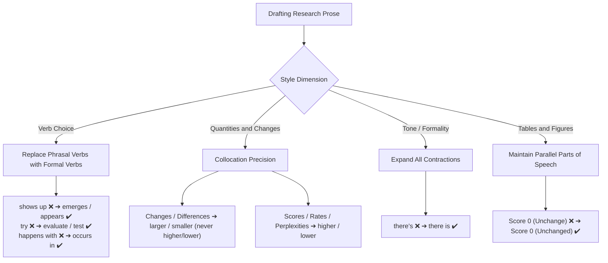

# Academic Register and Lexical Precision

Maintaining an appropriate academic register and using precise lexical collocations ensures clarity, conciseness, and scientific rigor in research publications.

---

## 1. Phrasal Verbs vs. Formal Academic Verbs

Avoid conversational idioms and informal phrasing in research papers:

| Informal / Colloquial | Formal Academic Alternative               | Example                                                                |
| :-------------------- | :---------------------------------------- | :--------------------------------------------------------------------- |
| **shows up**          | **emerges**, **is observed**, **appears** | _"A notable trend **emerges** in English..."_ (Not _shows up_)         |
| **try**               | **evaluate**, **test**, **investigate**   | _"...we **evaluate** other scaling factors..."_ (Not _try_)            |
| **happens with**      | **occurs in**, **is observed with**       | _"An exception **occurs with** feature 97688..."_ (Not _happens with_) |
| **the reported ones** | **those previously reported**             | _"...similar to **those previously reported**."_ (Avoid vague _ones_)  |
| **found X to vary**   | **found that X varies**                   | _"...found **that** neuron activations **vary**..."_                   |

---

## 2. Quantitative Collocations: Describing Changes and Differences

Quantities, differences, and variations take specific modifying adjectives:

- **Changes / Differences / Discrepancies:** Described as **larger**, **greater**, or **smaller** (never _higher_ or _lower_):
  - ❌ _"...and observe **higher PPL changes** with higher-magnitude factors."_
  - ✔️ _"...and observe **larger PPL changes** with higher-magnitude factors."_
- **Scores / Rates / Perplexities / Values:** Described as **higher** or **lower**:
  - ✔️ _"...resulting in **higher perplexity** and **lower accuracy**."_

---

## 3. Avoiding Contractions in Formal Prose

Never use informal contractions in research publications:

- ❌ _"...**there's** a refinement in layer 5..."_
- ✔️ _"...**there is** a refinement in layer 5..."_

---

## 4. Word Class Accuracy in Tables and Labels

Maintain part-of-speech consistency in experimental tables, metrics, and legends:

- ❌ _"Score 0 (**Unchange**):"_ (_Unchange_ is a bare verb).
- ✔️ _"Score 0 (**Unchanged**):"_ or _"Score 0 (**No Change**):"_
