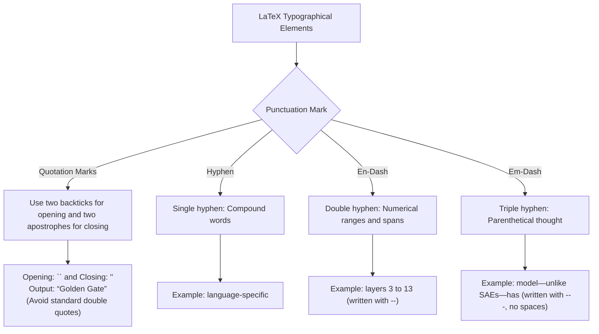

# LaTeX Typography Conventions for Academic Writing

High-quality typesetting in academic and scientific manuscripts requires adhering to specific typographical conventions, particularly around dashes, quotation marks, and spacing in LaTeX.

---

## 1. LaTeX Typography Conventions Table

| Element                     | Incorrect                      | Correct LaTeX Syntax            | Visual Effect / Rule                                                                                                  |
| :-------------------------- | :----------------------------- | :------------------------------ | :-------------------------------------------------------------------------------------------------------------------- |
| **Quotation Marks**         | `"Golden Gate"`                | ` ``Golden Gate'' `             | Produces proper curly opening (``) and closing ('') quotes. Standard quotes `"` produce closing quotes on both sides. |
| **Number Range**            | `layers 3-13` `layers 0–-2` | `layers 3--13`                  | Use an **en-dash** (`--`) for numerical ranges. Never mix en-dash and hyphen (`–-`).                                  |
| **Compound Modifier**       | `language--specific`           | `language-specific`             | Use a single **hyphen** (`-`) for hyphenated compound adjectives.                                                     |
| **Em-Dash (Parenthetical)** | `model - unlike SAEs - has`    | `model---unlike SAEs---has`     | Use an **em-dash** (`---`) without surrounding spaces for parenthetical thoughts.                                     |
| **Author Separator**        | `\AND` vs `\And`               | (Follow conference style sheet) | Check spelling (e.g., `separate`, not `seperate`).                                                                    |
