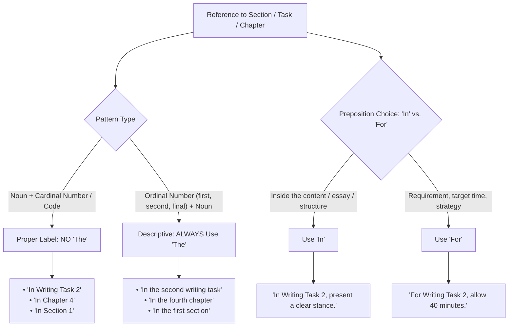

# Articles and Prepositions with Named Labels and Numbers

When referring to labeled sections, exam parts, chapters, or rooms, the choice of articles and prepositions follows specific grammatical rules.

---

## 1. Noun + Number / Label $\rightarrow$ No "the"

When a noun is followed directly by a number, letter, or code name (_Task 2_, _Part 1_, _Section 3_, _Chapter 5_, _Room 101_), it acts as a proper label. **Do not use the definite article ("the")**:

- ✔️ _"**In Writing Task 2**, candidates are required to write an essay of at least 250 words."_
- ✔️ _"Please refer to **Section 3** for additional details."_
- ✔️ _"The instructions are given in **Part 1** of the test."_
- ❌ _"In the Writing Task 2..."_ (Incorrect)
- ❌ _"Please refer to the Section 3..."_ (Incorrect)

---

## 2. Ordinal Numbers $\rightarrow$ Use "the"

If you rephrase using an ordinal number (_first, second, third, final_), you **must use "the"**:

- ✔️ _"In **the second writing task**, you must support your opinion with examples."_
- ✔️ _"Please read **the third section** carefully."_
- ✔️ _"Questions in **the first part** are generally easier."_

---

## 3. Preposition Choice: "In" vs. "For"

- **`In [Task / Section]`** $\rightarrow$ Refers to content, arguments, or structures **inside** the task/essay:
  - _"**In Writing Task 2**, you need to present a clear stance throughout the essay."_
  - _"**In Task 1**, candidates must provide an overview of key trends."_

- **`For [Task / Section]`** $\rightarrow$ Refers to requirements, time allocation, or strategies **aimed at** the task:
  - _"**For Writing Task 2**, it is recommended to spend around 40 minutes."_
  - _"**For Task 1**, a minimum of 150 words is required."_

---

## 4. Summary Table

| Pattern                    | Rule                                                                            | Examples                                                                                        |
| :------------------------- | :------------------------------------------------------------------------------ | :---------------------------------------------------------------------------------------------- |
| **`Noun + Number/Label`**  | **No "the"**                                                                    | • _In Writing Task 2_ • _In Chapter 4_ • _In Section 1_                                   |
| **`the + Ordinal + Noun`** | **Always use "the"**                                                            | • _In the second task_ • _In the fourth chapter_ • _In the first section_                 |
| **`In` vs. `For`**         | **In** = Inside the essay/content **For** = Requirement, strategy, or timing | • _**In** Writing Task 2, explain both views._ • _**For** Writing Task 2, allow 40 minutes._ |
