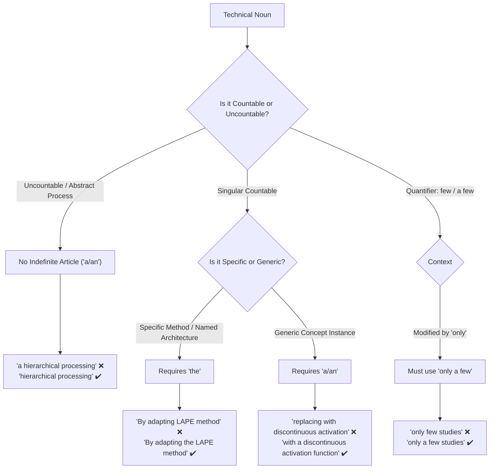

# Article & Determiner Conventions in Scientific Writing

Determiners (_a, an, the_) dictate specificity and countability. Dropping or misplacing them is one of the most frequent errors in technical and scientific papers.

---

## 1. "Only a Few" vs. "Few" vs. "A Few"

Understanding the subtle pragmatic shift between _few_ and _a few_:

- **`Few`** (without _a_): Emphasizes scarcity or near-absence (negative connotation, meaning _almost none_):
  - _"Few studies have investigated multilingual SAE interpretability."_ (= Very few exist; there is a notable gap).
- **`A few`**: Refers to a small number (positive/neutral connotation, meaning _some_):
  - _"A few studies have investigated multilingual SAE interpretability."_ (= Some have done it).
- **`Only a few`**: Emphasizes the small quantity, but **always requires the article "a"**:
  - ❌ _"While some features appear language-agnostic, **only few studies** have explored..."_
  - ✔️ _"While some features appear language-agnostic, **only a few studies** have explored..."_

---

## 2. Singular Countable Technical Nouns Require Determiners

Technical terms like _method_, _approach_, _function_, _model_, _matrix_, or _layer_ are countable singular nouns. They cannot stand alone without an article or determiner:

- ❌ _"By adapting **language activation probability entropy (LAPE) method** proposed by..."_
- ✔️ _"By adapting **the language activation probability entropy (LAPE) method** proposed by..."_
- ❌ _"...by replacing the standard ReLU with **a discontinuous activation** proposed by..."_ (Missing head noun).
- ✔️ _"...by replacing the standard ReLU with **a discontinuous activation function** proposed by..."_
- ❌ _"...retaining only the $k$ largest values in **SAE activations**..."_
- ✔️ _"...retaining only the $k$ largest values in **the SAE activations**..."_

---

## 3. Uncountable Abstract Process Nouns

Abstract verbal nouns describing continuous processes (_processing_, _inference_, _generalization_, _learning_) do not take an indefinite article (_a/an_):

- ❌ _"A consistent pattern observed across languages is **a hierarchical processing** of linguistic information."_
- ✔️ _"A consistent pattern observed across languages is **hierarchical processing** of linguistic information."_
- ✔️ _"...is **the hierarchical processing** of linguistic information."_ (If referring to a specific instance).

---

## 4. Parallel Articles in Coordinated Structures

When coordinating two nouns with _both... and_ or _from... to_, maintain balanced article usage:

- ❌ _"Language-specific features influence **both perplexity and language output** of LLMs."_ (Unbalanced).
- ✔️ _"Language-specific features influence **both the perplexity and the language output** of LLMs."_
- ❌ _"...concentrated in **the early to the middle layers**..."_
- ✔️ _"...concentrated in **the early to middle layers**..."_

---

## 5. Numeral–Adjective Word Order

In English noun phrase syntax, cardinal numerals (_one, two, 15_) must precede descriptive adjectives (_analyzed, evaluated, selected_):

- ❌ _"...to identify **the analyzed 15 languages**."_
- ✔️ _"...to identify **the 15 analyzed languages**."_
- ❌ _"...across **the observed three patterns**."_
- ✔️ _"...across **the three observed patterns**."_
