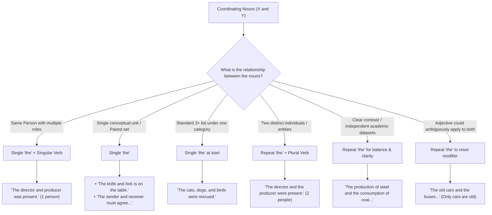

# Single "The" vs. Repeating "The" across Multiple Nouns

When connecting two or more nouns with **"and"** or **"or"**, you can either share a single **"the"** at the beginning (article ellipsis) or repeat **"the"** before each noun. The choice depends on whether the nouns represent a single unified unit, distinct separate items, or the same person/role.

---

## 1. Same Person or Unified Concept $\rightarrow$ Single "the"

### Same Person with Multiple Roles

If a single person holds both titles, use one "the" and a singular verb:

- _"**The director and producer was** present at the premiere."_ (One person who is both director and producer)
- _Contrast:_ _"**The director and the producer were** present."_ (Two distinct individuals)

### Paired Items / Single Conceptual Unit

When items naturally go together as a pair, package, or cohesive system:

- _"**The sender and receiver** must agree on the communication protocol."_
- _"**The knife and fork** is on the table."_ (Considered a single cutlery set)
- _"**The aim and objective** of this study is clear."_

### Lists of 3+ Items under a Single Category

In standard lists sharing a general group or category, placing "the" once at the start is clean and natural:

- _"**The** cats, dogs, and birds were rescued."_

---

## 2. Distinct Entities, Contrast, or Separation $\rightarrow$ Repeat "the"

When emphasizing that two items are separate, independent, or in direct contrast, repeat "the":

### Distinct People or Entities

- _"**The teacher and the student** discussed the feedback."_
- _"Both **the buyer and the seller** must sign the agreement."_

### Geographical & Spatial Distinctions (e.g., in Maps)

- _"**The north and the south** of the island underwent different developments."_ (Emphasizes two distinct geographical zones)
- _Note:_ _"The north and south of the island"_ is also grammatically acceptable, but repeating "the" adds clarity and emphasis.

### Parallel Academic Datasets / Trends

Repeating "the" helps clearly distinguish two independent data series or processes:

- ✔ _"**The production of steel** and **the consumption of coal** both increased."_
- ⚠️ _"**The production of steel and consumption of coal**..."_ (Acceptable, but can feel less balanced when both have long prepositional modifiers).

---

## 3. Avoiding Ambiguity with Modifiers

Repeat "the" if sharing one article might cause confusion over which words the adjectives or prepositional phrases modify:

- ❌ _Ambiguous:_ _"The old cars and buses..."_ (Are the buses old too?)
- ✔ _Clear (if both are old):_ _"The old cars and old buses..."_ or _"The old cars and buses..."_
- ✔ _Clear (if only cars are old):_ _"The old cars and **the** buses..."_ (The repeated article resets the modifier).

---

## 4. Summary Table

| Structure                              | When to Use                                                                                                           | Example                                                                                                                            |
| :------------------------------------- | :-------------------------------------------------------------------------------------------------------------------- | :--------------------------------------------------------------------------------------------------------------------------------- |
| **Single "the"** (`the X and Y`)       | • Same person holding two titles • Closely linked / single entity pair • Standard list of 3+ parallel items     | • _The president and CEO is here._ • _The supply and demand curve..._ • _The cats, dogs, and birds..._                       |
| **Repeated "the"** (`the X and the Y`) | • Two separate individuals / entities • Clear contrast, distinction, or balance • Preventing modifier ambiguity | • _The president and the CEO are here._ • _The increase in sales and the drop in costs..._ • _The old cars and the buses..._ |
