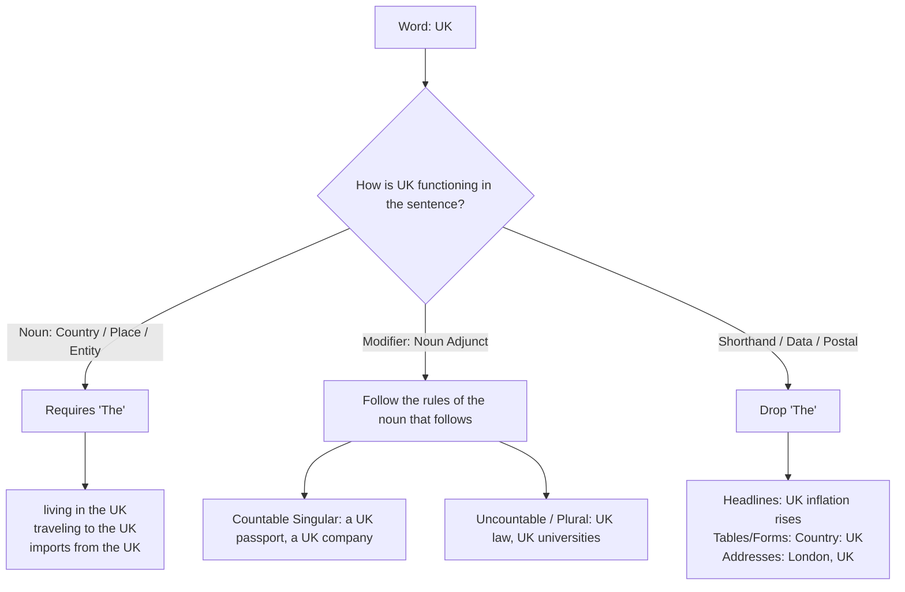

# "The UK" vs. "UK": Definite Article Rules

Use **"the UK"** when it functions as a noun (such as a country, destination, or political entity), and drop **"the"** when **"UK"** functions as a noun adjunct / adjective modifying another noun, or in specialized abbreviated contexts.

---

## 1. Always Use "The" (Noun / Destination / Location)

Country names that contain common nouns like _kingdom_, _states_, _republic_, or _union_ require the definite article when referring to the entity or geographical place:

- _Living in **the UK**_
- _Traveling to **the UK**_
- _The economy of **the United Kingdom**_
- _Imports from **the UK**_

---

## 2. Do NOT Use "The" (Adjective / Noun Adjunct)

When **UK** acts like an adjective directly modifying another noun, you follow the article rules of the noun that comes after it:

- _She has **a UK passport**._ (Indefinite article determined by singular countable noun _passport_)
- _They follow **UK law**._ (Uncountable noun, zero article)
- _UK universities attract international students._ (Plural noun, zero article)
- _He works for **a UK company**._ (Indefinite article determined by _company_)

---

## 3. Other Cases Without "The"

- **Headlines, forms, and tables:** Space-saving shorthand often drops articles (_"UK inflation rises"_, _"Country of Origin: UK"_).
- **Postal addresses and domain names:** Standard formatting omits articles (_"London, UK"_, `co.uk`).
