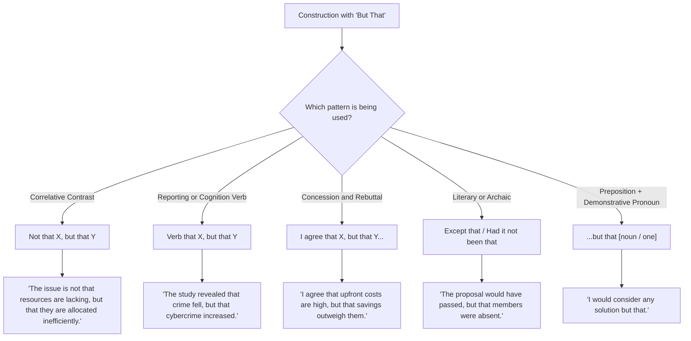

# Subordinate and Contrast Clauses: How to Use "But That"

**"But that"** occurs in several distinct grammatical patterns, primarily in **correlative contrast structures ("not that... but that...")**, **parallel subordinate clauses after reporting verbs**, and specific formal/idiomatic expressions.

---

## 1. Major Use Cases

### A. Correlative Contrast: "Not that... but that..."

This structure rejects one proposed explanation, cause, or premise and affirms another while maintaining strict syntactic parallelism:

- ✔️ _"The challenge is **not that** resources are lacking, **but that** they are allocated inefficiently."_
- ✔️ _"It is **not that** students dislike reading, **but that** digital distractions compete for their attention."_
- ✔️ _"The author argues **not that** urban growth should stop, **but that** it must be planned sustainably."_

### B. Parallel Subordinate Clauses after Reporting / Cognition Verbs

When a single main clause introduces two contrasting subordinate clauses linked by **but**, repeating **"that"** prevents ambiguity and clarifies that both clauses remain governed by the initial verb (_show, argue, find, suggest, believe, acknowledge_):

- ✔️ _"The study revealed **that** overall crime rates fell, **but that** cybercrime increased significantly."_
- ✔️ _"Economists believe **that** inflation will moderate by year-end, **but that** interest rates will remain elevated."_
- 💡 _Why repeat "that"?_ Without the second "that" (_"...revealed that crime fell, but cybercrime increased"_), readers may momentarily read the second clause as an independent observation made by the author rather than a finding revealed by the study.

### C. Concession + Rebuttal in Noun Clauses

Used to concede one point while immediately presenting a contrasting counter-fact:

- ✔️ _"I agree **that** upfront installation costs are substantial, **but that** long-term energy savings outweigh them."_

### D. Idiomatic & Literary Uses

1. **"No doubt but that..." (Formal / Literary for "No doubt that..."):**
   - _"There is **no doubt but that** automated systems will transform the workplace."_
   - > [!NOTE]
     > In modern academic and formal writing, the simpler _"There is no doubt that..."_ is preferred for clarity and conciseness.

2. **"Except that" / "Were it not that" (Archaic / Formal Subjunctive):**
   - _"The proposal would have passed, **but that** several key members were absent."_ (= _except that / had it not been for the fact that_).

3. **Demonstrative "that" after the preposition "but" (Non-clause usage):**
   - When "that" is a demonstrative pronoun (meaning "that thing / that option") and "but" means "except":
   - _"I would consider any solution **but that**."_
   - _"The committee approved every provision **but that** one."_

---

## 2. Key Rules and Pitfalls to Avoid

### 1. Maintain Parallel Structure with "Not... But..."

Both sides of the contrast must match grammatically:

- ❌ _"The failure was **not because of poor design**, **but that testing was rushed**."_ (Mismatched: prepositional phrase vs. that-clause)
- ✔️ _"The failure was **not because design was poor**, **but because testing was rushed**."_ (Parallel _because_-clauses)
- ✔️ _"The failure was **not that the design was poor**, **but that testing was rushed**."_ (Parallel _that_-clauses)

### 2. Avoid Misinterpreting Subject vs. Conjunction Role

Remember that in `"not that X, but that Y"`, each "that" introduces a subordinate clause containing its own subject and verb:

- ❌ _"The reason is not that lack of funding, but that poor planning."_ (Incomplete clauses)
- ✔️ _"The reason is **not that** funding was lacking, **but that** planning was poor."_

---

## 3. Summary Table

| Structure                        | Grammatical Function                                        | Example                                                                                           |
| :------------------------------- | :---------------------------------------------------------- | :------------------------------------------------------------------------------------------------ |
| **`Not that X, but that Y`**     | Reject reason/claim X; affirm reason/claim Y                | _"The issue is **not that** prices are high, **but that** wages have stagnated."_                 |
| **`[Verb] that X, but that Y`**  | Balance two contrasting findings/arguments under one verb   | _"Research indicates **that** solar adoption is growing, **but that** grid storage lags behind."_ |
| **`...but that [Clause]`**       | Formal/literary meaning _except that_ / _if not that_       | _"She would have attended, **but that** pressing matters intervened."_                            |
| **`...but that [Noun/Pronoun]`** | Preposition "but" (_except_) + demonstrative pronoun "that" | _"We had planned for every outcome **but that**."_                                                |
