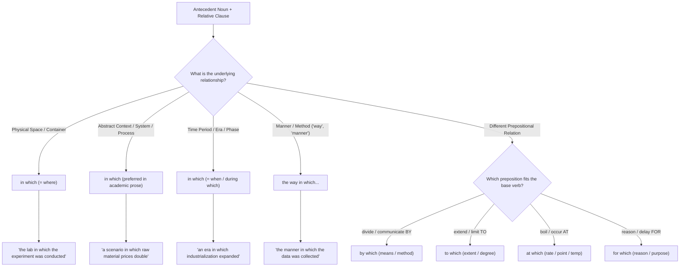

# Relative Constructions: How to Use "In Which"

**"In which"** is a formal relative construction combining the preposition **in** with the relative pronoun **which**. It connects an antecedent noun to a modifying clause, indicating that an action, condition, or event takes place _inside_ or _within_ that entity.

---

## 1. Core Functions and Use Cases

### A. Physical Locations & Spaces (Formal Alternative to "Where")

In formal and academic writing, **"in which"** is frequently used instead of "where" or to avoid preposition stranding (placing a preposition at the end of a sentence):

- _Informal (Preposition Stranding):_ "The laboratory **which** the experiment was conducted **in** was sterile."
- _Formal / Academic:_ "The laboratory **in which** the experiment was conducted was sterile."
- _Alternative:_ "The laboratory **where** the experiment was conducted was sterile."

### B. Abstract Situations, Contexts, and Systems (Preferred in Academic Writing)

While everyday English frequently uses "where" for non-physical/abstract concepts, formal and academic English prefers **"in which"** when modifying nouns like _situation, process, system, society, environment, context, scenario, framework, study, case_:

- ✔️ _"A society **in which** all citizens have equal access to healthcare."_
- ✔️ _"We analyzed a scenario **in which** raw material prices double."_
- ✔️ _"Photosynthesis is a biological process **in which** plants convert sunlight into chemical energy."_
- ✔️ _"The paper describes an experiment **in which** two participant groups were compared."_

### C. Time Periods, Eras, and Intervals

Used with time expressions (_year, decade, century, era, period, phase, stage_) as a formal alternative to _when_ or _during which_:

- ✔️ _"The 19th century was an era **in which** industrialization expanded rapidly across Europe."_
- ✔️ _"This represents the developmental phase **in which** critical thinking skills emerge."_

### D. Manner or Method ("The way in which...")

Used after nouns like _way_ or _manner_ to describe how an action is performed or how a phenomenon occurs:

- ✔️ _"The way **in which** people communicate has changed fundamentally due to the internet."_
- ✔️ _"The manner **in which** the data was collected remains questionable."_

---

## 2. Crucial Grammatical Rules & Common Pitfalls

### 1. Avoid Preposition Redundancy (Double "in")

Because "in" already introduces the relative pronoun "which", do not repeat "in" at the end of the clause:

- ❌ _"The environment **in which** species adapt and evolve **in** is changing."_
- ✔️ _"The environment **in which** species adapt and evolve is changing."_

### 2. "In which" Requires a Complete Subject + Verb Clause

"In which" functions as an adverbial/prepositional complement, not as the subject or direct object of the relative clause:

- ❌ _"A framework **in which** facilitates international cooperation..."_ (Faulty: "in which" cannot act as the grammatical subject of "facilitates")
- ✔️ _"A framework **which / that** facilitates international cooperation..."_ (Relative pronoun as subject)
- ✔️ _"A framework **in which** international cooperation is facilitated..."_ (Prepositional clause with subject "international cooperation")

### 3. Choosing the Right Preposition + "Which"

"In which" is only correct when the underlying relation naturally uses the preposition **in**. If another preposition applies, choose the matching preposition:

| Prepositional Phrase | Typical Application / Meaning                                              | Example                                                         |
| :------------------- | :------------------------------------------------------------------------- | :-------------------------------------------------------------- |
| **`in which`**       | Inside a place, abstract context, situation, process, time span, or manner | _"The context **in which** the policy was introduced..."_       |
| **`by which`**       | Means, method, or mechanism (= through which method)                       | _"The mechanism **by which** cells divide..."_                  |
| **`to which`**       | Extent, degree, target, or limit                                           | _"The extent **to which** technology enhances learning..."_     |
| **`at which`**       | Rate, speed, temperature, price, or exact point                            | _"The temperature **at which** water boils..."_                 |
| **`for which`**      | Reason, purpose, or exchange                                               | _"The primary reason **for which** the project was delayed..."_ |
| **`through which`**  | Medium, passage, or sequential process                                     | _"The medium **through which** information is transmitted..."_  |
| **`with which`**     | Tool, instrument, ease, or speed                                           | _"The ease **with which** users navigate the application..."_   |
