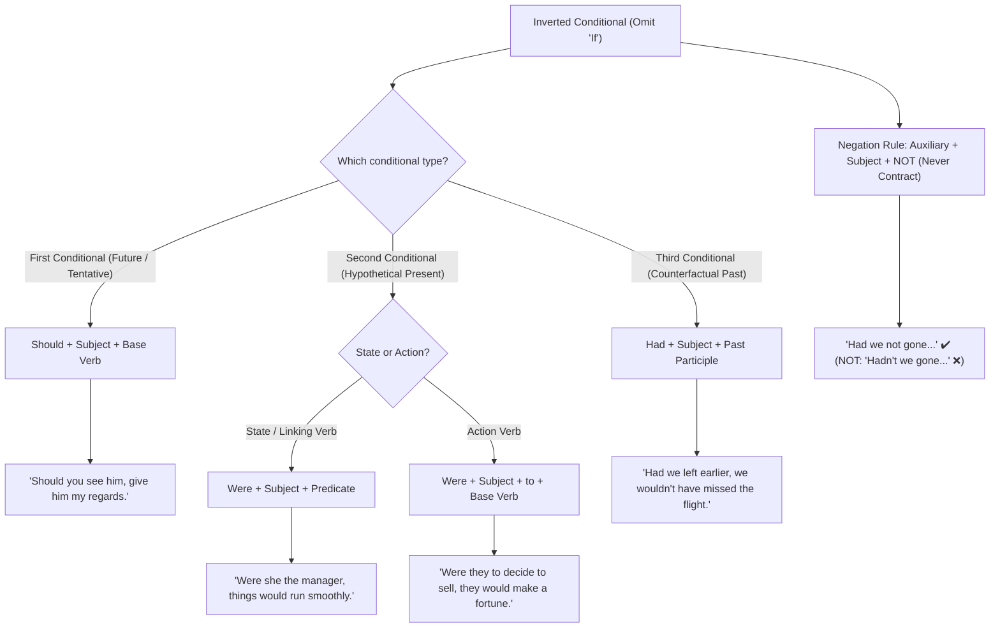

# Inverted Conditionals (Conditional Inversion)

**Inverted conditionals** (also known as conditional inversion) are formal structures formed by omitting **"if"** and inverting the subject and the auxiliary verb (**should**, **were**, or **had**). They are frequently used in formal, academic, and literary English.

---

## 1. Detailed Breakdown by Type

### A. First Conditional (`Should`)

Replaces **if** to describe possible future situations, tentative possibilities, or polite requests:

- **Standard:** _"If you see him, give him my regards."_
- **Inverted:** _"**Should you see** him, give him my regards."_
- **Negative:** _"**Should it not rain**, we will hold the event outside."_

### B. Second Conditional (`Were`)

Used for unreal or hypothetical present/future situations.

- **With state / identity (Linking Verb):**
  - **Standard:** _"If she were the manager, things would run smoothly."_
  - **Inverted:** _"**Were she** the manager, things would run smoothly."_
- **With action verbs (`Were + Subject + to + Base Verb`):**
  - **Standard:** _"If they decided to sell the house, they would make a fortune."_
  - **Inverted:** _"**Were they to decide** to sell the house, they would make a fortune."_
- **Negative:**
  - **Standard:** _"If he were not so busy, he would join us."_
  - **Inverted:** _"**Were he not** so busy, he would join us."_

### C. Third Conditional (`Had`)

Used for counterfactual past events (things that did not happen):

- **Standard:** _"If we had left earlier, we wouldn't have missed the flight."_
- **Inverted:** _"**Had we left** earlier, we wouldn't have missed the flight."_
- **Negative:**
  - **Standard:** _"If you had not reminded me, I would have forgotten completely."_
  - **Inverted:** _"**Had you not reminded** me, I would have forgotten completely."_

---

## 2. Core Rules to Keep in Mind

### 1. No Contractions in Negatives

Always place **not** after the subject (never contract auxiliary verbs with negative particles):

- ✔️ _"**Had we not** gone..."_ (❌ _~~Hadn't we gone...~~_)
- ✔️ _"**Should you not** receive..."_ (❌ _~~Shouldn't you receive...~~_)
- ✔️ _"**Were he not** busy..."_ (❌ _~~Weren't he busy...~~_)

### 2. Comma Usage

- **Inverted clause first $\rightarrow$ Use a comma:**
  - _"**Had you asked**, I would have helped."_
- **Inverted clause second $\rightarrow$ Drop the comma:**
  - _"I would have helped **had you asked**."_

---

## 3. Summary Table

| Conditional Type                | Inverted Structure                | Standard Example (`if`)        | Inverted Example                                               |
| :------------------------------ | :-------------------------------- | :----------------------------- | :------------------------------------------------------------- |
| **First Conditional**           | `Should + Subject + Base Verb`    | _If you see him..._            | _**Should you see** him, give him my regards._                 |
| **Second Conditional (State)**  | `Were + Subject + ...`            | _If she were the manager..._   | _**Were she** the manager, things would run smoothly._         |
| **Second Conditional (Action)** | `Were + Subject + to + Base Verb` | _If they decided to sell..._   | _**Were they to decide** to sell the house..._                 |
| **Third Conditional**           | `Had + Subject + Past Participle` | _If we had left earlier..._    | _**Had we left** earlier, we wouldn't have missed the flight._ |
| **Negative Pattern**            | `[Auxiliary] + Subject + not`     | _If you hadn't reminded me..._ | _**Had you not reminded** me..._ (No contractions)             |
