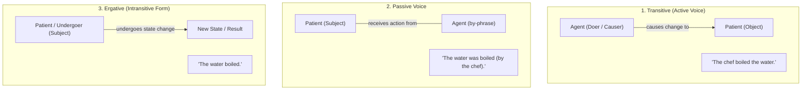

# Ergative Verbs

An **ergative verb** (also called an **unaccusative** or **labile** verb) is a verb that can be used both **transitively** (with an object) and **intransitively** (without an object).

When used intransitively, the **grammatical subject undergoes the action or state change** rather than performing it.

> **Key Rule:** An ergative verb takes an **active grammatical form**, but conveys an **underlying passive meaning**.

---

## 1. Grammar vs. Semantics

In typical active sentences, the subject is the "doer" (_agent_). With ergative verbs in their intransitive form, the subject is the "receiver" (_patient / undergoer_).

### Example: "To Open"

1. **Transitive (Active with an Agent):**

   > _"The wind **opened** the door."_
   - **Subject:** The wind (_agent / causer_)
   - **Object:** The door (_patient / entity undergoing change_)

2. **Passive Voice:**

   > _"The door **was opened** (by the wind)."_
   - **Subject:** The door (_patient_)
   - **Agent:** The wind (_introduced with "by"_)

3. **Ergative (Intransitive Form):**
   > _"The door **opened**."_
   - **Subject:** The door (_patient / undergoer_)
   - **Agent:** Omitted entirely. The sentence focuses on the event and state change (from closed to open), not on who or what caused it.

---

## 2. Visualizing the Difference

---

## 3. Common Ergative Verbs in Everyday English

Many common English verbs describing change of state, movement, and physical processes are ergative:

| Category                 | Verbs                                          | Transitive (with Agent)                    | Ergative (Focus on Subject)  |
| ------------------------ | ---------------------------------------------- | ------------------------------------------ | ---------------------------- |
| **Change of State**      | _melt, boil, freeze, burn, break, crack, tear_ | _"The sun **melted** the ice."_            | _"The ice **melted**."_      |
| **Movement / Direction** | _open, close, move, stop, start, turn_         | _"She **stopped** the car."_               | _"The car **stopped**."_     |
| **Cooking & Food**       | _cook, bake, fry, boil, simmer_                | _"He is **baking** the bread."_            | _"The bread is **baking**."_ |
| **Sound / Signals**      | _ring, sound, click_                           | _"The guard **rang** the bell."_           | _"The bell **rang**."_       |
| **Fast Changes**         | _crash, shatter, explode_                      | _"The shockwave **shattered** the glass."_ | _"The glass **shattered**."_ |

---

## 4. Transitive vs. Ergative vs. Passive Comparison

| Transitive (Active with Agent)  | Ergative (Active Form, Passive Sense) | Pure Passive                 |
| ------------------------------- | ------------------------------------- | ---------------------------- |
| _"The chef boils the water."_   | _"The water **boils**."_              | _"The water **is boiled**."_ |
| _"The wind opened the door."_   | _"The door **opened**."_              | _"The door **was opened**."_ |
| _"Someone broke the vase."_     | _"The vase **broke**."_               | _"The vase **was broken**."_ |
| _"The heat melted the snow."_   | _"The snow **melted**."_              | _"The snow **was melted**."_ |
| _"The driver stopped the bus."_ | _"The bus **stopped**."_              | _"The bus **was stopped**."_ |
| _"She rang the bell."_          | _"The bell **rang**."_                | _"The bell **was rung**."_   |

---

## 5. Why and When to Use Ergative Verbs

In natural English, native speakers frequently choose ergative verbs instead of the passive voice for several reasons:

1. **When the Causer Is Unknown or Unimportant:**
   - _"My phone screen cracked."_ (It matters that it's cracked, not necessarily how it happened).
2. **To Avoid Blame (Diplomatic Language):**
   - _"The glass dropped and shattered."_ instead of _"I dropped and shattered the glass."_
3. **To Describe Natural or Inevitable Processes:**
   - _"Leaves dry out and fall."_ (A natural process rather than an external agent performing an action).
4. **More Concise and Dynamic than the Passive:**
   - Saying _"The shop closes at 9 PM"_ is more natural and direct than _"The shop is closed by staff at 9 PM"_.
