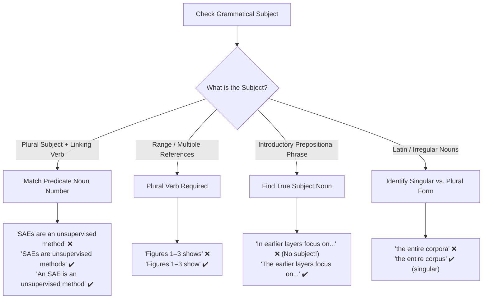
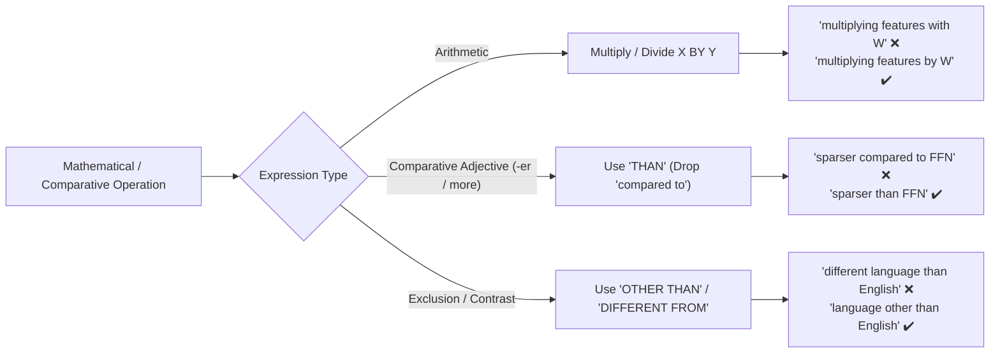
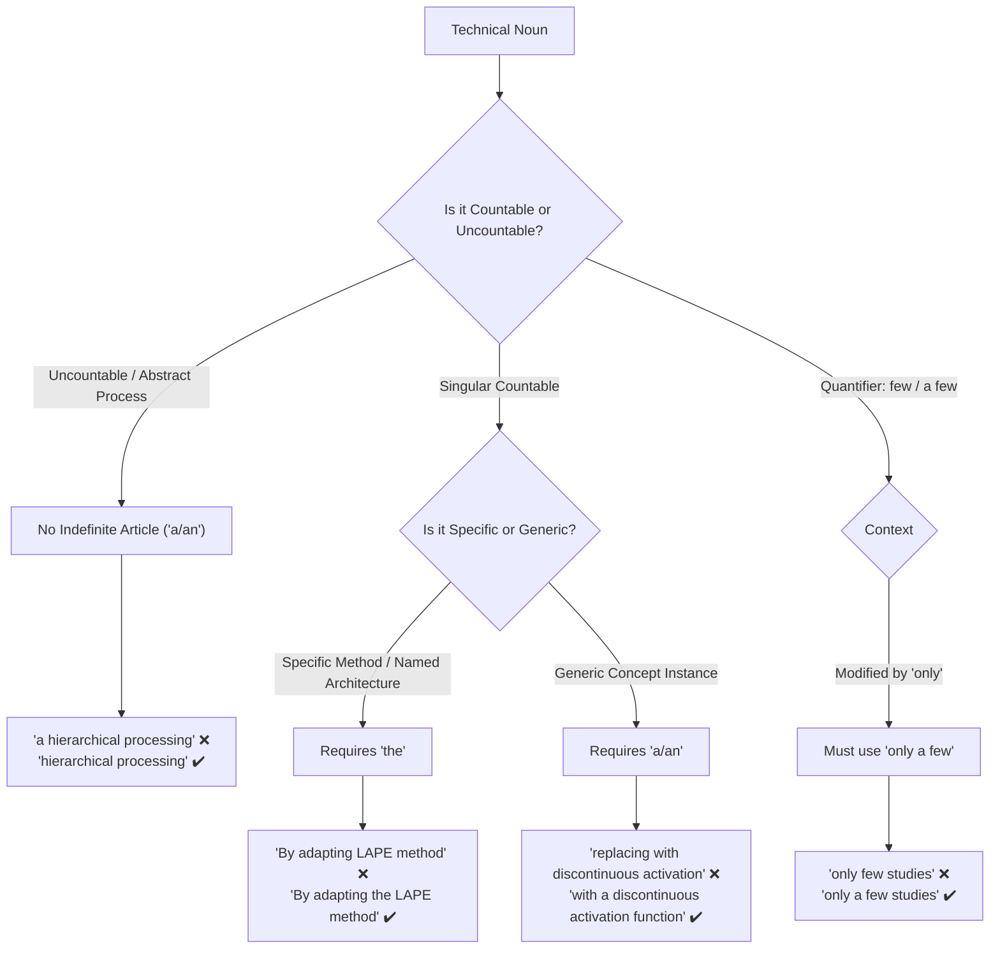
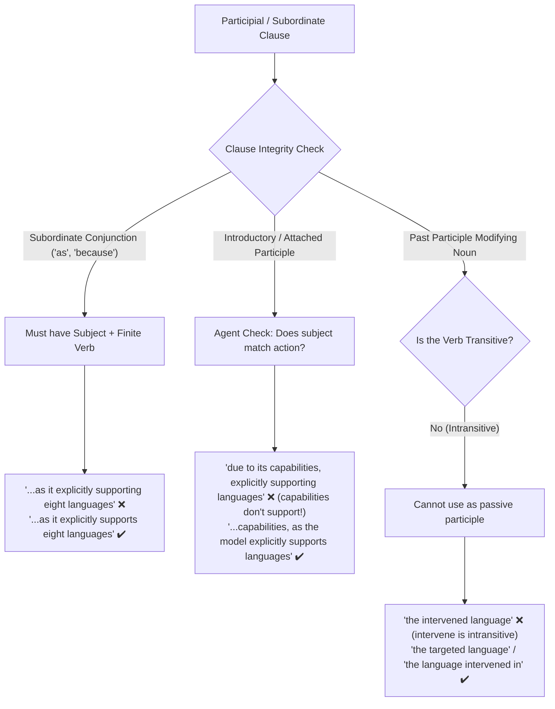

## 1. That/those of

1. **Ensuring Parallel Comparisons:**
   A common error is comparing an attribute of something directly to the entire entity itself. "That of" ensures you compare the same category of things.
   - _Faulty:_ The throughput of System A is higher than System B. _(Compares throughput to a system)._
   - _Correct:_ The throughput of System A is higher than that of System B. _("that" = the throughput)._

1. **Number Agreement (Singular vs. Plural):**
   - Singular / Uncountable $\rightarrow$ **that of**:
     - _"The latency of the new service is lower than that of the legacy service."_
   - Plural $\rightarrow$ **those of**:
     - _"The latency metrics of the new service are lower than those of the legacy service."_

**Alternatives & When to Omit:**
While precise and standard in formal/academic writing, overusing "that of" can feel stiff. Common alternatives include:

- Possessive nouns ('s):
  - _"The performance of Model A exceeds Model B's."_
- Rephrasing for brevity:
  - _"System A has higher throughput than System B."_

## 2. In the morning, at night, on Monday morning

In standard English, **"in the morning"** is standard and correct, while **"at morning"** is incorrect in everyday English.

1. **"In the morning" (Standard & Natural)**
   Use **"in"** for broad periods/chunks of the day:
   - _“I drink coffee in the morning.”_
   - _“She goes for a run in the afternoon.”_
   - _“We relax in the evening.”_

1. **"At morning" (Incorrect in Modern English)**
   We do not say _"at morning"_ or _"at the morning"_.

   Use **"at"** only for:
   - **Specific precise points in time:** _at dawn_, _at sunrise_, _at daybreak_, _at 7:00 AM_
   - **Midday / Midnight:** _at noon_, _at midday_, _at midnight_
   - **Night (idiomatic exception):** _at night_

   > [!NOTE]
   >
   > _"At morning"_ only appears in archaic poetry or literature (e.g., _"at morning's first light"_), but in standard modern English, always use _"in the morning"_.

1. **Quick Summary Table**

| Preposition | When to Use                              | Examples                                                     |
| :---------- | :--------------------------------------- | :----------------------------------------------------------- |
| **`in`**    | General spans of the day                 | _in the morning_, _in the afternoon_, _in the evening_       |
| **`at`**    | Specific moments / points / night        | _at dawn_, _at sunrise_, _at noon_, _at 8:00 AM_, _at night_ |
| **`on`**    | Specific days or dates + part of the day | _on Monday morning_, _on the morning of July 4th_            |

## 3. the UK vs UK

Use **the UK** when it functions as a noun, and drop **the** when **UK** functions as a modifier/adjective or in specific abbreviated contexts.

**Always use "the" (Noun / Destination / Location)**
Country names that contain common nouns like _kingdom_, _states_, _republic_, or _union_ require the definite article when referring to the entity or place:

- \*Living in **the UK\*\***
- \*Traveling to **the UK\*\***
- \*The economy of **the United Kingdom\*\***
- \*Imports from **the UK\*\***

**Do NOT use "the" (Adjective / Noun Adjunct)**
When **UK** acts like an adjective directly modifying another noun, you follow the article rules of the noun that comes after it:

- _She has **a UK passport**._ (Indefinite article determined by _passport_)
- _They follow **UK law**._ (Uncountable noun, no article)
- **\*UK universities** attract international students.\* (Plural noun, no article)
- _He works for **a UK company**._

**Other cases without "the"**

- **Headlines, forms, and tables:** Space-saving shorthand often drops articles (_"UK inflation rises"_, _"Country of Origin: UK"_).
- **Postal addresses and domain names:** Standard formatting omits articles (_"London, UK"_, _.co.uk_).

## 4. Single "the" vs. Repeating "the" across Multiple Nouns

When connecting two or more nouns with **"and"** or **"or"**, you can either share a single **"the"** at the beginning (article ellipsis) or repeat **"the"** before each noun. The choice depends on whether the nouns represent a single unified unit, distinct separate items, or the same person/role.

### 1. Same Person or Unified Concept $\rightarrow$ Single "the"

- **Same Person with Multiple Roles:**
  If a single person holds both titles, use one "the" and a singular verb:
  - _"**The director and producer was** present at the premiere."_ (One person who is both director and producer)
  - _Contrast:_ _"**The director and the producer were** present."_ (Two distinct individuals)
- **Paired Items / Single Conceptual Unit:**
  When items naturally go together as a pair, package, or cohesive system:
  - _"**The sender and receiver** must agree on the communication protocol."_
  - _"**The knife and fork** is on the table."_ (Considered a single cutlery set)
  - _"**The aim and objective** of this study is clear."_
- **Lists of 3+ Items under a Single Category:**
  In standard lists sharing a general group or category, placing "the" once at the start is clean and natural:
  - _"**The** cats, dogs, and birds were rescued."_

### 2. Distinct Entities, Contrast, or Separation $\rightarrow$ Repeat "the"

When emphasizing that two items are separate, independent, or in direct contrast, repeat "the":

- **Distinct People or Entities:**
  - _"**The teacher and the student** discussed the feedback."_
  - _"Both **the buyer and the seller** must sign the agreement."_
- **Geographical & Spatial Distinctions (e.g., in Maps):**
  - _"**The north and the south** of the island underwent different developments."_ (Emphasizes two distinct geographical zones)
  - _Note:_ _"The north and south of the island"_ is also grammatically acceptable, but repeating "the" adds clarity and emphasis.
- **Parallel Academic Datasets / Trends:**
  Repeating "the" helps clearly distinguish two independent data series or processes:
  - ✔ _"**The production of steel** and **the consumption of coal** both increased."_
  - ⚠️ _"**The production of steel and consumption of coal**..."_ (Acceptable, but can feel less balanced when both have long prepositional modifiers).

### 3. Avoiding Ambiguity with Modifiers

Repeat "the" if sharing one article might cause confusion over which words the adjectives or prepositional phrases modify:

- ❌ _Ambiguous:_ _"The old cars and buses..."_ (Are the buses old too?)
- ✔ _Clear (if both are old):_ _"The old cars and old buses..."_ or _"The old cars and buses..."_
- ✔ _Clear (if only cars are old):_ _"The old cars and **the** buses..."_ (The repeated article resets the modifier).

### 4. Summary Table

| Structure                              | When to Use                                                                                                           | Example                                                                                                                            |
| :------------------------------------- | :-------------------------------------------------------------------------------------------------------------------- | :--------------------------------------------------------------------------------------------------------------------------------- |
| **Single "the"** (`the X and Y`)       | • Same person holding two titles • Closely linked / single entity pair • Standard list of 3+ parallel items     | • _The president and CEO is here._ • _The supply and demand curve..._ • _The cats, dogs, and birds..._                       |
| **Repeated "the"** (`the X and the Y`) | • Two separate individuals / entities • Clear contrast, distinction, or balance • Preventing modifier ambiguity | • _The president and the CEO are here._ • _The increase in sales and the drop in costs..._ • _The old cars and the buses..._ |

## 5. Articles and Prepositions with Named Labels/Numbers (e.g., In Writing Task 2)

When referring to labeled sections, exam parts, chapters, or rooms, the choice of articles and prepositions follows specific rules:

### 1. Noun + Number/Label $\rightarrow$ No "the"

When a noun is followed directly by a number, letter, or code name (_Task 2_, _Part 1_, _Section 3_, _Chapter 5_, _Room 101_), it acts as a proper label. **Do not use the definite article ("the")**:

- ✔️ _"**In Writing Task 2**, candidates are required to write an essay of at least 250 words."_
- ✔️ _"Please refer to **Section 3** for additional details."_
- ✔️ _"The instructions are given in **Part 1** of the test."_
- ❌ _"In the Writing Task 2..."_ (Incorrect)
- ❌ _"Please refer to the Section 3..."_ (Incorrect)

---

### 2. Ordinal Numbers $\rightarrow$ Use "the"

If you rephrase using an ordinal number (_first, second, third, final_), you **must use "the"**:

- ✔️ _"In **the second writing task**, you must support your opinion with examples."_
- ✔️ _"Please read **the third section** carefully."_
- ✔️ _"Questions in **the first part** are generally easier."_

---

### 3. Preposition Choice: "In" vs. "For"

- **`In [Task / Section]`** $\rightarrow$ Refers to content, arguments, or structures **inside** the task/essay:
  - _"**In Writing Task 2**, you need to present a clear stance throughout the essay."_
  - _"**In Task 1**, candidates must provide an overview of key trends."_
- **`For [Task / Section]`** $\rightarrow$ Refers to requirements, time allocation, or strategies **aimed at** the task:
  - _"**For Writing Task 2**, it is recommended to spend around 40 minutes."_
  - _"**For Task 1**, a minimum of 150 words is required."_

---

### 4. Summary Table

| Pattern                    | Rule                                                                            | Examples                                                                                        |
| :------------------------- | :------------------------------------------------------------------------------ | :---------------------------------------------------------------------------------------------- |
| **`Noun + Number/Label`**  | **No "the"**                                                                    | • _In Writing Task 2_ • _In Chapter 4_ • _In Section 1_                                   |
| **`the + Ordinal + Noun`** | **Always use "the"**                                                            | • _In the second task_ • _In the fourth chapter_ • _In the first section_                 |
| **`In` vs. `For`**         | **In** = Inside the essay/content **For** = Requirement, strategy, or timing | • _**In** Writing Task 2, explain both views._ • _**For** Writing Task 2, allow 40 minutes._ |

## 6. How to Use "In Which"

**"In which"** is a formal relative construction combining the preposition **in** with the relative pronoun **which**. It connects an antecedent noun to a modifying clause, indicating that an action, condition, or event takes place _inside_ or _within_ that entity.

---

### 1. Core Functions and Use Cases

#### A. Physical Locations & Spaces (Formal Alternative to "Where")

In formal and academic writing, **"in which"** is frequently used instead of "where" or to avoid preposition stranding (placing a preposition at the end of a sentence):

- _Informal (Preposition Stranding):_ "The laboratory **which** the experiment was conducted **in** was sterile."
- _Formal / Academic:_ "The laboratory **in which** the experiment was conducted was sterile."
- _Alternative:_ "The laboratory **where** the experiment was conducted was sterile."

#### B. Abstract Situations, Contexts, and Systems (Preferred in Academic Writing)

While everyday English frequently uses "where" for non-physical/abstract concepts, formal and academic English prefers **"in which"** when modifying nouns like _situation, process, system, society, environment, context, scenario, framework, study, case_:

- ✔️ _"A society **in which** all citizens have equal access to healthcare."_
- ✔️ _"We analyzed a scenario **in which** raw material prices double."_
- ✔️ _"Photosynthesis is a biological process **in which** plants convert sunlight into chemical energy."_
- ✔️ _"The paper describes an experiment **in which** two participant groups were compared."_

#### C. Time Periods, Eras, and Intervals

Used with time expressions (_year, decade, century, era, period, phase, stage_) as a formal alternative to _when_ or _during which_:

- ✔️ _"The 19th century was an era **in which** industrialization expanded rapidly across Europe."_
- ✔️ _"This represents the developmental phase **in which** critical thinking skills emerge."_

#### D. Manner or Method ("The way in which...")

Used after nouns like _way_ or _manner_ to describe how an action is performed or how a phenomenon occurs:

- ✔️ _"The way **in which** people communicate has changed fundamentally due to the internet."_
- ✔️ _"The manner **in which** the data was collected remains questionable."_

---

### 2. Crucial Grammatical Rules & Common Pitfalls

#### 1. Avoid Preposition Redundancy (Double "in")

Because "in" already introduces the relative pronoun "which", do not repeat "in" at the end of the clause:

- ❌ _"The environment **in which** species adapt and evolve **in** is changing."_
- ✔️ _"The environment **in which** species adapt and evolve is changing."_

#### 2. "In which" Requires a Complete Subject + Verb Clause

"In which" functions as an adverbial/prepositional complement, not as the subject or direct object of the relative clause:

- ❌ _"A framework **in which** facilitates international cooperation..."_ (Faulty: "in which" cannot act as the grammatical subject of "facilitates")
- ✔️ _"A framework **which / that** facilitates international cooperation..."_ (Relative pronoun as subject)
- ✔️ _"A framework **in which** international cooperation is facilitated..."_ (Prepositional clause with subject "international cooperation")

#### 3. Choosing the Right Preposition + "Which"

"In which" is only correct when the underlying relation naturally uses the preposition **in**. If another preposition applies, choose the matching preposition:

| Prepositional Phrase | Typical Application / Meaning                                              | Example                                                         |
| :------------------- | :------------------------------------------------------------------------- | :-------------------------------------------------------------- |
| **`in which`**       | Inside a place, abstract context, situation, process, time span, or manner | _"The context **in which** the policy was introduced..."_       |
| **`by which`**       | Means, method, or mechanism (= through which method)                       | _"The mechanism **by which** cells divide..."_                  |
| **`to which`**       | Extent, degree, target, or limit                                           | _"The extent **to which** technology enhances learning..."_     |
| **`at which`**       | Rate, speed, temperature, price, or exact point                            | _"The temperature **at which** water boils..."_                 |
| **`for which`**      | Reason, purpose, or exchange                                               | _"The primary reason **for which** the project was delayed..."_ |
| **`through which`**  | Medium, passage, or sequential process                                     | _"The medium **through which** information is transmitted..."_  |
| **`with which`**     | Tool, instrument, ease, or speed                                           | _"The ease **with which** users navigate the application..."_   |

---

## 7. How to Use "But That"

**"But that"** occurs in several distinct grammatical patterns, primarily in **correlative contrast structures ("not that... but that...")**, **parallel subordinate clauses after reporting verbs**, and specific formal/idiomatic expressions.

---

### 1. Major Use Cases

#### A. Correlative Contrast: "Not that... but that..."

This structure rejects one proposed explanation, cause, or premise and affirms another while maintaining strict syntactic parallelism:

- ✔️ _"The challenge is **not that** resources are lacking, **but that** they are allocated inefficiently."_
- ✔️ _"It is **not that** students dislike reading, **but that** digital distractions compete for their attention."_
- ✔️ _"The author argues **not that** urban growth should stop, **but that** it must be planned sustainably."_

#### B. Parallel Subordinate Clauses after Reporting / Cognition Verbs

When a single main clause introduces two contrasting subordinate clauses linked by **but**, repeating **"that"** prevents ambiguity and clarifies that both clauses remain governed by the initial verb (_show, argue, find, suggest, believe, acknowledge_):

- ✔️ _"The study revealed **that** overall crime rates fell, **but that** cybercrime increased significantly."_
- ✔️ _"Economists believe **that** inflation will moderate by year-end, **but that** interest rates will remain elevated."_
- 💡 _Why repeat "that"?_ Without the second "that" (_"...revealed that crime fell, but cybercrime increased"_), readers may momentarily read the second clause as an independent observation made by the author rather than a finding revealed by the study.

#### C. Concession + Rebuttal in Noun Clauses

Used to concede one point while immediately presenting a contrasting counter-fact:

- ✔️ _"I agree **that** upfront installation costs are substantial, **but that** long-term energy savings outweigh them."_

#### D. Idiomatic & Literary Uses

1. **"No doubt but that..." (Formal / Literary for "No doubt that..."):**
   - _"There is **no doubt but that** automated systems will transform the workplace."_
   - > [!NOTE]
     >
     > In modern academic and formal writing, the simpler _"There is no doubt that..."_ is preferred for clarity and conciseness.

1. **"Except that" / "Were it not that" (Archaic / Formal Subjunctive):**
   - _"The proposal would have passed, **but that** several key members were absent."_ (= _except that / had it not been for the fact that_).

1. **Demonstrative "that" after the preposition "but" (Non-clause usage):**
   - When "that" is a demonstrative pronoun (meaning "that thing / that option") and "but" means "except":
   - _"I would consider any solution **but that**."_
   - _"The committee approved every provision **but that** one."_

---

### 2. Key Rules and Pitfalls to Avoid

#### 1. Maintain Parallel Structure with "Not... But..."

Both sides of the contrast must match grammatically:

- ❌ _"The failure was **not because of poor design**, **but that testing was rushed**."_ (Mismatched: prepositional phrase vs. that-clause)
- ✔️ _"The failure was **not because design was poor**, **but because testing was rushed**."_ (Parallel _because_-clauses)
- ✔️ _"The failure was **not that the design was poor**, **but that testing was rushed**."_ (Parallel _that_-clauses)

#### 2. Avoid Misinterpreting Subject vs. Conjunction Role

Remember that in `"not that X, but that Y"`, each "that" introduces a subordinate clause containing its own subject and verb:

- ❌ _"The reason is not that lack of funding, but that poor planning."_ (Incomplete clauses)
- ✔️ _"The reason is **not that** funding was lacking, **but that** planning was poor."_

---

### 3. Summary Table

| Structure                        | Grammatical Function                                        | Example                                                                                           |
| :------------------------------- | :---------------------------------------------------------- | :------------------------------------------------------------------------------------------------ |
| **`Not that X, but that Y`**     | Reject reason/claim X; affirm reason/claim Y                | _"The issue is **not that** prices are high, **but that** wages have stagnated."_                 |
| **`[Verb] that X, but that Y`**  | Balance two contrasting findings/arguments under one verb   | _"Research indicates **that** solar adoption is growing, **but that** grid storage lags behind."_ |
| **`...but that [Clause]`**       | Formal/literary meaning _except that_ / _if not that_       | _"She would have attended, **but that** pressing matters intervened."_                            |
| **`...but that [Noun/Pronoun]`** | Preposition "but" (_except_) + demonstrative pronoun "that" | _"We had planned for every outcome **but that**."_                                                |

---

## 8. Inverted Conditionals

**Inverted conditionals** (also known as conditional inversion) are formal structures formed by omitting **"if"** and inverting the subject and the auxiliary verb (**should**, **were**, or **had**). They are frequently used in formal, academic, and literary English.

---

### 1. Detailed Breakdown by Type

#### A. First Conditional (`Should`)

Replaces **if** to describe possible future situations, tentative possibilities, or polite requests:

- **Standard:** _"If you see him, give him my regards."_
- **Inverted:** _"**Should you see** him, give him my regards."_
- **Negative:** _"**Should it not rain**, we will hold the event outside."_

#### B. Second Conditional (`Were`)

Used for unreal or hypothetical present/future situations.

- **With state / identity (Linking Verb):**
  - **Standard:** _"If she were the manager, things would run smoothly."_
  - **Inverted:** _"**Were she** the manager, things would run smoothly."_
- **With action verbs (`Were + Subject + to + Base Verb`):**
  - **Standard:** _"If they decided to sell the house, they would make a fortune."_
  - **Inverted:** _"**Were they to decide** to sell the house, they would make a fortune."_
- **Negative:**
  - **Standard:** _"If he were not so busy, he would join us."_
  - **Inverted:** _"**Were he not** so busy, he would join us."_

#### C. Third Conditional (`Had`)

Used for counterfactual past events (things that did not happen):

- **Standard:** _"If we had left earlier, we wouldn't have missed the flight."_
- **Inverted:** _"**Had we left** earlier, we wouldn't have missed the flight."_
- **Negative:**
  - **Standard:** _"If you had not reminded me, I would have forgotten completely."_
  - **Inverted:** _"**Had you not reminded** me, I would have forgotten completely."_

---

### 2. Core Rules to Keep in Mind

1. **No Contractions in Negatives:**
   Always place **not** after the subject (never contract auxiliary verbs with negative particles):
   - ✔️ _"**Had we not** gone..."_ (❌ _~~Hadn't we gone...~~_)
   - ✔️ _"**Should you not** receive..."_ (❌ _~~Shouldn't you receive...~~_)
   - ✔️ _"**Were he not** busy..."_ (❌ _~~Weren't he busy...~~_)

2. **Comma Usage:**
   - **Inverted clause first $\rightarrow$ Use a comma:**
     - _"**Had you asked**, I would have helped."_
   - **Inverted clause second $\rightarrow$ Drop the comma:**
     - _"I would have helped **had you asked**."_

---

### 3. Summary Table

| Conditional Type                | Inverted Structure                | Standard Example (`if`)        | Inverted Example                                               |
| :------------------------------ | :-------------------------------- | :----------------------------- | :------------------------------------------------------------- |
| **First Conditional**           | `Should + Subject + Base Verb`    | _If you see him..._            | _**Should you see** him, give him my regards._                 |
| **Second Conditional (State)**  | `Were + Subject + ...`            | _If she were the manager..._   | _**Were she** the manager, things would run smoothly._         |
| **Second Conditional (Action)** | `Were + Subject + to + Base Verb` | _If they decided to sell..._   | _**Were they to decide** to sell the house..._                 |
| **Third Conditional**           | `Had + Subject + Past Participle` | _If we had left earlier..._    | _**Had we left** earlier, we wouldn't have missed the flight._ |
| **Negative Pattern**            | `[Auxiliary] + Subject + not`     | _If you hadn't reminded me..._ | _**Had you not reminded** me..._ (No contractions)             |

---

## 9. Subject–Verb & Number Agreement in Academic and Technical Writing

Subject–verb agreement in scientific and technical prose often breaks down around compound structures, predicate complements, Latin plurals, numerical ranges, and introductory prepositional phrases.

### 1. Copula & Predicate Noun Agreement (Plural Subject vs. Singular Complement)

While linking verbs grammatically agree with the subject, mismatched singular/plural complements create logical dissonance in scientific definitions:

- ❌ _"Sparse autoencoders (SAEs) **are an unsupervised method** to discover features."_ (Plural subject _SAEs_ vs. singular complement _an unsupervised method_).
- ✔️ _"**An SAE is an unsupervised method** used to discover features..."_ (Singular–singular).
- ✔️ _"Sparse autoencoders (SAEs) **are unsupervised methods** used to discover features..."_ (Plural–plural).
- ✔️ _"Sparse autoencoders (SAEs) **provide an unsupervised approach** to discover features..."_ (Rephrased with an active transitive verb).

#### Mathematical Variables and Set Definitions

- ❌ _"where $\bm{h}$ **is the intermediate activations**..."_ ($\bm{h}$ is a singular vector symbol, but _activations_ is plural).
- ✔️ _"where $\bm{h}$ **denotes the intermediate activation vector**..."_
- ❌ _"$\mathcal{T}_K \subseteq \{0, \ldots, n-1\}$ **is the indices** of the top-$k$ values..."_
- ✔️ _"$\mathcal{T}_K \subseteq \{0, \ldots, n-1\}$ **is the set of indices** of the top-$k$ values..."_

---

### 2. Plural Cross-References and Number Ranges

When referencing a range of figures, tables, equations, or layers, the subject is plural and requires a plural verb:

- ❌ _"**Figures 1--3 shows** the distribution of language-specific neurons..."_
- ✔️ _"**Figures 1--3 show** the distribution of language-specific neurons..."_
- ❌ _"Initially, in earlier layers (e.g., **layer 0--1**)..."_
- ✔️ _"Initially, in earlier layers (e.g., **layers 0--1**)..."_

> [!NOTE]
> In contrast, singular noun adjuncts are preferred when modifying another noun:
>
> - ❌ _"Language-Specific **Features** Counts"_ (Heading)
> - ✔️ _"Language-Specific **Feature** Counts"_ (Noun adjunct _feature_ remains singular).

---

### 3. Categorization Expressions: "A Type of [Singular Noun]"

Phrases like _a type of_, _a kind of_, or _a class of_ categorize an item into a single class and take a **singular noun**:

- ❌ _"The features we aim to find are **a type of HFLs**."_
- ✔️ _"The features we aim to find are **a type of HFL**."_
- ✔️ _"The features we aim to find **belong to HFLs**."_

---

### 4. Classical & Latin Plurals in Science

Academic English retains classical singular/plural distinctions that must match their modifiers and determiners:

| Singular Form  | Plural Form           | Common Pitfall                  | Correct Academic Usage                                       |
| :------------- | :-------------------- | :------------------------------ | :----------------------------------------------------------- |
| **corpus**     | **corpora**           | ❌ _the entire corpora_         | ✔️ _the entire corpus_ / _across all corpora_                |
| **criterion**  | **criteria**          | ❌ _a criteria_                 | ✔️ _a criterion_ / _these criteria_                          |
| **phenomenon** | **phenomena**         | ❌ _this phenomena_             | ✔️ _this phenomenon_ / _these phenomena_                     |
| **matrix**     | **matrices**          | ❌ _matrixes_                   | ✔️ _matrices_                                                |
| **index**      | **indices** / indexes | ❌ _index with values_          | ✔️ _indices of the top-k values_                             |
| **datum**      | **data**              | ❌ _this data show_ (ambiguous) | ✔️ _these data show_ (formal plural) or _this dataset shows_ |

---

### 5. Compound Subjects Joined by "And"

Two distinct subjects linked by _and_ take a plural verb:

- ❌ _"Furthermore, the specific configuration of the SAEs and their training process **is described** below."_
- ✔️ _"Furthermore, the specific configuration of the SAEs and their training process **are described** below."_

---

### 6. Prepositional Phrases Cannot Serve as Grammatical Subjects

An introductory prepositional phrase indicates setting, location, or circumstance; it cannot function as the grammatical subject of a finite verb:

- ❌ _"**In the earlier layers (layers 0--5) primarily focus on** identifying fundamental building blocks."_ (Who or what focuses? The prepositional phrase _In the earlier layers_ cannot perform the action).
- ✔️ _"**The earlier layers (layers 0--5) primarily focus on** identifying fundamental building blocks."_ (Noun phrase as subject).
- ✔️ _"**In the earlier layers (layers 0--5), the model primarily focuses on** identifying fundamental building blocks."_ (Subject _the model_ supplied).

---

## 10. Technical Prepositions, Collocations, and Mathematical Syntax

Mathematical operations and academic comparisons require strict prepositional pairings. Using casual conversational prepositions weakens scientific rigor.

### 1. Mathematical Operations: Multiply / Divide X "By" Y (Never "With")

In formal mathematics and machine learning prose, multiplication and division always govern **by**:

- ❌ _"...multiplying language-specific features **with** the token unembedding matrix..."_
- ✔️ _"...multiplying language-specific features **by** the token unembedding matrix..."_
- ❌ _"...multiplying the intermediate activations $\bm{h}^i$ **with** $\bm{W}_U$..."_
- ✔️ _"...multiplying the intermediate activations $\bm{h}^i$ **by** $\bm{W}_U$..."_

> [!TIP]
> Use **with** only when describing an interaction, dot product, or convolution where symmetry applies:
>
> - _"Computing the inner product of $\bm{a}$ **with** $\bm{b}$..."_
> - _"Convolving the signal **with** a Gaussian kernel..."_

---

### 2. Comparative Adjectives vs. "Compared to" (Comparative Redundancy)

When an adjective is already in the comparative form (inflected with _-er_ or accompanied by _more/less_), adding _compared to_ is redundant:

- ❌ _"However, SAE activations are **sparser compared to** FFN activations."_
- ✔️ _"However, SAE activations are **sparser than** FFN activations."_
- ❌ _"...and observe **higher PPL changes compared to** baseline..."_
- ✔️ _"...and observe **larger PPL changes than** the baseline..."_

#### When "Compared to / with" is Appropriate:

Use _compared to_ or _compared with_ only when introducing an independent clause modifier without an existing _than_:

- ✔️ _"**Compared to FFN activations**, SAE activations exhibit lower density."_
- ✔️ _"We observe that intervention in English exhibits different behavior **compared to that in** other languages."_

---

### 3. Preposition Precision with Attributes, Metrics, and Indices

- **Indices & Scores:**
  - ❌ _"selecting the index **of** the highest score..."_ (The index does not possess the score).
  - ✔️ _"selecting the index **with** the highest score..."_
- **Pairwise Relations:**
  - ❌ _"high similarity scores **to each other**..."_
  - ✔️ _"high **pairwise** similarity scores..."_ or _"high similarity scores **with one another**..."_
- **Spanning Ranges:**
  - ❌ _"...applied **from layers 3--13**..."_ (Ungrammatical without _to_).
  - ✔️ _"...applied **across layers 3--13**..."_ or _"...applied **from layer 3 to 13**..."_
- **Dataset / Model Associations:**
  - ❌ _"Text generation results **Llama 3.2 1B**..."_ (Missing governing preposition).
  - ✔️ _"Text generation results **for Llama 3.2 1B**..."_ / _"Text generation results **from Llama 3.2 1B**..."_

---

### 4. "Other Than" vs. "Different From" vs. "Different Than"

In formal academic writing, **different from** or **other than** are preferred; **different than** is generally non-standard when followed by a simple noun phrase:

- ❌ _"...from a different language **than** English."_
- ✔️ _"...from a language **other than** English."_
- ✔️ _"...from a language **different from** English."_

---

### 5. Verbs of Action vs. Clunky "Perform [Gerund]"

The verb _perform_ cannot directly govern a bare gerund phrase:

- ❌ _"We **perform steering language-specific features** in Llama 3.2 1B..."_
- ❌ _"We **perform steering with language-specific features**..."_
- ✔️ _"We **steer language-specific features** in Llama 3.2 1B..."_ (Direct, concise verb).
- ✔️ _"We **perform steering of language-specific features**..."_ (Grammatically valid nominalization).

---

## 11. Article & Determiner Conventions in Scientific Writing

Determiners (_a, an, the_) dictate specificity and countability. Dropping or misplacing them is one of the most frequent errors in technical papers.

### 1. "Only a Few" vs. "Few" vs. "A Few"

Understanding the subtle pragmatic shift between _few_ and _a few_:

- **`Few`** (without _a_): Emphasizes scarcity or near-absence (negative connotation, meaning _almost none_):
  - _"Few studies have investigated multilingual SAE interpretability."_ (= Very few exist; there is a notable gap).
- **`A few`**: Refers to a small number (positive/neutral connotation, meaning _some_):
  - _"A few studies have investigated multilingual SAE interpretability."_ (= Some have done it).
- **`Only a few`**: Emphasizes the small quantity, but **always requires the article "a"**:
  - ❌ _"While some features appear language-agnostic, **only few studies** have explored..."_
  - ✔️ _"While some features appear language-agnostic, **only a few studies** have explored..."_

---

### 2. Singular Countable Technical Nouns Require Determiners

Technical terms like _method_, _approach_, _function_, _model_, _matrix_, or _layer_ are countable singular nouns. They cannot stand alone without an article or determiner:

- ❌ _"By adapting **language activation probability entropy (LAPE) method** proposed by..."_
- ✔️ _"By adapting **the language activation probability entropy (LAPE) method** proposed by..."_
- ❌ _"...by replacing the standard ReLU with **a discontinuous activation** proposed by..."_ (Missing head noun).
- ✔️ _"...by replacing the standard ReLU with **a discontinuous activation function** proposed by..."_
- ❌ _"...retaining only the $k$ largest values in **SAE activations**..."_
- ✔️ _"...retaining only the $k$ largest values in **the SAE activations**..."_

---

### 3. Uncountable Abstract Process Nouns

Abstract verbal nouns describing continuous processes (_processing_, _inference_, _generalization_, _learning_) do not take an indefinite article (_a/an_):

- ❌ _"A consistent pattern observed across languages is **a hierarchical processing** of linguistic information."_
- ✔️ _"A consistent pattern observed across languages is **hierarchical processing** of linguistic information."_
- ✔️ _"...is **the hierarchical processing** of linguistic information."_ (If referring to a specific instance).

---

### 4. Parallel Articles in Coordinated Structures

When coordinating two nouns with _both... and_ or _from... to_, maintain balanced article usage:

- ❌ _"Language-specific features influence **both perplexity and language output** of LLMs."_ (Unbalanced).
- ✔️ _"Language-specific features influence **both the perplexity and the language output** of LLMs."_
- ❌ _"...concentrated in **the early to the middle layers**..."_
- ✔️ _"...concentrated in **the early to middle layers**..."_

---

### 5. Numeral–Adjective Word Order

In English noun phrase syntax, cardinal numerals (_one, two, 15_) must precede descriptive adjectives (_analyzed, evaluated, selected_):

- ❌ _"...to identify **the analyzed 15 languages**."_
- ✔️ _"...to identify **the 15 analyzed languages**."_
- ❌ _"...across **the observed three patterns**."_
- ✔️ _"...across **the three observed patterns**."_

---

## 12. Sentence Structure, Modifiers, and Clause Integrity

Academic manuscripts frequently lose clarity due to dangling modifiers, non-finite subordinate clauses, and intransitive participles.

### 1. Finite Verbs vs. Bare Participles in Subordinate Clauses

A subordinate clause introduced by a conjunction (_as, because, since, although_) requires a complete grammatical predicate with a **finite (tensed) verb**, not a bare participle (-ing):

- ❌ _"We adopt Llama 3.2 1B as the primary model due to its multilingual capabilities, **as it explicitly supporting eight languages**..."_
- ✔️ _"We adopt Llama 3.2 1B as the primary model due to its multilingual capabilities, **as it explicitly supports eight languages**..."_

---

### 2. Dangling and Misplaced Participial Modifiers

A participial modifier must logically modify the agent capable of performing the action:

- ❌ _"We adopt Llama 3.2 1B as the primary model in this study due to its multilingual capabilities, **explicitly supporting eight languages**..."_
  - _Why it fails:_ The modifier attaches to the immediately preceding noun phrase _multilingual capabilities_. But capabilities do not support languages—the model does!
- ✔️ _"We adopt Llama 3.2 1B as the primary model in this study due to its multilingual capabilities, **as the model explicitly supports eight languages**..."_

#### Misplaced Relative Clauses

- ❌ _"In contrast, automatic interpretation involves presenting these contexts **to LLMs with predefined instructions, which generate an explanation**..."_
  - _Why it fails:_ Grammatically, _which generate_ attaches to _predefined instructions_ rather than _LLMs_.
- ✔️ _"In contrast, automatic interpretation involves presenting these contexts **along with predefined instructions to LLMs, which generate an explanation**..."_

---

### 3. Intransitive Verbs Cannot Form Passive Participles

Intransitive verbs do not take direct objects (_you intervene in something_, you do not _intervene something_). Therefore, their past participles cannot serve as passive pre-nominal adjectives:

- ❌ _"Conversely, activating language-specific features has a minimal impact on **the intervened language**..."_
- ✔️ _"Conversely, activating language-specific features has a minimal impact on **the targeted language**..."_
- ✔️ _"Conversely, activating language-specific features has a minimal impact on **the language intervened in**..."_

---

### 4. Restrictive ("That") vs. Non-Restrictive ("Which") with Unique Identifiers

- **Restrictive (`that` without comma):** Defines which specific item is being discussed out of many.
- **Non-Restrictive (`which` with comma):** Provides supplementary information about an already uniquely identified item.

When an item is uniquely designated by name, layer, or ID, use **comma + which**:

- ❌ _"Another surprising instance is Japanese-specific feature 32154 in layer 8 **that is strongly active for Bulgarian morphemes**..."_ (Incorrectly implies there are multiple features with ID 32154 in layer 8).
- ✔️ _"Another surprising instance is Japanese-specific feature 32154 in layer 8, **which is strongly active for Bulgarian morphemes**..."_

---

### 5. Illogical Comparisons (Reinforcing "That of")

Ensure that comparisons contrast equivalent grammatical and logical categories:

- ❌ _"We observe that intervention in English exhibits different **behavior compared to other languages**."_ (Compares behavior to languages).
- ✔️ _"We observe that intervention in English exhibits different **behavior compared to that in other languages**."_ (Compares behavior to behavior).
- ❌ _"...shows that the performance of the SAE-based LID is slightly below **fastText**."_
- ✔️ _"...shows that the performance of the SAE-based LID is slightly below **that of fastText**."_

---

### 6. Tense & Modality Consistency

Maintain consistent tense and modality across related clauses in an analytical sentence:

- ❌ _"Conversely, activating language-specific features **has** a minimal impact on the target language, but **could** significantly disrupt other languages."_ (Clash between indicative _has_ and hypothetical conditional _could_).
- ✔️ _"Conversely, activating language-specific features **has** a minimal impact on the target language, but **can** significantly disrupt other languages."_
- ❌ _"...we found that shallower features **are associated** with generic tokens, while deeper features **promoted** language-specific vocabulary."_
- ✔️ _"...we found that shallower features **are associated** with generic tokens, while deeper features **promote** language-specific vocabulary."_

---

## 13. Academic Register, Lexical Precision, and Typography

### 1. Phrasal Verbs vs. Formal Academic Verbs

Avoid conversational idioms and informal phrasing in research papers:

| Informal / Colloquial | Formal Academic Alternative               | Example                                                                |
| :-------------------- | :---------------------------------------- | :--------------------------------------------------------------------- |
| **shows up**          | **emerges**, **is observed**, **appears** | _"A notable trend **emerges** in English..."_ (Not _shows up_)         |
| **try**               | **evaluate**, **test**, **investigate**   | _"...we **evaluate** other scaling factors..."_ (Not _try_)            |
| **happens with**      | **occurs in**, **is observed with**       | _"An exception **occurs with** feature 97688..."_ (Not _happens with_) |
| **the reported ones** | **those previously reported**             | _"...similar to **those previously reported**."_ (Avoid vague _ones_)  |
| **found X to vary**   | **found that X varies**                   | _"...found **that** neuron activations **vary**..."_                   |

---

### 2. Quantitative Collocations: Describing Changes and Differences

Quantities, differences, and variations take specific modifying adjectives:

- **Changes / Differences / Discrepancies:** Described as **larger**, **greater**, or **smaller** (never _higher_ or _lower_):
  - ❌ _"...and observe **higher PPL changes** with higher-magnitude factors."_
  - ✔️ _"...and observe **larger PPL changes** with higher-magnitude factors."_
- **Scores / Rates / Perplexities / Values:** Described as **higher** or **lower**:
  - ✔️ _"...resulting in **higher perplexity** and **lower accuracy**."_

---

### 3. Avoiding Contractions in Formal Prose

Never use informal contractions in research publications:

- ❌ _"...**there's** a refinement in layer 5..."_
- ✔️ _"...**there is** a refinement in layer 5..."_

---

### 4. Word Class Accuracy in Tables and Labels

Maintain part-of-speech consistency in experimental tables, metrics, and legends:

- ❌ _"Score 0 (**Unchange**):"_ (_Unchange_ is a bare verb).
- ✔️ _"Score 0 (**Unchanged**):"_ or _"Score 0 (**No Change**):"_

---

### 5. LaTeX Typography Conventions

| Element                     | Incorrect                      | Correct LaTeX Syntax            | Visual Effect / Rule                                                                                                  |
| :-------------------------- | :----------------------------- | :------------------------------ | :-------------------------------------------------------------------------------------------------------------------- |
| **Quotation Marks**         | `"Golden Gate"`                | ` ``Golden Gate'' `             | Produces proper curly opening (``) and closing ('') quotes. Standard quotes `"` produce closing quotes on both sides. |
| **Number Range**            | `layers 3-13` `layers 0–-2` | `layers 3--13`                  | Use an **en-dash** (`--`) for numerical ranges. Never mix en-dash and hyphen (`–-`).                                  |
| **Compound Modifier**       | `language--specific`           | `language-specific`             | Use a single **hyphen** (`-`) for hyphenated compound adjectives.                                                     |
| **Em-Dash (Parenthetical)** | `model - unlike SAEs - has`    | `model---unlike SAEs---has`     | Use an **em-dash** (`---`) without surrounding spaces for parenthetical thoughts.                                     |
| **Author Separator**        | `\AND` vs `\And`               | (Follow conference style sheet) | Check spelling (e.g., `separate`, not `seperate`).                                                                    |
