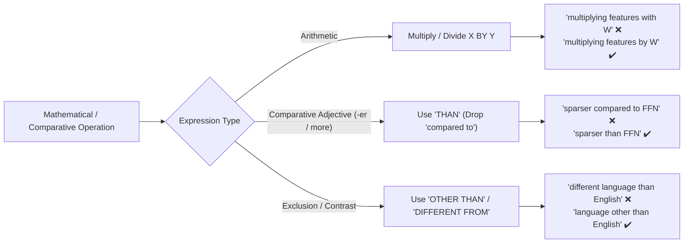

# Technical Prepositions, Collocations, and Mathematical Syntax

Mathematical operations and academic comparisons require strict prepositional pairings. Using casual conversational prepositions weakens scientific rigor.

---

## 1. Mathematical Operations: Multiply / Divide X "By" Y (Never "With")

In formal mathematics and machine learning prose, multiplication and division always govern **by**:

- ❌ _"...multiplying language-specific features **with** the token unembedding matrix..."_
- ✔️ _"...multiplying language-specific features **by** the token unembedding matrix..."_
- ❌ _"...multiplying the intermediate activations $\bm{h}^i$ **with** $\bm{W}_U$..."_
- ✔️ _"...multiplying the intermediate activations $\bm{h}^i$ **by** $\bm{W}_U$..."_

> [!TIP]
> Use **with** only when describing an interaction, dot product, or convolution where symmetry applies:
>
> - _"Computing the inner product of $\bm{a}$ **with** $\bm{b}$..."_
> - _"Convolving the signal **with** a Gaussian kernel..."_

---

## 2. Comparative Adjectives vs. "Compared to" (Comparative Redundancy)

When an adjective is already in the comparative form (inflected with _-er_ or accompanied by _more/less_), adding _compared to_ is redundant:

- ❌ _"However, SAE activations are **sparser compared to** FFN activations."_
- ✔️ _"However, SAE activations are **sparser than** FFN activations."_
- ❌ _"...and observe **higher PPL changes compared to** baseline..."_
- ✔️ _"...and observe **larger PPL changes than** the baseline..."_

### When "Compared to / with" is Appropriate

Use _compared to_ or _compared with_ only when introducing an independent clause modifier without an existing _than_:

- ✔️ _"**Compared to FFN activations**, SAE activations exhibit lower density."_
- ✔️ _"We observe that intervention in English exhibits different behavior **compared to that in** other languages."_

---

## 3. Preposition Precision with Attributes, Metrics, and Indices

- **Indices & Scores:**
  - ❌ _"selecting the index **of** the highest score..."_ (The index does not possess the score).
  - ✔️ _"selecting the index **with** the highest score..."_
- **Pairwise Relations:**
  - ❌ _"high similarity scores **to each other**..."_
  - ✔️ _"high **pairwise** similarity scores..."_ or _"high similarity scores **with one another**..."_
- **Spanning Ranges:**
  - ❌ _"...applied **from layers 3--13**..."_ (Ungrammatical without _to_).
  - ✔️ _"...applied **across layers 3--13**..."_ or _"...applied **from layer 3 to 13**..."_
- **Dataset / Model Associations:**
  - ❌ _"Text generation results **Llama 3.2 1B**..."_ (Missing governing preposition).
  - ✔️ _"Text generation results **for Llama 3.2 1B**..."_ / _"Text generation results **from Llama 3.2 1B**..."_

---

## 4. "Other Than" vs. "Different From" vs. "Different Than"

In formal academic writing, **different from** or **other than** are preferred; **different than** is generally non-standard when followed by a simple noun phrase:

- ❌ _"...from a different language **than** English."_
- ✔️ _"...from a language **other than** English."_
- ✔️ _"...from a language **different from** English."_

---

## 5. Verbs of Action vs. Clunky "Perform [Gerund]"

The verb _perform_ cannot directly govern a bare gerund phrase:

- ❌ _"We **perform steering language-specific features** in Llama 3.2 1B..."_
- ❌ _"We **perform steering with language-specific features**..."_
- ✔️ _"We **steer language-specific features** in Llama 3.2 1B..."_ (Direct, concise verb).
- ✔️ _"We **perform steering of language-specific features**..."_ (Grammatically valid nominalization).
