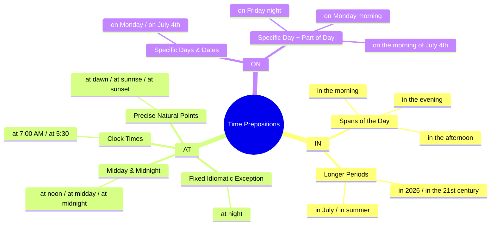

# Prepositions of Time: "In", "At", and "On"

In standard English, **"in the morning"** is standard and correct, while **"at morning"** is incorrect in everyday English.

---

## 1. "In the morning" (Standard & Natural)

Use **"in"** for broad periods/chunks of the day:

- _“I drink coffee in the morning.”_
- _“She goes for a run in the afternoon.”_
- _“We relax in the evening.”_

---

## 2. "At morning" (Incorrect in Modern English)

We do not say _"at morning"_ or _"at the morning"_.

Use **"at"** only for:

- **Specific precise points in time:** _at dawn_, _at sunrise_, _at daybreak_, _at 7:00 AM_
- **Midday / Midnight:** _at noon_, _at midday_, _at midnight_
- **Night (idiomatic exception):** _at night_

> [!NOTE]
> _"At morning"_ only appears in archaic poetry or literature (e.g., _"at morning's first light"_), but in standard modern English, always use _"in the morning"_.

---

## 3. Quick Summary Table

| Preposition | When to Use                              | Examples                                                     |
| :---------- | :--------------------------------------- | :----------------------------------------------------------- |
| **`in`**    | General spans of the day                 | _in the morning_, _in the afternoon_, _in the evening_       |
| **`at`**    | Specific moments / points / night        | _at dawn_, _at sunrise_, _at noon_, _at 8:00 AM_, _at night_ |
| **`on`**    | Specific days or dates + part of the day | _on Monday morning_, _on the morning of July 4th_            |
