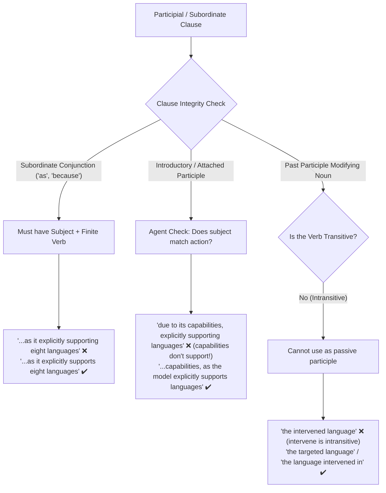

# Sentence Structure, Modifiers, and Clause Integrity

Academic manuscripts frequently lose clarity due to dangling modifiers, non-finite subordinate clauses, and intransitive participles.

---

## 1. Finite Verbs vs. Bare Participles in Subordinate Clauses

A subordinate clause introduced by a conjunction (_as, because, since, although_) requires a complete grammatical predicate with a **finite (tensed) verb**, not a bare participle (-ing):

- ❌ _"We adopt Llama 3.2 1B as the primary model due to its multilingual capabilities, **as it explicitly supporting eight languages**..."_
- ✔️ _"We adopt Llama 3.2 1B as the primary model due to its multilingual capabilities, **as it explicitly supports eight languages**..."_

---

## 2. Dangling and Misplaced Participial Modifiers

A participial modifier must logically modify the agent capable of performing the action:

- ❌ _"We adopt Llama 3.2 1B as the primary model in this study due to its multilingual capabilities, **explicitly supporting eight languages**..."_
  - _Why it fails:_ The modifier attaches to the immediately preceding noun phrase _multilingual capabilities_. But capabilities do not support languages—the model does!
- ✔️ _"We adopt Llama 3.2 1B as the primary model in this study due to its multilingual capabilities, **as the model explicitly supports eight languages**..."_

### Misplaced Relative Clauses

- ❌ _"In contrast, automatic interpretation involves presenting these contexts **to LLMs with predefined instructions, which generate an explanation**..."_
  - _Why it fails:_ Grammatically, _which generate_ attaches to _predefined instructions_ rather than _LLMs_.
- ✔️ _"In contrast, automatic interpretation involves presenting these contexts **along with predefined instructions to LLMs, which generate an explanation**..."_

---

## 3. Intransitive Verbs Cannot Form Passive Participles

Intransitive verbs do not take direct objects (_you intervene in something_, you do not _intervene something_). Therefore, their past participles cannot serve as passive pre-nominal adjectives:

- ❌ _"Conversely, activating language-specific features has a minimal impact on **the intervened language**..."_
- ✔️ _"Conversely, activating language-specific features has a minimal impact on **the targeted language**..."_
- ✔️ _"Conversely, activating language-specific features has a minimal impact on **the language intervened in**..."_

---

## 4. Restrictive ("That") vs. Non-Restrictive ("Which") with Unique Identifiers

- **Restrictive (`that` without comma):** Defines which specific item is being discussed out of many.
- **Non-Restrictive (`which` with comma):** Provides supplementary information about an already uniquely identified item.

When an item is uniquely designated by name, layer, or ID, use **comma + which**:

- ❌ _"Another surprising instance is Japanese-specific feature 32154 in layer 8 **that is strongly active for Bulgarian morphemes**..."_ (Incorrectly implies there are multiple features with ID 32154 in layer 8).
- ✔️ _"Another surprising instance is Japanese-specific feature 32154 in layer 8, **which is strongly active for Bulgarian morphemes**..."_

---

## 5. Illogical Comparisons (Reinforcing "That of")

Ensure that comparisons contrast equivalent grammatical and logical categories:

- ❌ _"We observe that intervention in English exhibits different **behavior compared to other languages**."_ (Compares behavior to languages).
- ✔️ _"We observe that intervention in English exhibits different **behavior compared to that in other languages**."_ (Compares behavior to behavior).
- ❌ _"...shows that the performance of the SAE-based LID is slightly below **fastText**."_
- ✔️ _"...shows that the performance of the SAE-based LID is slightly below **that of fastText**."_

_(For more details, see [that_those_of_comparisons.md](file:///c:/Users/Lyzander%20Andrylie/Documents/%285%29%20Note/english/concepts/sentence-structure-and-agreement/that_those_of_comparisons.md).)_

---

## 6. Tense & Modality Consistency

Maintain consistent tense and modality across related clauses in an analytical sentence:

- ❌ _"Conversely, activating language-specific features **has** a minimal impact on the target language, but **could** significantly disrupt other languages."_ (Clash between indicative _has_ and hypothetical conditional _could_).
- ✔️ _"Conversely, activating language-specific features **has** a minimal impact on the target language, but **can** significantly disrupt other languages."_
- ❌ _"...we found that shallower features **are associated** with generic tokens, while deeper features **promoted** language-specific vocabulary."_
- ✔️ _"...we found that shallower features **are associated** with generic tokens, while deeper features **promote** language-specific vocabulary."_
