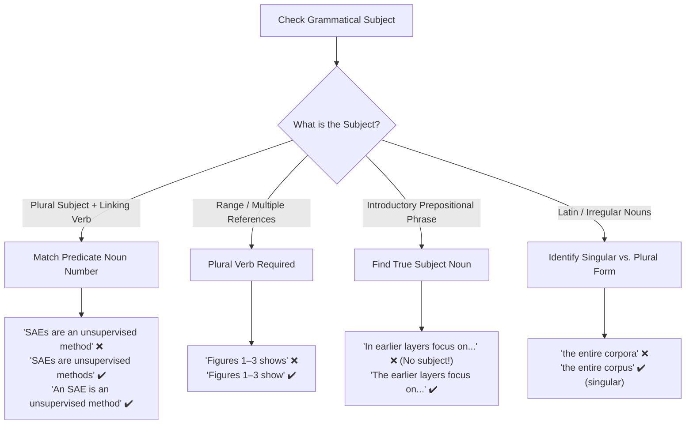

# Subject–Verb & Number Agreement in Academic and Technical Writing

Subject–verb agreement in scientific and technical prose often breaks down around compound structures, predicate complements, Latin plurals, numerical ranges, and introductory prepositional phrases.

---

## 1. Copula & Predicate Noun Agreement (Plural Subject vs. Singular Complement)

While linking verbs grammatically agree with the subject, mismatched singular/plural complements create logical dissonance in scientific definitions:

- ❌ _"Sparse autoencoders (SAEs) **are an unsupervised method** to discover features."_ (Plural subject _SAEs_ vs. singular complement _an unsupervised method_).
- ✔️ _"**An SAE is an unsupervised method** used to discover features..."_ (Singular–singular).
- ✔️ _"Sparse autoencoders (SAEs) **are unsupervised methods** used to discover features..."_ (Plural–plural).
- ✔️ _"Sparse autoencoders (SAEs) **provide an unsupervised approach** to discover features..."_ (Rephrased with an active transitive verb).

### Mathematical Variables and Set Definitions

- ❌ _"where $\bm{h}$ **is the intermediate activations**..."_ ($\bm{h}$ is a singular vector symbol, but _activations_ is plural).
- ✔️ _"where $\bm{h}$ **denotes the intermediate activation vector**..."_
- ❌ _"$\mathcal{T}_K \subseteq \{0, \ldots, n-1\}$ **is the indices** of the top-$k$ values..."_
- ✔️ _"$\mathcal{T}_K \subseteq \{0, \ldots, n-1\}$ **is the set of indices** of the top-$k$ values..."_

---

## 2. Plural Cross-References and Number Ranges

When referencing a range of figures, tables, equations, or layers, the subject is plural and requires a plural verb:

- ❌ _"**Figures 1--3 shows** the distribution of language-specific neurons..."_
- ✔️ _"**Figures 1--3 show** the distribution of language-specific neurons..."_
- ❌ _"Initially, in earlier layers (e.g., **layer 0--1**)..."_
- ✔️ _"Initially, in earlier layers (e.g., **layers 0--1**)..."_

> [!NOTE]
> In contrast, singular noun adjuncts are preferred when modifying another noun:
>
> - ❌ _"Language-Specific **Features** Counts"_ (Heading)
> - ✔️ _"Language-Specific **Feature** Counts"_ (Noun adjunct _feature_ remains singular).

---

## 3. Categorization Expressions: "A Type of [Singular Noun]"

Phrases like _a type of_, _a kind of_, or _a class of_ categorize an item into a single class and take a **singular noun**:

- ❌ _"The features we aim to find are **a type of HFLs**."_
- ✔️ _"The features we aim to find are **a type of HFL**."_
- ✔️ _"The features we aim to find **belong to HFLs**."_

---

## 4. Classical & Latin Plurals in Science

Academic English retains classical singular/plural distinctions that must match their modifiers and determiners:

| Singular Form  | Plural Form           | Common Pitfall                  | Correct Academic Usage                                       |
| :------------- | :-------------------- | :------------------------------ | :----------------------------------------------------------- |
| **corpus**     | **corpora**           | ❌ _the entire corpora_         | ✔️ _the entire corpus_ / _across all corpora_                |
| **criterion**  | **criteria**          | ❌ _a criteria_                 | ✔️ _a criterion_ / _these criteria_                          |
| **phenomenon** | **phenomena**         | ❌ _this phenomena_             | ✔️ _this phenomenon_ / _these phenomena_                     |
| **matrix**     | **matrices**          | ❌ _matrixes_                   | ✔️ _matrices_                                                |
| **index**      | **indices** / indexes | ❌ _index with values_          | ✔️ _indices of the top-k values_                             |
| **datum**      | **data**              | ❌ _this data show_ (ambiguous) | ✔️ _these data show_ (formal plural) or _this dataset shows_ |

---

## 5. Compound Subjects Joined by "And"

Two distinct subjects linked by _and_ take a plural verb:

- ❌ _"Furthermore, the specific configuration of the SAEs and their training process **is described** below."_
- ✔️ _"Furthermore, the specific configuration of the SAEs and their training process **are described** below."_

---

## 6. Prepositional Phrases Cannot Serve as Grammatical Subjects

An introductory prepositional phrase indicates setting, location, or circumstance; it cannot function as the grammatical subject of a finite verb:

- ❌ _"**In the earlier layers (layers 0--5) primarily focus on** identifying fundamental building blocks."_ (Who or what focuses? The prepositional phrase _In the earlier layers_ cannot perform the action).
- ✔️ _"**The earlier layers (layers 0--5) primarily focus on** identifying fundamental building blocks."_ (Noun phrase as subject).
- ✔️ _"**In the earlier layers (layers 0--5), the model primarily focuses on** identifying fundamental building blocks."_ (Subject _the model_ supplied).
