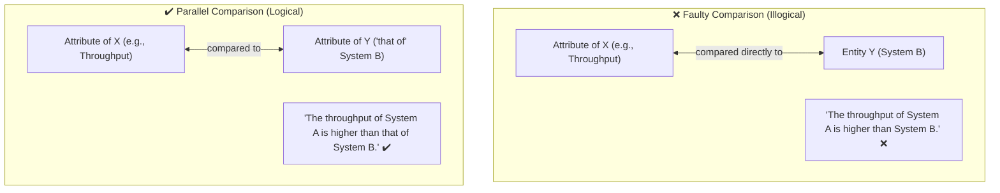
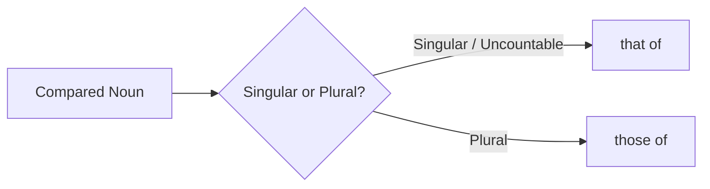

# Parallel Comparisons: "That Of" and "Those Of"

In formal and academic English, comparisons must be strictly parallel—comparing an attribute of an entity to the corresponding attribute of another, rather than to the entire entity itself. **"That of"** (singular/uncountable) and **"those of"** (plural) serve as essential pro-forms to maintain this grammatical and logical equivalence.

---

## 1. Ensuring Parallel Comparisons

A common error is comparing an attribute of something directly to the entire entity itself. **"That of"** ensures you compare items belonging to the same category:

- _Faulty:_ The throughput of System A is higher than System B. _(Compares throughput to a system)._
- _Correct:_ The throughput of System A is higher than **that of** System B. _("that" = the throughput)._

### Additional Academic & Technical Examples

- ❌ _"We observe that intervention in English exhibits different **behavior compared to other languages**."_ (Compares behavior to languages).
- ✔️ _"We observe that intervention in English exhibits different **behavior compared to that in other languages**."_ (Compares behavior to behavior).
- ❌ _"...shows that the performance of the SAE-based LID is slightly below **fastText**."_
- ✔️ _"...shows that the performance of the SAE-based LID is slightly below **that of fastText**."_

---

## 2. Number Agreement (Singular vs. Plural)

- **Singular / Uncountable $\rightarrow$ `that of`:**
  - _"The latency of the new service is lower than **that of** the legacy service."_
- **Plural $\rightarrow$ `those of`:**
  - _"The latency metrics of the new service are lower than **those of** the legacy service."_

---

## 3. Alternatives & When to Omit

While precise and standard in formal/academic writing, overusing "that of" can feel stiff. Common alternatives include:

- **Possessive nouns (`'s`):**
  - _"The performance of Model A exceeds Model B's."_
- **Rephrasing for brevity:**
  - _"System A has higher throughput than System B."_
