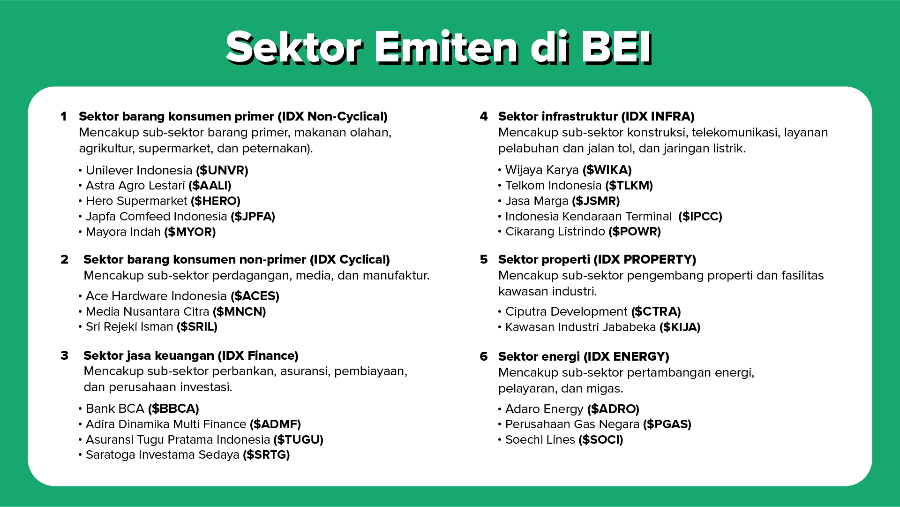
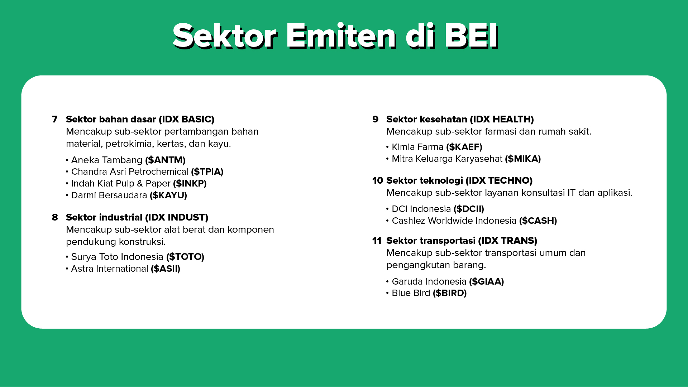

# Basic Pasar Modal

Sumber: [Stockbit Academy - Basic Pasar Modal](https://stockbit.com/academy/modules/1)

---

## 1. Investasi dan Kebebasan Finansial

### Konsep Dasar Investasi & Kebebasan Finansial

- **Investasi:** Kegiatan menanamkan dana atau aset agar nilainya berkembang melalui imbal hasil (_return_). Tujuannya adalah agar nilai riil uang tidak tergerus oleh laju inflasi (kenaikan harga barang dan jasa).
- **Kebebasan Finansial (_Financial Freedom_):** Kondisi ketika seseorang memiliki _passive income_ (pendapatan pasif) yang cukup untuk membiayai gaya hidup yang diinginkan tanpa harus bekerja secara aktif.
- **Passive Income:** Pendapatan yang mengalir masuk tanpa harus bekerja aktif secara terus-menerus, seperti dari bunga perbankan, hasil investasi, dividen saham, atau biaya sewa aset/properti.

### Langkah Mencapai Kebebasan Finansial

1. **Meningkatkan Cash Flow (Arus Kas):**
   - _Cash flow_ adalah selisih antara pendapatan (_income_) dan pengeluaran (_expense_).
   - **Cara Meningkatkan:** Naikkan pendapatan (misal: _freelance_, bisnis sampingan, peningkatan karier) dan tekan pengeluaran yang tidak perlu.
   - **Tips Pengeluaran:** Buat _budgeting_ terencana dan sisihkan dana di awal (misal 10%–20% dari pendapatan) khusus untuk tabungan dan investasi, bukan sekadar menggunakan sisa uang di akhir bulan.

1. **Meningkatkan Net Worth (Kekayaan Bersih):**
   - _Net worth_ adalah total nilai aset/kekayaan dikurangi total kewajiban (utang).
     - **Aset:** Terbagi menjadi aset finansial (saham, reksa dana, obligasi, kas) dan aset non-finansial (properti, tanah, emas, kendaraan).
     - **Utang:** Jika harus berutang, prioritaskan **Utang Produktif** (membeli aset yang nilainya berpotensi naik atau menghasilkan pendapatan, seperti KPR properti produktif atau modal usaha), dan hindari **Utang Konsumtif** (membeli barang yang nilainya langsung menyusut atau habis pakai).

1. **Memanfaatkan Compounding Interest (Bunga Berbunga):**
   - Dikenal juga sebagai _Snowball Effect_ (efek bola salju).
   - Keuntungan atau bunga investasi yang diperoleh tidak ditarik, melainkan diinvestasikan kembali bersama modal awal, sehingga menghasilkan imbal hasil yang berlipat ganda secara eksponensial di tahun-tahun berikutnya.

### Menghindari Investasi Bodong

- **Definisi:** Penipuan berkedok investasi tanpa legalitas dan skema bisnis yang jelas, yang berisiko tinggi melenyapkan seluruh uang modal.
- **Ciri-Ciri Investasi Bodong:**
  - Menjanjikan keuntungan pasti (_fixed return_) dalam nominal yang tidak masuk akal atau terlalu muluk.
  - Tidak memiliki izin usaha resmi dari regulator terkait.
  - Menggunakan **Skema Ponzi** (_money game_ / gali lubang tutup lubang), di mana keuntungan investor lama semata-mata dibayarkan dari setoran uang investor baru, bukan dari perputaran keuntungan bisnis nyata.
- **Cara Menghindarinya:**
  - Gunakan logika serta bersikap rasional terhadap mekanisme pembagian keuntungan.
  - Pastikan perusahaan dan produknya terdaftar serta diawasi oleh **Otoritas Jasa Keuangan (OJK)**.
  - Rutin mengecek legalitas dan berkonsultasi dengan penasihat keuangan atau sumber tepercaya.

### The Power of 72

Aturan 72 (_The Power of 72_) adalah rumus cepat untuk memperkirakan waktu (dalam tahun) yang dibutuhkan agar modal investasi berlipat ganda (_double_) berdasarkan tingkat imbal hasil tahunan:

$$
\text{Waktu (Tahun)} = \frac{72}{\text{Bunga Tahunan (\%)}}
$$

- **Contoh 1:** Modal Rp10.000.000 dengan imbal hasil (bunga) 8% per tahun:

  $$
  \frac{72}{8} = 9\text{ tahun}
  $$

  _Uang akan berlipat ganda menjadi Rp20.000.000 dalam waktu 9 tahun._

- **Contoh 2:** Jika imbal hasil (bunga) mencapai 18% per tahun:

  $$
  \frac{72}{18} = 4\text{ tahun}
  $$

  _Uang akan berlipat ganda hanya dalam waktu 4 tahun._

---

## 2. Pasar Modal

### Pengenalan Pasar Modal

- **Definisi Pasar Modal:** Tempat bertemunya ==pihak yang membutuhkan dana (emiten/penerbit efek)== dengan ==pihak yang kelebihan dana (investor)== untuk memperdagangkan ==instrumen investasi jangka panjang (efek keuangan)==.
- **Bursa Efek Indonesia (BEI / IDX):** Pihak resmi yang menyelenggarakan dan menyediakan sistem serta sarana perdagangan pasar modal di Indonesia.
- **Fungsi Pasar Modal:**
  - **Bagi Investor:** Sarana menempatkan modal guna memperoleh keuntungan finansial (_capital gain_, dividen, atau kupon).
  - **Bagi Perusahaan (Emiten):** Sumber pendanaan jangka panjang dari publik untuk ekspansi bisnis, investasi modal kerja, maupun pelunasan utang.
  - **Bagi Negara:** Mendorong pertumbuhan ekonomi nasional, memperluas penyerapan tenaga kerja, dan menyumbang pendapatan negara melalui pajak.

### Jenis Instrumen Investasi di Pasar Modal

1. **Saham:** Bukti kepemilikan modal atas suatu perseroan terbatas. Membeli saham berarti sah menjadi bagian pemilik perusahaan tersebut sesuai persentase kepemilikan.
2. **Obligasi:** Surat utang jangka menengah hingga panjang yang diterbitkan oleh pemerintah atau korporasi. Penerbit membayar bunga tetap/berkala (kupon) dan melunasi nilai pokok utang pada saat jatuh tempo.
   - **Obligasi Negara:** ORI, Sukuk Ritel (SR), SBN, SBSN.
   - **Obligasi Korporasi:** Diterbitkan oleh perusahaan BUMN maupun swasta.

3. **Reksa Dana:** Wadah penghimpun dana dari masyarakat pemodal untuk selanjutnya diinvestasikan dalam portofolio efek oleh Manajer Investasi.
4. **Efek Lainnya:** Instrumen derivatif (rights, warrants, options), _Exchange Traded Fund_ (ETF), Efek Beragun Aset (EBA), dan Dana Investasi Real Estate (DIRE).

### Tipe Profil Risiko Investor

1. **Konservatif (_Risk Averse_):**
   - Menomorsatukan keamanan modal pokok dengan toleransi risiko yang sangat kecil.
   - **Instrumen yang cocok:** Tabungan, deposito, Reksa Dana Pasar Uang (RDPU), obligasi negara ritel (SBN/ORI), dan Reksa Dana Pendapatan Tetap (RDPT).

1. **Moderat:**
   - Mampu menerima fluktuasi jangka pendek demi pertumbuhan nilai aset yang moderat di atas inflasi.
   - **Instrumen yang cocok:** Reksa Dana Campuran (RDC), obligasi korporasi, dan Reksa Dana Pendapatan Tetap.

1. **Agresif (_Risk Taker_):**
   - Berani menanggung fluktuasi harga tinggi dan risiko penurunan modal demi potensi pertumbuhan keuntungan maksimal (_high risk, high return_).
   - **Instrumen yang cocok:** Saham, Reksa Dana Saham (RDS), komoditas, forex, dan _cryptocurrency_.

### Prinsip Menentukan Pilihan Investasi

- **Prinsip Utama:** Tidak ada satu instrumen yang tepat untuk semua orang (_no one size fits all_). Keputusan investasi harus selalu diselaraskan dengan kondisi finansial, tujuan keuangan, jangka waktu (_time horizon_), dan profil risiko pribadi.
- **Karakteristik Investasi Saham:** Menuntut keterlibatan aktif investor untuk melakukan riset fundamental/teknikal mandiri serta mengevaluasi portofolio secara berkala.
- **Karakteristik Investasi Reksa Dana:** Lebih praktis dan santai karena alokasi dan manajemen portofolio dipercayakan kepada Manajer Investasi profesional.

### Pihak-Pihak di Pasar Modal

- **Investor:** Pemilik modal yang menginvestasikan dananya, baik investor domestik maupun investor asing.
- **Perusahaan / Emiten:** Perusahaan yang membutuhkan pendanaan modal dan menerbitkan efek di pasar modal.
- **Perusahaan Aset Manajemen (Manajer Investasi):** Lembaga pengelola dana portofolio investasi nasabah dalam bentuk reksa dana.
- **Perusahaan Sekuritas (Broker/Pialang):** Lembaga perantara perdagangan efek antara investor dengan BEI.
- **Bursa Efek Indonesia (BEI):** Penyelenggara sistem dan fasilitas pertemuan transaksi jual-beli efek.
- **Otoritas Jasa Keuangan (OJK):** Lembaga pengawas independen yang meregulasi dan mengawasi seluruh aktivitas jasa keuangan di Indonesia.
- **Kliring Penjaminan Efek Indonesia (KPEI):** Pelaksana kliring dan penjamin penyelesaian transaksi bursa yang teratur, wajar, dan efisien.
- **Kustodian Sentral Efek Indonesia (KSEI):** Lembaga penyimpanan terpusat dan penyelesaian administrasi kepemilikan efek dan dana investor.
- **Penjamin Emisi Efek (_Underwriter_):** Pihak yang membuat kontrak penjaminan dengan emiten untuk menjamin keberhasilan penawaran umum perdana saham (IPO).
- **Wali Amanat (_Trustee_):** Lembaga yang mewakili hak dan kepentingan pemegang efek obligasi/sukuk.

---

## 3. Reksa Dana

### Konsep Dasar Reksa Dana

- **Definisi:** Sarana investasi kolektif bagi pemodal yang tidak memiliki cukup waktu atau keahlian mendalam dalam meracik dan mengelola portofolio investasi sendiri.
- **Peran Manajer Investasi (MI):** Diumpamakan seperti peracik "es buah" profesional bersertifikasi; MI memilah, meramu, dan mengelola alokasi aset (saham, obligasi, pasar uang) agar tercipta portofolio yang seimbang dan optimal.
- **Karakteristik Utama:**
  - Dikelola oleh tenaga profesional berizin resmi OJK.
  - Nilai modal awal sangat terjangkau (mulai dari Rp10.000).
  - Terciptanya diversifikasi otomatis untuk meminimalisir risiko kerugian.
  - Biaya pengelolaan (_management fee_) relatif murah dan transparan.

### Jenis-Jenis Reksa Dana

1. **Reksa Dana Pasar Uang (RDPU):**
   - **Portofolio:** 100% dialokasikan pada instrumen pasar uang berjangka waktu kurang dari 1 tahun (deposito perbankan, Sertifikat Bank Indonesia / SBI).
   - **Karakteristik:** Imbal hasil relatif stabil, risiko paling rendah, sangat likuid, cocok untuk pemodal konservatif atau dana darurat.

1. **Reksa Dana Obligasi / Pendapatan Tetap (RDPT):**
   - **Portofolio:** Minimal 80% dialokasikan pada surat utang (obligasi negara/korporasi).
   - **Karakteristik:** Risiko moderat, memberikan pertumbuhan nilai yang lebih tinggi dibanding deposito, cocok untuk jangka menengah (1–3 tahun).

1. **Reksa Dana Campuran (RDC):**
   - **Portofolio:** Alokasi kombinasi antara instrumen saham, obligasi, dan pasar uang (maksimal 79% per instrumen).
   - **Karakteristik:** Tingkat risiko seimbang, fleksibel mengoptimalkan peluang pasar antara pertumbuhan modal dan pendapatan kupon.

1. **Reksa Dana Saham (RDS):**
   - **Portofolio:** Minimal 80% dialokasikan pada instrumen saham di bursa efek.
   - **Karakteristik:** Risiko paling tinggi (_risk taker_), fluktuasi harian tajam, berpotensi memberikan imbal hasil tinggi dalam jangka panjang (> 5 tahun).

1. **Reksa Dana Indeks (_Index Fund_):**
   - **Portofolio:** Dikelola pasif untuk meniru komposisi dan pergerakan indeks acuan tertentu (contoh: Indeks LQ45, IDX30, SRI-KEHATI).
   - **Karakteristik:** Kinerja bergerak selaras dengan performa indeks yang diikuti dengan biaya operasional yang lebih efisien.

1. **Reksa Dana Syariah:**
   - **Portofolio:** Dikelola dengan memenuhi kriteria dan prinsip syariah pasar modal (hanya berinvestasi pada efek dalam Daftar Efek Syariah / DES dan mematuhi batasan rasio utang berbasis bunga).

### Parameter & Aspek Penting dalam Memilih Reksa Dana

1. **Asset Under Management (AUM):** Total nilai dana kelolaan suatu produk reksa dana. Besarnya AUM menjadi tolok ukur tingginya kepercayaan investor terhadap produk dan Manajer Investasinya.
   - **Rumus:**

     $$
     \text{AUM (Total NAB)} = \text{Total Nilai Pasar Aset} - \text{Total Kewajiban}
     $$

     atau

     $$
     \text{AUM} = \text{NAB per Unit} \times \text{Total Unit Penyertaan (UP)}
     $$

   - _Contoh Kasus:_  
     Reksa dana "Makmur Bertumbuh" mengelola portofolio aset (saham, obligasi, kas) senilai **Rp520 miliar** dengan kewajiban (biaya MI, kustodian, dan transaksi) sebesar **Rp20 miliar**.

     $$
     \text{AUM} = \text{Rp520 Miliar} - \text{Rp20 Miliar} = \text{Rp500 Miliar}
     $$

1. **Net Asset Value (NAV) / Nilai Aset Bersih (NAB):** Harga per unit penyertaan reksa dana. Dihitung dari total nilai aset dikurangi kewajiban, kemudian dibagi total unit yang beredar. Pertumbuhan NAV mencerminkan keuntungan investor.
   - **Rumus:**

     $$
     \text{NAB per Unit} = \frac{\text{Total Aset} - \text{Total Kewajiban}}{\text{Total Unit Penyertaan (UP)}} = \frac{\text{Total NAB (AUM)}}{\text{Total Unit Penyertaan (UP)}}
     $$

   - _Contoh Kasus:_  
     Dari total AUM **Rp500 miliar** pada contoh sebelumnya, jika jumlah Unit Penyertaan (UP) yang beredar di masyarakat adalah **250 juta unit**:

     $$
     \text{NAB per Unit} = \frac{\text{Rp500.000.000.000}}{250.000.000 \text{ Unit}} = \text{Rp2.000 per unit}
     $$

     _(Jika seorang investor menginvestasikan modal sebesar Rp1.000.000, maka investor tersebut mendapatkan: $\frac{\text{Rp1.000.000}}{\text{Rp2.000}} = 500 \text{ unit penyertaan}$)._

1. **Compound Annual Growth Rate (CAGR):** Rata-rata laju pertumbuhan tahunan terkomposisi dari harga/nilai reksa dana dalam periode historis tertentu.
   - **Rumus:**

     $$
     \text{CAGR} = \left( \frac{\text{Nilai Akhir}}{\text{Nilai Awal}} \right)^{\frac{1}{n}} - 1
     $$

     _Keterangan: $n$ = jumlah periode investasi (dalam tahun)._

   - _Contoh Kasus:_  
     Seorang investor membeli reksa dana pada harga awal **Rp1.000 per unit**. Setelah berjalan selama **3 tahun** ($n = 3$), NAB per unit meningkat menjadi **Rp1.331 per unit**.

     $$
     \text{CAGR} = \left( \frac{1.331}{1.000} \right)^{\frac{1}{3}} - 1 = (1{,}331)^{0{,}333} - 1 = 1{,}10 - 1 = 0{,}10 \text{ (10\% per tahun)}
     $$

     _(Meskipun pergerakan pasar berfluktuasi tiap tahunnya, secara rata-rata majemuk tahunan nilai investasi tumbuh 10% per tahun)._

1. **Expense Ratio:** Rasio persentase biaya operasional pengelolaan reksa dana dalam satu tahun terhadap total nilai aset. Semakin kecil rasionya, semakin efisien pengelolaan dana tersebut.
   - **Rumus:**

     $$
     \text{Expense Ratio} = \frac{\text{Total Beban Operasional Tahunan}}{\text{Rata-rata Nilai Aset Bersih (AUM)}} \times 100\%
     $$

     _Beban operasional mencakup biaya manajer investasi, bank kustodian, auditor, transaksi, dan perizinan._

   - _Contoh Kasus:_  
     Sebuah produk reksa dana memiliki rata-rata AUM sebesar **Rp500 miliar** dalam 1 tahun buku. Total biaya operasional yang dikeluarkan untuk mengelola dana tersebut adalah **Rp7,5 miliar**.

     $$
     \text{Expense Ratio} = \frac{\text{Rp7.500.000.000}}{\text{Rp500.000.000.000}} \times 100\% = 1{,}5\%
     $$

     _(Artinya, efisiensi biaya pengelolaan adalah 1,5% per tahun dari total kelolaan dana)._

1. **Tingkat Max Drawdown:** Indikator risiko penurunan harga terdalam yang pernah dialami suatu reksa dana dari titik tertingginya (_peak_) ke titik terendahnya (_trough_) dalam periode tertentu (misal: _drawdown_ 5% dalam setahun berarti penurunan terdalam adalah 5% dari harga puncaknya).
   - **Rumus:**

     $$
     \text{Max Drawdown (MDD)} = \frac{\text{Nilai Terendah (Trough)} - \text{Nilai Puncak (Peak)}}{\text{Nilai Puncak (Peak)}} \times 100\%
     $$

   - _Contoh Kasus:_  
     Dalam rentang 1 tahun terakhir, harga NAB reksa dana saham pernah mencapai titik puncak tertingginya (_Peak_) di **Rp2.500 per unit**, kemudian terkoreksi hingga titik terendah (_Trough_) di **Rp2.000 per unit** sebelum kembali naik.

     $$
     \text{Max Drawdown} = \frac{2.000 - 2.500}{2.500} \times 100\% = \frac{-500}{2.500} \times 100\% = -20\%
     $$

     _(Artinya, risiko penurunan terdalam yang pernah dialami investor dari titik tertingginya adalah sebesar -20%)._

1. **Alokasi Aset:** Komposisi porsi masing-masing kelas instrumen (saham, obligasi, kas) dalam portofolio untuk disesuaikan dengan profil risiko.
1. **Top Holdings:** Daftar efek atau saham dengan porsi bobot terbesar di dalam portofolio yang sangat menentukan performa reksa dana tersebut.
1. **Prospektus Reksa Dana:** Dokumen legal komprehensif saat penerbitan produk yang memuat profil Manajer Investasi, Bank Kustodian, kebijakan investasi, rincian biaya, hingga prosedur likuidasi.
1. **Fund Fact Sheet (FFS):** Laporan bulanan ringkas yang diterbitkan MI berisi informasi performa bulanan terhadap _benchmark_, alokasi aset terkini, daftar _top holdings_, dan pandangan manajer investasi terhadap pasar.

### Keuntungan & Strategi Berinvestasi Reksa Dana

- **Mekanisme Keuntungan:** Investor memperoleh keuntungan (_capital gain_) dari kenaikan NAV per unit yang dihasilkan dari kenaikan harga aset portofolio serta penerimaan dividen dan bunga kupon.
- **Strategi Lump Sum:** Menempatkan dana dalam nominal besar sekaligus di awal. Menguntungkan saat pasar berada di titik dasar, namun rentan fluktuasi jika pasar terkoreksi.
- **Strategi Dollar Cost Averaging (DCA):**
  - Berinvestasi secara rutin dan terjadwal dalam nominal yang sama tanpa perlu memusingkan pergerakan harga pasar saat itu.
  - Saat harga NAV rendah otomatis memperoleh lebih banyak unit, dan saat harga NAV tinggi memperoleh unit lebih sedikit.
  - Menghasilkan harga perolehan rata-rata (_average price_) yang optimal serta melatih disiplin finansial secara konsisten.
- **Pemanfaatan Robo Advisor:** Fitur otomasi berbasis algoritma yang meracik alokasi portofolio reksa dana terbaik secara otomatis sesuai usia, tujuan investasi, dan profil risiko investor.

---

## 4. Saham

### Pengenalan Saham

- **Evolusi:** Perdagangan saham dahulu menggunakan sertifikat fisik berbentuk kertas (warkat). Kini seluruh pencatatan dan transaksi dilakukan secara digital (_scripless_) melalui platform _online trading_ sekuritas (seperti [Stockbit](https://stockbit.com/) dan Sinarmas Sekuritas).
- **Perusahaan Terbuka (Tbk):** Perusahaan yang mencatatkan sahamnya di bursa efek agar kepemilikannya dapat dimiliki oleh publik, ditandai dengan keterangan **Tbk** di belakang nama perseroan.
- **Kode Emiten (Ticker):** Simbol 4 huruf unik penanda saham emiten di BEI (contoh: `$UNVR` untuk Unilever Indonesia, `$BBCA` untuk Bank Central Asia).
- **Jumlah Emiten:** Terdapat lebih dari 700 perusahaan tercatat di BEI dan terus bertambah seiring berjalannya aksi IPO.

### 4 Tahapan Perusahaan "Go Public" (IPO)

1. **Tahap Persiapan:**
   - Perusahaan menggelar Rapat Umum Pemegang Saham (RUPS) untuk mendapat persetujuan _go public_.
   - Menunjuk penjamin emisi efek (_underwriter_) serta lembaga penunjang pasar modal.
   - _Underwriter_ (biasanya _investment bank_) bertugas melakukan valuasi nilai wajar saham serta mengukur risiko penawaran.

1. **Tahap Pengajuan Pendaftaran:**
   - Mengajukan dokumen pernyataan pendaftaran dan prospektus kepada OJK dan BEI untuk penelaahan legalitas.

1. **Tahap Go Public (Penawaran Umum):**
   - Masa penawaran saham perdana kepada publik/investor secara luas melalui sistem e-IPO.

1. **Tahap Pencatatan (_Listing_):**
   - Saham resmi dicatatkan di papan perdagangan BEI dan mulai dapat ditransaksikan di pasar sekunder antar-investor.

### Mekanisme Transaksi Jual dan Beli Saham

- **Rekening Dana Nasabah (RDN):** Rekening perbankan khusus atas nama investor yang dibuka melalui perusahaan sekuritas untuk menampung dana transaksi dan hasil penjualan saham.
- **Satuan Perdagangan (Lot):** Pembelian saham di BEI dilakukan dalam satuan lot, di mana **1 lot = 100 lembar saham**. Harga yang ditampilkan di bursa adalah harga per lembar saham.
- **Biaya Transaksi (_Transaction Fee_):** Dikenakan oleh pihak sekuritas berupa fee beli dan fee jual yang sudah mencakup komisi broker, biaya levy (BEI, KPEI, KSEI), PPN, dan PPh final (saat jual).
- **Jam Perdagangan Bursa:** Transaksi saham berlangsung pada hari kerja bursa (Senin–Jumat) yang terbagi menjadi dua sesi perdagangan:
  - **Senin – Kamis:**
    - **Sesi I:** 09.00 – 12.00 WIB
    - **Sesi II:** 13.30 – 15.49 WIB _(Pra-penutupan: 15.50 – 16.00 WIB, Pasca-penutupan: 16.01 – 16.15 WIB)_
  - **Jumat:**
    - **Sesi I:** 09.00 – 11.30 WIB
    - **Sesi II:** 14.00 – 15.49 WIB _(Pra-penutupan: 15.50 – 16.00 WIB, Pasca-penutupan: 16.01 – 16.15 WIB)_
  - _(Catatan: Sesi Pra-pembukaan / Pre-opening berlangsung pukul 08.45 – 08.59 WIB)._

#### Order Book (Buku Antrean Pesanan)

- **Bid:** Harga yang ditawar oleh pihak pembeli.
- **Ask / Offer:** Harga yang ditawarkan oleh pihak penjual.
- **Lot:** Jumlah volume antrean pesanan pada masing-masing tingkatan harga.
- **Mekanisme Eksekusi:**
  - Jika ingin langsung membeli tanpa antre, beli pada harga terbaik di kolom **Ask** (**Haka / Hajar Kanan**).
  - Jika ingin langsung menjual tanpa antre, jual pada harga terbaik di kolom **Bid** (**Haki / Hajar Kiri**).
  - Jika memasang harga di bawah ask (untuk beli) atau di atas bid (untuk jual), pesanan akan mengantre sesuai prioritas harga dan waktu (_price-time priority_).

#### Ketentuan Fraksi Harga Saham di BEI

Fraksi harga adalah batas kelipatan nominal kenaikan atau penurunan harga saham:

| Rentang Harga Saham   | Fraksi Harga (_Tick_)                        |
| :-------------------- | :------------------------------------------- |
| **< Rp200**           | **Rp1**                                      |
| **Rp200 – Rp500**     | **Rp2** _(standar panduan umum/lama: Rp5)_   |
| **Rp500 – Rp2.000**   | **Rp10**                                     |
| **Rp2.000 – Rp5.000** | **Rp20** _(standar panduan umum/lama: Rp25)_ |
| **> Rp5.000**         | **Rp25**                                     |

_(Contoh: Saham di harga Rp510 berada pada rentang Rp500–Rp2.000 dengan fraksi Rp10, maka pergerakan harga berikutnya naik menjadi Rp520 atau turun menjadi Rp500)._

### Keuntungan Investasi Saham

1. **Capital Gain:** Keuntungan yang diperoleh dari selisih positif antara harga jual yang lebih tinggi dibanding harga beli.
2. **Dividen:** Bagian laba bersih emiten yang dibagikan secara tunai atau saham kepada para pemegang saham berdasarkan keputusan RUPS.

### Risiko Investasi Saham

1. **Risiko Capital Loss:** Kerugian saat saham dijual pada harga yang lebih rendah daripada harga beli.
2. **Risiko Kebangkrutan / Likuidasi:** Jika emiten diputus pailit oleh pengadilan, investor hanya berhak menerima sisa pembagian aset setelah seluruh kewajiban utang dilunasi.
3. **Risiko Likuiditas:** Saham sulit dijual kembali karena transaksi sepi peminat (dikenal dengan istilah "saham tidur").
4. **Risiko Forced Delisting:** Penghapusan paksa pencatatan saham dari bursa BEI akibat pelanggaran ketentuan atau penurunan performa keuangan yang ekstrem.
5. **Risiko Suspensi:** Penghentian sementara aktivitas perdagangan saham oleh BEI (akibat lonjakan harga tak wajar/volatilitas tinggi atau masalah kepatuhan).
6. **Risiko Pasar (_Systematic Risk_):** Risiko makro yang melanda seluruh pasar, seperti lonjakan suku bunga acuan, krisis geopolitik, inflasi, dan kebijakan makroekonomi.
7. **Risiko Unik (_Unsystematic Risk_):** Risiko mikro internal yang spesifik menimpa emiten tertentu (seperti gugatan hukum, kesalahan produksi, atau persaingan bisnis).

### Memahami Indeks Saham

Indeks saham adalah indikator ukuran statistik pergerakan harga sekumpulan saham:

1. **Broad Market Index:** Mengukur keseluruhan pergerakan saham di bursa suatu negara (contoh di Indonesia: **Indeks Harga Saham Gabungan / IHSG**).
2. **Multi Market Index:** Mengelompokkan saham antar-negara berdasarkan kawasan atau kriteria ekonomi (contoh: _MSCI Asia Pacific Index_, _Emerging Market Index_).
3. **Indeks Sektoral:** Mengelompokkan saham berdasarkan industri sejenis (contoh: _IDX Finance_, _IDX Infrastructure_, _IDX Energy_).
4. **Style Index:** Mengelompokkan saham berdasarkan kriteria spesifik:
   - Likuiditas & kapitalisasi tinggi: **Indeks LQ45**, **IDX30**.
   - Berprinsip syariah: **Jakarta Islamic Index (JII)**, **ISSI**.
   - Kinerja baik bervaluasi murah: **IDX VALUE30**.

### Tipe-Tipe Analisis Saham

1. **Analisis Fundamental:**
   - Menganalisis kondisi kesehatan bisnis emiten, laporan keuangan (neraca, laba rugi, arus kas), rasio profitabilitas, serta faktor ekonomi makro dan persaingan industri.
   - Bertujuan menentukan nilai wajar (_intrinsic value_) saham untuk investasi jangka panjang (diterapkan oleh investor ternama seperti Warren Buffett dan Lo Kheng Hong).

1. **Analisis Teknikal:**
   - Mempelajari pergerakan harga historis, grafik tren (_chart pattern_), dan indikator matematis (seperti Moving Average, RSI, MACD, Volume).
   - Menentukan momentum waktu beli (_entry_) dan jual (_exit_) bagi _trader_ jangka pendek hingga menengah.

1. **Bandarmologi (_Smart Money Flow_):**
   - Menganalisis volume transaksi broker/sekuritas tertentu melalui fitur _Broker Summary_ (di Stockbit) untuk melacak jejak akumulasi atau distribusi oleh pemodal bermodal besar ("bandar").
   - Jika bandar sedang melakukan akumulasi, harga saham cenderung terdorong naik; jika sedang distribusi (jual masif), harga cenderung tertekan turun.

### Aksi Korporasi (_Corporate Action_)

Tindakan emiten yang berdampak pada jumlah saham beredar, modal, atau harga saham di pasar:

1. **Stock Split:** Pemecahan nilai nominal saham menjadi lebih kecil dengan rasio tertentu (contoh rasio 1:2: 1 saham nominal Rp1.000 dipecah menjadi 2 saham nominal Rp500). Dilakukan agar harga saham lebih terjangkau dan likuiditas perdagangan meningkat.
2. **Reverse Stock Split:** Penggabungan nominal beberapa saham menjadi saham baru dengan nominal lebih besar (kebalikan _stock split_), kerap diterapkan agar saham kembali aktif diperdagangkan di atas batas harga minimum bursa.
3. **Rights Issue (HMETD) & Private Placement:**
   - **Rights Issue (HMETD):** Penerbitan saham baru di mana pemegang saham lama berhak membeli saham terlebih dahulu guna mencegah penurunan persentase kepemilikannya (**dilusi**).
   - **Private Placement:** Penerbitan saham baru yang langsung dialokasikan ke investor strategis tertentu tanpa hak penawaran perdana bagi pemegang saham publik lama.

4. **Stock Dividend:** Pembagian dividen berupa lembar saham baru secara proporsional kepada para pemegang saham.
5. **Cash Dividend:** Pembagian keuntungan perseroan secara tunai ke rekening dana nasabah investor.
6. **Merger & Akuisisi:**
   - **Merger:** Penggabungan dua perusahaan atau lebih yang menghasilkan pembentukan entitas perseroan baru.
   - **Akuisisi:** Pengambilalihan kendali saham perusahaan lain, di mana perusahaan yang diakuisisi tetap beroperasi dengan nama lamanya.

7. **Shares Buyback:** Pembelian kembali saham yang beredar di pasar oleh emiten. Aksi ini mengurangi pasokan saham beredar dan memberikan sinyal optimisme bahwa manajemen menilai harga saham perseroan sedang _undervalued_ (murah).

---

## 5. Istilah-Istilah Investasi Saham

Kumpulan istilah dan bahasa slang yang populer dalam komunitas pasar modal:

1. **ARA (Auto Reject Atas):** Keadaan saat harga suatu saham naik menyentuh level batas kenaikan maksimal yang ditetapkan BEI (20% untuk harga > Rp5.000, 25% untuk Rp200–Rp5.000, dan 35% untuk < Rp200).
2. **ARB (Auto Reject Bawah):** Keadaan saat harga suatu saham turun menyentuh level batas penurunan maksimal yang dibolehkan oleh BEI.
3. **Bagger:** Keuntungan berlipat lebih dari 100% (contoh: "5 bagger" berarti nilai investasinya bertumbuh menjadi 5x lipat atau meraup keuntungan 400%).
4. **Bandar:** Pihak atau institusi bermodal raksasa yang transaksinya dinilai mampu menggerakkan tren harga saham.
5. **Bearish:** Kondisi pasar atau harga saham yang sedang dalam tren melemah atau mengalami penurunan.
6. **Boncos:** Keadaan saat investor atau trader mengalami kerugian modal atau menjual saham di bawah harga beli.
7. **Bullish:** Kondisi pasar atau harga saham yang sedang dalam tren menguat atau mengalami kenaikan.
8. **Cuan:** Keadaan saat investor atau trader meraih keuntungan finansial dari transaksi saham.
9. **Cut Loss (CL):** Tindakan menjual saham saat mengalami kerugian guna mencegah penurunan modal lebih dalam sesuai batas toleransi risiko.
10. **Fluktuatif:** Pergerakan harga yang cepat berubah dan naik-turun secara dinamis.
11. **Fear of Missing Out (FOMO):** Rasa takut ketinggalan tren atau lonjakan harga saham tertentu, sehingga buru-buru membeli tanpa pertimbangan analisis yang matang.
12. **Haka (Hajar Kanan):** Strategi membeli saham dengan memasang harga antrean jual (_offer/ask_) terbaik agar langsung mendapatkan barang tanpa perlu mengantre.
13. **Haki (Hajar Kiri):** Strategi menjual saham dengan memasang harga antrean beli (_bid_) terbaik agar langsung melepas saham tanpa perlu mengantre.
14. **Hu:** Singkatan dari "Suhu", yaitu panggilan kepada individu yang dipandang sangat ahli, berpengalaman, dan lihai dalam dunia investasi/trading.
15. **Ketinggalan Kereta:** Kondisi saat investor ingin membeli suatu saham, namun harga saham tersebut sudah terlanjur melambung tinggi.
16. **Nyangkut:** Kondisi ketika posisi harga saham saat ini lebih rendah dari harga perolehan beli (_floating loss_) dan belum direalisasikan.
17. **Pom-pom:** Upaya individu atau kelompok untuk "mempromosikan dan mengunggulkan" saham tertentu secara berlebihan agar menarik minat beli publik.
18. **Saham Gorengan:** Saham yang fluktuasi pergerakannya dinilai spekulatif, tidak mencerminkan fundamental bisnis, serta volume transaksinya tidak wajar.
19. **Serok:** Aksi membeli saham ketika harganya sudah mengalami penurunan tajam di area bawah.
20. **Saham Blue Chip:** Saham dari emiten berkapitalisasi pasar besar (_big market cap_), memiliki kinerja fundamental yang teruji, produknya digunakan secara luas oleh masyarakat, dan rutin membagikan dividen. Contoh: Indofood CBP (`$ICBP`), Unilever Indonesia (`$UNVR`), dan Bank Central Asia (`$BBCA`).
21. **Saham Gocap:** Saham yang harganya tertahan di level Rp50 (batas harga terendah di Papan Utama dan Papan Pengembangan BEI). Namun, untuk emiten yang tercatat di Papan Akselerasi, harga sahamnya dapat turun hingga Rp1.
22. **Short Selling:** Transaksi penjualan saham di mana penjual meminjam efek terlebih dahulu untuk dijual saat harga tinggi, kemudian membelinya kembali saat harga turun guna mendulang profit dari selisih penurunan harga tersebut.
23. **Tebar Fear:** Aksi menyebarkan berita atau sentimen negatif secara berlebihan untuk menakut-nakuti investor lain agar melakukan aksi jual (_panic selling_).
24. **Take Profit (TP):** Tindakan menjual saham untuk merealisasikan keuntungan setelah mencapai target harga yang direncanakan.
25. **Transaksi Margin:** Transaksi pembelian saham untuk kepentingan nasabah dengan fasilitas pembiayaan pinjaman dana dari perusahaan sekuritas.
