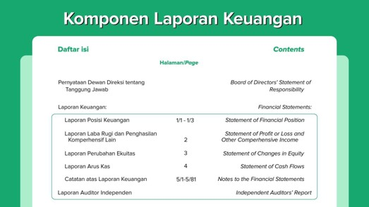
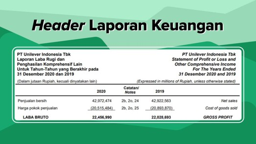
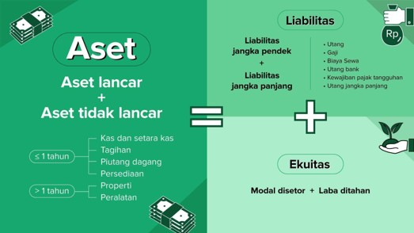
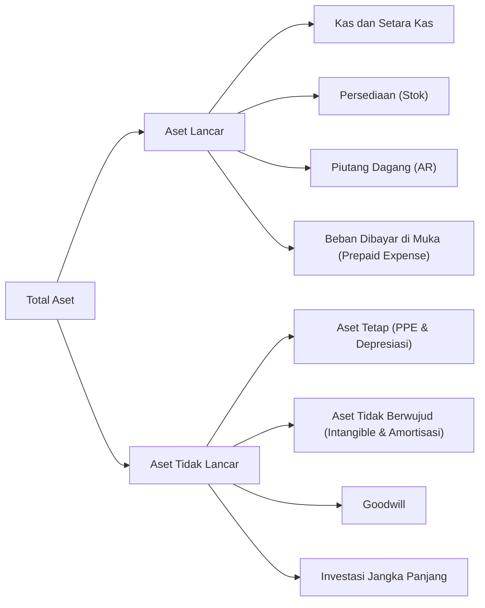
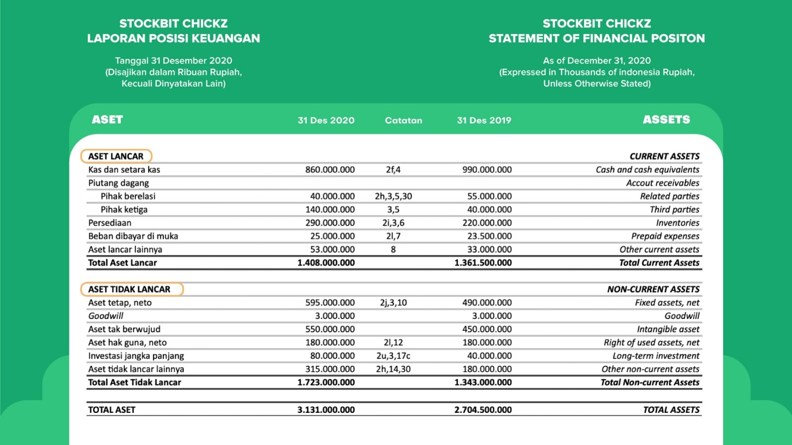
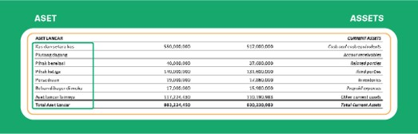
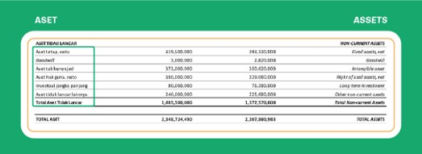
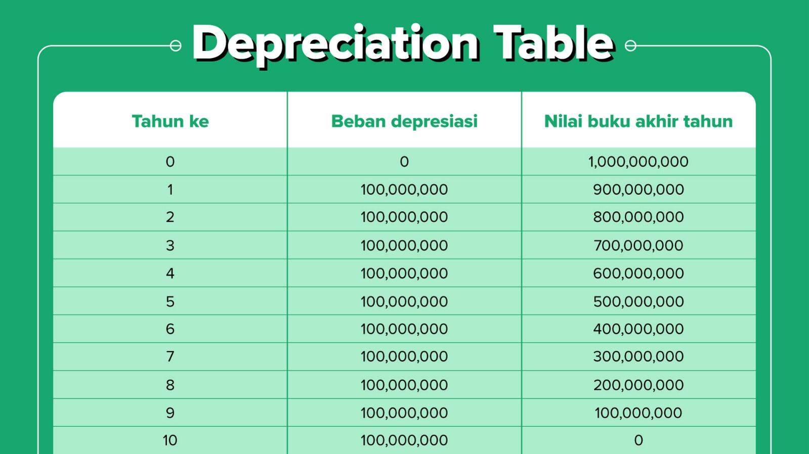

# Memahami Laporan Keuangan

Sumber: [Stockbit Academy - Memahami Laporan Keuangan](https://stockbit.com/academy/modules/2)

---

## 1. Pengantar Laporan Keuangan

### Apa Itu Laporan Keuangan?

- **Definisi:** Laporan keuangan (_financial statement_) adalah catatan informasi keuangan perusahaan dalam suatu periode akuntansi yang menggambarkan kinerja dan kondisi kesehatan finansial perusahaan tersebut.
- **Pentingnya bagi Investor:** Menilai baik atau buruknya kondisi fundamental perusahaan untuk menentukan kelayakan investasi.
- **Kewajiban Emiten:** Seluruh perusahaan terbuka (emiten) yang terdaftar di Bursa Efek Indonesia (BEI) wajib mempublikasikan laporan keuangannya secara berkala sesuai tenggat waktu regulasi.

### Periode Rilis Laporan Keuangan

Berdasarkan frekuensi dan periode rilisnya, laporan keuangan dibagi menjadi dua jenis:

1. **Laporan Keuangan Kuartalan (Triwulanan):**
   - Dipublikasikan sebanyak **4 kali dalam setahun** (masing-masing mencakup periode 3 bulan).
   - Umumnya dirilis **1 bulan setelah akhir kuartal**.
   - _Contoh:_ Kuartal I (Januari–Maret) wajib diterbitkan paling lambat tanggal **30 April**.
2. **Laporan Keuangan Tahunan (_Full Year_ / Kuartal IV):**
   - Merupakan laporan kinerja kumulatif selama satu tahun penuh (berakhir per 31 Desember).
   - Biasanya dipublikasikan emiten paling lambat **2 bulan setelah akhir tahun** buku.

### Mengapa Harus Menganalisis Laporan Keuangan Secara Mandiri?

Membeli saham pada hakikatnya adalah membeli kepemilikan bisnis riil. Sebagai pemilik modal, investor harus mampu menilai kinerja bisnis secara mandiri dan objektif, bukan sekadar mengikuti rekomendasi orang lain atau promosi figur publik/artis.

**Pertanyaan Kunci Sebelum Membeli Saham:**

- Apa model dan jenis bisnis yang dijalankan perusahaan?
- Bagaimana cara perusahaan menghasilkan pendapatan (_revenue_)?
- Apa saja beban dan pos pengeluaran operasional perusahaan?
- Apakah operasional bisnis mampu menghasilkan laba bersih secara konsisten?
- Bagaimana komposisi aset, liabilitas (utang), dan ekuitas (modal) perusahaan?
- Seberapa efektif kemampuan perusahaan dalam menghasilkan arus kas (_cash flow_) riil?

---

## 2. Komponen Utama Laporan Keuangan

Laporan keuangan lengkap terdiri atas 4 komponen utama:

### 1. Laporan Posisi Keuangan (_Balance Sheet_)

- **Fungsi:** Menunjukkan saldo aset, liabilitas (utang), dan ekuitas (modal) perusahaan pada **satu titik waktu tertentu** (misal: per 31 Desember 2020, per 31 Maret 2020, atau per 30 Juni 2020).
- **Karakteristik:** Bekerja layaknya sebuah foto (_snapshot_)—hanya memotret kondisi keuangan pada tanggal pelaporan.
- Menunjukkan total kekayaan bersih (_net worth_) perusahaan.

### 2. Laporan Laba Rugi (_Income Statement_)

- **Fungsi:** Menunjukkan performa dan hasil operasional perusahaan selama **rentang periode waktu tertentu** (misal: sepanjang tahun 2020, semester I 2020, atau kuartal I 2020).
- Mengakumulasikan seluruh pendapatan operasional serta beban usaha untuk menghitung laba atau rugi bersih.

### 3. Laporan Arus Kas (_Cash Flow Statement_)

- **Fungsi:** Mencatat penerimaan dan pengeluaran kas riil selama periode pelaporan tertentu.
- **Perbedaan dengan Income Statement:**
  - _Income Statement_ mencatat seluruh transaksi penjualan dan beban berdasarkan basis akrual (mencakup transaksi tunai maupun kredit/piutang).
  - _Cash Flow Statement_ murni mencatat pergerakan transaksi yang melibatkan penerimaan dan pengeluaran uang kas secara riil.

### 4. Catatan Atas Laporan Keuangan (CALK / _Notes to Financial Statements_)

- **Fungsi:** Memberikan rincian mendalam dan penjelasan naratif atas akun-akun di _balance sheet_ dan _income statement_.
- **Isi Catatan:** Standar akuntansi yang digunakan, metode perhitungan/pengukuran, rincian per segmen bisnis, asal dan tujuan transaksi, rincian negara tujuan ekspor, serta pengungkapan penting lainnya sesuai regulasi pasar modal.

---

## 3. Ketentuan Penyajian & Validitas Laporan Keuangan

### Cara Membaca Satuan Nominal dan Angka

- Pada bagian judul laporan selalu dicantumkan **satuan angka** (misal: disajikan dalam ribuan, jutaan, atau miliaran) dan **mata uang pelaporan** (Rupiah, USD, dsb.) agar penyajian angka lebih ringkas.
- _Contoh Kasus:_
  Penjualan bersih PT Unilever Indonesia Tbk tahun 2020 tertulis `42.972.474` dengan keterangan disajikan dalam **jutaan Rupiah**.

  $$\text{Nilai Riil} = 42.972.474 \times \text{Rp}1.000.000 = \text{Rp}42.972.474.000.000 \text{ (Rp42,972 triliun)}$$

- Nomor referensi pada tabel (misal: catatan 2B, 2O, 24) mengarahkan pembaca ke lembar Catatan Atas Laporan Keuangan (CALK) untuk melihat rincian pos tersebut.

### Peran Auditor & Pentingnya Opini Audit

- **Tujuan Audit:** Mencegah manipulasi pelaporan (seperti memoles/menggelembungkan laba, menyembunyikan biaya, atau mencatat aset fiktif).
- **Auditor Independen:** Pihak profesional eksternal yang bertugas menguji kepatuhan, keabsahan data, serta memberikan opini objektif atas laporan keuangan.
- **Kantor Akuntan Publik "The Big Four" di Indonesia:**
  1. **PwC** (_PricewaterhouseCoopers_)
  2. **EY** (_Ernst & Young_)
  3. **Deloitte**
  4. **KPMG**
- **Opini Audit yang Diharapkan:**
  Investor sebaiknya memprioritaskan perusahaan dengan opini **Wajar Tanpa Pengecualian (WTP / _Unqualified Opinion_)**, yang menunjukkan bahwa laporan keuangan disajikan secara wajar dalam semua hal yang material tanpa indikasi manipulasi.

---

## 4. Dokumen Pendukung Bagi Investor

### 1. Laporan Tahunan (_Annual Report_)

Dokumen laporan komprehensif yang dirilis setahun sekali mengenai seluruh aktivitas dan dinamika operasional emiten, memuat:

- Analisis dan pembahasan manajemen atas kinerja perusahaan (_MD&A_).
- Tinjauan kondisi makroekonomi dan tren industri.
- Struktur kepemilikan dan profil dewan manajemen (Direksi & Komisaris).
- Implementasi tata kelola perusahaan yang baik (_Good Corporate Governance_).
- Laporan kinerja operasional dan strategi rencana ekspansi bisnis ke depan.
- Laporan keuangan auditan lengkap.

### 2. Paparan Publik (_Public Expose_)

- **Pengertian:** Agenda resmi tempat manajemen emiten menyampaikan rangkuman kinerja terkini dan prospek bisnis langsung kepada publik serta investor.
- **Kewajiban:** BEI mewajibkan emiten menyelenggarakan _Public Expose_ minimal **1 kali dalam setahun**.
- **Isi Dokumen Paparan Publik:**
  - Profil dan rekam jejak bisnis emiten.
  - Produk dan portofolio layanan andalan.
  - Posisi dan peta persaingan industri.
  - Rencana kerja, target, dan prospek bisnis mendatang.
  - **Transkrip sesi tanya jawab (Q&A):** Memuat jawaban langsung manajemen atas pertanyaan krusial dari para investor/analis.
- **Akses Dokumen:** Dapat diakses lewat aplikasi Stockbit (menu Reports), situs web [BEI / IDX Tab Pengumuman](https://idx.co.id/berita/pengumuman/), atau menu _Investor Relations_ pada laman resmi emiten.

---

## 5. Neraca Keuangan (_Balance Sheet_)

### Apa Itu Balance Sheet?

Laporan Posisi Keuangan (_Balance Sheet_) adalah laporan yang memotret kondisi kekayaan, kewajiban, dan permodalan perusahaan pada tanggal penutupan buku.

### Persamaan Dasar Akuntansi

$$
\text{Aset} = \text{Liabilitas} + \text{Ekuitas}
$$

- **Aset:** Seluruh kekayaan dan sumber daya ekonomi yang dimiliki dan dikuasai perusahaan.
- **Liabilitas:** Kewajiban atau utang perusahaan kepada pihak ketiga untuk mendanai operasional/ekspansi.
- **Ekuitas:** Modal bersih milik pemegang saham/pendiri perusahaan.

> **Contoh Ilustrasi (Stockbit Chickz):**  
> Pak Agus dan Pak Budi berencana mendirikan usaha ayam goreng bernama _Stockbit Chickz_ dengan kebutuhan modal awal sebesar **Rp12 miliar**.
>
> 1. Pak Agus dan Pak Budi masing-masing mengumpulkan modal Rp5 miliar $\rightarrow$ **Ekuitas = Rp10 miliar**.
> 2. Karena masih kurang Rp2 miliar, mereka meminjam dana ke bank $\rightarrow$ **Liabilitas = Rp2 miliar**.
> 3. Dana yang terkumpul disimpan dalam bentuk kas perusahaan $\rightarrow$ **Total Aset = Rp12 miliar**.
>
> Pembuktian:  
> $\text{Aset (Rp12 Miliar)} = \text{Liabilitas (Rp2 Miliar)} + \text{Ekuitas (Rp10 Miliar)}$

---

## 6. Klasifikasi dan Komponen Aset

**Aset** adalah seluruh sumber daya fisik maupun non-fisik yang bernilai ekonomis dan digunakan untuk menunjang kegiatan operasional perusahaan.

Aset dikelompokkan ke dalam 2 kategori utama:

### A. Aset Lancar (_Current Assets_)

Aset yang likuid dan mudah dicairkan menjadi uang tunai dalam jangka waktu **kurang dari 1 tahun**:

1. **Kas dan Setara Kas (_Cash and Cash Equivalents_):**
   - _Kas:_ Uang tunai yang tersimpan di kasir toko, kantor, maupun saldo rekening bank.
   - _Setara Kas:_ Aset finansial yang sangat likuid dan berjangka pendek (jatuh tempo 3, 6, atau 9 bulan; < 1 tahun), seperti cek, giro, dan deposito jangka pendek.
2. **Persediaan / Stok (_Inventory_):**
   - Segala bahan mentah, barang dalam proses, atau produk jadi yang dibutuhkan untuk memproduksi barang jualan (pada _Stockbit Chickz_: ayam mentah, minyak goreng, kemasan).
3. **Piutang Dagang (_Accounts Receivable / AR_):**
   - Hak tagih perusahaan kepada pihak ketiga/pelanggan atas penjualan barang atau jasa yang belum dilunasi. Umumnya jatuh tempo dan tertagih dalam hitungan minggu hingga bulan (< 1 tahun).
4. **Beban Dibayar di Muka (_Prepaid Expense_):**
   - Biaya yang telah dibayarkan di awal sebelum barang/jasa dinikmati (contoh: biaya sewa ruko tahunan yang dibayar di muka setiap 1 Januari untuk masa sewa satu tahun berjalan).

---

### B. Aset Tidak Lancar (_Non-Current Assets_)

Aset yang memiliki masa manfaat **lebih dari 1 tahun** dan relatif membutuhkan waktu lama untuk dikonversi menjadi kas:

1. **Aset Tetap (_Property, Plant, and Equipment / PPE_):**
   - Aset berwujud fisik yang menunjang operasional jangka panjang (contoh: tanah, gedung, pabrik, mesin produksi, kendaraan, dan peralatan kerja).
   - **Beban Depresiasi (Penyusutan):** Pengurangan nilai tercatat aset tetap secara berkala sesuai masa manfaatnya:

     $$\text{Beban Depresiasi per Tahun} = \frac{\text{Harga Beli}}{\text{Masa Manfaat (Tahun)}}$$

     _Contoh Kasus:_  
     Stockbit Chickz membeli _kitchen set_ seharga **Rp1 miliar** dengan masa manfaat **10 tahun**.
     - Depresiasi per tahun: $\frac{\text{Rp1.000.000.000}}{10} = \text{Rp100.000.000/tahun}$.
     - Depresiasi Rp100 juta/tahun dicatat sebagai beban operasional di _income statement_.
     - Nilai aset tetap di _balance sheet_: Tahun ke-1 = Rp1 miliar, Tahun ke-2 = Rp900 juta, Tahun ke-3 = Rp800 juta, dan seterusnya hingga habis masa manfaatnya.

     

2. **Aset Tidak Berwujud (_Intangible Assets_):**
   - Aset non-moneter tanpa wujud fisik yang memberi nilai ekonomis masa depan dan dapat diidentifikasi (contoh: hak paten, hak cipta, lisensi, merek dagang, dan izin konsesi tambang).
   - Penurunan nilai aset tidak berwujud disebut **Amortisasi**.

3. **Goodwill:**
   - Aset tidak berwujud yang timbul ketika perusahaan mengakuisisi perusahaan lain dengan harga di atas nilai buku (_book value_) atau nilai ekuitasnya.
   - _Contoh Kasus:_  
     Pada tahun 2014, Stockbit Chickz membeli 100% saham _Bibit Chickz_ seharga **Rp15 miliar**, sedangkan nilai ekuitas Bibit Chickz hanya **Rp12 miliar**.

     $$\text{Goodwill} = \text{Harga Akuisisi} - \text{Nilai Ekuitas} = \text{Rp15 Miliar} - \text{Rp12 Miliar} = \text{Rp3 Miliar}$$

     Selisih **Rp3 miliar** dicatat sebagai akun _Goodwill_ pada neraca Stockbit Chickz.

4. **Investasi Jangka Panjang:**
   - Instrumen investasi yang dimiliki perusahaan untuk jangka waktu lebih dari 1 tahun (misal: kepemilikan saham/obligasi pada anak usaha atau entitas lain untuk tujuan strategis).

---

## 7. Apa Itu Liabilitas?

Materi berikutnya dapat diakses melalui tautan berikut:

- [Stockbit Academy - Modul 2: Apa Itu Liabilitas?](https://stockbit.com/academy/modules/2/chapters/10/lessons/71)
