# JSON Web Token (JWT) & The JOSE Architecture

A comprehensive technical guide to **JSON Web Tokens (JWT)**, the **JOSE (Javascript Object Signing and Encryption)** framework, and related specifications including **JWS**, **JWE**, **JWK**, and **JWA**. This document covers token structures, cryptographic mechanisms, communication flows, security pitfalls, and production best practices.

---

## 1. Overview & The JOSE Ecosystem

A **JSON Web Token (JWT)**, defined in [RFC 7519](https://datatracker.ietf.org/doc/html/rfc7519), is a compact, URL-safe means of representing claims to be transferred between two parties. JWTs are widely used for stateless authentication, federated single sign-on (SSO), and decentralized authorization in distributed microservice architectures.

However, a JWT is not a standalone primitive; it is part of a larger cryptographic suite governed by the **JOSE (Javascript Object Signing and Encryption)** family of standards:

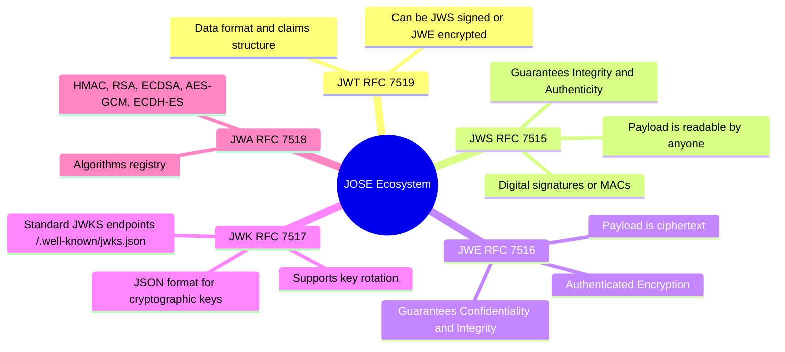

### 1.1 The Family Tree of JOSE Specifications

| Specification                 | RFC                                                       | Primary Responsibility                                           | Data Visibility                                            |
| :---------------------------- | :-------------------------------------------------------- | :--------------------------------------------------------------- | :--------------------------------------------------------- |
| **JWT** (JSON Web Token)      | [RFC 7519](https://datatracker.ietf.org/doc/html/rfc7519) | Defines JSON claims and semantics (`sub`, `iss`, `exp`)          | Depends on underlying container (JWS vs JWE)               |
| **JWS** (JSON Web Signature)  | [RFC 7515](https://datatracker.ietf.org/doc/html/rfc7515) | Signs arbitrary payloads using HMAC, RSA, ECDSA, or EdDSA        | **Publicly readable** (Base64URL encoded, not encrypted)   |
| **JWE** (JSON Web Encryption) | [RFC 7516](https://datatracker.ietf.org/doc/html/rfc7516) | Encrypts arbitrary content using authenticated encryption (AEAD) | **Confidential** (Payload is completely opaque ciphertext) |
| **JWK** (JSON Web Key)        | [RFC 7517](https://datatracker.ietf.org/doc/html/rfc7517) | Standardized JSON representation of asymmetric/symmetric keys    | Keys/Certificates metadata (e.g. JWKS)                     |
| **JWA** (JSON Web Algorithms) | [RFC 7518](https://datatracker.ietf.org/doc/html/rfc7518) | Algorithmic catalogs and crypto parameters used across JOSE      | Cryptographic definitions                                  |

> [!IMPORTANT]
> In everyday engineering conversations, when developers say "JWT", they almost always refer to a **JWS Compact Serialization** (the familiar three-part string). A JWT can be either a **signed JWS** or an **encrypted JWE**.

---

## 2. Standard Signed JWT (JWS - RFC 7515 & RFC 7519)

A signed JWT uses **JWS Compact Serialization**, where the token is represented as three distinct URL-safe Base64URL-encoded parts separated by periods (`.`):

```text
<Header>.<Payload>.<Signature>
```

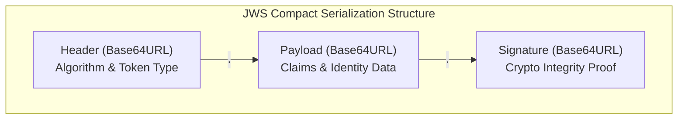

### 2.1 Base64URL Encoding vs. Standard Base64

JWT components are encoded using **Base64URL** (RFC 4648 §5) rather than standard Base64:

- Standard Base64 uses `+`, `/`, and `=` (padding), which conflict with URI query parameters and HTTP header delimiters.
- Base64URL substitutes `+` with `-` (minus) and `/` with `_` (underscore), and omits trailing `=` padding characters.

> [!WARNING]
> Base64URL is **encoding, not encryption**. Anyone who intercepts a standard JWS can decode the header and payload immediately without needing the secret or private key.

### 2.2 Header

The header contains cryptographic metadata specifying how the token was produced:

```json
{
  "alg": "RS256",
  "typ": "JWT",
  "kid": "auth-key-2026-q1"
}
```

- **`alg`**: The cryptographic algorithm used to secure the JWS (e.g., `HS256`, `RS256`, `ES256`, `EdDSA`).
- **`typ`**: Type of token, conventionally `"JWT"`.
- **`kid`** _(Key ID)_: An identifier matching a specific key in a JSON Web Key Set (JWKS), enabling seamless key rotation.
- **`cty`** _(Content Type)_: Used when nesting tokens (e.g. `cty: "JWT"` inside a JWE).

### 2.3 Payload & Claims

The payload contains the **claims**—statements about an entity (typically the user or client) and additional metadata:

```json
{
  "iss": "https://auth.example.com",
  "sub": "usr_9941a82f",
  "aud": "https://api.example.com",
  "exp": 1790289600,
  "nbf": 1790286000,
  "iat": 1790286000,
  "jti": "b47c0c16-d3c5-4cb2-83b5-318e470875e1",
  "role": "editor",
  "org_id": "org_5512"
}
```

Claims are divided into three categories:

#### 1. Registered Claims (Predefined by RFC 7519)

- **`iss`** (_Issuer_): Identity of the identity provider issuing the token.
- **`sub`** (_Subject_): Unique identifier of the principal (e.g., user ID).
- **`aud`** (_Audience_): Intended recipient(s) of the token (e.g., target API URI). The resource server must reject tokens where it is not listed in `aud`.
- **`exp`** (_Expiration Time_): Unix timestamp after which the token must be rejected.
- **`nbf`** (_Not Before_): Unix timestamp before which the token must not be accepted.
- **`iat`** (_Issued At_): Unix timestamp indicating when the token was created.
- **`jti`** (_JWT ID_): Unique nonce identifier for the token, used for one-time tokens or replay attack detection.

#### 2. Public Claims

Claims registered in the [IANA JSON Web Token Claims Registry](https://www.iana.org/assignments/jwt/jwt.xhtml) or defined with collision-resistant namespaces (e.g., URIs) to prevent naming collisions across systems.

#### 3. Private Claims

Custom claims negotiated between systems (e.g., `role`, `org_id`, `permissions`).

### 2.4 Signature Generation & Verification

The signature is created by concatenating the Base64URL-encoded header and payload with a period, hashing that string, and signing or computing a MAC with a secret or private key:

$$\text{Signing Input} = \text{base64Url}(\text{Header}) \mathbin{\Vert} \text{"."} \mathbin{\Vert} \text{base64Url}(\text{Payload})$$

$$\text{Signature} = \text{Sign}_{\text{Key}}(\text{Signing Input})$$

For symmetric HMAC-SHA256:

```text
HMACSHA256(
  base64UrlEncode(header) + "." + base64UrlEncode(payload),
  secretKey
)
```

```mermaid
flowchart TD
    subgraph SignPhase ["Token Creation (Issuer)"]
        H1["Header JSON"] --> B_H["base64Url(Header)"]
        P1["Payload JSON"] --> B_P["base64Url(Payload)"]
        B_H --> Input["Signing Input: H + '.' + P"]
        B_P --> Input
        Input --> CryptoSign["Crypto Sign / MAC<br/>(Private Key or Shared Secret)"]
        CryptoSign --> Sig["base64Url(Signature)"]
        Input --> FinalToken["JWT: base64Url(H).base64Url(P).base64Url(S)"]
        Sig --> FinalToken
    end

    subgraph VerifyPhase ["Token Verification (Consumer)"]
        RcvToken["Received Token"] --> Split["Split by '.'"]
        Split --> V_H["base64Url(Header)"]
        Split --> V_P["base64Url(Payload)"]
        Split --> V_S["base64Url(Signature)"]
        V_H --> V_Input["Verify Input: V_H + '.' + V_P"]
        V_P --> V_Input
        V_Input --> VerifyAlg["Cryptographic Verify<br/>(Public Key or Shared Secret)"]
        V_S --> VerifyAlg
        VerifyAlg --> Valid{"Signature Matches?"}
        Valid -- Yes --> CheckClaims{"Validate Claims<br/>exp, nbf, iss, aud"}
        Valid -- No --> Reject["REJECT: Invalid Signature"]
        CheckClaims -- Pass --> Accept["ACCEPT: Valid Token"]
        CheckClaims -- Fail --> RejectClaim["REJECT: Claim Violation"]
    end
```

---

## 3. Encrypted Tokens (JWE - RFC 7516)

While a standard JWS guarantees **authenticity** and **integrity**, it provides **zero confidentiality**. Any proxy, browser extension, or man-in-the-middle observing the HTTP header can read the entire payload.

When sensitive information (PII, session secrets, private identity claims) must reside inside the token, **JSON Web Encryption (JWE)** is used.

### 3.1 Anatomy of a JWE Compact Token

A compact serialized JWE consists of **five Base64URL-encoded parts** separated by periods (`.`):

```text
<Protected Header>.<Encrypted Key>.<Initialization Vector>.<Ciphertext>.<Authentication Tag>
```

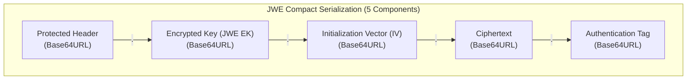

| Part  | Component                      | Purpose                                                                                                                                                   |
| :---- | :----------------------------- | :-------------------------------------------------------------------------------------------------------------------------------------------------------- |
| **1** | **Protected Header**           | Specifies both key management algorithm (`alg`) and content encryption algorithm (`enc`).                                                                 |
| **2** | **Encrypted Key (JWE EK)**     | The random symmetric Content Encryption Key (CEK), encrypted with the recipient's public key or pre-shared key. Empty if using direct encryption (`dir`). |
| **3** | **Initialization Vector (IV)** | Cryptographic nonce providing uniqueness for the symmetric cipher, preventing identical plaintexts from yielding identical ciphertexts.                   |
| **4** | **Ciphertext**                 | The actual encrypted payload data.                                                                                                                        |
| **5** | **Authentication Tag**         | Generated by the AEAD cipher (e.g. AES-GCM) to guarantee integrity and authenticity of both ciphertext and protected header.                              |

### 3.2 The Two-Tier Encryption Process

JWE avoids the high computational cost of encrypting large payloads with asymmetric cryptography by using a **hybrid two-tier envelope pattern**:

1. **Step 1 (Generate CEK)**: A high-entropy symmetric **Content Encryption Key (CEK)** is generated randomly for each individual token.
2. **Step 2 (Key Wrap / Encrypt CEK)**: The CEK is encrypted using the recipient's public key (e.g. `RSA-OAEP-256` or `ECDH-ES+A256KW`).
3. **Step 3 (Payload Encryption)**: The payload is encrypted with the CEK using an AEAD cipher (e.g., `A256GCM`), producing the **Ciphertext** and **Authentication Tag**.

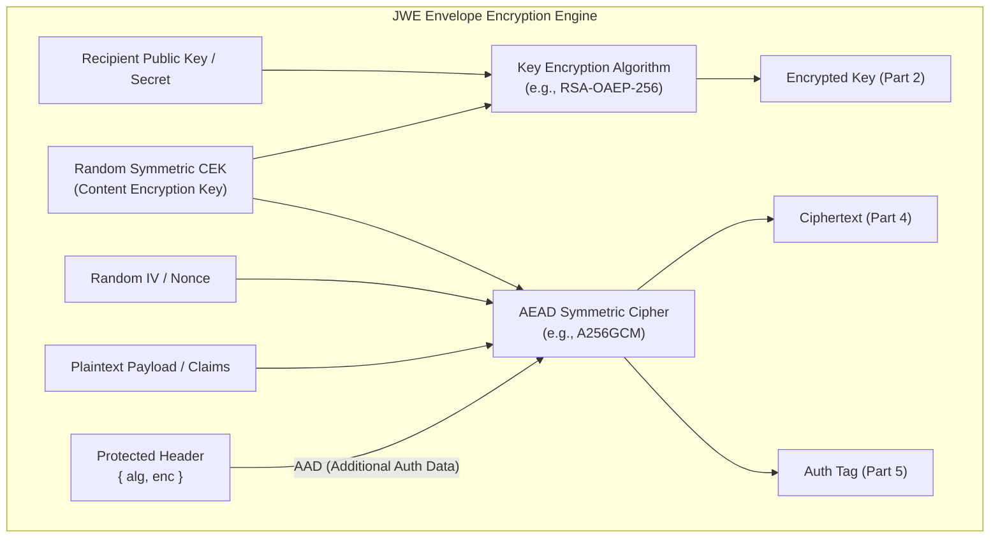

### 3.3 Nested JWT: Combining JWS and JWE

When a token requires **both** non-repudiation (proof of who created it) and confidentiality (only the recipient can read it), the specifications recommend a **Nested JWT**:

> [!TIP]
> **Best Practice**: **Sign-then-Encrypt** (JWS nested inside JWE).
>
> 1. Sign the inner claims using the issuer's private key to form a standard JWS.
> 2. Encrypt the entire JWS string as the payload of an outer JWE using the recipient's public key.
> 3. Set the JWE header `cty: "JWT"` to inform the recipient to parse the decrypted payload as a nested token.

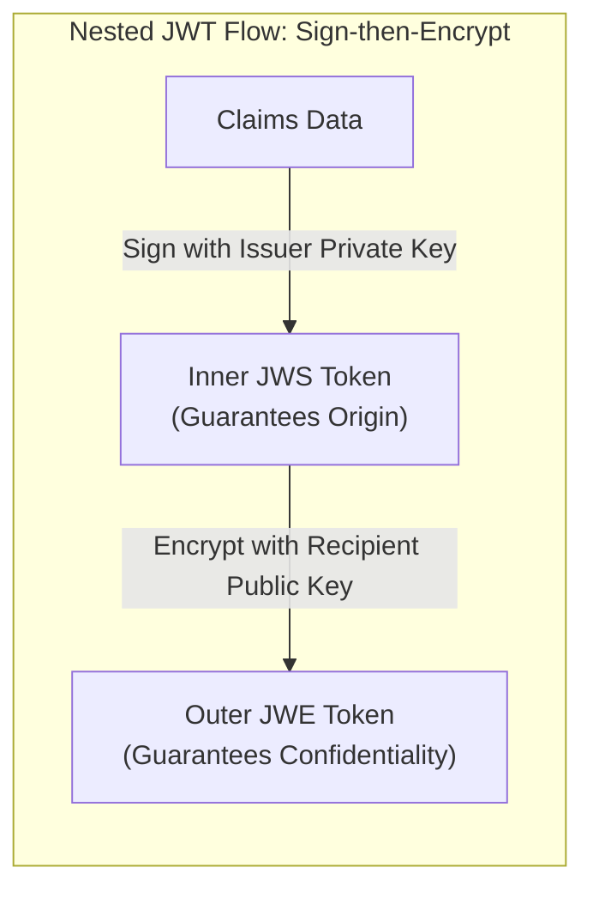

---

## 4. Key Management & Cryptography: JWK & JWA

### 4.1 JSON Web Key (JWK - RFC 7517)

A **JWK** is a JSON object representing a cryptographic key. It replaces cumbersome PEM and X.509 formats with standard JSON.

#### Example RSA Public Key (`JWK`):

```json
{
  "kty": "RSA",
  "use": "sig",
  "alg": "RS256",
  "kid": "k-2026-auth-01",
  "n": "u1W1gh...[Base64URL Modulus]...",
  "e": "AQAB"
}
```

#### Example Elliptic Curve Public Key (`JWK`):

```json
{
  "kty": "EC",
  "crv": "P-256",
  "use": "sig",
  "kid": "k-2026-ec-01",
  "x": "f83OJ3D2xFmT4v74...",
  "y": "x_daQJJea3DBBQni..."
}
```

#### Key Set (`JWKS`) & Discovery Endpoint

Systems host their public verification keys at a standardized public endpoint, typically:
`https://auth.example.com/.well-known/jwks.json`

```json
{
  "keys": [
    {
      "kty": "RSA",
      "kid": "key-2025-legacy",
      "use": "sig",
      "n": "...",
      "e": "AQAB"
    },
    {
      "kty": "RSA",
      "kid": "key-2026-current",
      "use": "sig",
      "n": "...",
      "e": "AQAB"
    }
  ]
}
```

This allows resource servers to fetch and cache public keys dynamically and match incoming tokens via the header `kid` without redeploying code during key rotations.

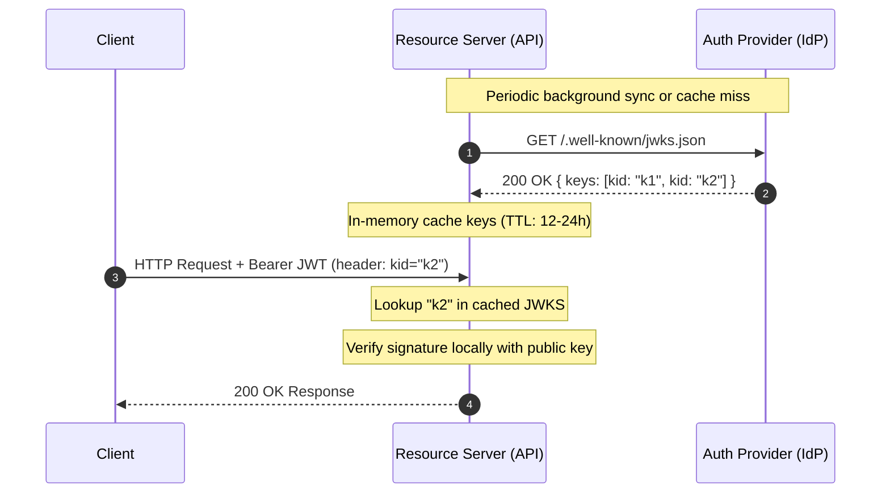

### 4.2 JSON Web Algorithms (JWA - RFC 7518)

| Category                     | Algorithm                 | Description & Security Posture                                                                                                                                                    |
| :--------------------------- | :------------------------ | :-------------------------------------------------------------------------------------------------------------------------------------------------------------------------------- |
| **Symmetric Signing**        | `HS256`, `HS384`, `HS512` | HMAC with SHA-2. Fast, but requires sharing the secret between issuer and all verifiers.                                                                                          |
| **Asymmetric Signing (RSA)** | `RS256`, `RS384`, `RS512` | RSASSA-PKCS1-v1_5. Legacy standard; widely supported.                                                                                                                             |
| **Asymmetric Signing (PSS)** | `PS256`, `PS384`, `PS512` | RSASSA-PSS with MGF1. **Recommended over RS256** due to a tighter security reduction (random oracle model) and resilience against padding-related attacks (e.g., Bleichenbacher). |
| **Elliptic Curve Signing**   | `ES256`, `ES384`, `ES512` | ECDSA using NIST curves (P-256, P-384, P-521). Small keys, short signatures, fast computation.                                                                                    |
| **Edwards Curve Signing**    | `EdDSA` (Ed25519)         | [RFC 8037]. Immune to side-channel timing attacks, fast, minimal signature size. State-of-the-art choice.                                                                         |
| **JWE Key Encryption**       | `RSA-OAEP-256`, `ECDH-ES` | Used in Part 2 of JWE to encrypt the Content Encryption Key.                                                                                                                      |
| **JWE AEAD Cipher**          | `A128GCM`, `A256GCM`      | Authenticated Encryption with Associated Data for encrypting the payload.                                                                                                         |

---

## 5. Architectural Authentication Flows

In modern distributed systems, JWTs are commonly employed as **Access Tokens** paired with **Refresh Tokens**.

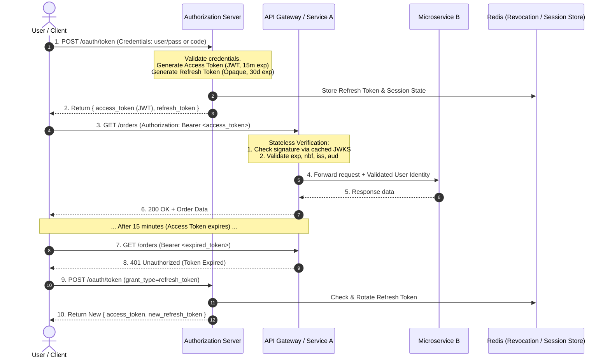

---

## 6. Security Pitfalls & Attack Vectors

JWTs are susceptible to subtle configuration errors and cryptographic vulnerabilities. Below are the most critical vulnerabilities and their mitigations (per [RFC 8725: JWT Best Current Practices](https://datatracker.ietf.org/doc/html/rfc8725)).

### 6.1 The `alg: "none"` Exploit

- **Vulnerability**: RFC 7515 permitted an algorithm value of `"none"` for unsigned tokens. Vulnerable libraries allowed attackers to modify the payload (e.g. elevating `"role": "admin"`), alter the header to `{"alg": "none"}`, strip the signature, and submit the token. If the parser did not explicitly enforce a cryptographic algorithm, it accepted the forged token as valid.
- **Mitigation**: Strictly whitelist expected algorithms in the verification configuration. Completely reject `"none"` in production.

```go
// Safe verification: Explicitly restrict allowed algorithms
parsedToken, err := jwt.Parse(tokenStr, keyFunc, jwt.WithValidMethods([]string{"RS256", "PS256"}))
```

### 6.2 The Algorithm Confusion Attack (HMAC vs. RSA)

- **Vulnerability**: An attacker takes an asymmetric token (using `RS256`). They obtain the server's public key (which is publicly accessible via JWKS), tamper with the payload, and change the header `alg` to `HS256` (symmetric HMAC). When the server verifies the token with its RSA public key using a generic verification function, the library treats the public key string as the HMAC shared secret. Because the attacker signed the token using that exact same public key, the signature matches!
- **Mitigation**: Never allow the incoming token's header to determine whether a symmetric or asymmetric validation key is passed to the verifier. Enforce key type checks against the header `alg`.

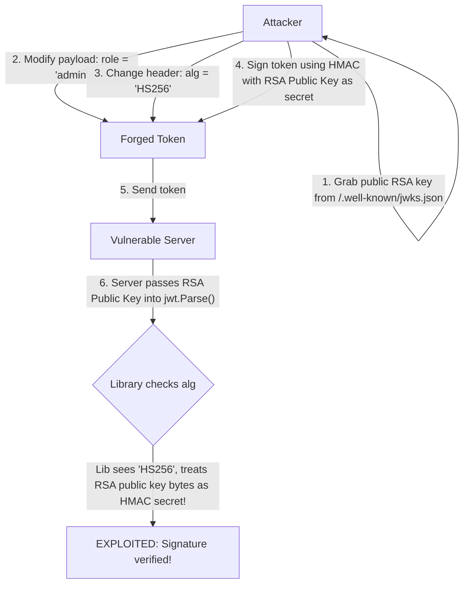

### 6.3 Sensitive Data Leakage in JWS

- **Vulnerability**: Developers frequently store passwords, hashes, personal identifiable information (PII), or database connection details inside standard JWT payloads, assuming that because it looks like a hash, it is secret.
- **Mitigation**: Never store credentials or sensitive data in a JWS. Use JWE if confidential data must be included, or keep data server-side and store only an opaque reference ID in the token.

### 6.4 The Token Revocation Problem

Because JWT verification is stateless, a valid token cannot be invalidated before its `exp` expires without adding state:

- **Strategy A (Short Lifetimes)**: Issue access tokens with 5–15 minute lifetimes and use refresh token rotation for stateful checks.
- **Strategy B (Revocation Blocklist / Denylist)**: Store revoked `jti` identifiers in a fast distributed cache (Redis) with TTL matching the remaining token lifetime.
- **Strategy C (User Security Stamp / Epoch)**: Store a `token_version` integer on the user record in the DB and embed it in the token. Incrementing the user's `token_version` invalidates all previously issued tokens on subsequent checks.

### 6.5 Storage Dilemma: `localStorage` vs. `HttpOnly` Cookies

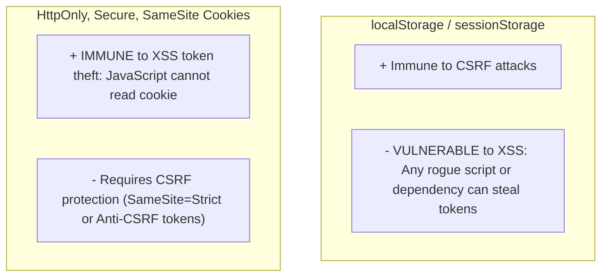

> [!CAUTION]
> For browser clients, storing sensitive access tokens in `localStorage` exposes them to complete compromise via **Cross-Site Scripting (XSS)**. Use **`HttpOnly; Secure; SameSite=Lax/Strict`** cookies or the **Backend-For-Frontend (BFF)** proxy pattern.

---

## 7. Comparative Analysis: JWT vs Alternative Token Formats

| Feature / Metric             | JWT (JWS)                   | JWE                         | Opaque Session Tokens             | PASETO (Platform-Agnostic SEcurity TOkens)   |
| :--------------------------- | :-------------------------- | :-------------------------- | :-------------------------------- | :------------------------------------------- |
| **Format**                   | 3 Base64URL parts           | 5 Base64URL parts           | Random string (e.g. UUID)         | Versioned prefix (`v4.public.`, `v4.local.`) |
| **Stateless Verification**   | Yes (Public Key / Secret)   | Yes (Private Key / Secret)  | **No** (Database lookup required) | Yes                                          |
| **Payload Privacy**          | Visible                     | Fully Encrypted             | Server-side only                  | Either Public or Encrypted                   |
| **Revocation Ease**          | Hard (Requires cache/epoch) | Hard (Requires cache/epoch) | **Instant** (Delete row/key)      | Hard                                         |
| **Cipher Negotiation**       | In header (`alg` agility)   | In header (`alg` + `enc`)   | N/A                               | **None** (Hardcoded modern crypto suites)    |
| **Algorithm Confusion Risk** | Possible if misconfigured   | Lower                       | None                              | **Impossible by design**                     |
| **Payload Size**             | Moderate (~300–800 bytes)   | Large (~1–2 KB)             | Minimal (~32–64 bytes)            | Moderate                                     |

### Decision Guide: Choosing the Right Token Architecture

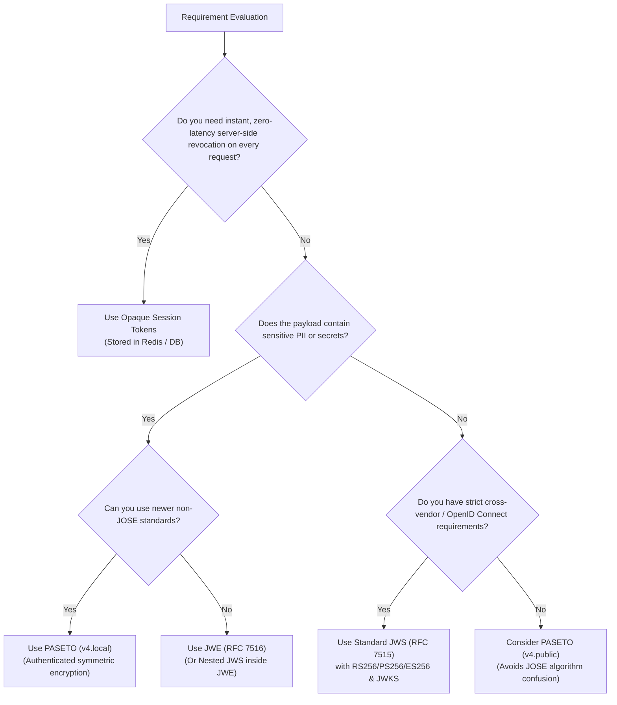

---

## 8. Implementation Code Examples

### 8.1 Go: Generating & Verifying a Signed JWT with Asymmetric Key Pair

Using the standard `golang-jwt/jwt/v5` package:

```go
package main

import (
	"crypto/rsa"
	"fmt"
	"time"

	"github.com/golang-jwt/jwt/v5"
)

type CustomClaims struct {
	UserID string `json:"user_id"`
	Role   string `json:"role"`
	jwt.RegisteredClaims
}

// GenerateToken creates an RS256-signed JWT
func GenerateToken(privateKey *rsa.PrivateKey, keyID string, userID string, role string) (string, error) {
	now := time.Now()
	claims := CustomClaims{
		UserID: userID,
		Role:   role,
		RegisteredClaims: jwt.RegisteredClaims{
			Issuer:    "https://auth.example.com",
			Subject:   userID,
			Audience:  jwt.ClaimStrings{"https://api.example.com"},
			ExpiresAt: jwt.NewNumericDate(now.Add(15 * time.Minute)),
			NotBefore: jwt.NewNumericDate(now),
			IssuedAt:  jwt.NewNumericDate(now),
			ID:        "unique-nonce-uuid",
		},
	}

	token := jwt.NewWithClaims(jwt.SigningMethodRS256, claims)
	token.Header["kid"] = keyID // Key ID for JWKS matching

	return token.SignedString(privateKey)
}

// VerifyToken verifies signature, algorithm, and registered claims
func VerifyToken(tokenString string, publicKey *rsa.PublicKey) (*CustomClaims, error) {
	token, err := jwt.ParseWithClaims(
		tokenString,
		&CustomClaims{},
		func(t *jwt.Token) (interface{}, error) {
			// Enforce specific algorithm to prevent algorithm confusion attacks
			if _, ok := t.Method.(*jwt.SigningMethodRSA); !ok {
				return nil, fmt.Errorf("unexpected signing method: %v", t.Header["alg"])
			}
			return publicKey, nil
		},
		jwt.WithIssuer("https://auth.example.com"),
		jwt.WithAudience("https://api.example.com"),
		jwt.WithValidMethods([]string{"RS256", "PS256"}),
	)

	if err != nil {
		return nil, fmt.Errorf("token validation failed: %w", err)
	}

	if claims, ok := token.Claims.(*CustomClaims); ok && token.Valid {
		return claims, nil
	}

	return nil, fmt.Errorf("invalid token claims")
}
```

### 8.2 TypeScript / Node.js: Generating a JWE (Encrypted Token)

Using the standard `jose` npm library:

```typescript
import { CompactEncrypt, compactDecrypt, generateSecret } from "jose";

async function runJWEDemo() {
  // 1. Generate or load a 256-bit symmetric key for A256GCM
  const secretKey = await generateSecret("A256GCM");

  const payload = JSON.stringify({
    sub: "user_12345",
    ssn: "000-12-3456", // Sensitive data protected by encryption
    scope: "admin:billing",
  });

  // 2. Encrypt into 5-part JWE compact string
  const jwe = await new CompactEncrypt(new TextEncoder().encode(payload))
    .setProtectedHeader({ alg: "dir", enc: "A256GCM" }) // 'dir' = direct encryption with shared key
    .encrypt(secretKey);

  console.log("JWE String (5 parts separated by dots):");
  console.log(jwe);

  // 3. Decrypt on recipient side
  const { plaintext, protectedHeader } = await compactDecrypt(jwe, secretKey, {
    contentEncryptionAlgorithms: ["A256GCM"],
    keyManagementAlgorithms: ["dir"],
  });

  const decryptedClaims = JSON.parse(new TextDecoder().decode(plaintext));
  console.log("Decrypted Claims:", decryptedClaims);
  console.log("Protected Header:", protectedHeader);
}
```

---

## 9. Summary & Quick Reference

| Concept        | Structure                                   | Key RFC       | Primary Use Case                                       |
| :------------- | :------------------------------------------ | :------------ | :----------------------------------------------------- |
| **JWS**        | `Header.Payload.Signature` (3 parts)        | RFC 7515      | Stateless API authentication, OpenID Connect ID Tokens |
| **JWE**        | `Header.EncKey.IV.Ciphertext.Tag` (5 parts) | RFC 7516      | Transferring confidential data over untrusted channels |
| **JWK / JWKS** | JSON key representations and set lists      | RFC 7517      | Public key sharing, automated key rotation             |
| **JWA**        | Cryptographic identifier catalog            | RFC 7518      | Algorithm negotiation specifications                   |
| **Nested JWT** | JWS signed inside JWE encrypted wrapper     | RFC 7519 §7.1 | Authenticated origin + strict confidentiality          |

---

## References & Further Reading

- [RFC 7519: JSON Web Token (JWT)](https://datatracker.ietf.org/doc/html/rfc7519)
- [RFC 7515: JSON Web Signature (JWS)](https://datatracker.ietf.org/doc/html/rfc7515)
- [RFC 7516: JSON Web Encryption (JWE)](https://datatracker.ietf.org/doc/html/rfc7516)
- [RFC 7517: JSON Web Key (JWK)](https://datatracker.ietf.org/doc/html/rfc7517)
- [RFC 7518: JSON Web Algorithms (JWA)](https://datatracker.ietf.org/doc/html/rfc7518)
- [RFC 8725: JSON Web Token Best Current Practices](https://datatracker.ietf.org/doc/html/rfc8725)
- [RFC 8037: CFRG Elliptic Curve Diffie-Hellman (ECDH) and Signatures in JOSE](https://datatracker.ietf.org/doc/html/rfc8037)
- [OpenID Connect Core 1.0 Specification](https://openid.net/specs/openid-connect-core-1_0.html)
