# OAuth 2.0, OAuth 2.1, and Modern Authorization Architectures

A technical guide and engineering reference on the OAuth authorization framework, grant flows, cryptographic extensions (PKCE, DPoP), OpenID Connect (OIDC) identity federation, security threat models, and architectural patterns.

---

## 1. High-Level Concept: The Delegation Problem

Before OAuth, third-party integrations relied on the **"Password Anti-Pattern"**: a user gave their primary credentials (username and password) directly to a third-party application so it could access their account on another service.

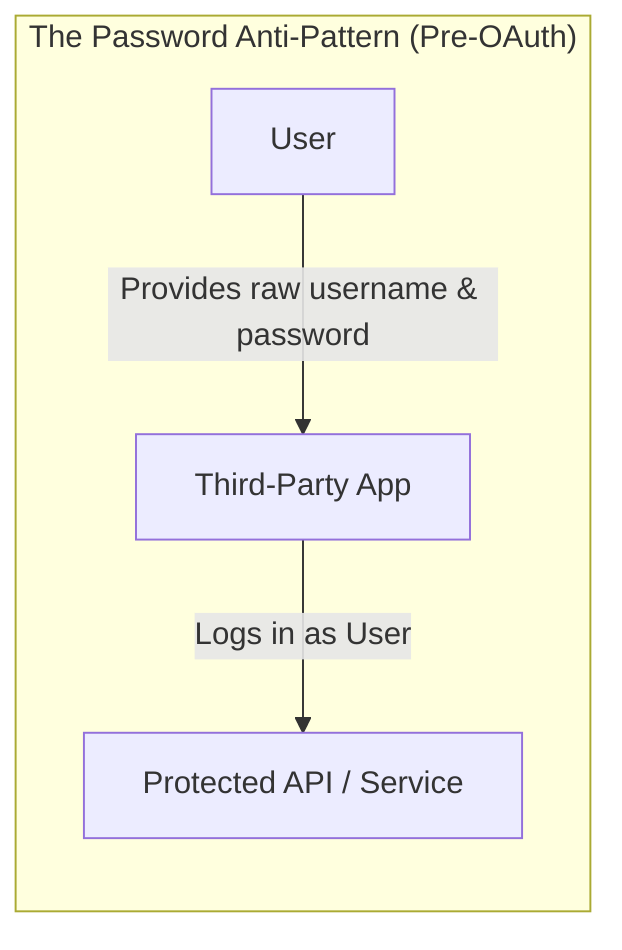

### Critical Flaws of the Anti-Pattern

1. **Over-privileged Access**: The third-party application had full access to the user's entire account (no scoped permissions).
2. **Indiscriminate Lifetime**: Access could only be revoked by changing the user's primary password, breaking all other integrated apps.
3. **Compromise Blast Radius**: A compromise of the third-party client exposed raw user credentials.
4. **No MFA Compatibility**: Third-party automated scripts could not easily satisfy multi-factor authentication (MFA) challenges.

### The OAuth Solution: Delegated Authorization

OAuth 2.0 ([RFC 6749](https://datatracker.ietf.org/doc/html/rfc6749)) solves this by introducing an authorization intermediary and replacing direct credential sharing with **scoped, revocable, short-lived tokens**.

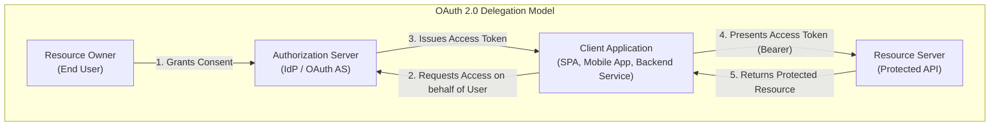

---

## 2. Core OAuth 2.0 Roles and Terminology

### 2.1 The Four Protocol Roles

| Role                     | RFC 6749 Designation   | Description                                                                                     | Example                                   |
| :----------------------- | :--------------------- | :---------------------------------------------------------------------------------------------- | :---------------------------------------- |
| **Resource Owner**       | `resource_owner`       | The entity capable of granting access to a protected resource (usually a human user).           | A person using a web app.                 |
| **Client**               | `client`               | The software application requesting access to resources on behalf of the Resource Owner.        | A web dashboard, mobile app, or CLI tool. |
| **Authorization Server** | `authorization_server` | The server that authenticates the Resource Owner, gathers consent, and issues security tokens.  | Auth0, Okta, Keycloak, Google Identity.   |
| **Resource Server**      | `resource_server`      | The server hosting the protected resources and accepting access tokens to fulfill API requests. | GitHub REST API, internal microservices.  |

> [!NOTE]
> The Authorization Server and Resource Server can reside within the same physical application or be separated into independent distributed microservices.

---

### 2.2 Client Classification

OAuth strictly separates clients by their ability to protect credentials:

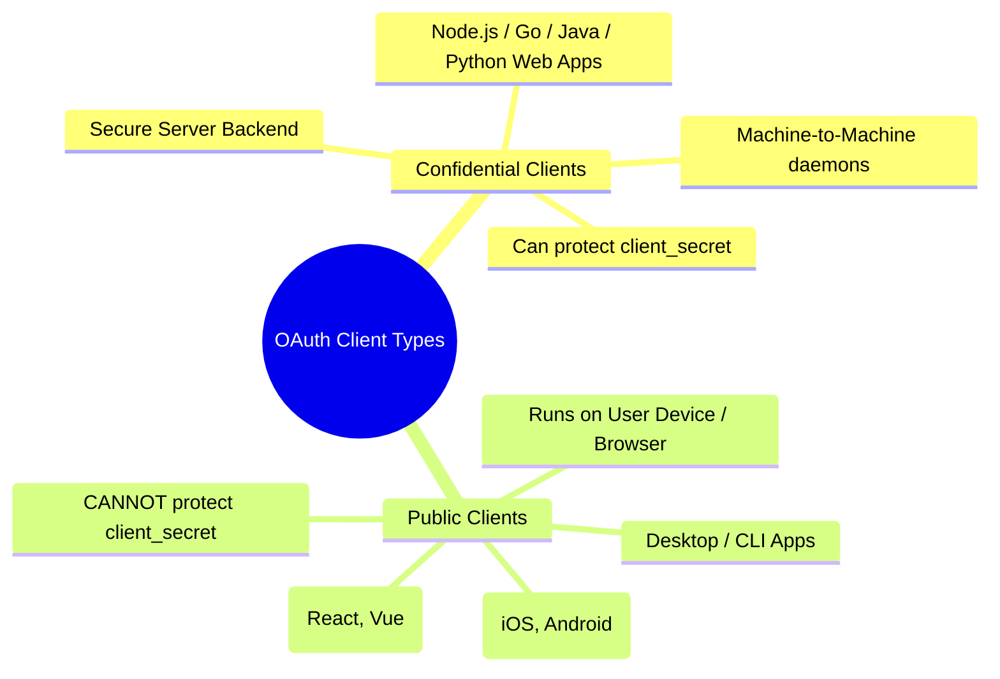

- **Confidential Client**: Executes on a secure server environment with restricted access where secrets (such as a `client_secret` or private signing key) cannot be extracted by unauthorized parties.
- **Public Client**: Executes on an end-user device or inside a web browser (e.g., Single Page Apps, iOS/Android apps). Any embedded secret can be decompiled, inspected in dev tools, or extracted via network proxies. **Public clients must never be issued static client secrets.**

---

### 2.3 Artifacts: Tokens, Scopes, and Context Parameters

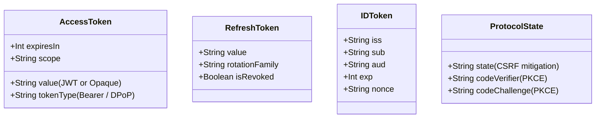

- **Access Token**: A credential representing authorization granted to the client. It can be:
  - **Opaque (Reference Token)**: A random string serving as a database lookup key; requires token introspection (`RFC 7662`) by the Resource Server.
  - **Structured (Value Token / JWT)**: Self-contained cryptographic token (`RFC 7519`) containing signed claims (`sub`, `aud`, `exp`, `scope`), validated offline using the Authorization Server's public keys (`JWKS`).
- **Refresh Token**: A long-lived credential used exclusively to obtain fresh access tokens when current access tokens expire, without re-prompting the user.
- **ID Token (OIDC Extension)**: A signed JWT representing identity assertions about the user's authentication event (identity layer, not access authorization).
- **Scope**: A space-delimited list of strings defining the granular boundaries of permissions requested (e.g., `read:reports write:profile`).
- **`state` Parameter**: An opaque, unguessable value generated by the client and sent to the `/authorize` endpoint. The Authorization Server returns it unmodified to the redirect URI. It binds the authorization response to the client session, preventing Cross-Site Request Forgery (CSRF).

---

## 3. Flow Selection Matrix

OAuth 2.0 defines several grant types. Choosing the correct flow depends on the client type, user involvement, and device capabilities:

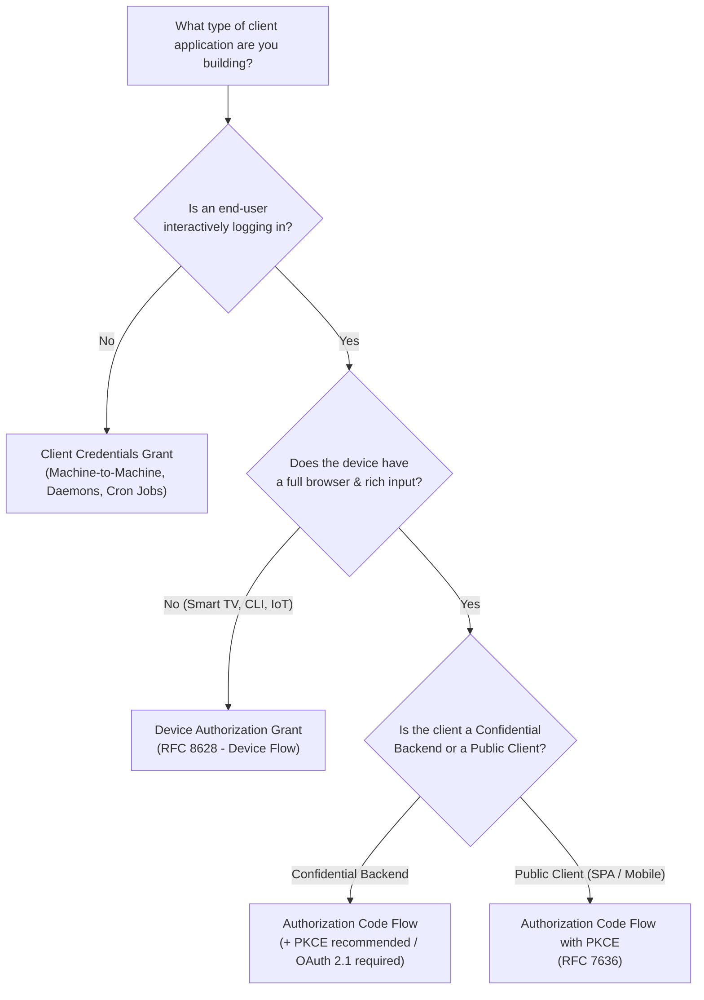

---

## 4. Grant Types and Execution Flows

### 4.1 Authorization Code Flow (Traditional Confidential Clients)

Used by server-rendered applications (e.g., Next.js backend, Spring Boot, Django, Ruby on Rails) where the client possesses a `client_secret` securely stored on a backend server.

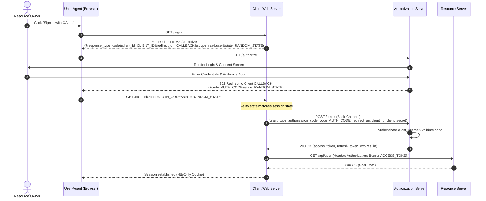

#### Key Mechanics:

- **Two Channels**:
  1. **Front-Channel** (Steps 2–7): Passes through the user's browser via redirects. Potentially exposed to browser history, proxy logs, and URL manipulation.
  2. **Back-Channel** (Steps 9–11): Direct, encrypted HTTPS connection between the Client server and the Authorization Server. The `client_secret` is never exposed to the browser.
- **Single-Use Authorization Code**: The temporary code returned in the front-channel has a short time-to-live (typically 30–60 seconds) and is invalidated immediately upon first use.

---

### 4.2 Authorization Code Flow with PKCE (Proof Key for Code Exchange)

PKCE ([RFC 7636](https://datatracker.ietf.org/doc/html/rfc7636), pronounced "pixie") was engineered to protect **public clients** (SPAs, mobile apps) that lack a `client_secret` from **Authorization Code Interception Attacks**.

#### The Vulnerability PKCE Solves: Code Interception

On mobile devices and desktops, apps register custom URI schemes (e.g., `myapp://oauth-callback`). A malicious app installed on the same device could register that identical custom scheme, intercept the incoming authorization code from the redirect, and exchange it for tokens at `/token` if no client secret is required.

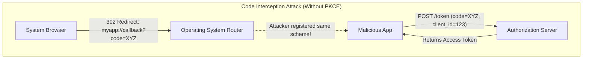

#### The PKCE Solution: Dynamic Cryptographic Proof

Instead of relying on a static secret, the client dynamically generates a one-time cryptographic secret for each authentication request:

1. **Code Verifier**: A cryptographically random string using characters `[A-Z]`, `[a-z]`, `[0-9]`, `-`, `.`, `_`, `~`, with a minimum length of 43 characters and maximum of 128 characters:
   $$\text{code\_verifier} \in [A\text{-}Za\text{-}z0\text{-}9\text{-}.\_\sim]^{43..128}$$
2. **Code Challenge**: The Base64URL-encoded SHA-256 hash of the verifier:
   $$\text{code\_challenge} = \text{BASE64URL-ENCODE}(\text{SHA-256}(\text{code\_verifier}))$$
   $$\text{code\_challenge\_method} = \text{"S256"}$$

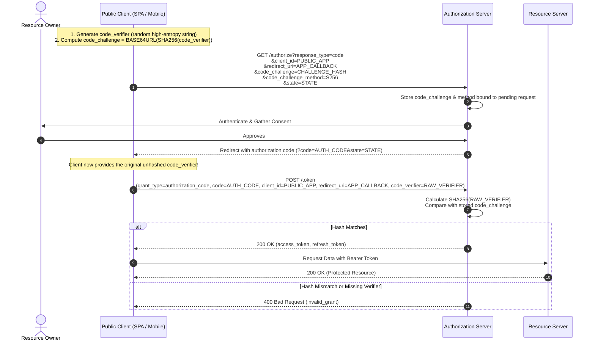

> [!IMPORTANT]
> **Why the Attacker is Blocked**: Even if a malicious app intercepts the `code` from the redirect URI, it cannot exchange it at `/token` because it does not know the raw `code_verifier`, which never left the memory space of the legitimate client application.
>
> In **OAuth 2.1**, PKCE is **mandatory for all clients**, including confidential clients, mitigating authorization code injection attacks across all topologies.

---

### 4.3 Client Credentials Flow (Machine-to-Machine)

Used when applications communicate directly without any human user present (microservice-to-microservice, background daemons, scheduled cron jobs).

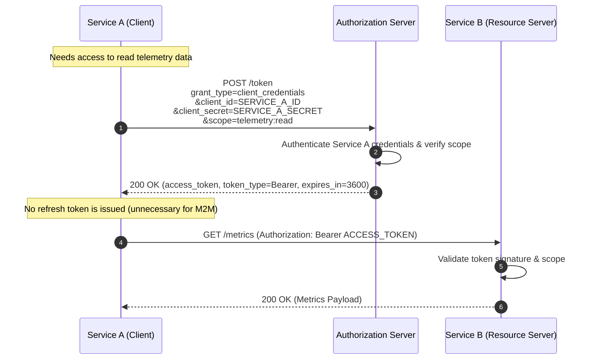

#### Key Characteristics:

- **No Resource Owner Interaction**: The client acts on its own behalf.
- **No Refresh Tokens**: Since the client can authenticate unattended using its static credentials, issuing refresh tokens creates unnecessary state. When the access token expires, the client simply calls `/token` again.

---

### 4.4 Device Authorization Flow (RFC 8628)

Designed for internet-connected devices that either lack a browser or have severe input constraints (Apple TV, smart TVs, CLI terminals, gaming consoles).

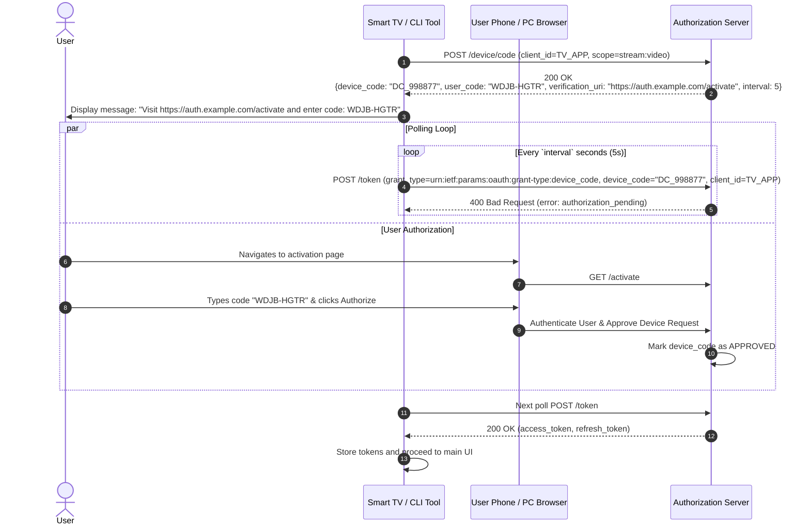

#### Key Mechanics:

- **Rate-Limitation**: The AS provides a polling `interval` (e.g., 5 seconds). If the device polls faster than the allowed rate, the AS returns error `slow_down`, and the device must back off by increasing its polling interval by at least 5 seconds.

---

### 4.5 Refresh Token Rotation & Reuse Detection

Access tokens must be short-lived (e.g., 5–15 minutes) to limit exposure if stolen. Refresh tokens are longer-lived (days to months). If a refresh token is compromised on a public client, an attacker could maintain persistent access.

To neutralize this, **Refresh Token Rotation (RTR)** issues a brand-new refresh token every time the client consumes one, invalidating the old one immediately.

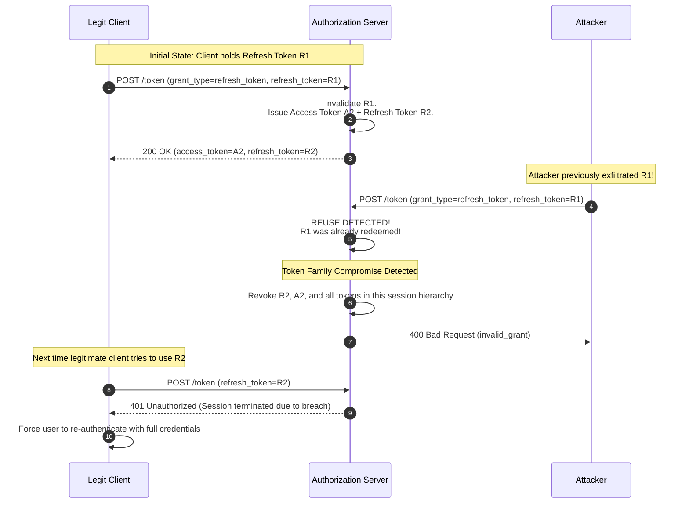

---

## 5. Deprecated and Forbidden Grants in Modern OAuth

OAuth 2.1 officially deprecates and removes two flows that were widespread in legacy OAuth 2.0 implementations:

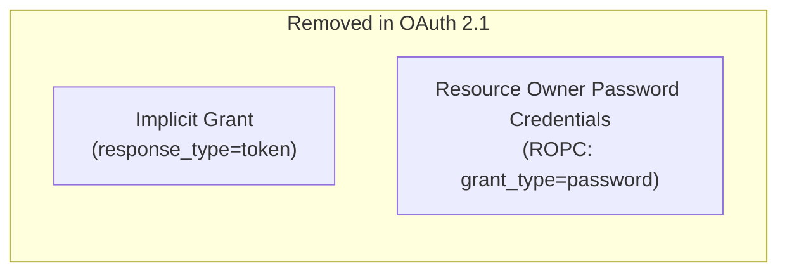

### 5.1 Why the Implicit Flow is Removed

In the legacy Implicit Flow, the Authorization Server directly appended the `access_token` to the URL fragment (`#access_token=...`) in the redirect to the browser:

- **URL Leakage**: Access tokens were exposed in browser history, HTTP `Referer` headers, proxy logs, and open redirect targets.
- **No Client Authentication**: No opportunity to verify caller identity.
- **No Refresh Tokens**: Refresh tokens could not be securely issued via URL hash fragments.
- **Modern Alternative**: Use **Authorization Code Flow with PKCE**.

### 5.2 Why Resource Owner Password Credentials (ROPC) is Removed

ROPC accepted the user's plain-text `username` and `password` in a `POST /token` payload:

- **Preserved Credential Sharing**: Defeated OAuth's foundational principle of never exposing user credentials to client applications.
- **Incompatible with MFA and SSO**: If the identity provider enforces WebAuthn, FIDO2, SMS OTP, or SAML redirects, ROPC breaks.
- **Expands Threat Surface**: Any client handling plain-text credentials becomes a target for credential dumping and memory scraping.

---

## 6. OAuth 2.0 vs. OpenID Connect (OIDC)

A frequent point of architectural confusion is conflating **Authorization** with **Authentication**.

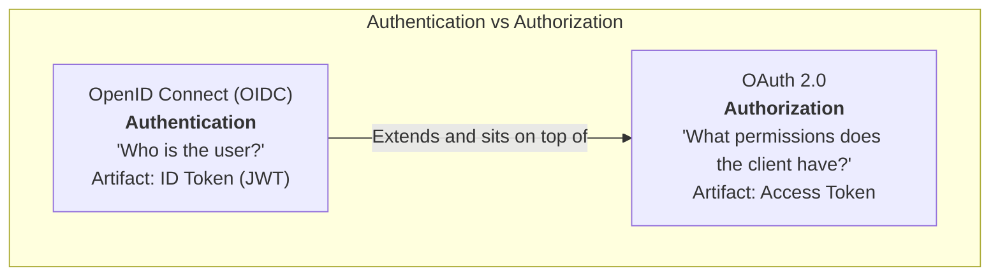

### The Hotel Keycard Analogy

- **OIDC (ID Token)**: Your **Passport or Driver's License**. It proves _who you are_, contains your name, issuance authority, and picture. You present it at the front desk to prove your identity.
- **OAuth (Access Token)**: The **Hotel Keycard**. It does not care what your name is or what your government ID says; the door lock only checks: _Does this keycard have permission to unlock Room 402 until 11:00 AM?_

### Technical Differences Matrix

| Dimension                    | OAuth 2.0 ([RFC 6749](https://datatracker.ietf.org/doc/html/rfc6749)) | OpenID Connect Core 1.0                                    |
| :--------------------------- | :-------------------------------------------------------------------- | :--------------------------------------------------------- |
| **Primary Purpose**          | **Authorization** (Access delegation).                                | **Authentication** (Identity verification + SSO).          |
| **Target Audience of Token** | The **Resource Server** (API).                                        | The **Client Application**.                                |
| **Key Artifact**             | **Access Token** (Opaque or JWT).                                     | **ID Token** (Always a cryptographically signed JWT).      |
| **Standardized Format?**     | No specification for token contents in RFC 6749.                      | Strictly standardized JSON claims structure.               |
| **Identity Claims**          | None guaranteed (custom scopes required).                             | Standard claims: `sub`, `name`, `email`, `email_verified`. |
| **Discovery Mechanism**      | None defined in core RFC.                                             | Discovery Endpoint: `/.well-known/openid-configuration`.   |
| **User Info Profile API**    | Not standardized.                                                     | Standardized `/userinfo` endpoint.                         |

#### Anatomical Structure of an OIDC ID Token:

```json
{
  "iss": "https://auth.company.com/",
  "sub": "usr_9988224411",
  "aud": "my-web-app-client-id",
  "exp": 1727220000,
  "iat": 1727216400,
  "auth_time": 1727216390,
  "nonce": "n-0S6_WzA2Mj",
  "email": "alex.dev@company.com",
  "email_verified": true
}
```

---

## 7. Security Threat Models & Attack Vectors

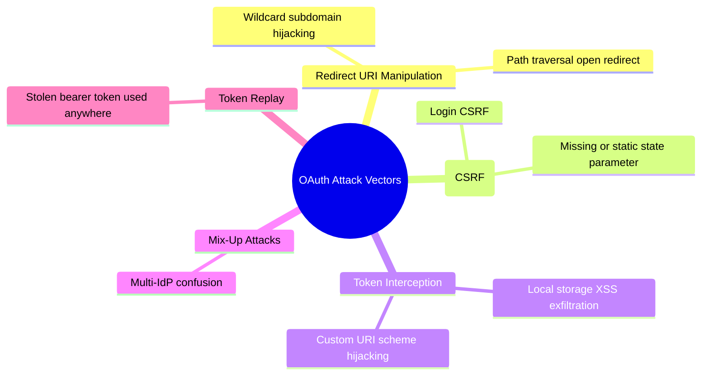

### 7.1 Cross-Site Request Forgery (CSRF) & State Parameter

#### Attack Mechanics (Login CSRF):

1. Attacker starts an OAuth flow on `legit-store.com` with their own account.
2. When the Authorization Server redirects to `legit-store.com/callback?code=ATTACKER_CODE`, the attacker intercepts and cancels the request before the browser follows the redirect.
3. The attacker tricks the victim into clicking a link that triggers that exact callback: `https://legit-store.com/callback?code=ATTACKER_CODE`.
4. The victim's browser sends the request. The client exchanges `ATTACKER_CODE` for tokens, binding the victim's session to the **attacker's account**.
5. When the victim enters credit card details or creates sensitive data, it is saved under the attacker's account.

#### Defense: Cryptographic State Binding

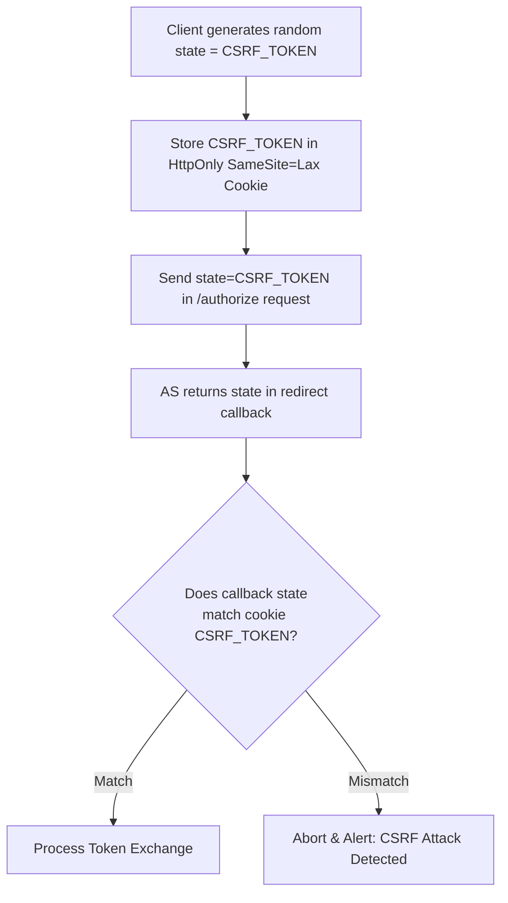

---

### 7.2 Open Redirectors and Exact Redirect URI Matching

If an Authorization Server permits loose matching or wildcards (e.g., `https://*.example.com/oauth/callback` or regex matching):

1. An attacker discovers an open redirect flaw on any subdomain: `https://blog.example.com/redirect?url=https://evil.com`.
2. The attacker crafts an authorization request with `redirect_uri=https://blog.example.com/redirect?url=https://evil.com`.
3. The Authorization Server validates the URL against the wildcard pattern and redirects the user with the authorization code.
4. The intermediate vulnerable page forwards the request to `evil.com`, leaking the `code` in the query string to the attacker.

> [!CAUTION]
> **OAuth 2.1 Mitigation**: Authorization Servers **must** require exact string comparison for all registered redirect URIs. Subdomain wildcards and path pattern matching are forbidden.

---

### 7.3 Securing Bearer Tokens: DPoP (RFC 9449)

Standard OAuth access tokens are **Bearer Tokens**: whoever holds the token can use it, like physical cash. If an attacker steals an access token via XSS or network sniffing, the Resource Server cannot distinguish between the legitimate client and the thief.

**DPoP (Demonstrating Proof-of-Possession, [RFC 9449](https://datatracker.ietf.org/doc/html/rfc9449))** transforms access tokens into **Sender-Constrained Tokens** bound to a private cryptographic key held by the client.

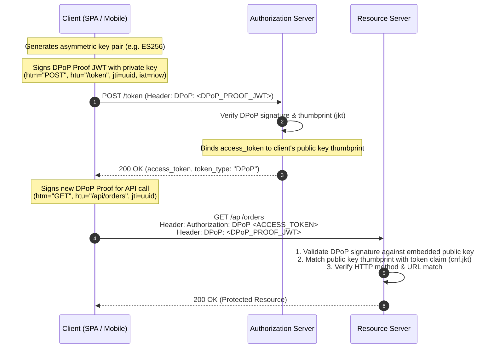

If an attacker intercepts the DPoP-bound access token, they cannot use it against the Resource Server without possessing the client's non-extractable private key to sign fresh DPoP proofs.

---

## 8. Modern Frontend Architecture: The Backend-For-Frontend (BFF) Pattern

Storing access and refresh tokens directly in browser storage (`localStorage` or `sessionStorage`) exposes them to theft via Cross-Site Scripting (XSS).

To eliminate this vulnerability in Single-Page Applications (SPAs), industry best practice has shifted to the **Backend-For-Frontend (BFF) Pattern**:

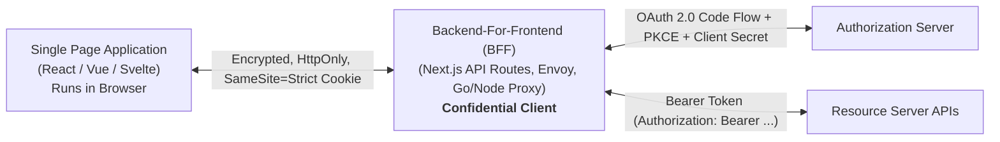

### Why the BFF Pattern is Superior

1. **SPA Never Sees OAuth Tokens**: The browser only holds a secure, encrypted `HttpOnly`, `SameSite=Strict`, `Secure` session cookie. JavaScript running in the DOM cannot read this cookie, neutralizing token exfiltration via XSS.
2. **Confidential Client Security**: The BFF runs on a server and can securely authenticate to the Authorization Server using a `client_secret` or private key.
3. **Automatic Token Refresh**: The BFF automatically transparently refreshes expired access tokens in the background before proxying requests to downstream Resource Servers.

---

## 9. Summary: OAuth 2.0 vs. OAuth 2.1 Changes

OAuth 2.1 consolidates and updates the core specifications ([RFC 6749](https://datatracker.ietf.org/doc/html/rfc6749), [RFC 6750](https://datatracker.ietf.org/doc/html/rfc6750), [RFC 7636](https://datatracker.ietf.org/doc/html/rfc7636), [RFC 8252](https://datatracker.ietf.org/doc/html/rfc8252)).

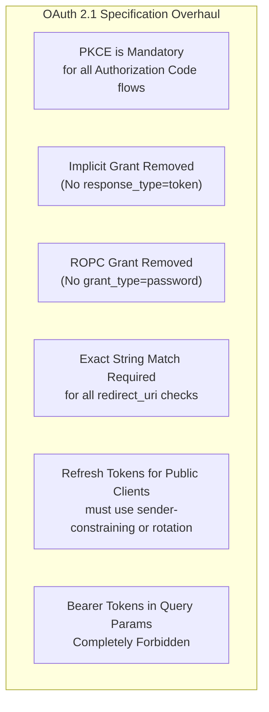

| Security Dimension                  | OAuth 2.0 Baseline                     | OAuth 2.1 Standard                                              |
| :---------------------------------- | :------------------------------------- | :-------------------------------------------------------------- |
| **PKCE**                            | Optional extension (RFC 7636).         | **Mandatory** for all clients using authorization codes.        |
| **Implicit Grant**                  | Supported (standard for SPAs in 2012). | **Removed completely**.                                         |
| **Resource Owner Password (ROPC)**  | Supported for legacy apps.             | **Removed completely**.                                         |
| **Redirect URI Matching**           | Allowed prefix / wildcard matching.    | **Exact string match** required.                                |
| **Refresh Tokens (Public Clients)** | Permitted without restrictions.        | Must be **sender-constrained** (DPoP/mTLS) or use **Rotation**. |
| **Token in URI Query String**       | Discouraged, but allowed in RFC 6750.  | **Explicitly forbidden**.                                       |

---

## 10. Key Endpoints Reference

A standard OAuth 2.0 / OIDC identity provider exposes the following well-defined endpoints:

| Endpoint                            | Method         | Purpose                                                                                                                       | Key Parameters                                                                                            |
| :---------------------------------- | :------------- | :---------------------------------------------------------------------------------------------------------------------------- | :-------------------------------------------------------------------------------------------------------- |
| `/.well-known/openid-configuration` | `GET`          | Discovery document returning IdP endpoint URLs and supported features.                                                        | None                                                                                                      |
| `/authorize`                        | `GET`          | Front-channel authorization & user consent.                                                                                   | `response_type`, `client_id`, `redirect_uri`, `scope`, `state`, `code_challenge`, `code_challenge_method` |
| `/token`                            | `POST`         | Back-channel token issuance and refreshing.                                                                                   | `grant_type`, `code`, `redirect_uri`, `client_id`, `client_secret`, `code_verifier`, `refresh_token`      |
| `/userinfo`                         | `GET` / `POST` | OIDC profile endpoint returning claims about the authenticated user.                                                          | `Authorization: Bearer <access_token>`                                                                    |
| `/revoke`                           | `POST`         | Token revocation endpoint ([RFC 7009](https://datatracker.ietf.org/doc/html/rfc7009)) to invalidate access or refresh tokens. | `token`, `token_type_hint`                                                                                |
| `/introspect`                       | `POST`         | Token introspection endpoint ([RFC 7662](https://datatracker.ietf.org/doc/html/rfc7662)) for opaque tokens.                   | `token`, `token_type_hint`                                                                                |
| `/.well-known/jwks.json`            | `GET`          | JSON Web Key Set (JWKS) containing public keys for validating JWT signatures.                                                 | None                                                                                                      |

---

## References & Further Reading

- [RFC 6749: The OAuth 2.0 Authorization Framework](https://datatracker.ietf.org/doc/html/rfc6749)
- [RFC 6750: The OAuth 2.0 Authorization Framework - Bearer Token Usage](https://datatracker.ietf.org/doc/html/rfc6750)
- [RFC 7636: Proof Key for Code Exchange (PKCE)](https://datatracker.ietf.org/doc/html/rfc7636)
- [RFC 8252: OAuth 2.0 for Native Apps (AppAuth)](https://datatracker.ietf.org/doc/html/rfc8252)
- [RFC 8628: OAuth 2.0 Device Authorization Grant](https://datatracker.ietf.org/doc/html/rfc8628)
- [RFC 9449: Demonstrating Proof-of-Possession (DPoP)](https://datatracker.ietf.org/doc/html/rfc9449)
- [The OAuth 2.1 Authorization Framework (Draft)](https://datatracker.ietf.org/doc/html/draft-ietf-oauth-v2-1)
- [OpenID Connect Core 1.0 Specification](https://openid.net/specs/openid-connect-core-1_0.html)
