# Transport Layer Security (TLS), mTLS, and Public Key Infrastructure (PKI)

A comprehensive, engineering-grade technical guide to **Transport Layer Security (TLS 1.2 & TLS 1.3)**, **Mutual TLS (mTLS)**, **Public Key Infrastructure (PKI)**, **X.509 Digital Certificates**, and **Certificate Authorities (CAs)**. This guide covers cryptographic foundations, handshake protocols, certificate chains, attack surfaces, and production implementations.

---

## 1. Overview & Foundational Principles

**Transport Layer Security (TLS)** is the cryptographic protocol that secures communication across computer networks (most prominently the Internet as HTTPS, gRPC, and FTPS). Standardized by the IETF in [RFC 5246 (TLS 1.2)](https://datatracker.ietf.org/doc/html/rfc5246) and [RFC 8446 (TLS 1.3)](https://datatracker.ietf.org/doc/html/rfc8446), TLS is the successor to the deprecated **Secure Sockets Layer (SSL)** protocols (SSL 2.0 and 3.0).

> [!NOTE]
> Although the industry still colloquially refers to "SSL certificates" or "SSL/TLS", **SSL is cryptographically broken and obsolete**. Modern systems run **TLS 1.2** or **TLS 1.3**.

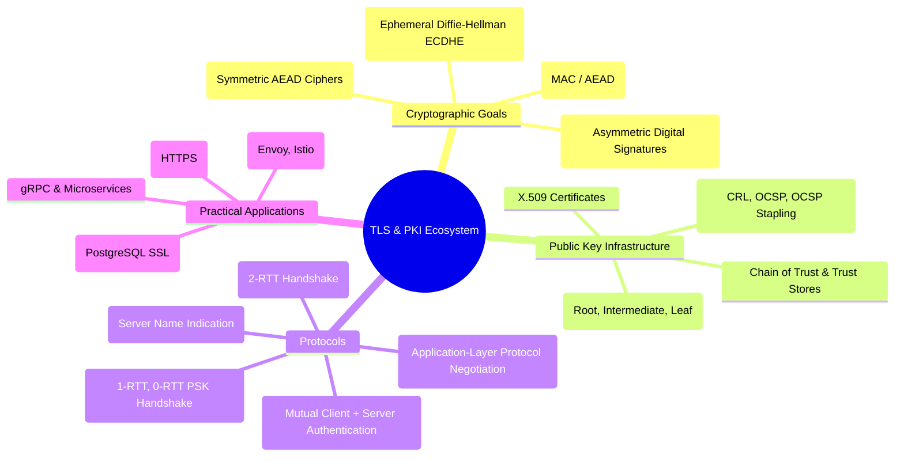

### 1.1 The CIA Triad in TLS

TLS achieves all three pillars of information security:

| Pillar              | Security Goal                                                                       | How TLS Enforces It                                                                                      | Cryptographic Primitive                     |
| :------------------ | :---------------------------------------------------------------------------------- | :------------------------------------------------------------------------------------------------------- | :------------------------------------------ |
| **Confidentiality** | Prevents eavesdropping; unauthorized parties cannot read transmitted data.          | Bulk payload encryption using high-speed symmetric ciphers negotiated during the handshake.              | AES-128-GCM, AES-256-GCM, ChaCha20-Poly1305 |
| **Integrity**       | Prevents tampering, injection, or undetected alteration in transit.                 | Authenticated Encryption with Associated Data (AEAD) ensures any modified bit causes decryption failure. | Poly1305, GHASH (in GCM)                    |
| **Authenticity**    | Verifies that peers are who they claim to be, eliminating Man-in-the-Middle (MitM). | Digital signatures verified against a trusted Certificate Authority (CA) chain.                          | RSA, ECDSA (P-256, P-384), Ed25519          |

### 1.2 Where TLS Sits in the Network Stack

TLS operates above the Transport Layer (Layer 4 - TCP) and immediately below the Application Layer (Layer 7 - HTTP, SMTP, gRPC). In HTTP/3, TLS 1.3 is embedded directly inside **QUIC** (over UDP).

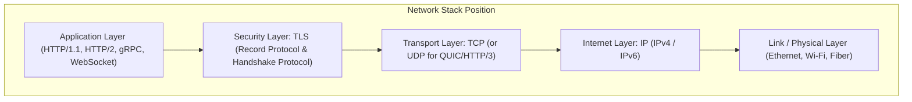

---

## 2. Public Key Infrastructure (PKI) & Digital Certificates

Public Key Infrastructure (PKI) is the set of roles, policies, hardware, software, and procedures needed to create, manage, distribute, use, store, and revoke digital certificates and manage public-key encryption.

### 2.1 Asymmetric vs. Symmetric Cryptography in TLS

TLS is a **hybrid cryptosystem**:

1. **Asymmetric Cryptography (Public/Private Key)**: Computationally heavy. Used **only during the initial handshake** to authenticate server/client identities and securely exchange/derive session secrets.
2. **Symmetric Cryptography (Shared Secret Key)**: Computationally fast (leveraging CPU hardware instructions like AES-NI). Used for **bulk data encryption and integrity** during the actual session.

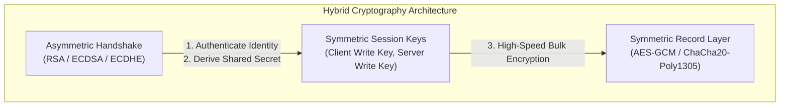

### 2.2 Anatomy of an X.509 Certificate (RFC 5280)

An **X.509 v3 Digital Certificate** is a cryptographically bound document that binds a public key to an identity (a domain name, organization, or machine).

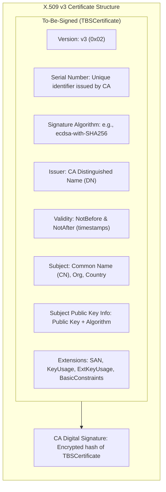

#### Key Fields Explained:

1. **Subject**: The identity of the certificate owner. Historically identified by the `Common Name` (CN, e.g., `CN=api.example.com`).
2. **Subject Alternative Name (SAN)**:
   > [!IMPORTANT]
   > **Common Name (CN) is deprecated** for domain validation (RFC 2818 & RFC 6125). Modern browsers and TLS clients (Go, Chrome, Curl) exclusively validate hostnames against the **SAN extension** (`DNS:api.example.com`, `DNS:*.example.com`, `IP:10.0.0.1`). If SAN is missing or does not match the requested host, the connection is aborted with an invalid hostname error.
3. **Issuer**: The entity (Certificate Authority) that signed this certificate.
4. **Validity (`NotBefore` and `NotAfter`)**: The certificate's active lifespan. Public CAs enforce a maximum validity of **398 days** (and moving toward 90 days).
5. **Basic Constraints**:
   - `CA:TRUE`: This certificate is a CA and is authorized to sign other certificates.
   - `CA:FALSE`: This is a leaf (end-entity) certificate; it cannot sign other certificates.
   - `pathlen:N`: Specifies how many intermediate CAs can follow below this certificate.
6. **Key Usage & Extended Key Usage (EKU)**:
   - `digitalSignature`: Allowed to sign messages or handshakes.
   - `keyEncipherment`: Allowed to encrypt symmetric keys (used in RSA key exchange).
   - `serverAuth`: Valid for authenticating a TLS server to a client.
   - `clientAuth`: Valid for authenticating a TLS client to a server (crucial for **mTLS**).

### 2.3 Certificate File Formats & Encodings

Certificates and private keys are distributed in various encoding formats:

| Format / Extension                       | Encoding                                                 | Contents                                                 | Common Use Case                                                           |
| :--------------------------------------- | :------------------------------------------------------- | :------------------------------------------------------- | :------------------------------------------------------------------------ |
| **PEM** (`.pem`, `.crt`, `.cer`, `.key`) | Base64 encoded ASCII with `-----BEGIN ...-----` headers. | Single cert, certificate chain, or private key.          | Linux, Nginx, Apache, Go, Docker, Kubernetes.                             |
| **DER** (`.der`)                         | Binary ASN.1 encoding.                                   | Single certificate or private key (unarmored).           | Java keystores, Windows native tools, smartcards.                         |
| **PKCS#12 / PFX** (`.p12`, `.pfx`)       | Binary archive, password-encrypted.                      | Bundles leaf cert, intermediate chain, AND private key.  | Windows IIS, Azure, macOS Keychain, enterprise mTLS client certs.         |
| **PKCS#7 / P7B** (`.p7b`, `.p7c`)        | Base64 or binary.                                        | Certificate chain only; **never contains private keys**. | Windows cert distribution, Java keystores.                                |
| **PKCS#8** (`BEGIN PRIVATE KEY`)         | PEM / DER format standard for private keys.              | Generic private key wrapper (RSA, ECDSA, Ed25519).       | Modern crypto libraries (replaces legacy PKCS#1 `BEGIN RSA PRIVATE KEY`). |

---

## 3. Certificate Authorities (CAs) & The Chain of Trust

A browser or client cannot maintain pre-shared keys with every website on earth. Instead, trust is established hierarchically through a **Chain of Trust**.

### 3.1 The Hierarchical Chain of Trust

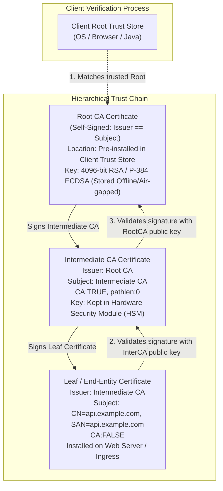

#### Why Have Intermediate CAs?

- **Root CA Isolation**: The Root CA private key is extremely valuable. If compromised, every certificate it issued is untrusted. Root CAs are kept **offline in air-gapped secure vaults** or physical Hardware Security Modules (HSMs).
- **Day-to-day Operations**: Intermediate CAs perform online, automated issuance (e.g., via ACME). If an intermediate CA is compromised, only that intermediate needs revocation; the Root CA remains intact.

### 3.2 Trust Stores (Root Stores)

Clients trust a certificate only if its chain terminates at an anchor present in their **Trust Store**:

- **Operating System Trust Stores**:
  - Windows: Windows Certificate Store (`certmgr.msc` / CryptoAPI).
  - macOS: System Keychain (`Keychain Access.app`).
  - Linux: File bundles such as `/etc/ssl/certs/ca-certificates.crt` (Debian/Ubuntu) or `/etc/pki/tls/certs/ca-bundle.crt` (RHEL/CentOS).
- **Application-Specific Trust Stores**:
  - Mozilla Firefox: Uses its own Mozilla NSS database rather than OS roots.
  - Google Chrome: Uses Chrome Root Program (Chrome Certificate Verifier).
  - Java: Uses Java Keystore located at `$JAVA_HOME/lib/security/cacerts`.
  - Go runtime: By default reads OS roots; allows programmatic override via `crypto/x509.NewCertPool()`.

### 3.3 The Certificate Lifecycle: From CSR to Issuance

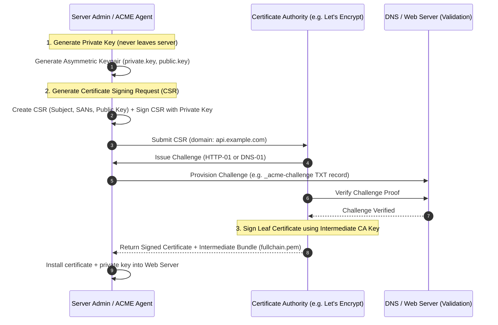

#### Validation Types

1. **DV (Domain Validation)**: CA verifies control over the domain (via DNS record or HTTP token). Automated (e.g., Let's Encrypt).
2. **OV (Organization Validation)**: CA verifies domain ownership plus legal business registration documents.
3. **EV (Extended Validation)**: Rigorous legal vetting of company identity and physical presence.

### 3.4 Certificate Revocation

If a private key is leaked or compromised before expiration, the certificate must be revoked.

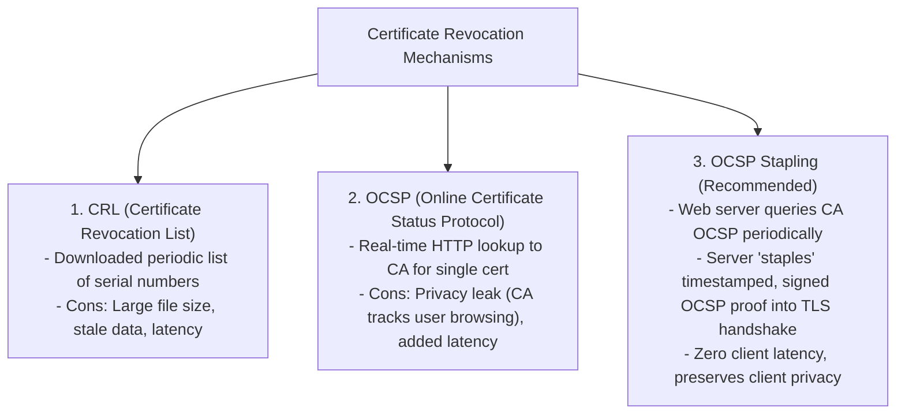

---

## 4. TLS Handshake Protocol Deep Dive

The TLS Handshake establishes session parameters, authenticates peers, and negotiates a shared symmetric key without transmitting that key over the wire.

### 4.1 Ephemeral Diffie-Hellman & Perfect Forward Secrecy (PFS)

> [!IMPORTANT]
> In older TLS (TLS 1.0-1.2 with static RSA key exchange), the client encrypted a pre-master secret using the server's public key. If an attacker recorded encrypted traffic and years later compromised the server's private key, they could decrypt **all historical recorded sessions**.

Modern TLS enforces **Perfect Forward Secrecy (PFS)** using **ECDHE** (Elliptic Curve Diffie-Hellman Ephemeral):

- For every new connection, both client and server generate a temporary, short-lived (ephemeral) keypair.
- They exchange public parameters over the wire and mathematically compute the exact same **Pre-Master Secret**.
- The ephemeral private keys are immediately wiped from memory.
- If the server's long-term certificate private key is compromised in the future, past recorded traffic **cannot** be decrypted.

---

### 4.2 TLS 1.2 Full Handshake (2 Round-Trip Times - 2-RTT)

In TLS 1.2, establishing an encrypted channel takes two network round trips before application data can flow:

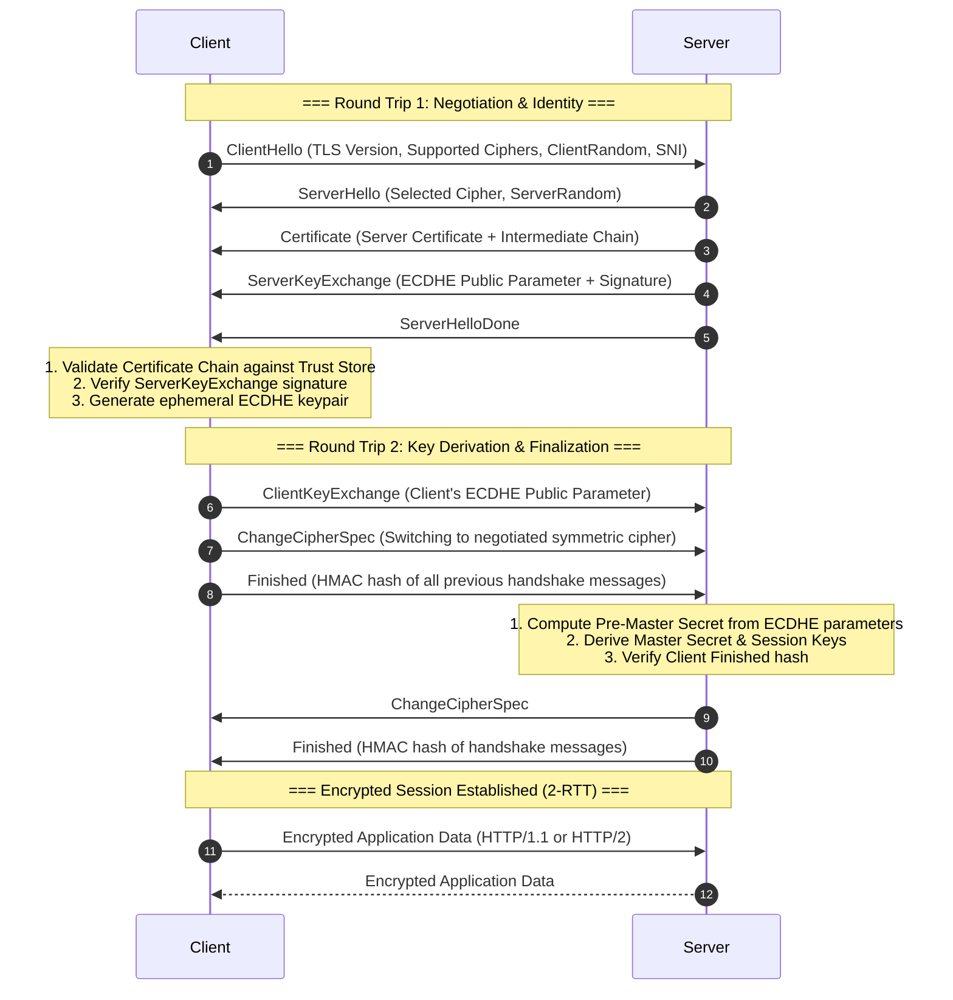

---

### 4.3 TLS 1.3 Handshake (1 Round-Trip Time - 1-RTT)

TLS 1.3 (RFC 8446) fundamentally restructured the protocol:

1. **Latency Reduction**: Handshake latency cut from 2-RTT to **1-RTT**.
2. **Stripped Legacy Flaws**: Completely removed static RSA key exchange, Diffie-Hellman with custom parameters, CBC mode ciphers (vulnerable to padding oracles like POODLE/Lucky13), RC4, MD5, and SHA-1.
3. **Mandatory AEAD**: Only AEAD (Authenticated Encryption with Associated Data) ciphers are permitted.
4. **Encrypted Handshake Metadata**: The server's certificate is now **encrypted** during transit, preventing passive network eavesdroppers from identifying which host you are connecting to.

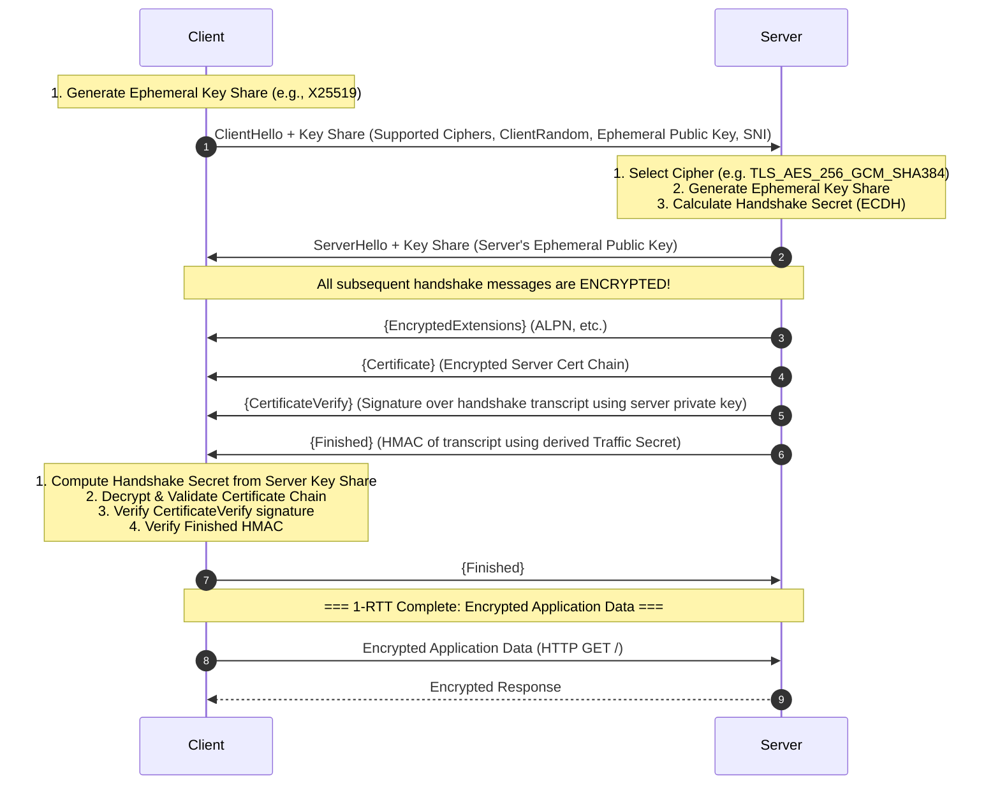

#### TLS 1.3 0-RTT Resumption (Early Data)

When reconnecting to a server previously visited, the client can use a Pre-Shared Key (PSK) derived from the prior session to encrypt application data in the **very first packet** (0-RTT).

> [!WARNING]
> **0-RTT data is susceptible to replay attacks**. An attacker can record the 0-RTT packet and replay it to the server. Therefore, 0-RTT should only be used for idempotent requests (e.g., HTTP `GET` queries without side effects), never for state-mutating requests (`POST /api/pay`).

---

### 4.4 Comparison Matrix: TLS 1.2 vs. TLS 1.3

| Feature                        | TLS 1.2 (RFC 5246)                                          | TLS 1.3 (RFC 8446)                                          |
| :----------------------------- | :---------------------------------------------------------- | :---------------------------------------------------------- |
| **Handshake Latency**          | 2-RTT (2 round trips)                                       | **1-RTT** (0-RTT for resumption)                            |
| **Server Certificate Privacy** | Transmitted in **plaintext**                                | **Encrypted** on the wire                                   |
| **Key Exchange Mechanisms**    | Static RSA, DH, DHE, ECDHE                                  | **ECDHE, DHE only** (mandatory PFS)                         |
| **Supported Cipher Suites**    | Dozens of legacy suites (including insecure CBC, RC4, 3DES) | **5 Clean AEAD Suites**                                     |
| **Cipher Suite Syntax**        | `TLS_ECDHE_RSA_WITH_AES_128_GCM_SHA256`                     | `TLS_AES_128_GCM_SHA256` (Orthogonal key exchange & cipher) |
| **Integrity Checks**           | Separate MAC (HMAC-SHA1, HMAC-SHA256)                       | Integrated **AEAD**                                         |
| **Speed & Security Profile**   | Vulnerable if misconfigured                                 | Secure by default                                           |

---

## 5. Mutual TLS (mTLS)

In standard TLS (one-way TLS), **only the server proves its identity** to the client. The client remains anonymous at the transport layer (authenticating later via HTTP headers, cookies, or JWTs).

In **Mutual TLS (mTLS)**, **both peers authenticate each other at Layer 4/6** using X.509 certificates.

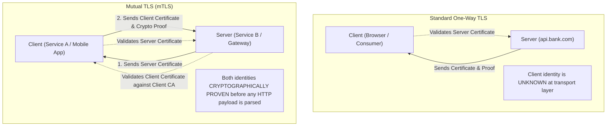

### 5.1 The mTLS Handshake Flow

During an mTLS handshake, after the server sends its own certificate, it issues a `CertificateRequest`. The client must present its certificate and cryptographic proof of private key ownership (`CertificateVerify`):

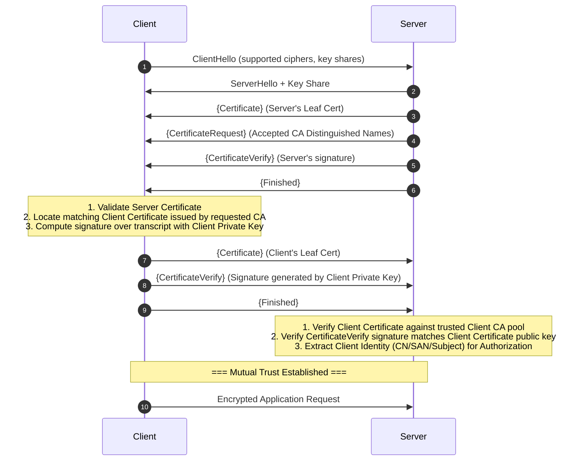

### 5.2 Why and Where mTLS is Used

1. **Microservice-to-Microservice Communication (Zero Trust Architecture)**:
   - In modern Kubernetes clusters and Service Meshes (**Istio**, **Linkerd**, **Consul**), sidecar proxies (Envoy) automatically inject and rotate short-lived certificates, enforcing mTLS for every east-west RPC.
2. **High-Security APIs & Financial Integrations**:
   - Open Banking APIs, SWIFT transactions, and payment processors require mTLS to ensure rogue clients cannot even reach application-level parsing.
3. **IoT & Hardware Device Authentication**:
   - Smart meters, medical devices, and connected vehicles embed factory-provisioned hardware certificates inside secure chips (TPM / Secure Enclave).

### 5.3 Comparison: mTLS vs. API Keys vs. OAuth/JWT

| Dimension                 | mTLS                                      | API Key                        | OAuth 2.0 / JWT                   |
| :------------------------ | :---------------------------------------- | :----------------------------- | :-------------------------------- |
| **OSI Layer**             | Layer 4 / 6 (Transport/TLS)               | Layer 7 (Application Header)   | Layer 7 (HTTP `Authorization`)    |
| **Authentication Timing** | Before HTTP processing begins             | After TCP + TLS handshake      | After TCP + TLS handshake         |
| **Tamper Resistance**     | Impossible to steal without private key   | Vulnerable to logging, leaks   | Vulnerable to token interception  |
| **Revocation**            | CA revocation, CRL, short TTL             | Database / Redis lookup        | Short TTL, token revocation list  |
| **Client Spoofing**       | Cryptographically impossible              | Trivially replayable if leaked | Replayable if bearer token leaked |
| **Performance**           | One-time handshake overhead               | Trivial string compare         | Cryptographic signature verify    |
| **Browser Compatibility** | Cumbersome (requires client cert install) | Native (HTTP headers)          | Native (HTTP headers / Cookies)   |

---

## 6. Practical Hands-On & Command-Line Guide

### 6.1 Inspecting & Debugging TLS with OpenSSL

```bash
# 1. Connect to a remote server and print the full certificate chain
openssl s_client -connect github.com:443 -showcerts

# 2. Test TLS 1.3 specifically
openssl s_client -connect github.com:443 -tls1_3

# 3. Test with Server Name Indication (SNI) explicitly set
openssl s_client -connect 140.82.121.4:443 -servername github.com

# 4. Inspect a local certificate file (PEM format)
openssl x509 -in cert.pem -text -noout

# 5. Verify if a private key matches a certificate (modulus or pubkey hash must match)
openssl x509 -noout -pubkey -in cert.pem | openssl sha256
openssl pkey -pubout -in private.key | openssl sha256

# 6. Check certificate expiration date
openssl x509 -enddate -noout -in cert.pem
```

---

### 6.2 Step-by-Step: Build Your Own Private CA and Issue mTLS Certificates

Below is a complete, reproducible guide to establishing a two-tier PKI (Root CA -> Leaf Certs) for testing mTLS.

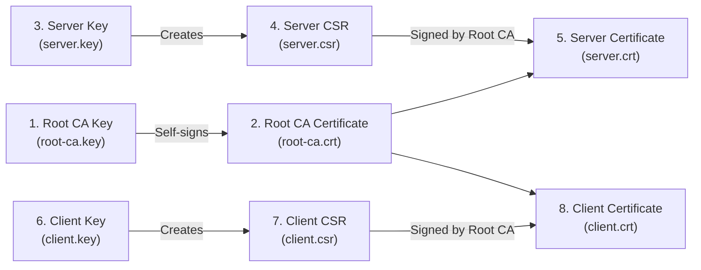

#### Step 1: Create the Root CA (Self-Signed)

```bash
# Generate high-entropy private key for Root CA
openssl ecparam -name prime256v1 -genkey -noout -out root-ca.key

# Create self-signed Root CA certificate valid for 10 years (3650 days)
openssl req -x509 -new -nodes -key root-ca.key -sha256 -days 3650 \
  -subj "/C=US/ST=CA/O=Internal Security/CN=Internal Root CA" \
  -out root-ca.crt
```

#### Step 2: Issue a Server Certificate (with SAN)

```bash
# 1. Generate Server Private Key
openssl ecparam -name prime256v1 -genkey -noout -out server.key

# 2. Generate Server CSR (Certificate Signing Request)
openssl req -new -key server.key \
  -subj "/C=US/ST=CA/O=Engineering/CN=localhost" \
  -out server.csr

# 3. Create extension config file for SAN & serverAuth
cat <<EOF > server-ext.cnf
authorityKeyIdentifier=keyid,issuer
basicConstraints=CA:FALSE
keyUsage = digitalSignature, keyEncipherment
extendedKeyUsage = serverAuth
subjectAltName = @alt_names

[alt_names]
DNS.1 = localhost
IP.1 = 127.0.0.1
EOF

# 4. Sign the Server Certificate with Root CA
openssl x509 -req -in server.csr -CA root-ca.crt -CAkey root-ca.key \
  -CAcreateserial -out server.crt -days 365 -sha256 -extfile server-ext.cnf
```

#### Step 3: Issue a Client Certificate (for mTLS)

```bash
# 1. Generate Client Private Key
openssl ecparam -name prime256v1 -genkey -noout -out client.key

# 2. Generate Client CSR
openssl req -new -key client.key \
  -subj "/C=US/ST=CA/O=Engineering/CN=service-billing-client" \
  -out client.csr

# 3. Create extension config file for clientAuth
cat <<EOF > client-ext.cnf
authorityKeyIdentifier=keyid,issuer
basicConstraints=CA:FALSE
keyUsage = digitalSignature
extendedKeyUsage = clientAuth
EOF

# 4. Sign Client Certificate with Root CA
openssl x509 -req -in client.csr -CA root-ca.crt -CAkey root-ca.key \
  -CAcreateserial -out client.crt -days 365 -sha256 -extfile client-ext.cnf
```

---

### 6.3 Testing with `curl`

```bash
# 1. Test standard HTTPS server using custom CA
curl --cacert root-ca.crt https://localhost:8443/

# 2. Test mTLS server by passing client certificate and private key
curl --cacert root-ca.crt \
     --cert client.crt \
     --key client.key \
     https://localhost:8443/api/secure-endpoint

# 3. Output verbose handshake logs to inspect TLS negotiation
curl -v --cacert root-ca.crt --cert client.crt --key client.key https://localhost:8443/
```

---

## 7. Production Code Examples

### 7.1 Go Implementation: Complete mTLS Server & Client

Go's standard library `crypto/tls` package provides top-tier support for TLS 1.3 and mTLS.

#### The Server (`server.go`)

```go
package main

import (
	"crypto/tls"
	"crypto/x509"
	"fmt"
	"log"
	"net/http"
	"os"
)

func main() {
	// 1. Load Server Certificate and Private Key
	serverCert, err := tls.LoadX509KeyPair("server.crt", "server.key")
	if err != nil {
		log.Fatalf("Failed to load server cert/key: %v", err)
	}

	// 2. Load Root CA to verify incoming Client Certificates
	caCert, err := os.ReadFile("root-ca.crt")
	if err != nil {
		log.Fatalf("Failed to read Root CA: %v", err)
	}
	clientCertPool := x509.NewCertPool()
	if !clientCertPool.AppendCertsFromPEM(caCert) {
		log.Fatal("Failed to append Root CA to client cert pool")
	}

	// 3. Configure TLS Settings
	tlsConfig := &tls.Config{
		Certificates: []tls.Certificate{serverCert},
		// Require and verify client certificate (Enables mTLS)
		ClientAuth:   tls.RequireAndVerifyClientCert,
		ClientCAs:    clientCertPool,
		MinVersion:   tls.VersionTLS13, // Enforce modern TLS 1.3
	}

	// 4. HTTP Handler extracting Client Identity
	http.HandleFunc("/api/secure", func(w http.ResponseWriter, r *http.Request) {
		if r.TLS != nil && len(r.TLS.PeerCertificates) > 0 {
			clientCert := r.TLS.PeerCertificates[0]
			clientCommonName := clientCert.Subject.CommonName
			fmt.Fprintf(w, "Hello authenticated client: %s\n", clientCommonName)
			return
		}
		http.Error(w, "No client certificate verified", http.StatusUnauthorized)
	})

	server := &http.Server{
		Addr:      ":8443",
		TLSConfig: tlsConfig,
	}

	log.Println("Starting mTLS server on :8443 (TLS 1.3 enforced)...")
	if err := server.ListenAndServeTLS("", ""); err != nil {
		log.Fatalf("Server error: %v", err)
	}
}
```

#### The Client (`client.go`)

```go
package main

import (
	"crypto/tls"
	"crypto/x509"
	"fmt"
	"io"
	"log"
	"net/http"
	"os"
)

func main() {
	// 1. Load Client Certificate & Key to present to the server
	clientCert, err := tls.LoadX509KeyPair("client.crt", "client.key")
	if err != nil {
		log.Fatalf("Failed to load client cert/key: %v", err)
	}

	// 2. Load Root CA to verify the server
	caCert, err := os.ReadFile("root-ca.crt")
	if err != nil {
		log.Fatalf("Failed to read Root CA: %v", err)
	}
	rootCertPool := x509.NewCertPool()
	if !rootCertPool.AppendCertsFromPEM(caCert) {
		log.Fatal("Failed to append Root CA to root pool")
	}

	// 3. Configure HTTP Client with mTLS
	tlsConfig := &tls.Config{
		Certificates: []tls.Certificate{clientCert},
		RootCAs:      rootCertPool,
		MinVersion:   tls.VersionTLS13,
	}

	client := &http.Client{
		Transport: &http.Transport{
			TLSClientConfig: tlsConfig,
		},
	}

	// 4. Perform Request
	resp, err := client.Get("https://localhost:8443/api/secure")
	if err != nil {
		log.Fatalf("Request failed: %v", err)
	}
	defer resp.Body.Close()

	body, _ := io.ReadAll(resp.Body)
	fmt.Printf("Status: %s\nResponse: %s\n", resp.Status, string(body))
}
```

---

### 7.2 Nginx: Terminating mTLS at Reverse Proxy

In production, TLS and mTLS are often terminated at the reverse proxy or API gateway before proxying requests upstream:

```nginx
server {
    listen 443 ssl http2;
    server_name api.example.com;

    # Server TLS certificate
    ssl_certificate /etc/nginx/certs/server.crt;
    ssl_certificate_key /etc/nginx/certs/server.key;

    # Enforce TLS 1.3 and modern TLS 1.2
    ssl_protocols TLSv1.2 TLSv1.3;
    ssl_ciphers ECDHE-ECDSA-AES128-GCM-SHA256:ECDHE-RSA-AES128-GCM-SHA256;
    ssl_prefer_server_ciphers off;

    # === mTLS Client Authentication Settings ===
    ssl_client_certificate /etc/nginx/certs/root-ca.crt; # Trusted Client CA
    ssl_verify_client on;                               # Reject if cert missing or invalid
    ssl_verify_depth 2;

    location / {
        # Forward authenticated client certificate Subject CN to backend application
        proxy_set_header X-Client-DN $ssl_client_s_dn;
        proxy_set_header X-Client-Serial $ssl_client_serial;
        proxy_set_header X-Client-Verify $ssl_client_verify;

        proxy_pass http://internal-service:8080;
    }
}
```

---

## 8. Attacks, Pitfalls & Production Best Practices

### 8.1 Critical Vulnerabilities & Attacks

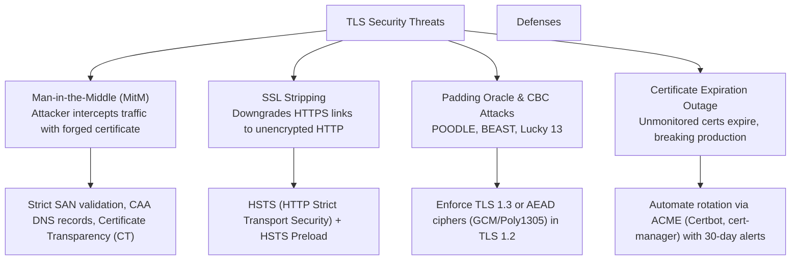

#### 1. SSL Stripping & HSTS

- **The Attack**: When a user types `example.com`, browsers initially make an unencrypted HTTP request. An active attacker on the Wi-Fi intercepts this request, connects to the server via HTTPS, and proxies back unencrypted HTTP to the user.
- **Defense**: **HTTP Strict Transport Security (HSTS)** header:
  ```http
  Strict-Transport-Security: max-age=63072000; includeSubDomains; preload
  ```
  This tells browsers to **never** attempt HTTP connections to this domain for the next 2 years and automatically rewrite `http://` to `https://`.

#### 2. Certificate Transparency (CT - RFC 6962)

- To prevent rogue or compromised CAs from silently issuing unauthorized certificates for your domain (e.g., a hacked foreign CA issuing a cert for `google.com`), modern CAs must submit all issued certificates to public, append-only, cryptographically verifiable **Certificate Transparency Logs**.
- Browsers reject any public certificate that does not contain cryptographic proofs (Signed Certificate Timestamps - SCTs) from at least two independent CT logs.

#### 3. DNS CAA (Certificate Authority Authorization - RFC 8659)

- DNS CAA records allow domain owners to declare which CAs are authorized to issue certificates for their domain:
  ```text
  example.com. IN CAA 0 issue "letsencrypt.org"
  example.com. IN CAA 0 iodef "mailto:security@example.com"
  ```
  Any compliant CA checking CAA records will refuse to issue certificates if it is not explicitly listed.

#### 4. Encrypted Client Hello (ECH) & SNI Privacy

- In standard TLS (including standard TLS 1.3), the **Server Name Indication (SNI)** in `ClientHello` is transmitted in the clear. ISPs and network eavesdroppers know which website you visit even if they can't read the payload.
- **ECH (Encrypted Client Hello)** encrypts the entire inner `ClientHello` using a public key published via DNS HTTPS resource records (`type 65`), sealing the last major metadata leak in TLS.

---

### 8.2 Production Checklist

- [ ] **Disable Insecure Protocols**: Disable SSL 2.0, SSL 3.0, TLS 1.0, and TLS 1.1. Permit only **TLS 1.2 and TLS 1.3**.
- [ ] **AEAD Ciphers Only**: Restrict TLS 1.2 to AEAD suites (e.g. `ECDHE-ECDSA-AES128-GCM-SHA256`).
- [ ] **Enforce Perfect Forward Secrecy**: Eliminate static RSA key exchange suites.
- [ ] **Validate SANs, Not CN**: Ensure all services validate `Subject Alternative Name`.
- [ ] **Automate Rotation**: Use ACME agents (`cert-manager` on Kubernetes, `certbot` on VMs) to renew certificates at least 30 days before expiry.
- [ ] **Enable OCSP Stapling**: Prevent client latency and preserve visitor privacy.
- [ ] **Deploy HSTS**: Prevent protocol downgrade attacks.
- [ ] **Enforce mTLS on East-West RPCs**: Never trust internal VPC traffic; require mutual certificate validation between microservices.

---

## 9. Summary & Architecture Comparison

| Architecture              | Identification Mechanism            | Validation                                              | Trust Boundary                                          | Best Suited For                                  |
| :------------------------ | :---------------------------------- | :------------------------------------------------------ | :------------------------------------------------------ | :----------------------------------------------- |
| **Standard TLS (1-way)**  | Server Certificate only             | Client validates Server                                 | Client trusts Server; Server treats client as anonymous | Public Web Sites, Consumer Mobile Apps           |
| **mTLS (2-way)**          | Server Cert + Client Cert           | Bidirectional validation at Layer 4/6                   | Both peers cryptographically proven                     | Service Mesh, Inter-service RPC, Open Banking    |
| **TLS + JWT / OAuth**     | Server Cert + Bearer Token          | Server validates Token signature at Layer 7             | Server trusts Identity Provider (IdP); Token can leak   | User sessions, Multi-tenant Web APIs             |
| **mTLS + JWT (Combined)** | Transport Certs + Application Token | mTLS establishes secure tunnel; JWT carries user claims | Defense-in-depth: Zero-trust network + granular RBAC    | Enterprise Microservices, High-assurance Finance |

---

## References & Further Reading

- [RFC 8446: The Transport Layer Security (TLS) Protocol Version 1.3](https://datatracker.ietf.org/doc/html/rfc8446)
- [RFC 5246: The Transport Layer Security (TLS) Protocol Version 1.2](https://datatracker.ietf.org/doc/html/rfc5246)
- [RFC 5280: Internet X.509 Public Key Infrastructure Certificate and CRL Profile](https://datatracker.ietf.org/doc/html/rfc5280)
- [RFC 8555: Automatic Certificate Management Environment (ACME)](https://datatracker.ietf.org/doc/html/rfc8555)
- [RFC 6962: Certificate Transparency](https://datatracker.ietf.org/doc/html/rfc6962)
- [RFC 8659: DNS Certification Authority Authorization (CAA) Resource Record](https://datatracker.ietf.org/doc/html/rfc8659)
- [Mozilla SSL Configuration Generator & Server Side TLS Guidelines](https://wiki.mozilla.org/Security/Server_Side_TLS)
