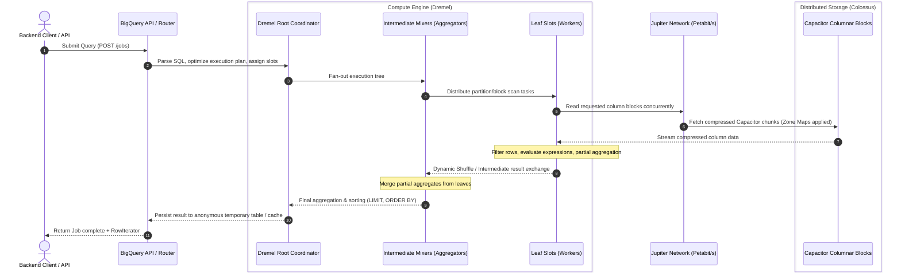
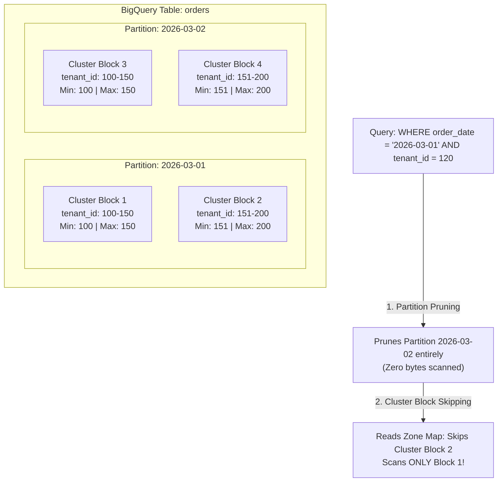
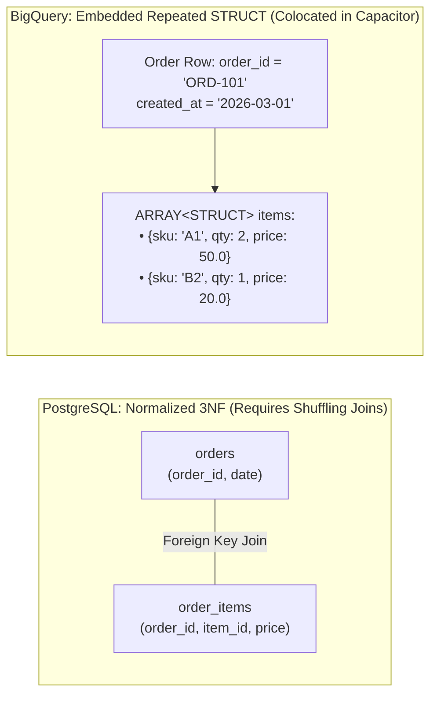
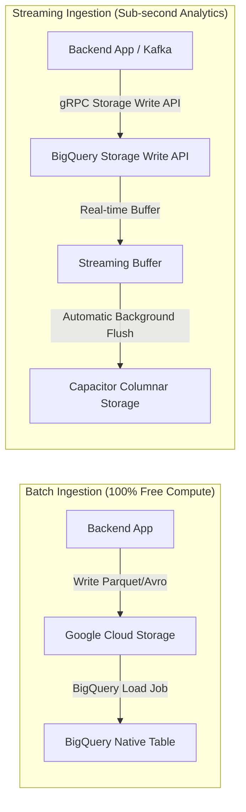
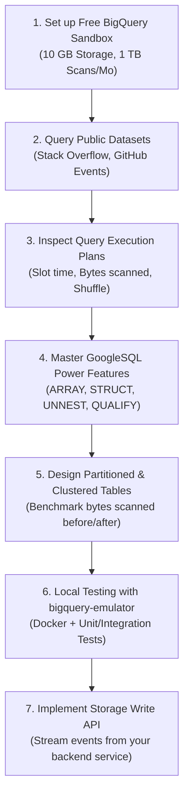

# BigQuery Architecture & Engineering Guide for PostgreSQL Backend Engineers

A deep-dive technical reference and architectural transition guide designed for backend engineers with relational database (PostgreSQL/MySQL) backgrounds transitioning to Google Cloud BigQuery.

---

## 1. The Paradigm Shift: PostgreSQL (OLTP) vs. BigQuery (OLAP)

Coming from PostgreSQL, your architectural instincts are tuned for **OLTP (Online Transaction Processing)**: low-latency queries, strict ACID compliance, row-level indexes (B-Tree), connection pools, and normalized relational schemas (3NF).

BigQuery is an **OLAP (Online Analytical Processing)** distributed data warehouse. Its design priorities are the exact opposite: scanning billions of rows, executing massive aggregations across petabytes of data, scaling horizontally across thousands of virtual CPUs (slots), and decoupling compute from storage.

### 1.1 Primary Workload (Point Operations vs. Bulk Aggregations)

- **PostgreSQL (OLTP)**:
  - Designed for low-latency, high-frequency transactional queries operating on small numbers of rows.
  - Typical patterns: `SELECT * FROM users WHERE id = $1`, `UPDATE accounts SET balance = balance - 50 WHERE id = $2`.
  - Latency expectation: Sub-millisecond to low tens of milliseconds per operation.
- **BigQuery (OLAP)**:
  - Designed for massive batch aggregations and complex analytical queries scanning millions to billions of rows.
  - Typical patterns: Multi-year aggregations, large window functions, time-series bucketing (`SUM`, `AVG`, `GROUP BY`, `QUALIFY`).
  - Latency expectation: Seconds to minutes. BigQuery has higher minimum latency (~1–2 seconds query initiation overhead), but scales to petabytes with flat execution times.
- **Backend Takeaway**:
  - Never use BigQuery as the backing database for real-time user-facing CRUD endpoints (e.g., serving a user profile page or processing an checkout transaction). Keep your transactional core in PostgreSQL and stream/replicate data to BigQuery for analytics.

---

### 1.2 Storage Layout (Row-Oriented Heap vs. Columnar Capacitor)

- **PostgreSQL (Row-Oriented)**:
  - Stores data in 8 KB heap pages where every column of a single row is co-located together
  - Efficient when a query needs all or most attributes of a specific record (`SELECT * WHERE id = 123`).
  - Inefficient for analytical aggregates: computing the average user age requires reading every user's entire row (name, address, metadata, email) into memory just to extract the age column.
- **BigQuery (Columnar - Capacitor)**:
  - Stores each column in separate, independent, highly-compressed file blocks on Colossus.
  - Queries only read the exact columns specified in the `SELECT` clause from disk or network.
  - Enables aggressive compression (Dictionary, Run-Length Encoding, Frame of Reference) because identical data types and similar values are stored contiguously.
- **Backend Takeaway**:
  - Unused columns directly multiply I/O cost and scan billing. Always project only the required columns; eliminate `SELECT *`.
  - _See deep-dive note: [PostgreSQL Row-Oriented Heap Internal Mechanism](../postgres/row_oriented_heap.md)._

---

### 1.3 Hardware Coupling & Scaling (Coupled Node vs. Decoupled Compute & Storage)

- **PostgreSQL (Coupled Compute & Storage)**:
  - Compute (CPU, RAM) and persistent storage (NVMe SSD, Amazon EBS, GCP Persistent Disk) are bound to a single virtual machine or bare-metal host.
  - Scaling storage or compute requires vertically resizing the instance (downtime/failover) or setting up read replicas.
  - Storage bandwidth is capped by the VM's disk controller and hypervisor limits.
- **BigQuery (Fully Decoupled Compute & Storage)**:
  - Storage is managed globally by **Colossus** (Google's planet-scale distributed file system).
  - Compute is provided on-demand by **Dremel** (a multi-tenant pool of dynamic virtual CPU slots).
  - Compute and storage communicate across the **Jupiter network fabric**, providing 1+ Petabit/sec bisection bandwidth.
- **Backend Takeaway**:
  - You can store petabytes of data without paying for running compute instances. When a query runs, BigQuery dynamically assigns hundreds or thousands of worker cores for a few seconds, executes the query, and immediately releases the compute resources.

---

### 1.4 Indexing Strategy (B-Tree Pointers vs. Partition & Cluster Metadata)

- **PostgreSQL (Physical Indexes)**:
  - Uses explicit disk-backed indexes (B-Tree, Hash, GiST, GIN, BRIN) maintaining pointers to heap tuple IDs (`ctid`).
  - An index allows the storage engine to perform $O(\log N)$ point lookups, skipping 99.99% of disk blocks.
  - Trade-off: Every index adds write latency, increases table bloat, and consumes RAM cache (shared buffers).
- **BigQuery (No B-Trees - Metadata Pruning & Zone Maps)**:
  - Does **not** support traditional B-Tree indexes.
  - Employs **Partition Pruning**: Tables are sliced into coarse physical partitions (e.g., by day or month). Queries with date filters completely ignore unreferenced partition folders.
  - Employs **Clustering & Zone Maps**: Within each partition, data is sorted by up to 4 columns. Capacitor file blocks store min/max values in their headers, allowing workers to skip non-matching blocks entirely.
- **Backend Takeaway**:
  - Replace index design thinking with **Partitioning + Clustering** strategies. If a query is slow or expensive, examine whether your `WHERE` clause matches the partition and cluster column order.

---

### 1.5 Concurrency & Connection Handling (Connection Pools vs. Serverless Jobs)

- **PostgreSQL (Process-per-Connection Model)**:
  - Spawns a dedicated OS process for each client connection, each consuming 5–10 MB of RAM.
  - High concurrency quickly saturates max connection limits, requiring external pooling layers like **PgBouncer** or **AWS RDS Proxy** to cap active connections (~500–2,000 max).
- **BigQuery (Serverless Asynchronous Job Model)**:
  - No connection pools, stateful sockets, or persistent DB connections.
  - Clients communicate via stateless REST/gRPC APIs by submitting asynchronous **Jobs** (`jobs.insert`).
  - Concurrency is managed at the project level via slot availability and dynamic query queuing (up to 1,000 interactive queries can be queued simultaneously per project).
- **Backend Takeaway**:
  - Backend services do not need connection pool singletons. Use standard HTTP/gRPC SDK client instances that handle job creation, polling, and streaming row iterators.
  - _See deep-dive note: [PostgreSQL Connection Architecture & Connection Pooling](../postgres/connection_pool.md)._

---

### 1.6 ACID & Transactionality (Row-Level Locking vs. Append-Optimized Snapshot Isolation)

- **PostgreSQL (Full Multi-Statement ACID with MVCC)**:
  - Complete support for multi-statement transactions (`BEGIN ... COMMIT / ROLLBACK`), savepoints, serializable isolation, and explicit row-level locking (`SELECT ... FOR UPDATE`).
  - MVCC creates new tuple versions on update and relies on `VACUUM` to clean dead tuples.
- **BigQuery (Snapshot Isolation & Append-Heavy Optimization)**:
  - Supports multi-statement transactions and standard DML (`INSERT`, `UPDATE`, `DELETE`, `MERGE`), but enforces snapshot isolation.
  - **No row-level locking**: Mutations rewrite entire columnar chunks in the background. High-frequency concurrent updates to the same table partition will trigger transaction conflict errors (`400 Concurrent update table`).
- **Backend Takeaway**:
  - Avoid using BigQuery for frequent single-row updates or transactional state machines (e.g., updating an order status from `PENDING` to `PROCESSING`). Design ingestion as append-only event logs, and resolve current state at query time using window functions or periodic batch merges.

---

### 1.7 Cost Economics (Provisioned Uptime vs. Scanned Bytes & Slot Hours)

- **PostgreSQL (Predictable Infrastructure Sizing)**:
  - Billed based on provisioned VM specifications (e.g., `db.r6g.2xlarge` = 8 vCPU, 64 GB RAM at ~$0.50/hour + storage volume $/GB/month).
  - A runaway, unindexed sequential scan slows down queries and spikes CPU, but does **not** generate surprise charges on your monthly cloud invoice.
- **BigQuery (Pay-per-Query / Consumption-Driven)**:
  - **On-Demand**: Billed strictly by the volume of bytes read from storage by the columns in your query (**$6.25 per TB scanned**).
  - A poorly written query on an unpartitioned 40 TB table will cost **$250 in a single execution**.
- **Backend Takeaway**:
  - Cost optimization is a software engineering responsibility in BigQuery. Backend code must enforce cost guardrails (`dryRun`, `maximum_bytes_billed`, and mandatory partition filtering).
  - _See deep-dive note: [BigQuery Table Partitioning, Partition Pruning & Cost Economics](partition.md)._

---

### 1.8 Schema Philosophy (Normalized 3NF vs. Denormalized Nested Records)

- **PostgreSQL (Relational Normalization - 3NF)**:
  - Prioritizes third normal form (3NF) to eliminate data redundancy and prevent write anomalies.
  - Entities are split into separate tables (e.g., `orders`, `order_items`, `customers`) and joined at query time using foreign keys. Joins are fast when working in memory.
- **BigQuery (Denormalization with First-Class ARRAY & STRUCT)**:
  - Distributed joins across large tables require shuffling gigabytes of data across network nodes, which is computationally expensive and slow.
  - Solves this by supporting first-class **nested and repeated data structures** (`ARRAY<STRUCT<...>>`), allowing 1-to-many child records to be physically co-located within the parent row.
- **Backend Takeaway**:
  - Do not blindly translate normalized PostgreSQL schemas into BigQuery. Store child line-items or tags directly inside the parent entity as repeated records to achieve single-scan performance without joins.

---

## 2. Core Architecture Under the Hood

BigQuery achieves petabyte-scale execution within seconds because of three proprietary Google infrastructure systems connected together: **Colossus**, **Jupiter**, and **Dremel**.



### 1. Storage Layer: Colossus & Capacitor

- **Colossus**: Google's planetary-scale distributed file system (successor to GFS). It handles automatic replication, Reed-Solomon erasure encoding, and high durability across fault domains.
- **Capacitor**: The proprietary columnar file format used inside Colossus (equivalent to Apache Parquet / ORC).
  - Each column is written to its own set of compressed blocks.
  - Applies encoding algorithms tailored per data type: Run-Length Encoding (RLE), Dictionary Encoding, Frame of Reference, and Bit-Packing.
  - **Embedded Zone Maps**: Capacitor blocks store min/max values and null counts in file headers. When a query filters by a column, BigQuery skips entire multi-megabyte blocks without reading them from disk.

### 2. Network Layer: Jupiter

- In standard database clusters, reading data over the network creates an I/O bottleneck.
- Google's **Jupiter network fabric** provides over **1 Petabit per second** of bisection bandwidth.
- This allows thousands of Dremel compute cores to read storage blocks from thousands of Colossus storage disks simultaneously as if they were reading from local RAM or NVMe drives.

### 3. Compute Layer: Dremel & Slots

- **What is a "Slot"?** A slot is an abstraction of compute capacity consisting of virtual CPU cores and RAM.
- **Hierarchical Execution Tree**:
  - **Root Coordinator**: Ingests the SQL, rewrites the plan, applies cost optimization, and monitors execution.
  - **Mixers (Intermediate nodes)**: Coordinate parallel execution branches and intermediate aggregations.
  - **Leaf Slots (Worker nodes)**: Execute the heavy lifting. They communicate with Colossus over Jupiter, decompress Capacitor columns, filter rows, perform vector operations, and pass data to the shuffle layer.
- **Dremel Dynamic Shuffle**: BigQuery does not exchange intermediate results across workers via direct point-to-point sockets. Instead, workers write to a dedicated, high-speed remote memory shuffle layer, decoupling worker lifecycles and preventing stragglers from crashing queries.

---

## 3. Getting Started & Development Environments

For a backend engineer wanting to experiment immediately without incurring infrastructure charges or entering credit cards, Google provides multiple pathways.

### 1. The BigQuery Sandbox (100% Free, No Credit Card)

The BigQuery Sandbox enables full access to BigQuery capabilities within free limits:

- **Free Monthly Allowances**:
  - **10 GB** of active data storage.
  - **1 TB** of query data processed per month.
- **Sandbox Safeguards**:
  - Default table expiration is set to **60 days**.
  - Compute is limited to On-Demand billing (with the 1 TB free tier active).
- **How to activate**: Go to the [Google Cloud Console](https://console.cloud.google.com/bigquery), create any new project, and BigQuery automatically defaults to Sandbox mode if no billing account is linked.

### 2. Exploring Google Cloud Public Datasets

BigQuery hosts petabytes of curated public data in the project `bigquery-public-data`. You can query real-world production-scale tables immediately:

```sql
-- Query 100M+ Stack Overflow posts (Free to test)
SELECT
    EXTRACT(YEAR FROM creation_date) AS post_year,
    COUNT(1) AS total_posts,
    ROUND(AVG(score), 2) AS avg_score
FROM `bigquery-public-data.stackoverflow.posts_questions`
WHERE creation_date >= '2020-01-01'
GROUP BY post_year
ORDER BY post_year DESC;
```

### 3. Local Development: `goccy/bigquery-emulator`

For automated integration tests (e.g., in Go, Python, Java, or Node.js), running queries against a real GCP project in CI/CD introduces latency and security credential overhead.

The industry standard local solution is [`goccy/bigquery-emulator`](https://github.com/goccy/bigquery-emulator), a standalone Go-based emulator that supports GoogleSQL standard syntax and provides HTTP/gRPC endpoints compatible with Google Cloud client libraries.

#### Running with Docker Compose

```yaml
version: "3.8"
services:
  bigquery-emulator:
    image: ghcr.io/goccy/bigquery-emulator:latest
    ports:
      - "9050:9050" # HTTP REST
      - "9060:9060" # gRPC (Storage API)
    command:
      - --project=test-project
      - --dataset=test_dataset
```

#### Pointing Backend Client Libraries to Local Emulator

In Go, Python, or Node, override the endpoint option in your SDK client:

```python
# Python example pointing to local emulator
from google.cloud import bigquery
from google.api_core.client_options import ClientOptions

client_options = ClientOptions(api_endpoint="http://localhost:9050")
client = bigquery.Client(
    project="test-project",
    client_options=client_options,
    credentials=None # Anonymous credentials for local emulator
)

query_job = client.query("SELECT 1 AS status")
for row in query_job.result():
    print(row.status)
```

---

## 4. Cost Model & Economics: Critical Backend Gotchas

In PostgreSQL, an unoptimized query consumes local CPU time and causes slow response times. In BigQuery, an unoptimized query can cost your organization **thousands of dollars in seconds**.

### Pricing Models: On-Demand vs. Editions

1. **On-Demand (Default)**:
   - You pay strictly for the **number of bytes scanned by your query**.
   - Price: **$6.25 per TB** (first 1 TB each month is free).
   - Compute allocation: BigQuery dynamically assigns up to ~2,000 slots per project (shared across all concurrent queries).
2. **Capacity-Based (BigQuery Editions - Standard, Enterprise, Enterprise Plus)**:
   - You pay for **compute capacity (slot-hours)** provisioned with auto-scaling baselines and maximums.
   - Ideal for predictable enterprise budgets with steady multi-tenant workloads.

### The Two Most Dangerous Traps for Postgres Engineers

#### 1. The `SELECT *` Trap

- In PostgreSQL, executing `SELECT * FROM users WHERE id = 42` reads a single 8 KB heap page from disk or shared buffers.
- In BigQuery, `SELECT *` forces Dremel to read **every single column's Capacitor files** across the entire table.
- **The Rule**: Always specify exact columns. Never use `SELECT *` in production backend queries or ETL jobs.

#### 2. The `LIMIT` Myth

- In PostgreSQL:

  ```sql
  SELECT * FROM massive_audit_log LIMIT 10;
  ```

  Postgres executes an index scan or stops sequential scan after retrieving 10 tuples. It reads ~1-2 disk blocks.

- In BigQuery (On-Demand):

  ```sql
  SELECT * FROM `my_project.analytics.massive_audit_log` LIMIT 10;
  ```

  **BigQuery will still scan the ENTIRE table (e.g., 50 TB = $312.50)!**
  The `LIMIT` clause is applied at the **Root coordinator node** after all leaf nodes have scanned and processed their assigned column blocks. It reduces network egress from BigQuery to your application, but does **not** reduce scanned bytes or billing.

### Cost Control & Production Guardrails

#### 1. Dry Run Queries ($0 Cost Estimation)

Before running queries programmatically, perform a dry run. The dry run parses the SQL, validates table references and types, and returns the exact `totalBytesProcessed` without touching actual data:

```python
job_config = bigquery.QueryJobConfig(dry_run=True, use_query_cache=False)
query_job = client.query(
    "SELECT event_id, user_id FROM `my_project.analytics.events`",
    job_config=job_config
)
bytes_scanned = query_job.total_bytes_processed
estimated_cost_usd = (bytes_scanned / (1024**4)) * 6.25
print(f"Scanned: {bytes_scanned / 1024 / 1024:.2f} MB | Est. Cost: ${estimated_cost_usd:.4f}")
```

#### 2. Hard Budget Circuit Breakers (`maximum_bytes_billed`)

Prevent rogue developers or runaway endpoints from issuing multi-terabyte scans by configuring `maximum_bytes_billed`. If the query plan exceeds this threshold, BigQuery aborts execution immediately with zero bytes billed:

```python
job_config = bigquery.QueryJobConfig(
    maximum_bytes_billed=10 * 1024 * 1024 * 1024 # Reject if > 10 GB (~$0.06)
)
```

#### 3. Deterministic Query Caching

BigQuery caches query results for **24 hours** at **zero cost** (0 bytes billed for subsequent hits).

- **Cache Hit Requirements**:
  - The query text must be identical.
  - Underlying tables have not received new inserts or updates.
  - The query uses deterministic functions (no `CURRENT_TIMESTAMP()`, `RAND()`, `SESSION_USER()`).
  - No streaming buffer is actively holding uncommitted rows for the table.

---

## 5. Physical Layout: Partitioning & Clustering (Replacing Indexes)

In PostgreSQL, when a query is slow, you run `CREATE INDEX idx_col ON tbl(col)`.
**In BigQuery, conventional row-level indexes do not exist.** Instead, physical data arrangement is controlled via **Partitioning** and **Clustering**.



### 1. Partitioning (Coarse-Grained Division)

Partitioning divides a table into distinct physical segments based on a single column.

- **Partitioning Types**:
  1. **Time-unit column**: `DATE`, `DATETIME`, or `TIMESTAMP` (e.g., partitioned by `DATE(created_at)`).
  2. **Ingestion time**: System pseudo-column `_PARTITIONTIME` or `_PARTITIONDATE`.
  3. **Integer range**: Numeric ranges (e.g., `customer_id` range 0 to 100,000, step 1,000).
- **Partition Limits**: A single table can have a maximum of **10,000 partitions**. Daily partitioning gives ~27 years of data.
- **Partition Pruning in Action**:

  ```sql
  -- Scans ONLY the 2026-03-01 partition files in Colossus:
  SELECT order_id, total_amount
  FROM `my_project.analytics.orders`
  WHERE order_date = '2026-03-01';
  ```

- **Guardrail Protection**: Always enforce partition filtering on critical tables:

  ```sql
  ALTER TABLE `my_project.analytics.orders`
  SET OPTIONS (require_partition_filter = true);
  ```

  Any query omitting a `WHERE` clause on the partition column will fail immediately before executing.

### 2. Clustering (Fine-Grained Colossus Sorting)

Clustering sorts the data within each partition based on the contents of up to **4 columns**.

- **How it works**: BigQuery groups rows with similar values into contiguous Capacitor storage blocks and writes **Zone Maps** (min/max values) in the block metadata.
- **Block Skipping**: When a query filters by clustered columns (`WHERE tenant_id = 120`), BigQuery checks the Zone Maps and reads only matching blocks, bypassing the rest.
- **Zero Maintenance Re-clustering**: Unlike PostgreSQL, which requires periodic `VACUUM FULL` or manual table reorganization, BigQuery runs **automatic background re-clustering** as data is inserted or modified, with zero maintenance overhead.

### Comparison: Partitioning vs. Clustering vs. Postgres Indexes

| Feature               | PostgreSQL B-Tree Index                         | BigQuery Partitioning                        | BigQuery Clustering                              |
| :-------------------- | :---------------------------------------------- | :------------------------------------------- | :----------------------------------------------- |
| **Granularity**       | Row-level pointer lookup ($O(\log N)$)          | Coarse segment level (Day, Hour, Month)      | Block level (Capacitor file chunk skipping)      |
| **Cost Impact**       | Increases write latency and disk size           | **Directly slashes On-Demand scan cost**     | Further reduces bytes scanned via block skipping |
| **Max Allowed**       | Unlimited (at the expense of write performance) | Exactly **1 column** (Max 10,000 partitions) | Up to **4 columns** (order of columns matters!)  |
| **Ideal Cardinality** | High cardinality (`uuid`, `id`)                 | Low to Medium (`date`, `month`)              | High to Low (`tenant_id`, `status`, `user_id`)   |
| **Maintenance**       | `REINDEX`, `VACUUM` to manage bloat             | Managed automatically                        | Managed automatically in the background          |

#### Production DDL Example (Best Practice)

```sql
CREATE TABLE `my_project.ecommerce.orders` (
    order_id STRING NOT NULL,
    tenant_id INT64 NOT NULL,
    user_id INT64 NOT NULL,
    order_status STRING,
    total_amount NUMERIC,
    items ARRAY<STRUCT<sku STRING, qty INT64, price NUMERIC>>,
    created_at TIMESTAMP
)
PARTITION BY DATE(created_at)
CLUSTER BY tenant_id, order_status, user_id
OPTIONS (
    description = "Partitioned by day and clustered by tenant/status for fast analytical filtering",
    require_partition_filter = true
);
```

---

## 6. Syntax & Language: GoogleSQL vs. PostgreSQL

BigQuery uses **GoogleSQL** (formerly Standard SQL; never use the deprecated Legacy SQL). While largely ANSI-compliant, there are distinct differences from PostgreSQL.

### Key Data Type Differences

| PostgreSQL                    | BigQuery (GoogleSQL)     | Notes & Differences                                                                                    |
| :---------------------------- | :----------------------- | :----------------------------------------------------------------------------------------------------- |
| `BIGINT`, `INT8`              | `INT64`                  | Standard 64-bit integer.                                                                               |
| `DOUBLE PRECISION`            | `FLOAT64`                | 64-bit IEEE 754 floating point.                                                                        |
| `VARCHAR`, `TEXT`             | `STRING`                 | Variable-length UTF-8 encoded. No need to define lengths like `VARCHAR(255)`.                          |
| `BYTEA`                       | `BYTES`                  | Variable-length raw binary data.                                                                       |
| `BOOLEAN`                     | `BOOL`                   | `TRUE`, `FALSE`, or `NULL`.                                                                            |
| `NUMERIC(p, s)`               | `NUMERIC` / `BIGNUMERIC` | Fixed precision. `NUMERIC` supports 38 digits precision (scale 9); `BIGNUMERIC` supports ~76.8 digits. |
| `TIMESTAMP WITH TIME ZONE`    | `TIMESTAMP`              | Absolute point in time stored in UTC with microsecond precision.                                       |
| `TIMESTAMP WITHOUT TIME ZONE` | `DATETIME`               | Civil calendar date and time independent of time zones.                                                |
| `JSONB`                       | `JSON`                   | Native binary JSON format supporting direct dot-notation path extraction.                              |

### Null Safety Functions

In PostgreSQL, type casting errors (`CAST('abc' AS INT)`) or division by zero crash the query transaction. In BigQuery, safe scalar functions return `NULL` instead of terminating the execution:

```sql
-- Returns NULL instead of throwing runtime error:
SELECT SAFE_CAST("invalid_number" AS INT64) AS parsed_int;

-- Returns NULL instead of 22012 division_by_zero:
SELECT SAFE_DIVIDE(total_revenue, total_visitors) AS rev_per_visitor;

-- Safe array indexing (returns NULL if index out of bounds):
SELECT [10, 20, 30][SAFE_OFFSET(5)] AS out_of_bounds_item;
```

---

## 7. Advanced GoogleSQL: Nested & Repeated Data (`ARRAY` & `STRUCT`)

In PostgreSQL, 1-to-Many relationships require joining two distinct tables:

```sql
-- PostgreSQL: Relational Join
SELECT o.id, i.sku, i.price
FROM orders o
JOIN order_items i ON o.id = i.order_id;
```

In BigQuery, distributed joins require shuffling data across network boundaries, which degrades performance at terabyte scale. **BigQuery solves this by supporting first-class denormalization through `ARRAY` and `STRUCT`.**

### Understanding `STRUCT` and `ARRAY`

- **`STRUCT` (Record / Object)**: A container of named, typed fields. Represents a single child entity (e.g., `address STRUCT<city STRING, zip STRING>`).
- **`ARRAY<T>` (Repeated field)**: An ordered list of zero or more elements of type `T`.
- **`ARRAY<STRUCT<...>>`**: A table inside a row. Enables storing an entire list of order items directly inside the order row itself.



### Flattening Arrays with `UNNEST`

To query repeated records as individual rows, use the `UNNEST` operator:

```sql
-- Query individual line items without joining another table
SELECT
    o.order_id,
    o.created_at,
    item.sku,
    item.qty,
    item.price,
    (item.qty * item.price) AS line_total
FROM `my_project.ecommerce.orders` o
CROSS JOIN UNNEST(o.items) AS item
WHERE DATE(o.created_at) = '2026-03-01'
  AND item.price > 25.0;
```

### `LEFT JOIN UNNEST` (Preserving Empty Arrays)

If an order has zero items, `CROSS JOIN UNNEST` drops the parent row. Use `LEFT JOIN UNNEST` to retain parent rows with empty arrays:

```sql
SELECT
    o.order_id,
    IFNULL(item.sku, 'NO_ITEMS') AS sku
FROM `my_project.ecommerce.orders` o
LEFT JOIN UNNEST(o.items) AS item;
```

### Creating Arrays with `ARRAY_AGG`

```sql
-- Aggregate aggregated events back into an array
SELECT
    user_id,
    COUNT(1) AS total_events,
    ARRAY_AGG(STRUCT(event_name, event_time) ORDER BY event_time DESC LIMIT 5) AS latest_events
FROM `my_project.analytics.events`
GROUP BY user_id;
```

---

## 8. Power Clauses: `QUALIFY`, Window Functions, and `PIVOT`

### The `QUALIFY` Clause (A PostgreSQL Engineer's Dream)

In PostgreSQL, filtering the result of a window function (e.g., getting the latest record per user) requires wrapping the query inside a Subquery or Common Table Expression (CTE):

```sql
-- PostgreSQL Pattern: Requires CTE/Subquery boilerplate
WITH ranked_events AS (
    SELECT
        user_id,
        event_name,
        created_at,
        ROW_NUMBER() OVER(PARTITION BY user_id ORDER BY created_at DESC) as rn
    FROM events
)
SELECT * FROM ranked_events WHERE rn = 1;
```

In BigQuery, the **`QUALIFY`** clause filters window function outputs directly, eliminating intermediate subqueries:

```sql
-- BigQuery Pattern: Clean, single-pass filtering
SELECT
    user_id,
    event_name,
    created_at
FROM `my_project.analytics.events`
WHERE DATE(created_at) >= '2026-03-01'
QUALIFY ROW_NUMBER() OVER(PARTITION BY user_id ORDER BY created_at DESC) = 1;
```

### Native `PIVOT` and `UNPIVOT`

BigQuery includes native operators to transpose row values into column headers:

```sql
-- Transpose status counts into columns per tenant
SELECT * FROM (
    SELECT tenant_id, order_status, total_amount
    FROM `my_project.ecommerce.orders`
    WHERE created_at >= '2026-01-01'
)
PIVOT(
    SUM(total_amount) AS revenue,
    COUNT(1) AS order_count
    FOR order_status IN ('PENDING', 'COMPLETED', 'CANCELLED')
);
```

### `MERGE` Statements (Upsert / CDC Sync)

Like modern PostgreSQL, BigQuery supports standard `MERGE` for syncing Change Data Capture (CDC) events into target tables:

```sql
MERGE `my_project.analytics.users` T
USING `my_project.staging.user_cdc_events` S
ON T.user_id = S.user_id
WHEN MATCHED AND S.op_type = 'DELETE' THEN
    DELETE
WHEN MATCHED AND S.op_type = 'UPDATE' THEN
    UPDATE SET
        T.email = S.email,
        T.full_name = S.full_name,
        T.updated_at = S.updated_at
WHEN NOT MATCHED AND S.op_type = 'INSERT' THEN
    INSERT (user_id, email, full_name, created_at, updated_at)
    VALUES (S.user_id, S.email, S.full_name, S.created_at, S.updated_at);
```

---

## 9. Data Ingestion & Backend Integration Patterns

When integrating BigQuery into a backend microservice architecture, choosing the correct ingestion strategy is vital for controlling latency and cloud costs.



### Ingestion Strategy Comparison

| Method                 | Latency         | Pricing                      | Throughput                    | Use Case                                                     |
| :--------------------- | :-------------- | :--------------------------- | :---------------------------- | :----------------------------------------------------------- |
| **Batch Load Jobs**    | Minutes (Batch) | **FREE** (No compute cost)   | Terabytes / Gigabytes per job | Daily/Hourly ETL, DB snapshot dumps, log archiving           |
| **Storage Write API**  | Sub-second      | $0.025 per GB                | Millions of rows / second     | Real-time event ingestion, CDC pipelines, payment audit logs |
| **Legacy `insertAll`** | Sub-second      | $0.01 per 200 MB (~$0.05/GB) | Limited                       | **Not recommended** for new projects. Use Storage Write API  |

### 1. Batch Loading (Zero Compute Cost)

If your backend dumps logs, telemetry, or database exports to Google Cloud Storage (GCS) in Parquet, Avro, ORC, CSV, or JSON format, **BigQuery load jobs are free of compute charges**. You only pay for GCS and the resulting BigQuery storage.

```bash
# Load compressed Parquet files from GCS into BigQuery via CLI:
bq load \
    --source_format=PARQUET \
    --time_partitioning_field=created_at \
    --clustering_fields=tenant_id,user_id \
    my_project:analytics.events \
    gs://my-bucket/events/2026/03/*.parquet
```

### 2. BigQuery Storage Write API (gRPC)

For high-volume real-time ingestion, use the **BigQuery Storage Write API**:

- **Protocol**: High-performance streaming over gRPC using Protocol Buffers (`protobuf`).
- **Semantics**: Supports **Exactly-Once delivery** through stream offsets and transactional commits.
- **Cost**: $0.025 per GB (first 2 TB per month are free).

#### Backend Go Example: Streaming Rows

```go
package main

import (
	"context"
	"fmt"
	"time"

	"cloud.google.com/go/bigquery/storage/apiv1/storagepb"
	storage "cloud.google.com/go/bigquery/storage/managedwriter"
	"google.golang.org/protobuf/proto"
)

// In production, define a proto3 schema matching your table
func streamEvents(ctx context.Context, projectID, datasetID, tableID string) error {
	client, err := storage.NewClient(ctx)
	if err != nil {
		return fmt.Errorf("storage.NewClient: %w", err)
	}
	defer client.Close()

	tableRef := fmt.Sprintf("projects/%s/datasets/%s/tables/%s", projectID, datasetID, tableID)

	// ManagedStream handles connection pooling, reconnects, and flow control
	ms, err := client.NewManagedStream(ctx,
		storage.WithDestinationTable(tableRef),
		storage.WithType(storage.DefaultStream), // At-least-once / default stream
	)
	if err != nil {
		return fmt.Errorf("NewManagedStream: %w", err)
	}
	defer ms.Close()

	// Serialize your protobuf records and call ms.AppendRows(...)
	return nil
}
```

### 3. Change Data Capture (CDC) Architecture: PostgreSQL to BigQuery

To replicate transactional data from PostgreSQL into BigQuery in near real-time:

1. **Source**: PostgreSQL `wal_level = logical`.
2. **Extractor**: Debezium or Google Cloud **Datastream**.
3. **Transport**: Google Cloud Pub/Sub or Kafka.
4. **Target Strategy**:
   - **Append-only log**: Stream CDC events directly into a partitioned BigQuery table (`raw_orders_cdc`).
   - **Analytical View**: Expose the current state to users using a view with `QUALIFY`:

     ```sql
     CREATE VIEW `my_project.analytics.v_current_orders` AS
     SELECT * EXCEPT(cdc_op, cdc_timestamp)
     FROM `my_project.analytics.raw_orders_cdc`
     QUALIFY ROW_NUMBER() OVER(PARTITION BY order_id ORDER BY cdc_timestamp DESC) = 1
     AND cdc_op != 'D'; -- Filter out deleted records
     ```

   - **Periodic Compaction**: Run a scheduled `MERGE` query once per hour to collapse CDC logs into a consolidated table.

---

## 10. Advanced Features Backend Engineers Should Know

### 1. Time Travel & Table Snapshots

- **Time Travel**: BigQuery preserves a 7-day change history automatically for all tables. You can query data as it existed at any historical point within the last 7 days without restoring backups:

  ```sql
  -- Query the table exactly as it looked 2 hours ago:
  SELECT COUNT(1)
  FROM `my_project.analytics.users`
  FOR SYSTEM_TIME AS OF TIMESTAMP_SUB(CURRENT_TIMESTAMP(), INTERVAL 2 HOUR);
  ```

- **Table Clones & Snapshots (Zero-Copy)**:
  - Create instant, zero-cost copies of production tables for staging or QA environments:

  ```sql
  CREATE SNAPSHOT TABLE `my_project.staging.users_snapshot_20260301`
  CLONE `my_project.analytics.users`;
  ```

  - Storage is copy-on-write: You only pay for rows that diverge after cloning.

### 2. Materialized Views with Automatic Query Rewrite

Unlike PostgreSQL Materialized Views (which require manual `REFRESH MATERIALIZED VIEW` commands that block or read the whole table):

- **Incremental Refresh**: BigQuery automatically refreshes MVs in the background as new data streams in.
- **Smart Query Rewrite**: If a user queries the base table, the BigQuery optimizer **automatically redirects the query to the Materialized View** if it satisfies the aggregation, cutting cost and latency without modifying user SQL:

  ```sql
  CREATE MATERIALIZED VIEW `my_project.analytics.mv_daily_tenant_revenue`
  PARTITION BY order_date
  CLUSTER BY tenant_id
  AS SELECT
      DATE(created_at) AS order_date,
      tenant_id,
      COUNT(1) AS total_orders,
      SUM(total_amount) AS total_revenue
  FROM `my_project.ecommerce.orders`
  GROUP BY 1, 2;
  ```

### 3. BigQuery BI Engine (In-Memory Acceleration)

- A distributed, in-memory execution engine integrated directly into BigQuery.
- Accelerates SQL queries to **sub-second latencies** (10ms - 100ms) by caching column vectors directly in memory.
- Completely transparent: No table migrations or code changes required. Ideal for backing real-time API endpoints or dashboards.

### 4. BigLake & External Tables

- Allows querying data directly on Google Cloud Storage, AWS S3, or Azure Blob Storage (formats: Parquet, ORC, Avro, Iceberg, Delta Lake) without copying it into BigQuery storage.
- Enables consistent fine-grained row-level and column-level access control across multi-cloud object stores.

---

## 11. Backend Engineer's Anti-Patterns & Best Practices Checklist

### ❌ Anti-Patterns to Avoid

1. **Never use `SELECT *` in production**: Every unused column scanned directly inflates your cloud bill and consumes I/O bandwidth.
2. **Never assume `LIMIT` saves scan cost**: `LIMIT` restricts network transmission to the client; it does **not** prune storage scans.
3. **Never run single-row `INSERT INTO table VALUES (...)` in loops**: BigQuery rate limits DML inserts. Use the Storage Write API or batch load jobs.
4. **Never update single rows frequently (`UPDATE tbl SET status = 'DONE' WHERE id = 123`)**: BigQuery rewrites entire storage blocks on updates. For high-frequency state changes, use append-only event streams and deduplicate via `QUALIFY`.
5. **Never join unclustered massive tables on random string keys**: String joins require heavy distributed shuffles. Join on partitioned/clustered keys or integer identifiers.
6. **Never query without partition filters on large tables**: Always enable `require_partition_filter = true` on production tables.

### Production Best Practices

1. **Implement Dry Runs**: Always integrate dry-run checks in staging/CI pipelines to measure byte consumption before deploying queries.
2. **Set `maximum_bytes_billed`**: Protect your application service accounts from runaway SQL queries with hard byte caps.
3. **Denormalize with `ARRAY<STRUCT>`**: Replace multi-table joins for parent-child relationships with nested records.
4. **Order Cluster Columns by Query Frequency**: Place the most frequently filtered column first (e.g., `CLUSTER BY tenant_id, status`).
5. **Use `APPROX_COUNT_DISTINCT`**: Exact `COUNT(DISTINCT uuid)` on billions of rows requires expensive shuffling of every distinct string across workers. `APPROX_COUNT_DISTINCT` uses HyperLogLog++ to return results with ~1% error in a fraction of the time and slot capacity.
6. **Use BigQuery Storage Read API for Large Egress**: When your backend application needs to export millions of rows from BigQuery, use the Storage Read API (gRPC Arrow format) instead of REST pagination.

---

## 12. Step-by-Step Hands-On Learning Roadmap

Follow this progressive roadmap to master BigQuery from a backend engineering standpoint:



### Phase 1: Sandbox & Query Economics (Day 1 - 2)

- [ ] Create a GCP project without entering a credit card to activate the **BigQuery Sandbox**.
- [ ] Open the BigQuery Web Console and pin the `bigquery-public-data` project.
- [ ] Write queries against `bigquery-public-data.stackoverflow.comments` and note the top-right indicator: _"This query will process 4.2 GB when run"_.
- [ ] Experiment with adding/removing columns and observing how projected bytes change.
- [ ] Inspect the **Execution Graph**: identify the stages, input bytes, slot time, and shuffle stages.

### Phase 2: Schema Design & Advanced GoogleSQL (Day 3 - 5)

- [ ] Create a dataset and build a table using `PARTITION BY DATE(created_at)` and `CLUSTER BY tenant_id, status`.
- [ ] Enable `require_partition_filter = true` and verify that queries without a date filter are rejected.
- [ ] Create a table with `ARRAY<STRUCT<sku STRING, qty INT64>>` and practice querying it using `CROSS JOIN UNNEST` and `LEFT JOIN UNNEST`.
- [ ] Write deduplication queries using `ROW_NUMBER() OVER(...) QUALIFY rn = 1`.

### Phase 3: Backend Service Integration (Day 6 - 8)

- [ ] Run `goccy/bigquery-emulator` in Docker and connect your language SDK (Go, Python, Java, or Node.js).
- [ ] Build a repository pattern layer in your backend service that injects `dry_run = True` during test suites.
- [ ] Implement query cancellation and enforce `maximum_bytes_billed` on all outgoing analytical queries.
- [ ] Set up a streaming producer using the BigQuery Storage Write API to stream high-throughput mock application logs.
