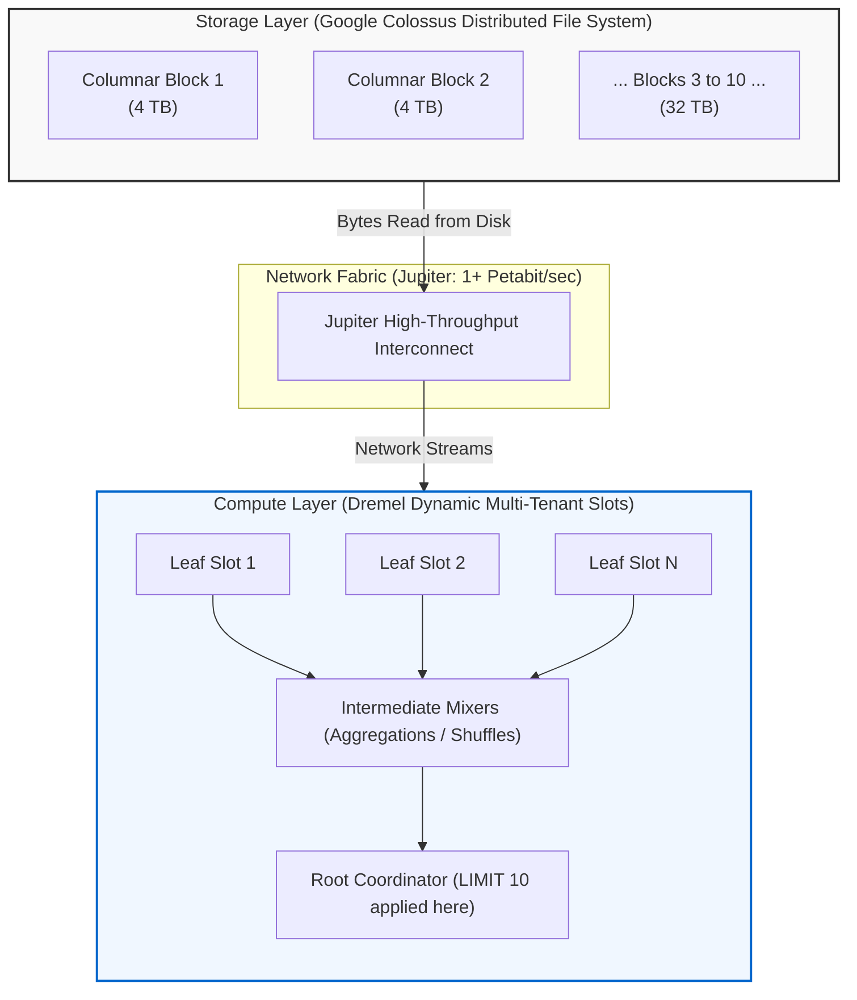
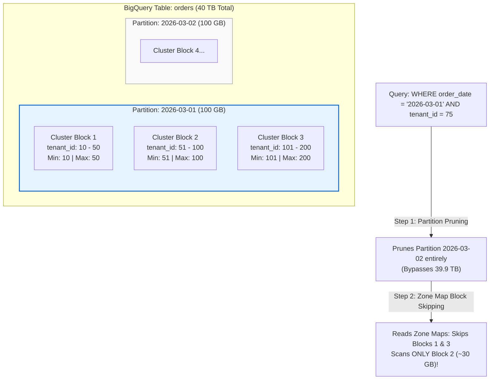

# BigQuery Table Partitioning, Partition Pruning & Cost Economics

A comprehensive technical reference on BigQuery table partitioning, the mechanics of partition pruning, storage-compute decoupling, and how to prevent catastrophic runaway query costs.

> Runaway Query is a query that scans more data than expected, leading to high costs and slow performance.

---

## 1. The Core Economics: Why Unpartitioned Queries Cost Hundreds of Dollars

In traditional relational databases (e.g., PostgreSQL, MySQL), an unindexed full table scan degrades query latency and spikes local CPU utilization, but does **not** directly generate variable charges on your cloud bill.

In BigQuery's **On-Demand compute model**, query billing is directly decoupled from execution time and provisioned hardware. Instead, you are billed strictly for the **volume of raw bytes read from storage** by the columns referenced in your SQL statement.

### 1.1 The Math Behind the $250 / 40 TB Query

The standard Google Cloud BigQuery on-demand pricing rate is:
$$\mathbf{\$6.25 \text{ per TB scanned}}$$
_(First 1 TB per month is free per billing account)._

If a backend service or analyst triggers a full scan across an unpartitioned 40 TB table:

$$\text{Total Cost} = 40 \text{ TB} \times \$6.25/\text{TB} = \mathbf{\$250.00 \text{ per execution}}$$

If an automated cron job or API endpoint executes this query once every 10 minutes:

- $250 \times 6 \text{ runs/hour} = \mathbf{\$1,500 / \text{hour}}$
- In 24 hours: $\mathbf{\$36,000}$ in surprise cloud spend.

---

### 1.2 The Three Critical Misconceptions for Relational (OLTP) Engineers

Engineers coming from PostgreSQL or MySQL frequently bring relational query execution assumptions that do not hold in BigQuery:

```text
Relational (PostgreSQL) Assumption         BigQuery Reality
─────────────────────────────────────      ─────────────────────────────────────────
1. "I used a WHERE clause, so it will     -> On an unpartitioned table, BigQuery must
    use an index and scan only a few          scan EVERY storage block to evaluate
    disk pages."                              the predicate across all 40 TB.

2. "I added LIMIT 10, so the engine       -> LIMIT is evaluated AFTER the full table
    stops scanning after 10 rows."            scan and shuffle stages; 40 TB is read.

3. "SELECT * is fine because I have a     -> Capacitor is columnar. SELECT * forces
    WHERE filter."                            reading all 50+ column files from disk.
```

#### Trap 1: The `SELECT *` Columnar Storage Penalty

- BigQuery stores data in **Capacitor**, Google's proprietary columnar file format on Colossus.
- Each column is stored in separate, isolated, compressed file segments.
- Querying 2 columns out of 50 reads only the bytes for those 2 columns.
- Using `SELECT *` forces BigQuery's storage reader to open and stream **every single column's file** across the entire table, maximizing the scanned bytes to the absolute maximum table size.

#### Trap 2: The `WHERE` Clause Fallacy on Unpartitioned Tables

In PostgreSQL, an index scan traverses a B-Tree to find matching heap tuple IDs (`ctid`) and reads only the target 8 KB pages.

In BigQuery, **B-Tree indexes do not exist**. Without partitioning:

- Data is stored as an arbitrary collection of columnar blocks.
- Even with `WHERE event_date = '2026-03-01'`, the query engine has no metadata boundary to skip files.
- BigQuery must read the entire `event_date` column (plus all projected columns) across **all 40 TB** of data to evaluate whether each row matches the predicate.

#### Trap 3: The `LIMIT` Fallacy

Consider this query:

```sql
-- DANGEROUS: This STILL scans the full 40 TB and incurs $250!
SELECT *
FROM `my_project.analytics.raw_logs`
LIMIT 10;
```

In BigQuery’s distributed **Dremel** execution tree:

1. **Leaf Nodes (Slots)**: Parallel worker tasks read assigned column blocks directly from Colossus storage.
2. **Intermediate Mixers**: Aggregate and sort intermediate data.
3. **Root Coordinator**: Gathers the aggregated streams, applies the final `LIMIT 10`, and returns 10 rows to the client.

Because the `LIMIT` operation occurs at the root/mixer stage **after** the leaf slots have already pulled the data from storage, the Colossus read meter has already registered the full 40 TB scan. `LIMIT` reduces network transfer to your application, but provides **zero cost reduction**.

---

### 1.3 Architectural Cause: Decoupled Storage & Compute

The root cause of this pricing behavior is BigQuery's underlying disaggregated infrastructure:



> [!IMPORTANT]
> **The Billing Boundary**: BigQuery charges at the **Colossus-to-Dremel boundary** (where data is pulled off persistent storage over the Jupiter network into worker RAM). Once a byte leaves Colossus, you are billed for it, regardless of whether a downstream `WHERE` condition or `LIMIT` clause subsequently discards it in Dremel memory.

---

## 2. BigQuery Partitioning Internals

**Partitioning** is the physical separation of a table's data into distinct, independent storage segments based on the value of a specific column.

### 2.1 Physical Storage Layout

When a table is partitioned:

- Data is physically segregated into distinct storage segments on Colossus based on the partition key.
- BigQuery maintains **partition-level metadata** in its global catalog (metadata server), recording which Colossus file chunks belong to which partition key value.
- During query compilation, the query planner evaluates the SQL `WHERE` clause against this catalog metadata before dispatching work to leaf slots.

```text
Unpartitioned Table (40 TB)           Partitioned Table (Daily: 40 TB total, 110 GB/day)
┌───────────────────────────────┐     ┌───────────────────────┐ ┌───────────────────────┐
│ [Block 1: Jan - Dec 2026]     │     │ Partition: 2026-03-01 │ │ Partition: 2026-03-02 │
│ [Block 2: Jan - Dec 2026]     │     │ (110 GB)              │ │ (115 GB)              │
│ [Block 3: Jan - Dec 2026]     │     └───────────────────────┘ └───────────────────────┘
│ ...                           │     ┌───────────────────────┐ ┌───────────────────────┐
│ All rows interleaved          │     │ Partition: 2026-03-03 │ │ Partition: 2026-03-04 │
└───────────────────────────────┘     │ (108 GB)              │ │ (112 GB)              │
Query for 1 day = 40 TB scan ($250)   └───────────────────────┘ └───────────────────────┘
                                      Query for 1 day = 110 GB scan ($0.68) -> 99.7% savings!
```

---

### 2.2 Partitioning Types

BigQuery supports three primary partitioning strategies:

| Partitioning Strategy | Column Data Types               | Granularities                                   | Typical Use Case                                                           |
| :-------------------- | :------------------------------ | :---------------------------------------------- | :------------------------------------------------------------------------- |
| **Time-Unit Column**  | `DATE`, `DATETIME`, `TIMESTAMP` | `HOUR`, `DAY`, `MONTH`, `YEAR`                  | Event logs, transactional order dates, user activity timestamps.           |
| **Ingestion Time**    | Pseudo-column `_PARTITIONTIME`  | `HOUR`, `DAY`, `MONTH`, `YEAR`                  | Tables without a dedicated timestamp column in the schema.                 |
| **Integer Range**     | `INT64`                         | Configurable Range (`start`, `end`, `interval`) | Sharding by integer ranges (e.g., `tenant_id`, `customer_id`, `batch_id`). |

#### 1. Time-Unit Column Partitioning (Recommended)

Partitioned based on an explicit timestamp or date field in your table schema:

```sql
CREATE TABLE `my_project.analytics.user_events` (
    event_id STRING NOT NULL,
    user_id INT64 NOT NULL,
    event_type STRING,
    payload JSON,
    created_at TIMESTAMP NOT NULL
)
PARTITION BY DATE(created_at);
```

#### 2. Ingestion-Time Partitioning

When data is appended without a reliable business timestamp, BigQuery automatically tracks the arrival time in the hidden pseudo-column `_PARTITIONTIME` (or `_PARTITIONDATE`):

```sql
CREATE TABLE `my_project.analytics.raw_stream` (
    raw_payload STRING
)
PARTITION BY DATE(_PARTITIONTIME);

-- Querying ingestion-time partitioned tables:
SELECT raw_payload
FROM `my_project.analytics.raw_stream`
WHERE _PARTITIONDATE = '2026-03-01';
```

#### 3. Integer Range Partitioning

Used when partitioning by a numeric key rather than time:

```sql
CREATE TABLE `my_project.analytics.customer_transactions` (
    transaction_id STRING,
    customer_id INT64,
    amount NUMERIC
)
PARTITION BY RANGE_BUCKET(
    customer_id,
    GENERATE_ARRAY(0, 1000000, 10000) -- Starts at 0, ends at 1M, bucket size 10K items per partition
);
```

---

### 2.3 Limits, Granularities & Special Partitions

- **Maximum Partitions**: A single table can contain a maximum of **10,000 partitions**.
  - **Daily (`DAY`)**: $10,000 \text{ days} \approx 27.4 \text{ years}$ of data.
  - **Hourly (`HOUR`)**: $10,000 \text{ hours} \approx 416 \text{ days}$ of data.
  - **Monthly (`MONTH`)**: $10,000 \text{ months} \approx 833 \text{ years}$ of data.
  - _Engineering Rule_: For tables retaining data for more than 1 year, avoid hourly partitioning to prevent hitting the 10,000 limit.
- **Special System Partitions**:
  - `__NULL__`: Captures rows where the partition column contains `NULL`.
  - `__UNPARTITIONED__`: Captures data with timestamps earlier than 1960-01-01, later than 2159-12-31, or integers outside the defined `RANGE_BUCKET`.

---

## 3. Partition Pruning Mechanics

**Partition Pruning** is the process where BigQuery's query planner analyzes filter conditions in the `WHERE` clause and completely excludes unreferenced partition directories before any data is read from Colossus.

### 3.1 Pruning in Action

```sql
-- Target Query:
SELECT user_id, event_type
FROM `my_project.analytics.user_events`
WHERE DATE(created_at) = '2026-03-01';
```

1. The SQL parser resolves `DATE(created_at) = '2026-03-01'`.
2. Dremel consults the table metadata catalog: _Only partition `2026-03-01` matches_.
3. All other ~3,999 partitions are **pruned**.
4. Leaf slots are assigned **only** the Capacitor files mapped to partition `2026-03-01`.
5. Only ~110 GB is scanned instead of 40 TB. Cost drops from **$250.00** to **$0.68**.

---

### 3.2 Static vs. Dynamic Partition Pruning

#### Static Partition Pruning

Occurs at query planning time when filter predicates use constant literals:

```sql
WHERE created_at >= '2026-03-01 00:00:00' AND created_at < '2026-03-08 00:00:00'
```

BigQuery knows the exact bytes to scan **before execution begins** (accurately reflected in `dryRun`).

#### Dynamic Partition Pruning

Occurs at query execution time when partition filters depend on the results of a subquery or join:

```sql
SELECT t.user_id, t.amount
FROM `my_project.analytics.transactions` t
WHERE DATE(t.created_at) = (
    SELECT MAX(DATE(report_date)) FROM `my_project.analytics.batch_reports`
);
```

BigQuery first executes the subquery, determines the scalar result, and dynamically skips partitions for the outer table during stage execution.

---

### 3.3 Pitfalls That Break Partition Pruning

A single anti-pattern in a SQL query can accidentally disable partition pruning, triggering a silent full table scan:

#### Pitfall 1: Modifying the Partition Column with Complex Expressions

When the partition column is wrapped in non-standard scalar expressions, the optimizer cannot map the expression back to partition keys:

```sql
-- ❌ BAD: Wraps column in arithmetic; disables partition pruning
SELECT COUNT(1)
FROM `my_project.analytics.user_events`
WHERE TIMESTAMP_ADD(created_at, INTERVAL 2 DAY) = '2026-03-03 00:00:00';

-- ✅ GOOD: Keeps the partition column isolated on one side of the operator
SELECT COUNT(1)
FROM `my_project.analytics.user_events`
WHERE created_at = TIMESTAMP_SUB('2026-03-03 00:00:00', INTERVAL 2 DAY);
```

#### Pitfall 2: Timezone Mismatch and Implicit Casts

When a table is partitioned by `DATE(created_at)` (which assumes UTC by default):

```sql
-- ❌ RISKY: Comparing with civil date without explicit UTC casting
SELECT * FROM `my_project.analytics.user_events`
WHERE DATE(created_at, "America/New_York") = '2026-03-01';
-- The partition key was generated using UTC. Calling DATE with a non-UTC timezone
-- forces BigQuery to read adjacent UTC partitions to evaluate boundary overlaps.

-- ✅ GOOD: Explicitly filter against the exact UTC partition column
SELECT * FROM `my_project.analytics.user_events`
WHERE DATE(created_at) = '2026-03-01';
```

---

## 4. Partitioning vs. Clustering

While partitioning provides **coarse-grained physical division** (by day/month), **Clustering** provides **fine-grained block-level ordering** inside each partition.



### Architectural Comparison

| Attribute           | Partitioning                                 | Clustering                                                    |
| :------------------ | :------------------------------------------- | :------------------------------------------------------------ |
| **Granularity**     | Coarse segments (Day, Month, Hour)           | Fine-grained file blocks (Capacitor chunks)                   |
| **Mechanic**        | Catalog metadata directory mapping           | **Zone Maps** (min/max column values stored in block headers) |
| **Max Columns**     | Exactly **1 column**                         | Up to **4 columns** (order of columns matters!)               |
| **Cost Estimation** | Exact bytes scanned known upfront (`dryRun`) | Exact bytes scanned determined dynamically during execution   |
| **Cardinality**     | Low to medium (< 10,000 distinct values)     | High to low (e.g., `user_id`, `uuid`, `status`)               |
| **Maintenance**     | Automatic partition creation on insert       | Automatic background re-clustering by Google slots            |

---

## 5. Engineering Cost Guardrails & Production Protections

To protect your organization from accidental multi-hundred-dollar queries, enforce these three production guardrails:

### 5.1 Enforce `require_partition_filter = true`

Configure the table schema so that any query omitting a partition filter in the `WHERE` clause is **rejected immediately** before executing:

```sql
-- Set during table creation:
CREATE TABLE `my_project.analytics.user_events` (
    event_id STRING,
    created_at TIMESTAMP
)
PARTITION BY DATE(created_at)
OPTIONS (
    require_partition_filter = true
);

-- Or update an existing table:
ALTER TABLE `my_project.analytics.user_events`
SET OPTIONS (
    require_partition_filter = true
);
```

If an engineer or dashboard executes:

```sql
SELECT * FROM `my_project.analytics.user_events`;
```

BigQuery rejects the query with:
`Cannot query over table without a filter that is evaluated when the query is planned...`

---

### 5.2 Set `maximum_bytes_billed` in SDK Clients

In application code, configure a hard circuit breaker on every query job. If the query optimizer estimates that scanned bytes exceed this threshold, BigQuery aborts execution with zero cost:

```python
from google.cloud import bigquery

client = bigquery.Client()

# Set hard ceiling: 50 GB maximum (~$0.31)
job_config = bigquery.QueryJobConfig(
    maximum_bytes_billed=50 * 1024 * 1024 * 1024
)

sql = """
    SELECT user_id, COUNT(1)
    FROM `my_project.analytics.user_events`
    WHERE DATE(created_at) BETWEEN '2026-03-01' AND '2026-03-07'
    GROUP BY user_id
"""

try:
    query_job = client.query(sql, job_config=job_config)
    results = query_job.result()
except Exception as e:
    # Triggers: Query exceeded limit for bytes billed
    print(f"Query aborted to protect budget: {e}")
```

---

### 5.3 Automated Pre-Flight Cost Validation (`dryRun`)

Use `dryRun` in your backend or CI/CD pipelines to calculate the exact cost before executing queries:

```python
job_config = bigquery.QueryJobConfig(dry_run=True, use_query_cache=False)
query_job = client.query(sql, job_config=job_config)

bytes_scanned = query_job.total_bytes_processed
cost_usd = (bytes_scanned / (1024**4)) * 6.25

print(f"Pre-flight Check: {bytes_scanned / (1024**3):.2f} GB | Cost: ${cost_usd:.4f}")
```

---

### 5.4 Automatic Data Lifecycle: Partition Expiration

Reduce ongoing storage costs by automatically deleting old partitions:

```sql
-- Automatically drop partitions older than 90 days:
ALTER TABLE `my_project.analytics.user_events`
SET OPTIONS (
    partition_expiration_days = 90
);
```

---

## 6. Inspecting Partitions via `INFORMATION_SCHEMA`

Monitor partition storage, row counts, and data skew using system views:

```sql
SELECT
    partition_id,
    total_rows,
    ROUND(total_logical_bytes / (1024 * 1024 * 1024), 2) AS size_gb,
    last_modified_time
FROM `my_project.analytics.INFORMATION_SCHEMA.PARTITIONS`
WHERE table_name = 'user_events'
ORDER BY partition_id DESC
LIMIT 30;
```

---

## 7. Summary Reference Checklist

1. **Never leave tables over 10 GB unpartitioned** if they have a date, timestamp, or integer filtering dimension.
2. **Always enable `require_partition_filter = true`** on high-volume production tables.
3. **Always set `maximum_bytes_billed`** in backend SDK clients to prevent rogue queries from generating multi-hundred-dollar invoices.
4. **Combine Partitioning with Clustering**: Partition by time/date (coarse pruning), cluster by high-cardinality foreign keys (`tenant_id`, `user_id`, `status`).
5. **Remember that `LIMIT` does not reduce scanned bytes** in BigQuery's decoupled architecture.
