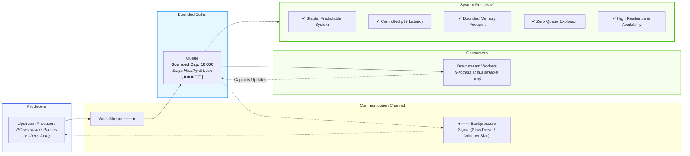
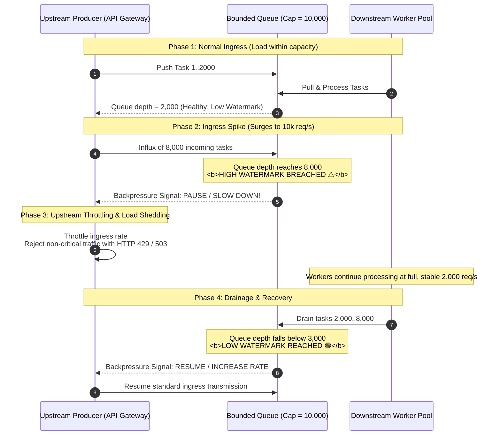
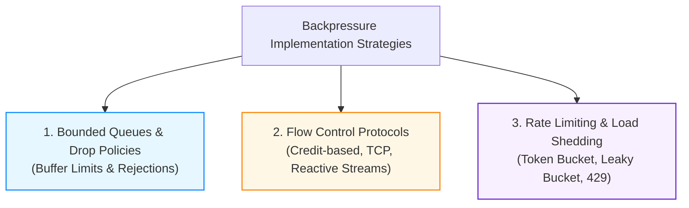
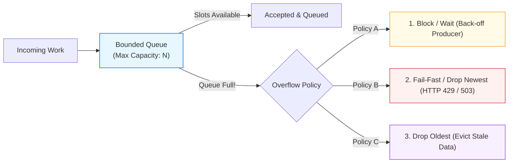
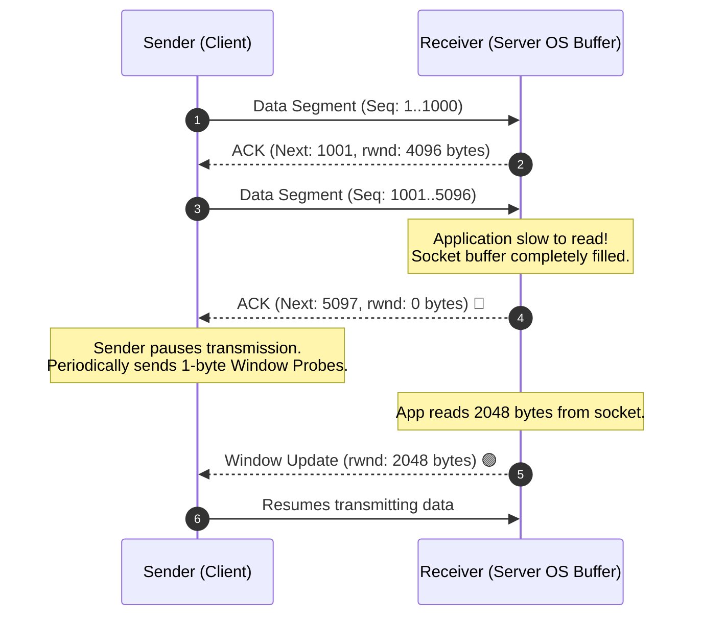
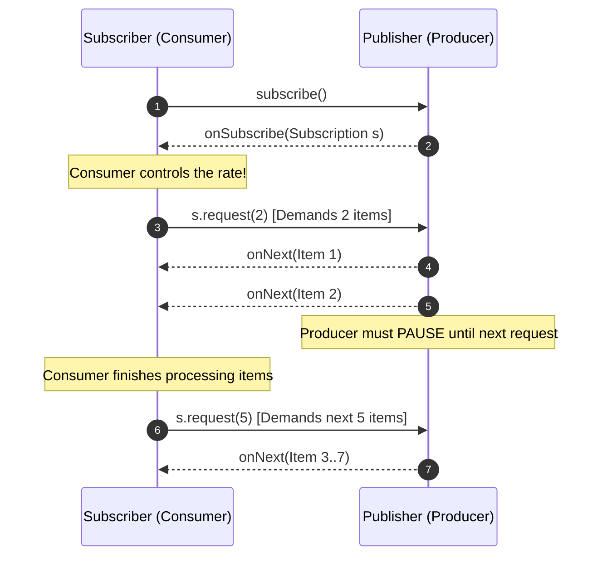
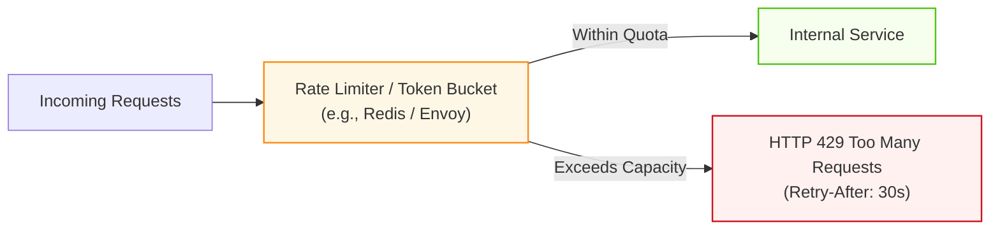
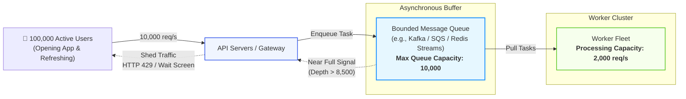
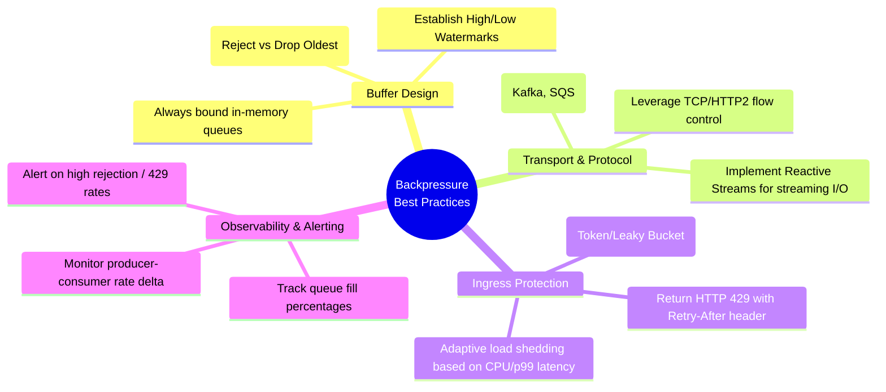

# Backpressure in Distributed Systems

**Backpressure** is a fundamental design pattern and flow-control mechanism that prevents a system from being overwhelmed when upstream **producers generate work faster than downstream consumers can process it** ($\lambda_{\text{in}} > \mu_{\text{out}}$).

Rather than allowing unhandled requests to accumulate indefinitely in memory—which inevitably causes memory exhaustion, skyrocketing latency, and cascading system failure—backpressure introduces **reverse feedback signals** that force producers to slow down, pause, or shed load to match downstream processing capacity.

> **Guiding Principle**: _"A slower, stable system is infinitely better than a faster, crashed one."_

---

## 1. The Core Issue: The Producer-Consumer Rate Mismatch

In distributed architectures, microservices, and event-driven pipelines, components rarely operate at identical throughputs. When producers operate unconstrained without a feedback loop, the system experiences **unbounded buffer growth**.

```mermaid
flowchart LR
    subgraph Producers ["1. Fast Producers"]
        P1["API Clients / Users"]
        P2["Microservices"]
        P3["IoT / Webhooks"]
    end

    subgraph Pipeline ["2. Unbounded Queue"]
        Q["Queue / Memory Buffer<br/><b>Keeps Growing... ⚠️</b><br/>[ ■ ■ ■ ■ ■ ■ ■ ■ ■ ■ ... ]"]
    end

    subgraph Consumers ["3. Slow Consumers"]
        C1["Worker Pool"]
        C2["Database Writes"]
        C3["Third-Party APIs"]
    end

    subgraph ImpactArea ["System Impacts 💥"]
        direction TB
        I1["❌ Unbounded Queue Growth"]
        I2["❌ Latency Explosion (Queuing Delay)"]
        I3["❌ Memory Exhaustion (OOM Crashes)"]
        I4["❌ CPU Context Switching & GC Pauses"]
        I5["❌ Cascading Timeouts & Retry Storms"]
    end

    Producers -->|"Generate Requests (Fast)<br/>λ = 10,000 req/s"| Pipeline
    Pipeline -->|"Process Requests (Slower)<br/>μ = 2,000 req/s"| Consumers
    Pipeline -.->|"Memory Saturation"| ImpactArea

    style Producers fill:#f0f5ff,stroke:#2f54eb,stroke-width:1.5px
    style Pipeline fill:#fff1f0,stroke:#cf1322,stroke-width:2px
    style Consumers fill:#f6ffed,stroke:#52c41a,stroke-width:1.5px
    style ImpactArea fill:#fffbe6,stroke:#fa8c16,stroke-width:2px
```



### Anatomy of a Cascading Outage (Without Backpressure)

When arrival rate ($\lambda$) consistently exceeds service rate ($\mu$), the system enters a failure cascade governed by queueing theory:

```
Arrival Rate (λ = 10,000 req/s)  >>>  Service Rate (μ = 2,000 req/s)
Rate of Accumulation = λ - μ = +8,000 requests/second
```

1. **Queue Accumulation & Buffer Bloat**:

   - Because the queue is unbounded (or excessively large), requests sit waiting for available worker threads. In just 10 seconds of peak traffic, 80,000 requests accumulate in RAM.
1. **Exponential Latency Deterioration (Little's Law)**:

   - According to Little's Law ($L = \lambda W$), as queue length ($L$) grows, average wait time ($W$) balloons from milliseconds to tens of seconds:

     $$
     W = \frac{L}{\mu}
     $$
   - Even though each request only takes 10ms of CPU time to process, it spends 40+ seconds waiting in line.
1. **Memory Exhaustion & JVM / Runtime Crash (OOM)**:

   - Every buffered request holds allocated memory (headers, payload payloads, context structures). Memory usage ramps up until the OS kernel triggers an **Out-Of-Memory (OOM) Killer** invocation or runtime GC thrashing stops all execution threads.
1. **The Client Retry Storm (Death Spiral)**:

   - Upstream clients reach their HTTP connection timeouts (e.g., 5 seconds) and terminate the socket.
   - Automated client retry policies fire 2 to 3 duplicate requests, further multiplying $\lambda_{\text{in}}$.
   - Downstream workers waste precious CPU cycles processing requests whose clients have already timed out and disconnected.
   - For database-backed systems, this frequently exhausts connection pools and locks up transactions (see [PostgreSQL Connection Pooling](<file:///c:/Users/Lyzander%20Andrylie/Documents/(5)%20Note/software-engineer/concept/postgres/connection_pool.md>)).

---

## 2. The Solution: Operating With Backpressure

Backpressure establishes a **bidirectional communication channel**. Consumers communicate their real-time available capacity back up the stack to producers, creating a self-regulating, closed-loop control system.



### Lifecycle Timeline: High-Watermark and Low-Watermark Signaling



---

## 3. How to Implement Backpressure

There are three primary architectural mechanisms used across modern engineering stacks to enforce backpressure:



---

### Strategy 1: Bounded Queues & Overflow Policies

The simplest and most vital backpressure rule is: **Never use unbounded in-memory queues in production.**

A bounded queue enforces a hard ceiling on the number of elements it can hold in memory. When the queue reaches capacity, it must execute an explicit **overflow policy**:



1. **Block / Synchronous Wait**:

   - The enqueueing thread is suspended until downstream workers drain an item.
   - _Use Case_: Internal thread pools (e.g., Go channels without `default`, Java `ArrayBlockingQueue.put()`).
   - _Drawback_: Upstream threads remain blocked, which can propagate thread exhaustion upstream.
1. **Drop Newest / Fail-Fast (Drop-Tail)**:

   - When the queue is full, incoming items are immediately rejected with an explicit error code (e.g., HTTP `429 Too Many Requests` or `503 Service Unavailable`).
   - _Use Case_: REST APIs and public microservice gateways. Allows clients to gracefully fail or retry after a backoff window.
1. **Drop Oldest (Head-Drop)**:

   - Evicts the oldest unprocessed item at the front of the queue to make room for fresh data.
   - _Use Case_: Real-time telemetries, stock tickers, sensor metrics, and live video streaming where old data is obsolete.

#### Code Pattern (Go Buffered Channel with Non-Blocking Rejection)

```go
type WorkPool struct {
    tasks chan Task
}

func NewWorkPool(capacity int) *WorkPool {
    return &WorkPool{
        tasks: make(chan Task, capacity), // Bounded capacity
    }
}

// Submit enqueues work or applies immediate backpressure
func (p *WorkPool) Submit(t Task) error {
    select {
    case p.tasks <- t:
        // Enqueued successfully
        return nil
    default:
        // Queue is full: apply backpressure immediately (Fail-Fast)
        return ErrQueueFull // Caller returns HTTP 429 Too Many Requests
    }
}
```

---

### Strategy 2: Protocol-Level Flow Control

Rather than discarding requests, modern protocols negotiate throughput dynamically between endpoints.

#### A. TCP Sliding Window Flow Control

- Every TCP packet includes a **Receive Window (`rwnd`)** field in its header.
- The receiver advertises how many bytes of buffer space it currently has available in its OS socket buffer.
- If the receiving application is slow to read from the socket, its kernel buffer fills up and it advertises `rwnd = 0` (**Zero Window**).
- The sender OS TCP stack immediately suspends transmitting data packets until a non-zero window update is acknowledged.



#### B. HTTP/2 & gRPC Stream Windowing

- Built atop HTTP/2 framing, gRPC supports flow control on both a **per-stream** and **per-connection** basis using `WINDOW_UPDATE` frames.
- This prevents a single heavy multiplexed RPC stream from starving or overwhelming the entire shared TCP connection.

#### C. Reactive Streams (Dynamic Pull Model)

Traditional systems push data from producer to consumer. Reactive Streams (**Project Reactor**, **RxJava**, **Akka Streams**) invert this into a **demand-driven pull model**:



---

### Strategy 3: Upstream Rate Limiting & Load Shedding

Rate limiting acts as an outer perimeter defense, shielding internal queues from unmanageable traffic bursts.



- **Token Bucket / Leaky Bucket**:
    - Accumulates tokens at a steady rate. Traffic bursts are permitted up to the bucket capacity; sustained volume exceeding the refill rate is immediately rejected.
- **Adaptive Load Shedding (CoDel / Latency-Based)**:
    - Instead of fixed request-per-second thresholds, the system monitors internal metrics (CPU utilization, event-loop lag, or queue delay).
    - If p90 processing delay exceeds 200ms, the gateway preemptively drops lower-priority requests at the ingress boundary before they consume backend resources.

---

## 4. Real-World Architecture Example

Consider a high-throughput mobile application ingress pipeline during a major product launch:



### Operational Behavior During Peak Traffic:

1. **Traffic Surge**:

   - Clients generate a sustained burst of **10,000 req/s**.
   - Downstream workers can only consume **2,000 req/s** due to third-party API rate limits and database write throughput.
1. **Buffer Utilization**:

   - The bounded queue begins absorbing the excess traffic.
   - At a surplus rate of $+8,000\text{ req/s}$, the queue reaches its high-watermark threshold (8,500 items) in just over 1 second.
1. **Backpressure Triggered**:

   - The queue signals the API servers that capacity is nearly exhausted.
   - The API Gateway immediately throttles ingress:
       - New requests are either held briefly in a short client-side backoff or returned an immediate `HTTP 429 (Too Many Requests)` with a `Retry-After: 5` header.
       - Mobile clients display an elegant "High demand—please wait a moment" UI banner instead of hanging indefinitely on a blank loading spinner.
1. **Outcome**:

   - Downstream databases and worker services remain 100% stable at their peak efficiency (2,000 req/s).
   - Memory usage remains bounded, CPU thrashing is prevented, and no services crash.

---

## 5. Comparison of Backpressure Mechanisms

| Mechanism                      | Operating Layer             | Action When Saturated                             | Latency Impact                              | Key Advantage                                       | Typical Trade-off                                               |
| :----------------------------- | :-------------------------- | :------------------------------------------------ | :------------------------------------------ | :-------------------------------------------------- | :-------------------------------------------------------------- |
| **Bounded Queue (Fail-Fast)**  | Application / In-Memory     | Rejects incoming task immediately (HTTP 429/503)  | Zero wait time added                        | Prevents OOM crashes completely                     | Requires upstream callers to handle error / retries             |
| **Bounded Queue (Block/Wait)** | Application / Thread Pool   | Suspends producer thread until space frees up     | Latency increases proportionally            | Easy to implement inside single process             | Upstream caller threads can become exhausted                    |
| **TCP Sliding Window**         | Transport Layer (L4)        | Shrinks `rwnd` to 0; pauses sender OS socket      | Transmission pauses                         | Fully automated by OS kernel                        | Operates per socket; no business-logic granularity              |
| **Reactive Streams (Pull)**    | Application / Microservices | Subscriber asks for $N$ items via demand requests | Controlled, predictable latency             | Fine-grained, zero dropped items                    | Requires end-to-end reactive framework adoption                 |
| **Token Bucket Rate Limiting** | API Gateway / Edge          | Drops or queues requests outside quota            | Predictable for allowed traffic             | Smooths out spikes before internal systems          | Requires distributed state (e.g. Redis) for cluster-wide limits |
| **Adaptive Load Shedding**     | Reverse Proxy / Ingress     | Drops non-critical requests based on latency/CPU  | Keeps p99 latency flat for accepted traffic | Protects systems from unexpected catastrophic loads | Sacrifices low-priority transactions during crises              |

---

## 6. Best Practices Mindmap & Implementation Checklist



### Production Readiness Checklist

- [x] **No Unbounded Buffers**: Verify that every queue, channel, executor service, and message buffer has a hard maximum capacity.
- [x] **Explicit Drop Policies**: Ensure every bounded queue has a defined overflow strategy (`Block`, `Drop-Newest`, or `Drop-Oldest`).
- [x] **Fail Fast at Ingress**: Return HTTP `429 Too Many Requests` or `503 Service Unavailable` with `Retry-After` headers when ingress limits are breached.
- [x] **Client-Side Exponential Backoff & Jitter**: Upstream clients must use randomized jittered backoff on 429/503 responses to prevent synchronized retry storms.
- [x] **Pull-Based Message Consumption**: For background asynchronous processing, prefer pull models (e.g., Kafka `poll()`, AWS SQS `ReceiveMessage`) over unconstrained push webhooks.
- [x] **End-to-End Timeouts**: Enforce strict deadlines/timeouts on all in-flight requests so cancelled operations are dropped rather than processed.
- [x] **Queue Depth & Lag Observability**: Set up Prometheus/Grafana metrics monitoring consumer lag ($\lambda - \mu$) and queue saturation percentages.

---

## 7. Key Takeaways

1. **The Core Imbalance**: Backpressure is required whenever work generation rate exceeds work processing rate ($\lambda_{\text{in}} > \mu_{\text{out}}$).
2. **Buffering Only Delays the Inevitable**: Queues smooth out short temporary spikes; they **cannot** fix sustained throughput deficits. Unbounded queues will always exhaust memory and crash the host.
3. **Preserve System Health Over Total Ingestion**: Rejecting or slowing down 15% of requests to ensure 85% succeed with low latency is vastly superior to accepting 100% and crashing the entire platform.
4. **Implement at Multiple Layers**: Combine edge rate limiting, bounded internal buffers, protocol-level flow control, and pull-based worker pools to achieve end-to-end resilience.