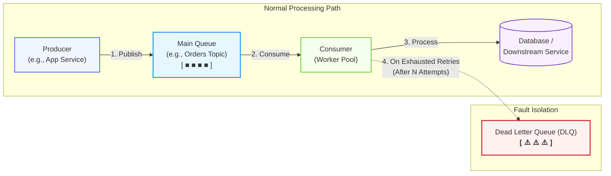
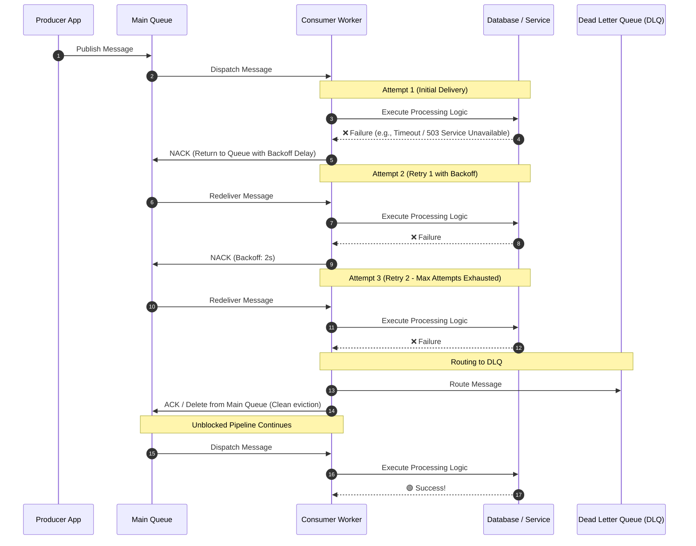
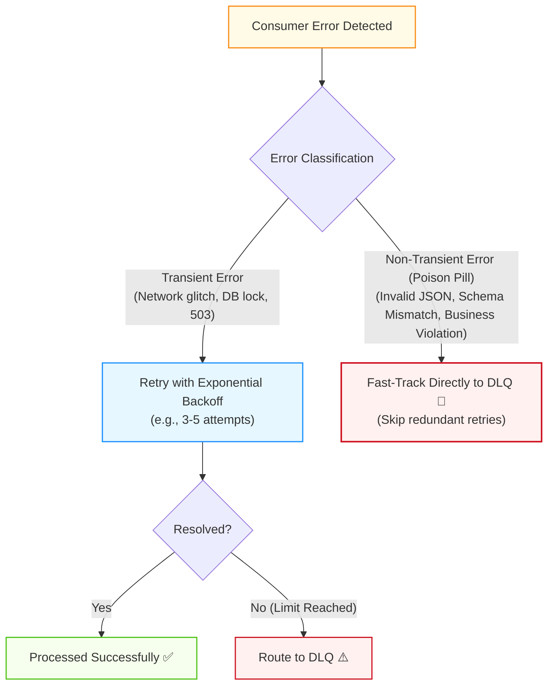
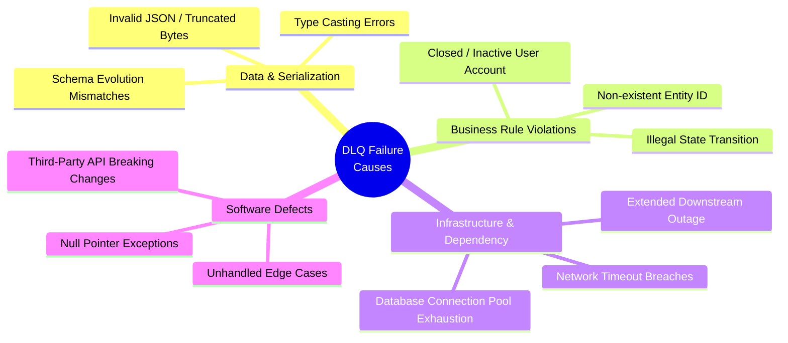
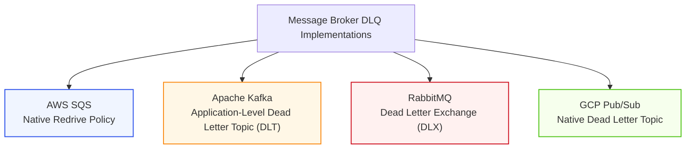

# Dead Letter Queue (DLQ) in Distributed Systems

A **Dead Letter Queue (DLQ)** is a specialized secondary message queue designed to isolate, store, and retain messages that **cannot be processed successfully** by downstream consumers after exhausting designated retry thresholds.

By segregating unprocessable messages (commonly known as **"poison pills"**) from the primary message flow, a DLQ protects distributed architectures from Head-of-Line (HoL) blocking, prevents consumer crash loops, and preserves valuable payload data for debugging and subsequent reprocessing.

> **Guiding Principle**: _"Isolate the bad without blocking the good, and never discard data you might need to diagnose or reprocess."_

---

## 1. Why Do We Need a DLQ? (The Poison Pill Problem)

In asynchronous, event-driven architectures, messages flow continuously from producers to consumers through message brokers (e.g., Apache Kafka, AWS SQS, RabbitMQ, Google Cloud Pub/Sub).

When a consumer encounters a malformed or unprocessable message without a DLQ mechanism in place:

1. The consumer fails to process the message and rejects or negative-acknowledges (`NACK`) it.
2. The broker returns the message to the front of the main queue.
3. The consumer picks up the exact same bad message again, fails immediately, and repeats the cycle indefinitely.

### Core Benefits of a DLQ

| Benefit                                        | Description                                                                                                   | Impact                                                                                                                                                                                                          |
| :--------------------------------------------- | :------------------------------------------------------------------------------------------------------------ | :-------------------------------------------------------------------------------------------------------------------------------------------------------------------------------------------------------------- |
| **Prevents Head-of-Line (HoL) Blocking**       | Stops a single corrupted message from stalling the entire queue partition or worker thread pool.              | Preserves steady system throughput ($\mu$) and prevents artificial [backpressure](file:///c:/Users/Lyzander%20Andrylie/Documents/%285%29%20Note/software-engineer/concept/distributed-systems/backpressure.md). |
| **Prevents Consumer Crash Loops**              | Shields workers from infinite runtime panic loops (e.g., unhandled `NullPointerException`, memory leaks).     | Maintains high worker availability and prevents cascade failures.                                                                                                                                               |
| **Enables Forensic Root Cause Analysis (RCA)** | Retains the exact message payload along with diagnostic headers (stack trace, attempt count, exception type). | Allows engineering teams to reproduce bugs without searching through gigabytes of logs.                                                                                                                         |
| **Safe Reprocessing & Replay**                 | Provides a buffer where fixed messages can be safely redriven back to the primary pipeline.                   | Guarantees zero data loss for business-critical transactions (e.g., payments, order fulfillment).                                                                                                               |

---

## 2. How It Works: The Failure and Retry Lifecycle

A well-architected DLQ pattern does not send a message directly to the dead-letter queue upon the very first transient error. Instead, it follows a structured lifecycle involving **transient error retries**, **exponential backoff**, and **final dead-letter routing**.

### Detailed Lifecycle Stages

1. **Initial Consumption**: The consumer polls or receives a message from the main queue.
2. **Execution & Failure**: The processing logic fails (e.g., database constraint error, network timeout, or schema mismatch).
3. **Retry with Exponential Backoff & Jitter**:
   - The message is scheduled for retry with an increasing backoff window ($2^n \times \text{delay} + \text{jitter}$) to prevent hammering recovering dependencies.
4. **Retry Threshold Breach**:
   - If the message continues failing and reaches the maximum delivery attempt limit (typically $3$ to $5$ attempts), it is classified as unprocessable.
5. **Diverting to DLQ**:
   - The broker or consumer moves the message to the DLQ, attaching metadata headers (failure timestamp, error message, stack trace, original queue name).
6. **Main Queue Acknowledgment**:
   - The message is acknowledged (`ACK`) or deleted from the main queue, allowing the consumer to immediately pick up subsequent healthy messages.

### Transient vs. Non-Transient Failures

Not all errors should follow the full retry cycle. Distinguishing between error types optimizes system resources:

---

## 3. Common Causes for Messages Landing in a DLQ

Understanding why messages land in a dead-letter queue helps teams categorize system failures into actionable buckets:

1. **Invalid Data / Schema Mismatch**:
   - A producer releases a new payload version containing an unexpected field type or missing required keys before consumer code has been updated.
2. **Deserialization / Parsing Errors**:
   - Corrupted payloads, truncated strings, or encoding differences (e.g., UTF-8 vs. Latin-1) that prevent deserialization into application data structures.
3. **Downstream Dependency Outages**:
   - A downstream microservice, payment gateway, or database is down longer than the consumer's total retry window.
4. **Business Rule Violations**:
   - Semantic inconsistencies that cannot succeed without manual intervention (e.g., attempting to process a refund for an order that was never paid).
5. **Unhandled Code Exceptions & Bugs**:
   - Software regressions, out-of-bounds array access, or unhandled null references inside consumer handlers.

---

## 4. The DLQ Post-Failure Workflow: Inspect, Analyze, Fix, Reprocess

A Dead Letter Queue is **not a trash can** or a black hole where messages go to die; it is a temporary holding pen that requires active triage and operational resolution:

```mermaid
flowchart LR
    DLQ["1. Dead Letter Queue<br/><b>[ ⚠️ ⚠️ ⚠️ ]</b>"] -->|"Inspect & Alert"| Monitor["2. Monitor & Analyze<br/>• Root Cause Analysis<br/>• Bug vs. Bad Data?<br/>• Downstream Outage?"]

    Monitor -->|"Hotfix / Schema Migration"| Remediation["3. Fix & Remediate<br/>• Deploy Code Patch<br/>• Fix Downstream Service<br/>• Sanitize Payload Data"]

    Remediation -->|"Redrive / Replay"| Reprocess["4. Reprocessing Engine<br/>• Safe Replay Tool<br/>• Re-publish to Main Queue"]

    Reprocess -->|"Successful Execution"| Success["5. Processed<br/>Successfully ✔"]

    style DLQ fill:#fff1f0,stroke:#cf1322,stroke-width:2px
    style Monitor fill:#fffbe6,stroke:#fa8c16,stroke-width:1.5px
    style Remediation fill:#e6f7ff,stroke:#1890ff,stroke-width:1.5px
    style Reprocess fill:#f9f0ff,stroke:#722ed1,stroke-width:1.5px
    style Success fill:#f6ffed,stroke:#52c41a,stroke-width:2px
```

### The 4 Stages of DLQ Remediation

1. **Inspect & Monitor**:
   - Automated monitoring alarms fire when DLQ depth exceeds zero ($\text{QueueDepth} > 0$).
   - Engineers inspect the dead-lettered messages via administrative dashboards or CLI tools.
2. **Root Cause Analysis (RCA)**:
   - Identify whether the failure is caused by:
     - **Code bug**: Requires a software patch.
     - **External outage**: Requires waiting until downstream systems recover.
     - **Bad data**: Requires payload editing or dropping malformed requests.
3. **Remediation**:
   - Deploy code fixes to consumer pods or resolve external system bottlenecks.
4. **Reprocessing (Redrive / Replay)**:
   - Replay the messages from the DLQ back into the main queue (or a dedicated staging/replay queue) for reprocessing.

> [!IMPORTANT]
> **Idempotency is Non-Negotiable**: Because messages sent to a DLQ may have partially succeeded before failing during earlier retry attempts, downstream handlers **must be idempotent**. Reprocessing must not result in duplicate billing, multiple email notifications, or duplicate database records.

---

## 5. DLQ Implementation Across Major Message Brokers

Different messaging technologies implement the dead-letter pattern using distinct architectural mechanisms:

| Broker           | DLQ Mechanism              | How It Works                                                                                                                                                                                                                    | Native Redrive Support                                                         |
| :--------------- | :------------------------- | :------------------------------------------------------------------------------------------------------------------------------------------------------------------------------------------------------------------------------ | :----------------------------------------------------------------------------- |
| **AWS SQS**      | Native Redrive Policy      | Configured on the source queue via `RedrivePolicy`. After `maxReceiveCount` deliveries without a successful `DeleteMessage`, SQS automatically moves the item to `deadLetterTargetArn`.                                         | **Yes**: Native 1-click or API Redrive to Source Queue.                        |
| **Apache Kafka** | Dead Letter Topic (DLT)    | Kafka brokers have no built-in DLQ concept. Consumers (e.g., Spring Kafka `@DltHandler`, Kafka Streams) catch unhandled exceptions in consumer code and publish the message to a `<topic>-dlt` topic before committing offsets. | **Manual / Custom**: Implemented via consumer redrive tools or Kafka Connect.  |
| **RabbitMQ**     | Dead Letter Exchange (DLX) | Configured using the queue argument `x-dead-letter-exchange`. Messages routed when rejected with `requeue=false`, or when message TTL expires or queue length limits are reached.                                               | **Via Plugins / Tools**: Handled via RabbitMQ Shovel plugin or custom scripts. |
| **GCP Pub/Sub**  | Dead Letter Topics         | Configured on the subscription via `DeadLetterPolicy` with `maxDeliveryAttempts`. Pub/Sub writes failed messages to the designated topic after reaching the attempt threshold.                                                  | **Yes**: Native Cloud Console / CLI redrive capability.                        |

---

## 6. Best Practices & Antipatterns

### Production Best Practices

- [x] **Set Explicit Retry Limits (3–5 Attempts)**: Never allow unbounded retries on the main queue. A small threshold gives transient glitches room to recover without delaying poison pill detection.
- [x] **Use Exponential Backoff with Jitter**: Prevent synchronized thundering herd spikes on downstream databases by randomizing retry intervals.
- [x] **Enrich Messages with Diagnostic Headers**: Always append critical debugging metadata before writing to the DLQ:
  - `x-exception-message`: Brief description of the failure reason.
  - `x-exception-stacktrace`: Full error stack trace.
  - `x-original-queue`: The origin queue or topic name.
  - `x-retry-count`: Total number of failed attempts.
  - `x-failed-timestamp`: Precise ISO timestamp of the final failure.
- [x] **Set Alerts on DLQ Depth**: DLQs should remain near zero. Configure PagerDuty / CloudWatch / Prometheus alerts when message depth rises above zero or breaches a safety threshold.
- [x] **Set Adequate DLQ Retention Periods**: Ensure DLQ message retention (e.g., SQS 14-day retention) is long enough to permit weekend or holiday investigation before messages expire.
- [x] **Design for Automated or Push-Button Redrive**: Have a documented, automated, or single-click runbook for replaying messages once bugs are resolved.

### Critical Antipatterns to Avoid

> [!WARNING]
> **Common Antipatterns That Cause Outages**:
>
> 1. **The "Black Hole" DLQ**: Directing messages to a DLQ without metrics, alerting, or ownership. Messages silently accumulate until retention expires, resulting in unrecoverable data loss.
> 2. **Infinite Main Queue Retries**: Missing a DLQ entirely, leaving unprocessable messages looping endlessly at the head of the queue, causing queue starvation and elevated latency across all consumers.
> 3. **Blind Replay without Remediation**: Triggering a DLQ redrive before fixing the underlying code bug or data defect, instantly re-poisoning the main queue.
> 4. **Retrying Non-Transient Errors**: Re-attempting schema validation or JSON parsing errors 5 times across several minutes; non-transient errors should be routed directly to the DLQ immediately.

---

## 7. Key Takeaways

> [!IMPORTANT]
>
> - **DLQ captures persistently failing messages**: Isolates poison pills after a defined number of retry attempts.
> - **Prevents Head-of-Line blocking**: Keeps the main message pipeline flowing smoothly for all healthy records.
> - **Preserves forensic context**: Retains original payload data, timestamps, and error traces for accurate root cause analysis.
> - **Enables safe recovery**: Provides an audit trail and replay target so failed business events can be reprocessed without data loss once bugs are patched.
