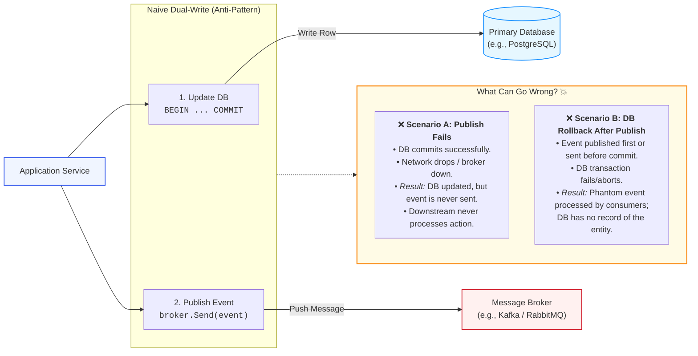
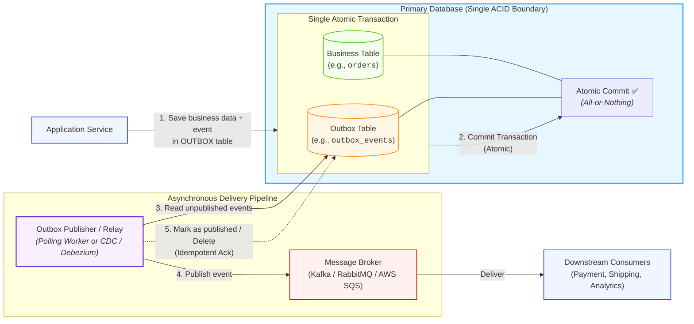
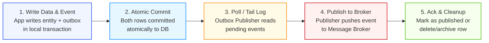
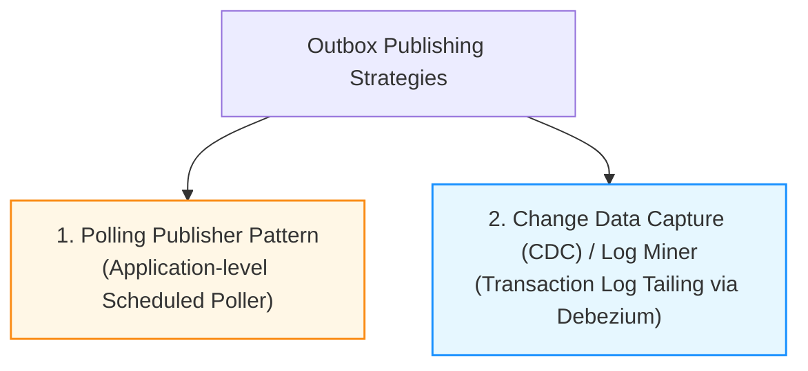
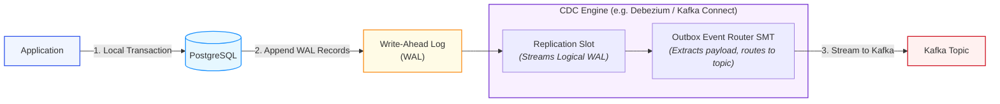
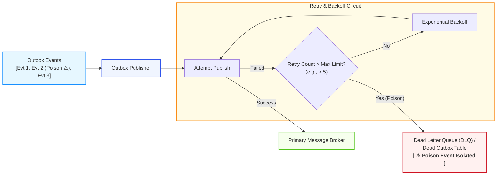
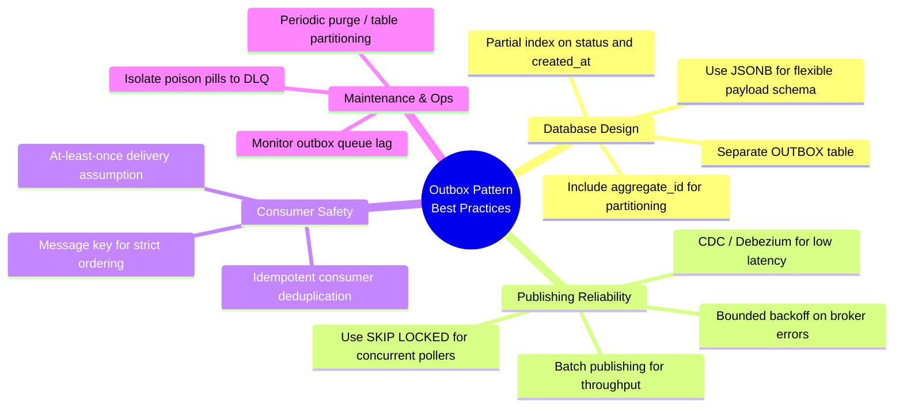

# Transactional Outbox Pattern in Distributed Systems

The **Transactional Outbox Pattern** is an architectural pattern that enables microservices and distributed applications to **reliably publish domain events and update local database state atomically**, without resorting to costly, fragile distributed transactions (such as Two-Phase Commit / 2PC).

> **Guiding Principle**: _"Never attempt a dual write across two independent distributed systems. Commit the event locally within the database transaction, then publish asynchronously."_

---

## 1. The Core Problem: The Dual-Write Problem

In event-driven architectures and microservices, an operation often requires two distinct side effects:

1. Updating local application state in the **Database** (e.g., creating an order, updating account balance).
2. Emitting an event or message to a **Message Broker** (e.g., Apache Kafka, RabbitMQ, AWS SQS) to notify downstream services.

When an application attempts to write to both systems sequentially—known as a **Dual Write**—data consistency cannot be guaranteed because networks, brokers, and processes fail independently.



### Consequences of Inconsistent State

- **Downstream Services Miss Events**: Inventory is never reserved, confirmation emails are lost, or billing pipelines fail to trigger.
- **Phantom State Execution**: Downstream consumers charge credit cards or decrement stock for an order that rolled back and was never saved in the database.
- **Why Not Two-Phase Commit (2PC / XA)?**: Distributed transactions require all participants (DB, broker, coordinator) to support XA transactions. 2PC introduces heavy lock contention, high latency, operational fragility, and creates a single point of failure if the coordinator stalls. Most modern distributed message brokers (like Kafka or SQS) do not support XA transactions.

---

## 2. The Solution: Transactional Outbox Pattern

The solution is to **eliminate the dual write**. Instead of publishing directly to the message broker during request execution, the application writes the domain event into an **Outbox Table** located inside the **same database and within the exact same ACID transaction** as the business data.

A separate, dedicated asynchronous process (**Outbox Publisher**) reads unpublished events from the outbox table and dispatches them to the message broker.



### Why the Outbox Pattern Works

| Advantage             | Technical Rationale                                                                                                                              |
| :-------------------- | :----------------------------------------------------------------------------------------------------------------------------------------------- |
| **Strict Atomicity**  | Both business mutations and event records commit or rollback together within local database transactions (ACID). No partial failure is possible. |
| **Zero Message Loss** | If the network drops or the message broker is temporarily down, the event safely resides in the persistent outbox table awaiting retry.          |
| **Decoupled Latency** | User-facing HTTP requests do not block on external broker roundtrips, partition leader elections, or network delays.                             |
| **No 2PC Overhead**   | Relies solely on native database engine consistency guarantees without distributed lock coordination.                                            |

---

## 3. Step-by-Step Flow



### Detailed Sequence Lifecycle

```mermaid
sequenceDiagram
    autonumber
    actor Client as User / API Client
    participant App as Order Service
    participant DB as PostgreSQL Database
    participant Relay as Outbox Publisher
    participant Broker as Kafka / RabbitMQ
    participant Consumer as Payment Service

    Client->>App: POST /orders (Create Order)
    activate App

    Note over App,DB: Phase 1: Local Transaction Execution
    App->>DB: BEGIN TRANSACTION;
    App->>DB: INSERT INTO orders (id, user_id, amount, status) VALUES ('ord_101', 'u_42', 250, 'PENDING');
    App->>DB: INSERT INTO outbox_events (id, aggregate_type, aggregate_id, event_type, payload, status) VALUES ('evt_901', 'Order', 'ord_101', 'OrderCreated', '{...}', 'PENDING');
    App->>DB: COMMIT;
    deactivate DB

    App-->>Client: HTTP 201 Created (Order ord_101)
    deactivate App

    Note over DB,Relay: Phase 2: Asynchronous Outbox Event Relay
    Relay->>DB: SELECT * FROM outbox_events WHERE status = 'PENDING' FOR UPDATE SKIP LOCKED LIMIT 50;
    DB-->>Relay: Return batch of events (evt_901)

    Relay->>Broker: Publish Message (Topic: order-events, Key: ord_101, Payload: {...})
    Broker-->>Relay: ACK (Partition Offset 40812)

    Note over Relay,DB: Phase 3: Status Update / Deletion
    Relay->>DB: UPDATE outbox_events SET status = 'PUBLISHED', published_at = NOW() WHERE id = 'evt_901';

    Note over Broker,Consumer: Phase 4: Downstream Ingestion
    Broker->>Consumer: Deliver OrderCreated (evt_901)
    Consumer->>Consumer: Deduplicate by evt_901 & Process Payment
```

---

## 4. Implementation Approaches

There are two primary architectural strategies for relaying events from the outbox table to the message broker:



---

### Strategy 1: Polling Publisher (Scheduled Query Worker)

A background worker periodically executes a query against the outbox table to discover rows with `status = 'PENDING'`, publishes them to the broker, and updates their status.

#### Safe Concurrent Polling with PostgreSQL `SKIP LOCKED`

To allow multiple publisher worker instances to poll the outbox in parallel without lock collisions or duplicate processing, use `FOR UPDATE SKIP LOCKED` (see [PostgreSQL Locking Mechanisms](<file:///c:/Users/Lyzander%20Andrylie/Documents/(5)%20Note/software-engineer/concept/postgres/lock.md>)):

```sql
-- Fetch and lock up to 100 pending events without waiting on other workers
BEGIN;

SELECT id, aggregate_type, aggregate_id, event_type, payload
FROM outbox_events
WHERE status = 'PENDING'
ORDER BY created_at ASC
LIMIT 100
FOR UPDATE SKIP LOCKED;

-- (Worker publishes the batch to the broker here)

UPDATE outbox_events
SET status = 'PUBLISHED',
    published_at = NOW()
WHERE id IN ('evt_1', 'evt_2', ...);

COMMIT;
```

#### Polling Publisher Trade-offs

- **Pros**: Simple to implement, requires no external infrastructure, works on any relational database.
- **Cons**:
  - **Polling Overhead**: Frequent polling queries impose constant read load and connection pool pressure (see [PostgreSQL Connection Pooling](<file:///c:/Users/Lyzander%20Andrylie/Documents/(5)%20Note/software-engineer/concept/postgres/connection_pool.md>)).
  - **Latency Floor**: Publishing delay is bounded by the polling frequency (e.g., 500ms–2s).
  - **Table Bloat**: High write/update frequency generates dead tuples requiring frequent vacuuming in Postgres.

---

### Strategy 2: Change Data Capture (CDC) & Transaction Log Tailing

Instead of running polling queries against the database engine, an external agent (such as **Debezium**, **AWS DMS**, or native CDC connectors) tails the database's Write-Ahead Log (**WAL** in PostgreSQL, **binlog** in MySQL) directly.

When an `INSERT` into `outbox_events` is committed to disk, the CDC tool decodes the logical change record from the WAL and streams it straight to Kafka in sub-millisecond real time.



For an in-depth breakdown of replication slots, publications, and WAL stream decoding, see [PostgreSQL Logical Replication Architecture](<file:///c:/Users/Lyzander%20Andrylie/Documents/(5)%20Note/software-engineer/concept/postgres/logical_replication.md>).

#### CDC Trade-offs

- **Pros**:
  - **Zero Query Overhead**: No repeated `SELECT` queries hitting the database heap.
  - **Ultra-low Latency**: Events are streamed instantly as soon as WAL records are flushed to disk.
  - **No Update Contention**: No need for `UPDATE ... SET status = 'PUBLISHED'` queries on the source table. Rows can simply be inserted and later archived or truncated in bulk.
- **Cons**: Requires additional infrastructure (Kafka Connect, Debezium clusters, replication slot monitoring) and stricter operational maintenance.

---

## 5. Recommended Database Schema Design

A robust outbox schema must capture essential metadata for routing, traceability, ordering, and failure recovery:

```sql
CREATE TABLE outbox_events (
    id UUID PRIMARY KEY DEFAULT gen_random_uuid(),
    aggregate_type VARCHAR(100) NOT NULL,       -- e.g., 'Order', 'User', 'Payment'
    aggregate_id VARCHAR(100) NOT NULL,         -- e.g., 'ord_101928' (Partition key for Kafka)
    event_type VARCHAR(100) NOT NULL,           -- e.g., 'OrderCreated', 'OrderCancelled'
    payload JSONB NOT NULL,                     -- Domain event payload in JSON format
    headers JSONB DEFAULT '{}'::jsonb,          -- Tracing context (traceparent, correlation_id)
    status VARCHAR(20) NOT NULL DEFAULT 'PENDING', -- 'PENDING', 'PROCESSING', 'PUBLISHED', 'FAILED'
    retry_count INT NOT NULL DEFAULT 0,
    created_at TIMESTAMPTZ NOT NULL DEFAULT NOW(),
    published_at TIMESTAMPTZ,
    last_error TEXT
);

-- Crucial: Partial index for lightning-fast polling of pending events
CREATE INDEX idx_outbox_pending_events
ON outbox_events (created_at ASC)
WHERE status = 'PENDING';

-- Aggregate lookup index for debugging / audit
CREATE INDEX idx_outbox_aggregate
ON outbox_events (aggregate_type, aggregate_id);
```

### Key Field Responsibilities

- **`aggregate_id`**: Serves as the Kafka message key / partition key. Ensuring all events for a given aggregate share the same key guarantees **per-aggregate event ordering** inside partition logs.
- **`headers`**: Encapsulates distributed tracing context (`traceparent`, OpenTelemetry spans) so observability is preserved across asynchronous boundaries.
- **Partial Index (`WHERE status = 'PENDING'`)**: Keeps index depth minimal. As published rows accumulate, the index remains small, preventing sequential table scans.

---

## 6. Delivery Semantics & Consumer Idempotency

The Transactional Outbox Pattern guarantees **At-Least-Once Delivery**. It does **not** provide "Exactly-Once Delivery" across the entire distributed system.

```mermaid
flowchart TD
    Relay["Outbox Publisher"] -->|"1. Publish Event"| Broker["Message Broker"]
    Broker -->>|"2. ACK Received"| Relay
    Relay -.->|"💥 Crash Before DB Update!"| Fail["Publisher Process Dies"]
    Fail -.->|"3. Restarted / Next Poller"| Replay["Picks Up Same Row (Still 'PENDING')"]
    Replay -->|"4. Republish Duplicate Event"| Broker
    Broker -->|"Duplicate Deliveries"| Consumer["Downstream Consumer"]

    Consumer --> Check{"Seen Event ID Before?<br/><i>(Idempotency Check)</i>"}
    Check -->|No / New| Execute["Process Message & Store Event ID"]
    Check -->|Yes / Duplicate| Discard["Acknowledge & Discard (Skip)"]

    style Relay fill:#f0f5ff,stroke:#2f54eb,stroke-width:1.5px
    style Broker fill:#fff1f0,stroke:#cf1322,stroke-width:1.5px
    style Fail fill:#fff1f0,stroke:#cf1322,stroke-width:1.5px
    style Consumer fill:#e6f7ff,stroke:#1890ff,stroke-width:1.5px
    style Check fill:#fffbe6,stroke:#fa8c16,stroke-width:1.5px
    style Execute fill:#f6ffed,stroke:#52c41a,stroke-width:1.5px
    style Discard fill:#f9f0ff,stroke:#722ed1,stroke-width:1.5px
```

### Handling Duplicate Deliveries

Because the publisher can fail after publishing to the broker but before updating the database status, **consumers MUST implement the Idempotent Consumer Pattern**:

1. **Unique Message Deduplication Key**: Use `outbox_events.id` (UUID) as the global message deduplication key.
2. **Processed Messages Table**: Downstream consumers record processed message IDs inside their own database transaction:
   ```sql
   INSERT INTO processed_messages (message_id, processed_at)
   VALUES (:messageId, NOW())
   ON CONFLICT (message_id) DO NOTHING;
   ```
3. If zero rows are inserted, the consumer detects a duplicate and skips business logic execution safely.

---

## 7. Handling Failures and Poison Events

When an event contains corrupt data, an invalid schema, or an unreachable partition key, the publisher may repeatedly fail to dispatch it, creating head-of-line blocking for subsequent events.



- **Exponential Backoff**: Transient network outages should be retried with exponential backoff and randomized jitter to avoid thundering herds.
- **Dead Letter Quarantine**: When an event exceeds maximum retry attempts (e.g., `retry_count >= 5`), mark `status = 'FAILED'`, record `last_error`, and divert the event to a Dead Letter Queue for forensic analysis (see [Dead Letter Queue (DLQ)](<file:///c:/Users/Lyzander%20Andrylie/Documents/(5)%20Note/software-engineer/concept/distributed-systems/dlq.md>)).
- **Publisher Rate Limiting**: Ensure outbox dispatchers apply bounded queueing and flow control so they do not saturate broker ingress (see [Backpressure in Distributed Systems](<file:///c:/Users/Lyzander%20Andrylie/Documents/(5)%20Note/software-engineer/concept/distributed-systems/backpressure.md>)).

---

## 8. Best Practices & Production Checklist



### Production Checklist

- [x] **Separate Dedicated Table**: Never combine outbox fields directly onto business domain entity tables. Keep the outbox generic and decoupled.
- [x] **Essential Schema Columns**: Always store `id`, `aggregate_type`, `aggregate_id`, `event_type`, `payload`, `status`, and `created_at`.
- [x] **Partitioning Keys for Ordering**: Use `aggregate_id` as the message key to maintain sequence ordering within Kafka partitions.
- [x] **Partial Indexing**: Ensure `CREATE INDEX ... WHERE status = 'PENDING'` is in place to keep polling index size small.
- [x] **Batch Publishing**: Read and transmit events in batches (e.g., 50–500 rows) to amortize network round-trips.
- [x] **Non-Blocking Locks**: When using multiple poller workers, always query with `SELECT ... FOR UPDATE SKIP LOCKED` to avoid worker lock contention.
- [x] **Table Purge & Retention Strategy**: Implement a retention policy (e.g., deleting published records after 7 days, or utilizing PostgreSQL declarative table partitioning by month) to avoid unbounded table bloat.
- [x] **Outbox Lag Monitoring**: Alert when `COUNT(*) WHERE status = 'PENDING'` exceeds normal operational thresholds or oldest pending event age exceeds SLA (e.g., > 10 seconds).
- [x] **Poison Pill Handling**: Route unpublishable messages to a [DLQ](<file:///c:/Users/Lyzander%20Andrylie/Documents/(5)%20Note/software-engineer/concept/distributed-systems/dlq.md>) after $N$ failed retries rather than blocking the worker thread indefinitely.

---

## 9. Key Takeaways

1. **Solves the Dual-Write Problem**: Eliminates inconsistent states where database commits succeed but event broadcasts fail (or vice versa).
2. **Local ACID Atomicity**: Trades complex, fragile distributed two-phase commits (2PC) for reliable local database transaction atomicity.
3. **At-Least-Once Delivery**: The outbox pattern guarantees delivery to the broker, but network restarts may re-emit messages. Downstream consumers must be idempotent.
4. **Choose the Right Publisher**:
   - Use **Polling with `SKIP LOCKED`** for simple setups, modest throughput, or environments without Kafka Connect infrastructure.
   - Use **Change Data Capture (Debezium / WAL log tailing)** for mission-critical, high-throughput, sub-second event streaming requirements.
5. **Simple, Resilient, Production-Proven**: Widely adopted in microservices across banking, e-commerce order management, inventory control, and audit trail pipelines.
