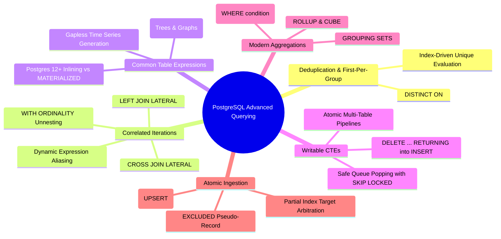
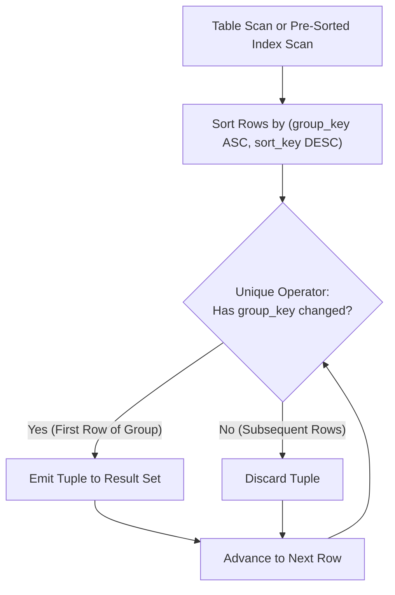
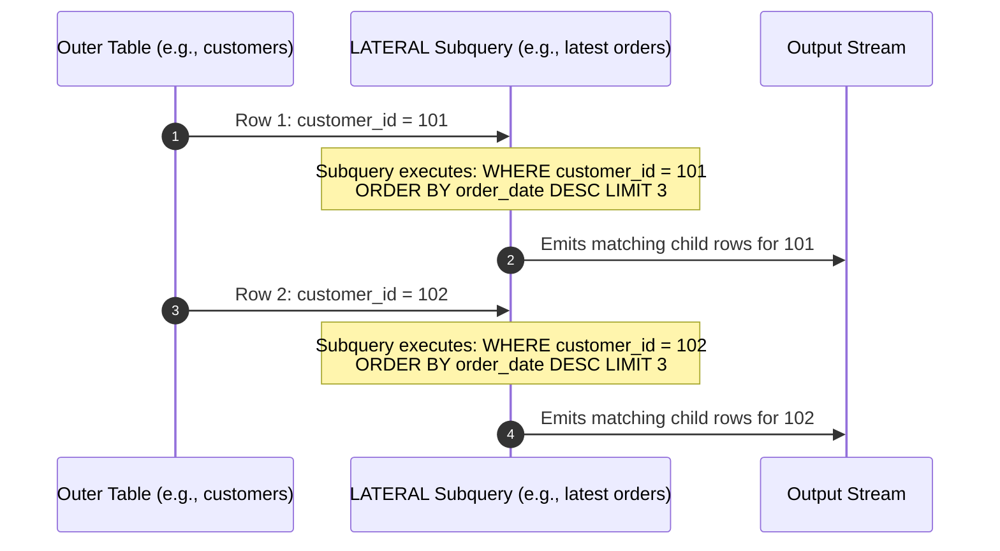
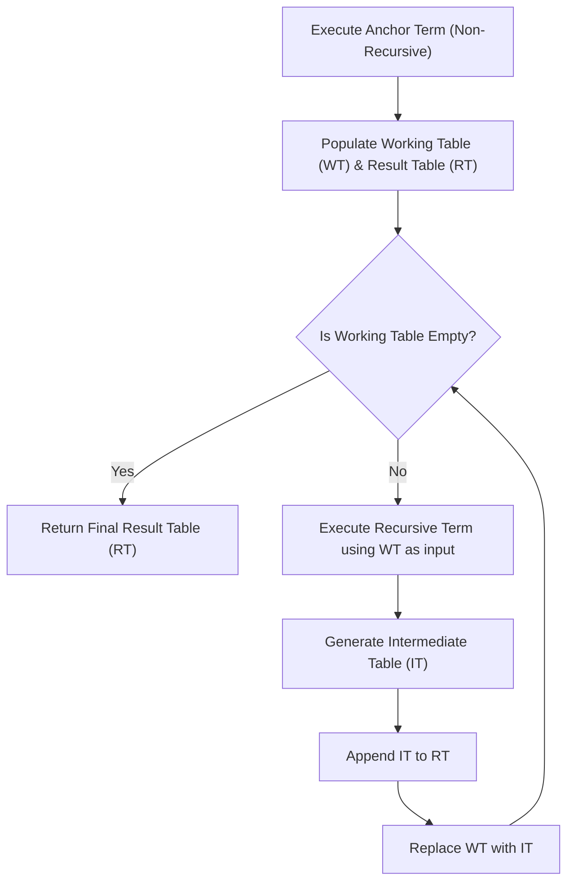
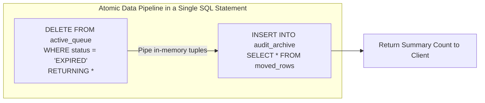
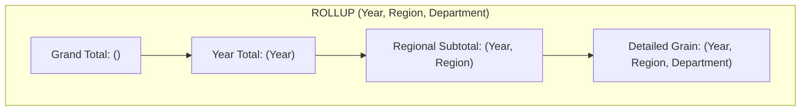
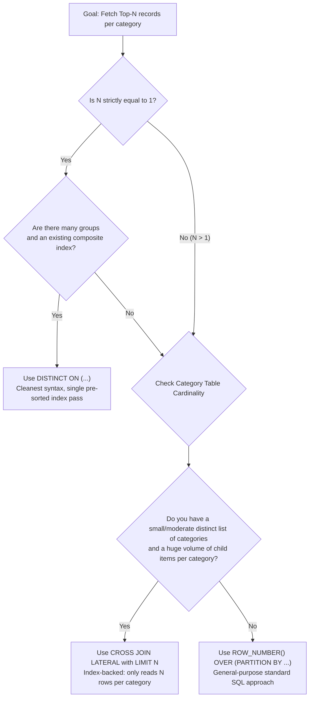

# Advanced PostgreSQL Query Patterns & Techniques

A production-grade technical reference and deep dive into advanced PostgreSQL query patterns: `DISTINCT ON`, `LATERAL` joins, Common Table Expressions (`WITH RECURSIVE` and Writable CTEs), conditional aggregations (`FILTER`), multidimensional rollups (`GROUPING SETS`, `ROLLUP`, `CUBE`), atomic upserts (`INSERT ... ON CONFLICT`), and query optimization mechanics.

---

## 1. High-Level Taxonomy of Advanced PostgreSQL Querying

Modern PostgreSQL extends standard ANSI SQL with powerful relational primitives that eliminate the need for procedural looping, multiple round-trips, or heavy application-side data manipulation.



---

## 2. `DISTINCT ON`: Fast Deduplication & First-Per-Group

### 2.1 The Problem Statement

In relational databases, a frequent business requirement is to fetch the **"most recent"**, **"highest value"**, or **"first encountered"** record for each entity (e.g., the latest status update per user, or the most recent sensor reading per device).

Standard SQL approaches typically require:

1. A self-join with an aggregated subquery (`WHERE created_at = (SELECT MAX(created_at) ...)`).
2. A window function (`ROW_NUMBER() OVER (PARTITION BY entity_id ORDER BY created_at DESC)`) wrapped in an outer query with `WHERE row_num = 1`.

PostgreSQL provides a proprietary, highly optimized construct: **`DISTINCT ON (expression [, ...])`**.

---

### 2.2 Syntax & Mandatory Sorting Rules

```sql
SELECT DISTINCT ON (group_column [, ...])
       group_column, sort_column, other_columns
FROM table_name
ORDER BY group_column [ASC|DESC], sort_column [ASC|DESC];
```

> [!IMPORTANT]
> **The `ORDER BY` Prefix Rule**:
> The expressions specified in `DISTINCT ON (...)` **must match the leftmost expressions** in the query's `ORDER BY` clause.
>
> PostgreSQL processes rows in the sorted order specified by `ORDER BY`. As it iterates through rows, it compares the `DISTINCT ON` keys against the previous row:
>
> - If the key is new: the row is kept and emitted to the result set.
> - If the key matches the previous row: the row is discarded.
>
> Without matching leading `ORDER BY` expressions, PostgreSQL throws an error (`ERROR: SELECT DISTINCT ON expressions must match initial ORDER BY expressions`).

---

### 2.3 Execution Mechanics



---

### 2.4 Concrete Production Example: Latest Order per Customer

Consider an e-commerce database tracking orders:

```sql
CREATE TABLE customer_orders (
    order_id BIGINT GENERATED ALWAYS AS IDENTITY PRIMARY KEY,
    customer_id INT NOT NULL,
    order_date TIMESTAMPTZ NOT NULL,
    total_amount NUMERIC(10, 2) NOT NULL,
    order_status VARCHAR(30) NOT NULL
);
```

To retrieve the single latest order for each customer:

```sql
SELECT DISTINCT ON (customer_id)
       customer_id,
       order_id,
       order_date,
       total_amount,
       order_status
FROM customer_orders
ORDER BY customer_id, order_date DESC;
```

#### Comparison: `DISTINCT ON` vs Window Function

```sql
-- Alternative using standard Window Function
SELECT customer_id, order_id, order_date, total_amount, order_status
FROM (
    SELECT customer_id, order_id, order_date, total_amount, order_status,
           ROW_NUMBER() OVER (PARTITION BY customer_id ORDER BY order_date DESC) AS rn
    FROM customer_orders
) ranked
WHERE rn = 1;
```

- **Readability**: `DISTINCT ON` eliminates the nested derived table.
- **Planner Optimization**: With `DISTINCT ON`, PostgreSQL can stop scanning a group as soon as the first matching tuple is found if supported by an index scan, whereas a window function may compute rank numbers for every row in the partition before filtering.

---

### 2.5 Indexing Strategy for `DISTINCT ON`

To prevent an expensive in-memory or on-disk sort node (`Sort Method: quicksort / external merge`), create a composite B-Tree index matching the `ORDER BY` clause exactly:

```sql
CREATE INDEX idx_customer_orders_cust_date
ON customer_orders (customer_id, order_date DESC);
```

With this index, PostgreSQL performs an **Index Scan** or **Index Only Scan**, walking the B-Tree in pre-sorted order and evaluating the `Unique` filter in $O(N)$ streaming time with zero temporary sort buffers.

> [!WARNING]
> **Limitation of `DISTINCT ON`**:
> `DISTINCT ON` only retrieves **exactly 1 row** per group ($N=1$). If your business requirement requires fetching the Top-2, Top-3, or Top-$N$ records per group, `DISTINCT ON` cannot be used; you must use a `LATERAL` join or a window function.

---

## 3. `LATERAL` Joins: Correlated Subqueries in the `FROM` Clause

### 3.1 The Concept & Mental Model

In standard SQL, subqueries in the `FROM` clause are evaluated independently. A subquery in `FROM` cannot reference columns provided by sibling tables appearing before it in the `FROM` list.

The **`LATERAL`** keyword (introduced in PostgreSQL 9.3) changes this fundamental rule. It allows a subquery or set-returning function in the `FROM` clause to access column values from preceding tables.



**The Mental Model**: A `LATERAL` join acts like a parameterized **`for-each` loop** executed by the query planner:
$$\text{For every row } r \in \text{OuterTable}, \text{ execute } \text{Subquery}(r.\text{column})$$

---

### 3.2 Join Variants: `CROSS JOIN LATERAL` vs `LEFT JOIN LATERAL`

1. **`CROSS JOIN LATERAL` (Inner Join Behavior)**:
   If the lateral subquery returns **0 rows** for a given outer row, the outer row is excluded from the final result set.
2. **`LEFT JOIN LATERAL ... ON true` (Left Outer Join Behavior)**:
   If the lateral subquery returns **0 rows**, the outer row is preserved, and all columns of the lateral subquery evaluate to `NULL`.

---

### 3.3 Production Pattern 1: High-Performance Top-N Per Group

Suppose we want to find the **top 3 latest orders for every customer**.

```sql
SELECT c.id AS customer_id,
       c.name AS customer_name,
       recent_orders.order_id,
       recent_orders.order_date,
       recent_orders.total_amount
FROM customers c
CROSS JOIN LATERAL (
    SELECT o.order_id,
           o.order_date,
           o.total_amount
    FROM orders o
    WHERE o.customer_id = c.id
    ORDER BY o.order_date DESC
    LIMIT 3
) recent_orders;
```

#### Why `LATERAL` Beats Window Functions for High-Volume Tables

- **Window Function Approach**: `ROW_NUMBER() OVER (PARTITION BY customer_id ORDER BY order_date DESC)` forces PostgreSQL to scan **every single row in the entire `orders` table** (e.g., 10,000,000 rows), sort or partition them all, and then filter `WHERE rn <= 3`.
- **`LATERAL` Approach**: With an index on `orders(customer_id, order_date DESC)`, PostgreSQL executes an **Index Scan with a hard stop of 3 rows** per customer. If you have 500 customers, PostgreSQL only reads $500 \times 3 = 1,500$ index entries from disk/cache, completing in milliseconds.

---

### 3.4 Production Pattern 2: Reusing Computed Expressions (No Repeated Math)

Standard SQL forbids referencing a calculated column alias within the same `SELECT` clause or `WHERE` clause without retyping the entire calculation or wrapping the query in another subquery.

`CROSS JOIN LATERAL (VALUES (...))` cleanly solves this:

```sql
SELECT p.id,
       p.product_name,
       p.cost_price,
       p.retail_price,
       calc.markup,
       calc.tax_amount,
       calc.final_price
FROM products p
CROSS JOIN LATERAL (
    SELECT (p.retail_price - p.cost_price) AS markup,
           (p.retail_price * 0.10) AS tax_amount,
           (p.retail_price * 1.10) AS final_price
) calc
WHERE calc.markup > 15.00
ORDER BY calc.final_price DESC;
```

---

### 3.5 Production Pattern 3: Set-Returning Functions & JSONB Unnesting with `WITH ORDINALITY`

`LATERAL` is implicitly invoked when expanding arrays or JSON structures per row. Pairing this with `WITH ORDINALITY` preserves array indices:

```sql
CREATE TABLE articles (
    article_id INT PRIMARY KEY,
    title TEXT NOT NULL,
    tags TEXT[] NOT NULL
);

-- Flatten tags while preserving the 1-based element position
SELECT a.article_id,
       a.title,
       t.tag_name,
       t.tag_position
FROM articles a
CROSS JOIN LATERAL unnest(a.tags) WITH ORDINALITY AS t(tag_name, tag_position);
```

#### Unpacking JSONB Arrays to Relational Columns

```sql
CREATE TABLE webhook_events (
    id BIGINT PRIMARY KEY,
    payload JSONB NOT NULL
);

-- Payload contains: {"items": [{"sku": "A1", "qty": 2}, {"sku": "B2", "qty": 5}]}
SELECT e.id AS event_id,
       item.sku,
       item.qty
FROM webhook_events e
CROSS JOIN LATERAL jsonb_to_recordset(e.payload->'items') AS item(sku TEXT, qty INT);
```

---

## 4. Common Table Expressions (CTEs) & `WITH RECURSIVE`

Common Table Expressions (CTEs) define temporary named result sets that exist only within the scope of a single query.

---

### 4.1 Modern CTE Inlining vs `AS MATERIALIZED` (Postgres 12+)

> [!NOTE]
> **The PostgreSQL 12 Planner Revolution**:
> Prior to PostgreSQL 12, CTEs acted as strict **optimization fences**. PostgreSQL always fully computed and materialized the CTE into a temporary in-memory/disk buffer before executing the outer query.
>
> In **PostgreSQL 12 and newer**, CTEs are **inlined** by default into the main query if:
>
> 1. They do not contain volatile functions (e.g., `random()`, `clock_timestamp()`).
> 2. They do not contain data-modifying statements (`INSERT`, `UPDATE`, `DELETE`).
> 3. They are referenced only once in the outer query.

You can explicitly control the planner's materialization strategy:

```sql
-- 1. Force materialization (acts as an optimization fence, prevents multiple executions)
WITH expensive_calculation AS MATERIALIZED (
    SELECT department_id, AVG(salary) AS avg_sal
    FROM employees
    GROUP BY department_id
)
SELECT * FROM expensive_calculation WHERE avg_sal > 80000;

-- 2. Force inlining (allows outer WHERE predicates to push down into the CTE)
WITH raw_events AS NOT MATERIALIZED (
    SELECT * FROM application_logs
)
SELECT * FROM raw_events WHERE user_id = 42;
```

---

### 4.2 `WITH RECURSIVE`: Anatomy & Execution Loop

Recursive CTEs are used to query hierarchical data (organizational charts, category trees, graphs) and generate dynamic sequences.

A recursive CTE consists of three components:

1. **Non-Recursive Term (Anchor Query)**: The base dataset that seeds the recursion.
2. **`UNION` or `UNION ALL`**: `UNION ALL` is strongly preferred for performance because it avoids duplicate elimination passes.
3. **Recursive Term**: A query referencing the CTE itself, evaluating against the working table produced by the previous step.



---

### 4.3 Production Example 1: Traversing an Organizational Hierarchy

Given an adjacency list representing an employee org chart:

```sql
CREATE TABLE employees (
    employee_id INT PRIMARY KEY,
    name VARCHAR(100) NOT NULL,
    manager_id INT REFERENCES employees(employee_id),
    title VARCHAR(100) NOT NULL
);

-- Find the entire management chain above employee 105, plus reporting depth
WITH RECURSIVE management_chain AS (
    -- Anchor Member: find the target employee
    SELECT employee_id, name, manager_id, title, 1 AS depth, ARRAY[employee_id] AS path
    FROM employees
    WHERE employee_id = 105

    UNION ALL

    -- Recursive Member: walk up to the manager
    SELECT m.employee_id, m.name, m.manager_id, m.title, mc.depth + 1, mc.path || m.employee_id
    FROM employees m
    JOIN management_chain mc ON m.employee_id = mc.manager_id
    -- Cycle prevention: stop if manager was already visited
    WHERE NOT (m.employee_id = ANY(mc.path))
)
SELECT depth, name, title, path
FROM management_chain
ORDER BY depth ASC;
```

> [!TIP]
> **Cycle Prevention in Graph Traversal**:
> Always maintain an array path (`path || next_id`) and include `WHERE NOT (next_id = ANY(path))` in the recursive term when querying graphs that may contain circular loops, preventing infinite query loops.

---

### 4.4 Production Pattern 2: Gapless Date Spines

Aggregating metrics by day (e.g., daily sales) drops days with zero activity. Generating a continuous date spine ensures every calendar day appears in the chart:

```sql
-- Generate a gapless date spine from Jan 1 to Jan 31 using generate_series
WITH date_spine AS (
    SELECT generate_series(
        '2026-01-01'::date,
        '2026-01-31'::date,
        '1 day'::interval
    )::date AS report_date
)
SELECT ds.report_date,
       COALESCE(SUM(o.total_amount), 0.00) AS total_revenue,
       COUNT(o.order_id) AS total_orders
FROM date_spine ds
LEFT JOIN customer_orders o ON o.order_date::date = ds.report_date
GROUP BY ds.report_date
ORDER BY ds.report_date ASC;
```

---

## 5. Data-Modifying Statements in CTEs (Writable CTEs)

PostgreSQL allows `INSERT`, `UPDATE`, and `DELETE` statements inside CTEs when paired with the `RETURNING` clause. All statements within a single query execute **in the same transaction and against the same snapshot**.



---

### 5.1 Pattern 1: Atomic Move / Archiving Pipeline

Moving expired records from a primary table to an archive table without concurrency races or separate application round-trips:

```sql
WITH moved_rows AS (
    DELETE FROM user_notifications
    WHERE created_at < NOW() - INTERVAL '90 days'
    RETURNING id, user_id, message, created_at
)
INSERT INTO archived_notifications (id, user_id, message, archived_at)
SELECT id, user_id, message, NOW()
FROM moved_rows;
```

---

### 5.2 Pattern 2: Concurrent-Safe Queue Processing (`SKIP LOCKED`)

Building a bulletproof transactional worker queue:

```sql
WITH claimed_jobs AS (
    SELECT job_id
    FROM background_jobs
    WHERE status = 'QUEUED'
      AND run_at <= NOW()
    ORDER BY priority DESC, job_id ASC
    FOR UPDATE SKIP LOCKED
    LIMIT 5
)
UPDATE background_jobs bj
SET status = 'PROCESSING',
    locked_at = NOW(),
    worker_id = 'worker-node-04'
FROM claimed_jobs cj
WHERE bj.job_id = cj.job_id
RETURNING bj.job_id, bj.task_payload;
```

- `FOR UPDATE SKIP LOCKED` skips any row locked by another worker thread without blocking or waiting.
- The writable CTE atomically transitions those claimed rows to `'PROCESSING'` and returns the job payload to the calling worker in one step.

---

### 5.3 Pattern 3: Atomic Parent and Children Bulk Insertion

Inserting a header and child detail records without waiting for client-side transaction round-trips:

```sql
WITH inserted_invoice AS (
    INSERT INTO invoices (customer_id, invoice_date, status)
    VALUES (99, CURRENT_DATE, 'DRAFT')
    RETURNING invoice_id
)
INSERT INTO invoice_line_items (invoice_id, item_sku, unit_price, quantity)
SELECT inserted_invoice.invoice_id, items.sku, items.price, items.qty
FROM inserted_invoice
CROSS JOIN (
    VALUES
        ('SKU-1001', 49.99, 2),
        ('SKU-2004', 19.50, 1),
        ('SKU-3099', 9.99, 5)
) AS items(sku, price, qty);
```

---

## 6. Conditional Aggregations: The `FILTER (WHERE ...)` Clause

### 6.1 Syntax & Readability Advantage

In traditional SQL, conditional aggregations require cumbersome `CASE` statements:

```sql
-- Legacy SQL syntax
SELECT department_id,
       COUNT(CASE WHEN is_active = true THEN 1 END) AS active_users,
       SUM(CASE WHEN role = 'ADMIN' THEN salary ELSE 0 END) AS admin_payroll
FROM employees
GROUP BY department_id;
```

PostgreSQL supports the standard ANSI SQL **`FILTER (WHERE condition)`** clause directly appended to any aggregate function:

```sql
-- Modern PostgreSQL syntax
SELECT department_id,
       COUNT(*) FILTER (WHERE is_active = true) AS active_users,
       SUM(salary) FILTER (WHERE role = 'ADMIN') AS admin_payroll
FROM employees
GROUP BY department_id;
```

---

### 6.2 Semantic Correctness with `AVG`, `MIN`, `MAX`

When using `CASE`, returning `0` inside `ELSE` corrupts functions like `AVG()` or `MIN()` because `0` is treated as a valid value rather than an excluded point:

- `AVG(CASE WHEN flag THEN score ELSE 0 END)`: Calculates $\frac{\sum \text{score}}{N_{\text{total}}}$, distorting the average.
- `AVG(score) FILTER (WHERE flag)`: Ignores rows where `flag` is false, accurately computing $\frac{\sum \text{score}}{N_{\text{matching}}}$.

---

### 6.3 Production Example: Single-Scan Analytical Pivot

Compute multiple business metrics across different statuses in a single table scan:

```sql
SELECT DATE_TRUNC('month', transaction_date) AS month,
       COUNT(*) AS total_transactions,
       SUM(amount) AS gross_volume,
       SUM(amount) FILTER (WHERE status = 'SETTLED') AS settled_volume,
       SUM(amount) FILTER (WHERE status = 'REFUNDED') AS refunded_volume,
       ROUND(
           100.0 * COUNT(*) FILTER (WHERE status = 'FAILED') / NULLIF(COUNT(*), 0),
           2
       ) AS failure_rate_pct
FROM transactions
WHERE transaction_date >= '2026-01-01'
GROUP BY DATE_TRUNC('month', transaction_date)
ORDER BY month DESC;
```

---

## 7. Multidimensional Aggregations: `GROUPING SETS`, `ROLLUP`, and `CUBE`

When building financial or management reports, users often need breakdowns across multiple dimensional combinations, along with subtotals and grand totals.

Instead of running separate queries combined with `UNION ALL`, PostgreSQL computes multiple dimensional groupings in a single scan.



---

### 7.1 Comparison of Multidimensional Clauses

| Construct           | Combinations Generated                             | Example for `(A, B)`     | Use Case                                                     |
| :------------------ | :------------------------------------------------- | :----------------------- | :----------------------------------------------------------- |
| **`GROUPING SETS`** | Explicitly specified subsets only                  | `((A), (B))`             | Custom non-hierarchical reports                              |
| **`ROLLUP`**        | Hierarchical prefixes ($N + 1$ combinations)       | `((A, B), (A), ())`      | Drill-downs (Year $\rightarrow$ Quarter $\rightarrow$ Month) |
| **`CUBE`**          | All mathematical combinations ($2^N$ combinations) | `((A, B), (A), (B), ())` | Cross-tabulations / OLAP multidimensional analysis           |

---

### 7.2 The `GROUPING()` Helper Function

When subtotals are generated, the grouped columns contain `NULL` in the aggregate rows. To distinguish between a **natural `NULL` value** in the data vs. an **aggregated super-row `NULL`**, use `GROUPING(col)`:

- Returns `0` if the column is part of the current grouping row.
- Returns `1` if the column was aggregated away in the subtotal/grand total.

```sql
SELECT
    COALESCE(region, '--- ALL REGIONS ---') AS region,
    COALESCE(product_category, '--- ALL CATEGORIES ---') AS category,
    GROUPING(region) AS is_region_subtotal,
    GROUPING(product_category) AS is_category_subtotal,
    SUM(sales_amount) AS total_sales
FROM regional_sales
GROUP BY ROLLUP (region, product_category)
ORDER BY GROUPING(region), region, GROUPING(product_category), category;
```

---

## 8. Advanced Upsert: `INSERT ... ON CONFLICT`

`INSERT ... ON CONFLICT` provides atomic, race-condition-free upsert behavior without requiring explicit table locks.

### 8.1 Mechanics & The `EXCLUDED` Pseudo-Record

When an insert collides with a unique index, PostgreSQL constructs an ephemeral table named **`EXCLUDED`**, which holds the values that were submitted in the `INSERT` payload.

```sql
INSERT INTO user_daily_metrics (user_id, metric_date, login_count, points_earned)
VALUES (101, CURRENT_DATE, 1, 50)
ON CONFLICT (user_id, metric_date)
DO UPDATE SET
    login_count   = user_daily_metrics.login_count + EXCLUDED.login_count,
    points_earned = user_daily_metrics.points_earned + EXCLUDED.points_earned,
    updated_at    = NOW();
```

---

### 8.2 Conflict Targets: Constraints vs Partial Unique Indexes

The conflict target can be:

1. A named constraint: `ON CONFLICT ON CONSTRAINT user_daily_metrics_pkey`
2. Column names: `ON CONFLICT (user_id, metric_date)`
3. A **partial unique index predicate** matching index conditions:

```sql
-- Table has a partial unique index for active accounts
CREATE UNIQUE INDEX idx_users_active_email
ON users (email)
WHERE deleted_at IS NULL;

-- Upsert targeting the partial index
INSERT INTO users (email, full_name, deleted_at)
VALUES ('alice@example.com', 'Alice Smith', NULL)
ON CONFLICT (email) WHERE deleted_at IS NULL
DO UPDATE SET
    full_name = EXCLUDED.full_name;
```

> [!IMPORTANT]
> If a partial unique index is used as the conflict arbiter, the `INSERT ... ON CONFLICT` statement **must explicitly include the exact `WHERE` clause** in the conflict target specification.

---

### 8.3 Concurrency & Idempotent Safeguards (`WHERE` in `DO UPDATE`)

You can attach a `WHERE` condition to the `DO UPDATE` clause to prevent stale writes or enforce idempotency:

```sql
INSERT INTO order_shipments (order_id, tracking_number, status_code, updated_at)
VALUES (501, 'TRK-98210', 3, '2026-09-13 14:00:00+00')
ON CONFLICT (order_id)
DO UPDATE SET
    tracking_number = EXCLUDED.tracking_number,
    status_code     = EXCLUDED.status_code,
    updated_at      = EXCLUDED.updated_at
-- Concurrency guard: only update if incoming timestamp is newer than current state
WHERE EXCLUDED.updated_at > order_shipments.updated_at;
```

---

## 9. Architectural Decision Guide: Solving the "Top-N Per Group" Problem

When engineers need to query the "Top-$N$ items per category", three distinct PostgreSQL patterns can be used. Selecting the correct technique depends on group cardinality, data volume, and index design.

### 9.1 Comparative Matrix

| Criterion                                                                  | `DISTINCT ON (...)`                       | Window Function (`ROW_NUMBER`)          | `LATERAL` Join with `LIMIT N`                            |
| :------------------------------------------------------------------------- | :---------------------------------------- | :-------------------------------------- | :------------------------------------------------------- |
| **Supported $N$ Value**                                                    | Strictly $N = 1$                          | Any $N$ ($N \ge 1$)                     | Any $N$ ($N \ge 1$)                                      |
| **SQL Portability**                                                        | PostgreSQL proprietary                    | ANSI SQL standard                       | ANSI SQL:2008 standard                                   |
| **Index Exploitation**                                                     | Uses composite index `(grp, sort DESC)`   | Scans all rows in group even with index | Emulates index skip scan with per-group limit            |
| **High Group Cardinality (e.g. 1M groups, few rows each)**                 | 🚀 Very Fast                              | ⚠️ Moderate                             | ⚠️ Moderate (1M subquery executions)                     |
| **Low Group Cardinality, Huge Row Count (e.g. 50 groups, 500k rows each)** | ⚠️ Must sort/scan index across full table | ❌ Scans & ranks all 25M rows           | 🚀 **Blazing Fast** (50 $\times$ $N$ index lookups only) |

---

### 9.2 Decision Flowchart



---

## Summary Reference Cheat Sheet

```sql
-- 1. Deduplicate & First-Per-Group (N=1)
SELECT DISTINCT ON (user_id) user_id, status, created_at
FROM audit_logs
ORDER BY user_id, created_at DESC;

-- 2. Top-N Per Group with Index-Skip Emulation (N=3)
SELECT c.category_name, p.*
FROM categories c
CROSS JOIN LATERAL (
    SELECT product_name, price
    FROM products p
    WHERE p.category_id = c.id
    ORDER BY p.price DESC
    LIMIT 3
) p;

-- 3. Atomic Queue Popping
WITH next_item AS (
    SELECT id FROM task_queue WHERE status = 'PENDING'
    ORDER BY priority DESC LIMIT 1
    FOR UPDATE SKIP LOCKED
)
UPDATE task_queue t
SET status = 'RUNNING' FROM next_item ni
WHERE t.id = ni.id RETURNING t.*;

-- 4. Conditional Aggregation
SELECT dept_id,
       COUNT(*) FILTER (WHERE active = true) AS active_cnt,
       AVG(salary) FILTER (WHERE role = 'ENGINEER') AS avg_eng_sal
FROM employees GROUP BY dept_id;

-- 5. Subtotals and Rollups
SELECT region, department, SUM(revenue)
FROM sales
GROUP BY ROLLUP (region, department);

-- 6. Safe Upsert
INSERT INTO counters (key, val) VALUES ('hits', 1)
ON CONFLICT (key) DO UPDATE SET val = counters.val + EXCLUDED.val;
```

---

## References & Further Reading

- [PostgreSQL Documentation: Queries - SELECT DISTINCT](https://www.postgresql.org/docs/current/queries-select-lists.html#QUERIES-DISTINCT)
- [PostgreSQL Documentation: Queries - LATERAL Subqueries](https://www.postgresql.org/docs/current/queries-table-expressions.html#QUERIES-LATERAL)
- [PostgreSQL Documentation: Queries - WITH Queries (Common Table Expressions)](https://www.postgresql.org/docs/current/queries-with.html)
- [PostgreSQL Documentation: Aggregate Functions with FILTER Clause](https://www.postgresql.org/docs/current/sql-expressions.html#SYNTAX-AGGREGATES)
- [PostgreSQL Documentation: SQL INSERT - ON CONFLICT Clause](https://www.postgresql.org/docs/current/sql-insert.html#SQL-ON-CONFLICT)
