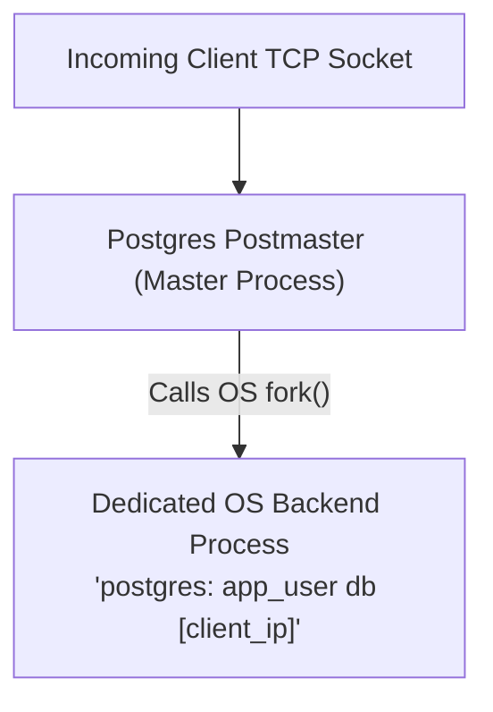
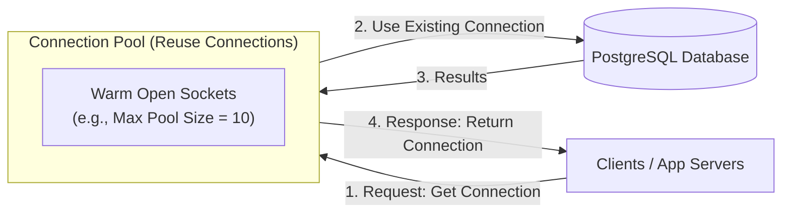
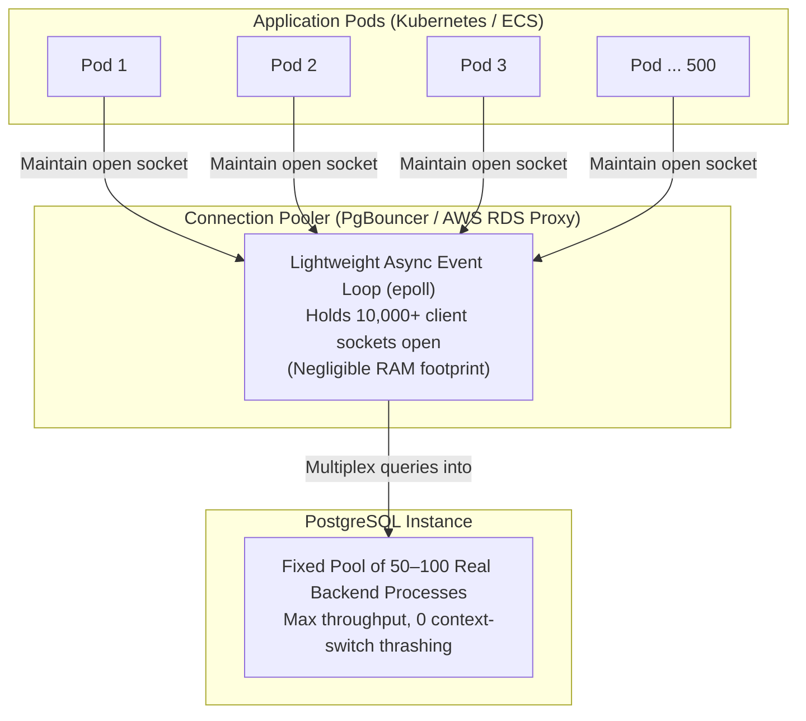

# PostgreSQL Connection Architecture & Connection Pooling

PostgreSQL manages client connections using a dedicated **process-per-connection** model. In modern distributed and microservice architectures, this design quickly leads to connection saturation, high memory consumption, and severe CPU thrashing unless a connection multiplexer (such as **PgBouncer** or **AWS RDS Proxy**) is introduced.

---

## 1. The Root Cause: Why PostgreSQL Chokes on High Connection Counts

Unlike databases such as MySQL (which uses lightweight OS **threads** per connection), PostgreSQL relies on a **process-based model** rooted in traditional Unix architecture:



Every time an application opens a connection to PostgreSQL, the operating system spawns an entirely new **Linux process**. This architecture introduces three primary bottlenecks:

### A. Heavy RAM Consumption (Even While Idle)

Each Postgres backend process maintains its own private memory spaces:

- **Process Stack & State**: ~2–5 MB per process.
- **Catalog & Schema Cache**: Caches table definitions, column types, and user permissions.
- **Dynamic Query Memory**: Buffers allocated per execution (`work_mem`, `temp_buffers` for sorting and hashing).

> **The Math**: An **idle** connection sitting inside an application pool still consumes **5 MB to 20 MB+ of RAM**.
>
> - 100 connections $\approx$ 1–2 GB of RAM.
> - 1,000 connections $\approx$ 10–20 GB of RAM allocated _solely to keep idle sockets open_.

### B. CPU Context-Switching Thrashing

- When hundreds or thousands of active OS processes compete for CPU time, the Linux kernel scheduler spends a substantial portion of CPU cycles swapping process state and memory registers in and out (**context switching**).
- This constant switching invalidates CPU L1/L2/L3 hardware caches and flushes Translation Lookaside Buffers (TLB), sharply reducing overall CPU efficiency.
  - A Translation Lookaside Buffer (TLB) is a small, extremely fast hardware cache inside the CPU's Memory Management Unit (MMU).
  - Its sole purpose is to cache recent translations from Virtual Memory Addresses to Physical Memory Addresses.

### C. Internal Lock Contention (The "Connection Cliff")

- All Postgres backend processes must coordinate access to shared memory (such as `shared_buffers` and transaction status logs) using shared memory latches and spinlocks (e.g., `ProcArrayLock`).
  - **Shared Memory:** A common pool of RAM shared across all Postgres processes to cache table data (`shared_buffers`) and coordinate transaction states.
  - **Latches & Spinlocks:** Lightweight internal locks that prevent processes from corrupting shared data structures when reading or modifying them simultaneously.
  - **`ProcArrayLock`:** A central lock guarding the array of all active transactions; queries must check this frequently to determine row visibility (MVCC snapshots).
- As active connection counts rise past ~100–300, throughput hits a ceiling and drops drastically. Beyond this point, CPU time is consumed waiting on lock queues rather than executing queries.

---

## 2. The Microservice Connection Explosion

In a containerized or microservices environment, connection counts scale multiplicatively:

```text
[ 10 Microservices ]
       × [ 10 Kubernetes Pods each ] = 100 Pods
       × [ Pool Size of 20 (HikariCP / pgxpool / Prisma) ]
       = 2,000 Active TCP Connections to PostgreSQL!
```

When connection limits are reached, PostgreSQL terminates new connection attempts with fatal errors:

```text
FATAL: remaining connection slots are reserved for non-replication superuser connections
FATAL: sorry, too many clients already
```

---

## 3. Connection Pooling Fundamentals

Opening a new database connection for every request is **expensive**. In client-server architectures, connection pooling maintains a pool of pre-warmed, reusable connections rather than continually creating and destroying them.

### Lifecycle Comparison: Without vs. With Connection Pooling

```mermaid
flowchart TD
    subgraph WithoutPool ["Without Connection Pooling"]
        R1["Many Client Requests"] --> O1["Open Connection (Expensive OS Fork / TLS)"]
        O1 --> U1["Use Connection (Execute Query)"]
        U1 --> C1["Close Connection (Expensive Teardown)"]
        C1 --> DB1[("PostgreSQL Database")]
    end

    subgraph WithPool ["With Connection Pooling"]
        R2["Many Client Requests"] --> G2["Get from Pool (Fast / Pre-established)"]
        G2 --> U2["Use Connection (Execute Query)"]
        U2 --> Ret2["Return to Pool (Reused / Kept Alive)"]
        Ret2 --> DB2[("PostgreSQL Database")]
    end
```



### How Connection Pooling Works



1. **Request (Get Connection)**: When an application thread needs to execute a query, it requests an active connection from the pool instead of initiating a raw network socket.
2. **Use Existing Connection**: The pool assigns an already-open, idle database socket from its pre-warmed inventory and forwards the query to PostgreSQL.
3. **Results**: The database executes the query and streams results back across the established socket.
4. **Response & Return Connection**: Once query/transaction execution finishes, the application returns the connection to the pool so it can immediately serve subsequent requests.

### Core Benefits

- **Lower Latency**: Eliminates the repeated cost of TCP handshakes, TLS negotiation, authentication, backend process forks, and startup catalog cache population.
- **Handles High Concurrency**: Prevents connection stampedes by queuing surplus application requests gracefully until a pooled socket becomes available.
- **Reduces Load on the Database**: Shields the database from process exhaustion, lock contention, and out-of-memory (OOM) crashes.
- **Better Resource Utilization**: Stabilizes RAM footprint and CPU usage, avoiding the memory-hungry process bloat of idle connections.
- **Improves Throughput & Scalability**: Keeps database worker processes in their optimal execution zone rather than thrashing in context-switching and lock waits.

---

## 4. The Solution: Connection Multiplexing (PgBouncer / AWS RDS Proxy)

To protect PostgreSQL from process overload, an external **connection pooler** is deployed between application services and the database:



### How PgBouncer Works

1. **Lightweight Socket Management**: PgBouncer uses an asynchronous `epoll` event loop (similar to Nginx). It can hold **10,000+ open TCP sockets** from client pods while consuming only a few kilobytes of RAM per socket.
2. **Multiplexing**: PgBouncer maintains a small, fixed pool of **50 to 100 actual persistent connections** to PostgreSQL.
3. **Queue & Dispatch**: When an application pod begins a transaction, PgBouncer temporarily assigns one of the real Postgres connections, executes the query, and **immediately returns the connection to the pool** upon completion (`COMMIT` / `ROLLBACK`).

### Pooling Modes

| Mode                                    | Behavior                                                                                     | Use Case / Caveat                                                                                                                                                                                   |
| :-------------------------------------- | :------------------------------------------------------------------------------------------- | :-------------------------------------------------------------------------------------------------------------------------------------------------------------------------------------------------- |
| **Transaction Pooling** _(Recommended)_ | A server connection is assigned only for the duration of a transaction (`BEGIN ... COMMIT`). | Best balance of concurrency and performance. _Caveat_: Session-level features (e.g., `SET timezone`, `LISTEN/NOTIFY`, named prepared statements without workaround) are reset between transactions. |
| **Session Pooling**                     | A server connection is tied to the client for the entire duration of the client connection.  | Safe for legacy apps, but limits concurrency to the number of server connections.                                                                                                                   |
| **Statement Pooling**                   | A server connection is returned after every single SQL statement.                            | Does not support multi-statement transactions (`BEGIN ... COMMIT`). Rarely used in application backends.                                                                                            |

### PostgreSQL Sizing Rule of Thumb

The optimal number of active connections to a single PostgreSQL server is surprisingly small. Popularized by PostgreSQL engineering benchmarks and the HikariCP pool sizing research:

$$\text{Connections} = (\text{CPU Cores} \times 2) + \text{Effective Spindle Count}$$

- **$\text{CPU Cores} \times 2$**:
  - Accounts for hardware hyper-threading and keeps physical CPU cores saturated.
  - While one worker process briefly stalls on an L3 cache miss or memory pipeline wait, another thread immediately takes over the core. Exceeding this multiplier leads to CPU context switching overhead rather than productive work.
- **$\text{Effective Spindle Count}$**:
  - Originally refers to mechanical hard disk drives (HDDs) with spinning platters. While an HDD head is physically seeking data on disk (I/O wait), that connection is blocked, freeing the CPU to work on another connection.
  - On modern **SSDs / NVMe / cloud block storage (e.g. AWS EBS)**, storage has high internal parallelism and zero seek time. Consequently, the effective spindle count is treated as a small constant (e.g., 1–4) or near $0$ if the database working set fits comfortably in RAM (`shared_buffers` / OS page cache).
- **The Core Intuition**:
  - Developers often assume _"more connections = faster performance"_.
  - In reality, queuing requests _outside_ PostgreSQL (in an external pooler or application queue) and processing them through a small pool of saturated CPU cores yields significantly higher query throughput and lower latency than letting hundreds of queries fight over locks and CPU time concurrently inside PostgreSQL.

For example, a dedicated 16-core server with SSD storage operates at peak throughput with approximately **32 to 50 active PostgreSQL worker processes**, handled through a pooler.

---

## 5. Connection Pool Best Practices & Operational Hygiene

To maximize throughput and prevent pool starvation, apply the following production best practices:

1. **Set Max Pool Size Based on DB Capacity (Don't Make It Too Large)**
   - Never set pool sizes arbitrarily high (e.g., hundreds per service instance).
   - Size application and middleware pools in alignment with PostgreSQL server hardware limits ($(\text{Cores} \times 2) + \text{Spindles}$ across all replicas and instances).

2. **Set Connection Timeouts**
   - **Acquisition / Checkout Timeout**: Configure a finite timeout (e.g., 3–5 seconds) when acquiring a connection from the pool. Failing fast surfaces pool exhaustion and prevents cascading application thread lockups.
   - **Query / Statement Timeout**: Enforce database statement timeouts (`statement_timeout`) to ensure slow queries do not monopolize pooled connections indefinitely.

3. **Validate Connections Before Using**
   - Enable lightweight connection validation (e.g., TCP keepalive or periodic ping) to ensure dead, severed, or firewall-reaped sockets are discarded before an application tries to run queries on them.

4. **Close Idle Connections After Some Time**
   - Configure an **idle timeout** (e.g., 10–30 minutes) and a **minimum idle connection count**.
   - This reaps excess idle connections during low-traffic periods to release PostgreSQL backend memory, while maintaining a warm baseline for quick response.

5. **Monitor Pool Usage Metrics**
   - Continuously track pool telemetry:
     - **Active Connections**: Number of connections currently executing transactions.
     - **Idle Connections**: Number of warm connections waiting in the pool.
     - **Wait / Queued Threads**: Number of application requests waiting to acquire a connection.
     - **Connection Acquisition Latency**: Time spent waiting to borrow a connection (a leading indicator of pool exhaustion).

6. **Always Return Connections to the Pool (Prevent Leaks)**
   - Ensure connections are reliably returned to the pool across all error paths and exceptions.
   - Always use scoped blocks such as `try-with-resources` (Java), `defer conn.Close()` (Go), context managers `with` (Python), or automatic ORM/driver middleware. Unclosed connections cause **connection leaks**, eventually starving the entire application pool.

---

## 6. The Architectural Contrast with BigQuery

In BigQuery, **connection management does not exist**:

- **No Stateful Sockets**: BigQuery does not maintain persistent TCP database connections, nor does it require connection pools, PgBouncer, or HikariCP.
- **Stateless REST/gRPC API**: Backend services make stateless HTTP/gRPC requests (`POST /queries` or `jobs.insert`).
- **Limitless Client Scale**: 5,000 application pods can query BigQuery simultaneously without encountering connection slot exhaustion. Concurrency is decoupled from client counts and managed entirely via cloud compute slots and project query quotas.

---

## 7. Key Takeaways

> [!IMPORTANT]
>
> - **DB connections are limited and expensive**: Opening new sockets incurs heavy CPU and memory overhead per request.
> - **Pooling reuses connections**: Keeps pre-warmed sockets open to minimize latency and prevent resource thrashing.
> - **Right pool size = high performance**: Oversized pools degrade throughput; small, CPU-aligned pools deliver peak efficiency without overloading the database.
> - **Always return the connection to the pool after use**: Never leave borrowed connections unreturned, as leaks lead directly to pool exhaustion and downtime.
