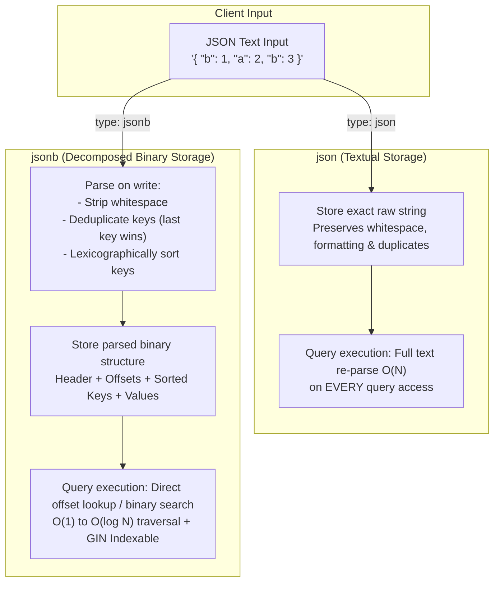
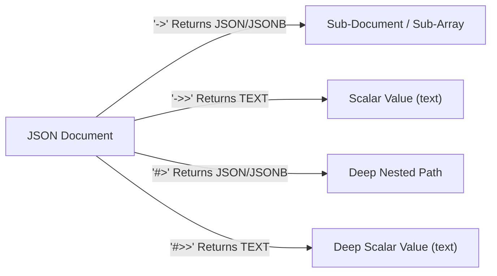
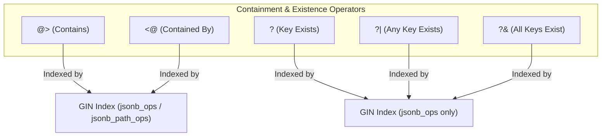
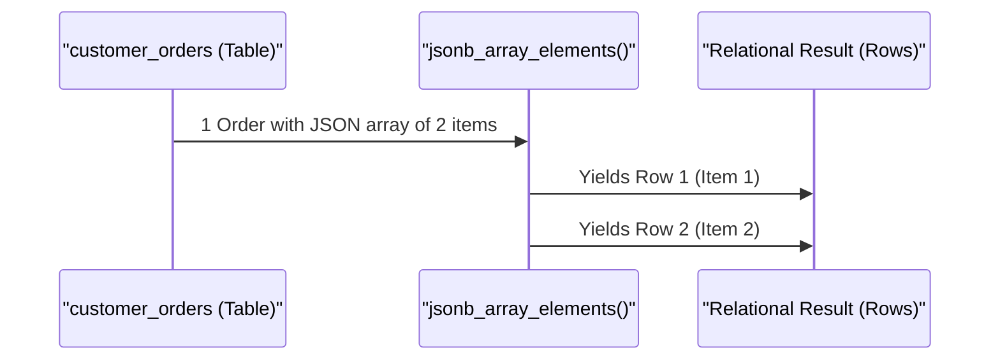
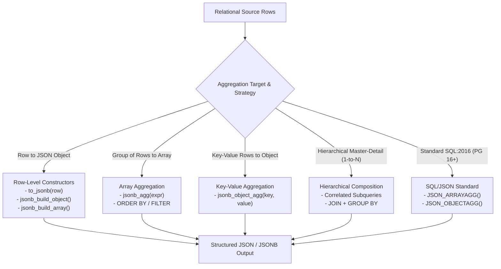
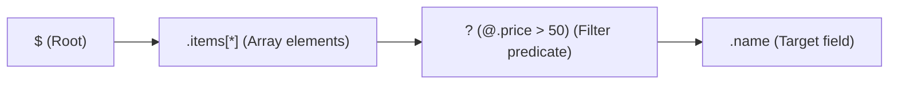
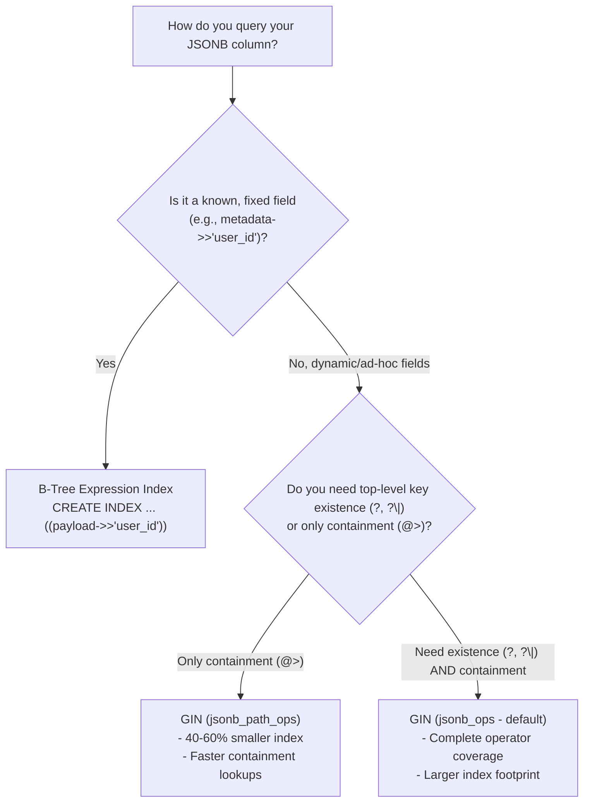
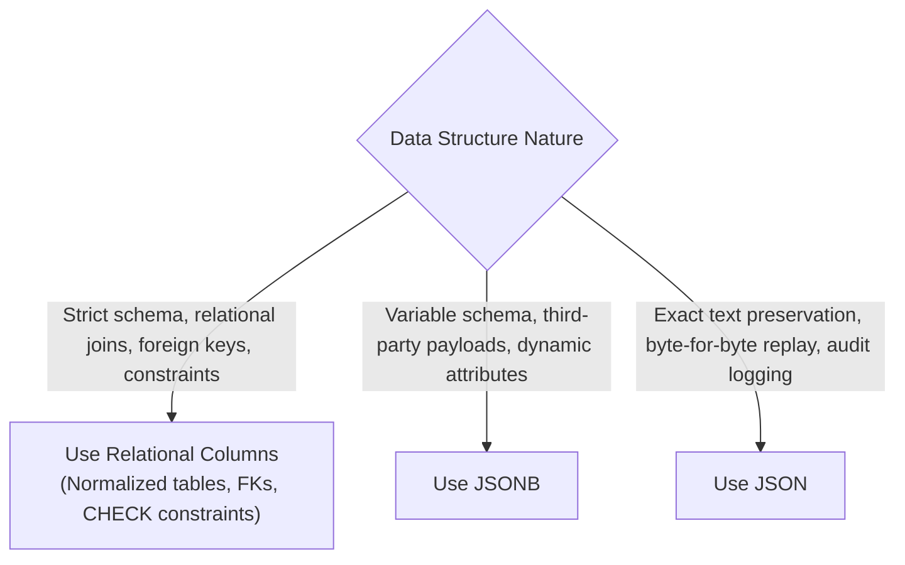

# PostgreSQL JSON & JSONB: Architecture, Querying, and Indexing

PostgreSQL provides first-class support for storing and querying semi-structured documents through two distinct data types: **`json`** and **`jsonb`**. While both accept valid RFC 7159 JSON strings, their underlying storage architecture, ingestion mechanics, query capabilities, and indexing characteristics differ fundamentally.

---

## 1. The Core Architecture: `json` vs `jsonb`

PostgreSQL implements two distinct internal engines to handle JSON:



### Architectural Breakdown

### A. `json` (Textual)

- **Storage**: Stored as a raw text string (similar to `text` or `varchar`).
- **Write Cost**: Minimal. PostgreSQL only checks that the string is valid JSON syntax before writing it straight to disk.
- **Read Cost**: High. Every time you query a key or array element, PostgreSQL must re-parse the raw text from scratch.
- **Key Characteristics**:
  - Preserves exact whitespace and indentation.
  - Preserves duplicate keys (does not remove them).
  - Preserves original key order.
  - **No GIN indexing** support for keys or values.

### B. `jsonb` (Decomposed Binary)

- **Storage**: Stored in a decomposed binary format (`jsonb` header, element count, array of header metadata/offsets, followed by sorted keys and values).
- **Write Cost**: Higher ingestion overhead because PostgreSQL parses the string, sorts keys, and encodes it into binary.
- **Read Cost**: Extremely fast. Fetching a nested key uses binary search over pre-sorted keys without re-parsing.
- **Key Characteristics**:
  - Strips insignificant whitespace.
  - Removes duplicate keys (the **last** encountered value wins).
  - Keys are sorted lexicographically.
  - Full support for **GIN (Generalized Inverted Index)** indexing, containment operators (`@>`), and JSONPath queries.

### Feature Comparison Matrix

| Feature                          | `json`                              | `jsonb`                                        |
| :------------------------------- | :---------------------------------- | :--------------------------------------------- |
| **Physical Storage**             | Raw text string                     | Decomposed binary tree                         |
| **Ingestion (INSERT) Speed**     | Faster (validates syntax only)      | Slightly slower (parses, deduplicates, sorts)  |
| **Query / Extraction Speed**     | Slower ($O(N)$ re-parse on access)  | Fast ($O(\log N)$ binary search lookup)        |
| **Whitespace Preservation**      | Yes                                 | No                                             |
| **Duplicate Keys**               | Preserved                           | Eliminated (last value wins)                   |
| **Key Ordering**                 | Preserved exactly as written        | Re-ordered lexicographically                   |
| **Indexability**                 | Expression B-Tree only              | **GIN**, GiST, B-Tree expressions              |
| **Containment Operators (`@>`)** | No                                  | Yes                                            |
| **Primary Use Case**             | Raw audit logs, exact format replay | Production application state, document queries |

---

## 2. Selecting and Extracting Data: Fundamental Operators

PostgreSQL provides dedicated operators to navigate and extract data from JSON and JSONB structures.



### The Operator Reference

| Operator  | Left Operand     | Right Operand     | Return Type      | Description                                                |
| :-------- | :--------------- | :---------------- | :--------------- | :--------------------------------------------------------- |
| **`->`**  | `json` / `jsonb` | `text` (key)      | `json` / `jsonb` | Extract JSON object field by key. Quotes preserved.        |
| **`->`**  | `json` / `jsonb` | `integer` (index) | `json` / `jsonb` | Extract JSON array element by 0-based index.               |
| **`->>`** | `json` / `jsonb` | `text` (key)      | `text`           | Extract JSON object field as **scalar text**.              |
| **`->>`** | `json` / `jsonb` | `integer` (index) | `text`           | Extract JSON array element as **scalar text**.             |
| **`#>`**  | `json` / `jsonb` | `text[]` (path)   | `json` / `jsonb` | Extract nested object/array along path as JSON.            |
| **`#>>`** | `json` / `jsonb` | `text[]` (path)   | `text`           | Extract nested object/array along path as **scalar text**. |

---

### The #1 Beginner Pitfall: `->` vs `->>`

- **`->` returns a JSON value**: If the target is string `"admin"`, `->` returns `'"admin"'` (including the JSON quotes).
- **`->>` returns scalar text**: It returns `'admin'` (plain SQL string without quotes).

```sql
-- GIVEN: payload = '{"role": "admin", "age": 30}'::jsonb

-- PITFALL: This comparison FAILS (false) because '"admin"'::jsonb != 'admin'::text
SELECT payload->'role' = 'admin'; -- FALSE

-- CORRECT: Use ->> when comparing against text literals
SELECT payload->>'role' = 'admin'; -- TRUE
```

---

### Concrete Query Examples

Given the following sample table:

```sql
CREATE TABLE customer_orders (
    id SERIAL PRIMARY KEY,
    reference VARCHAR(50) NOT NULL,
    payload JSONB NOT NULL
);

INSERT INTO customer_orders (reference, payload) VALUES
(
    'ORD-2026-001',
    '{
        "customer": {
            "name": "Sarah Connor",
            "tier": "vip",
            "address": {
                "city": "Los Angeles",
                "zipcode": "90001"
            }
        },
        "items": [
            {"sku": "SKU-A1", "name": "Mechanical Keyboard", "qty": 1, "price": 120.00},
            {"sku": "SKU-B2", "name": "USB-C Cable", "qty": 2, "price": 15.50}
        ],
        "is_paid": true,
        "total": 151.00
    }'::jsonb
);
```

#### 1. Extracting Top-Level and Nested Fields

```sql
SELECT
    reference,
    -- Extract object as JSONB
    payload->'customer' AS customer_json,

    -- Extract scalar field as text
    payload->'customer'->>'name' AS customer_name,

    -- Extract deep path directly using #>>
    payload#>>'{customer,address,city}' AS city,
    payload#>>'{customer,address,zipcode}' AS zipcode
FROM customer_orders;
```

#### 2. Querying Array Elements by Index

```sql
SELECT
    reference,
    -- First item in the array (0-based index)
    payload->'items'->0->>'name' AS first_item_name,
    (payload->'items'->0->>'price')::numeric AS first_item_price,

    -- Negative index: extracts from the end (-1 is the last item)
    payload->'items'->-1->>'name' AS last_item_name
FROM customer_orders;
```

#### 3. Filtering and Casting Types in `WHERE` Clauses

Because `->>` returns `text`, you must explicitly cast to numeric, boolean, or timestamp for arithmetic or boolean comparisons:

```sql
SELECT reference, payload#>>'{customer,name}' AS customer_name
FROM customer_orders
WHERE
    -- Boolean casting
    (payload->>'is_paid')::boolean = true

    -- Numeric casting for range queries
    AND (payload->>'total')::numeric >= 100.00

    -- String comparison
    AND payload->'customer'->>'tier' = 'vip';
```

---

## 3. Containment & Existence Operators (`jsonb` Superpowers)

PostgreSQL provides containment and existence operators that allow declarative matching against JSON sub-structures without writing verbose path expressions.



### Operator Summary

| Operator  | Left Type | Right Type | Description                           | GIN Indexable                        |
| :-------- | :-------- | :--------- | :------------------------------------ | :----------------------------------- |
| **`@>`**  | `jsonb`   | `jsonb`    | Does left JSONB contain right JSONB?  | Yes (`jsonb_ops` & `jsonb_path_ops`) |
| **`<@`**  | `jsonb`   | `jsonb`    | Is left JSONB contained within right? | Yes (`jsonb_ops` & `jsonb_path_ops`) |
| **`?`**   | `jsonb`   | `text`     | Does the top-level string/key exist?  | Yes (`jsonb_ops` only)               |
| **`?\|`** | `jsonb`   | `text[]`   | Does **any** of these keys exist?     | Yes (`jsonb_ops` only)               |
| **`?&`**  | `jsonb`   | `text[]`   | Do **all** of these keys exist?       | Yes (`jsonb_ops` only)               |

---

### Practical Containment Queries

#### Check If an Object Contains Specific Attributes (`@>`)

```sql
-- Find orders where the customer tier is 'vip'
SELECT reference
FROM customer_orders
WHERE payload @> '{"customer": {"tier": "vip"}}';
```

#### Check If an Array Contains a Specific Element

```sql
-- Find orders containing an item with SKU 'SKU-A1'
SELECT reference
FROM customer_orders
WHERE payload->'items' @> '[{"sku": "SKU-A1"}]';
```

#### Key Existence Queries (`?`, `?|`, `?&`)

```sql
-- 1. Check if top-level key 'is_paid' exists
SELECT reference FROM customer_orders WHERE payload ? 'is_paid';

-- 2. Check if ANY of the listed keys exist (OR logic)
SELECT reference FROM customer_orders WHERE payload ?| array['discount_code', 'voucher'];

-- 3. Check if ALL of the listed keys exist (AND logic)
SELECT reference FROM customer_orders WHERE payload ?& array['customer', 'items', 'total'];
```

---

## 4. Expanding & Unnesting JSON Data into Relational Rows

JSON documents often encapsulate one-to-many relationships (e.g., items within an order). PostgreSQL provides set-returning functions to normalize JSON structures into relational rows and columns.



### A. Unnesting Arrays: `jsonb_array_elements()` and `CROSS JOIN LATERAL`

Use `jsonb_array_elements()` to expand a JSON array into a set of JSONB rows. Combine it with `CROSS JOIN LATERAL` to correlate array elements back to the parent row:

```sql
SELECT
    o.reference,
    item->>'sku' AS sku,
    item->>'name' AS item_name,
    (item->>'qty')::int AS quantity,
    (item->>'price')::numeric AS unit_price,
    ((item->>'qty')::int * (item->>'price')::numeric) AS line_total
FROM customer_orders o
CROSS JOIN LATERAL jsonb_array_elements(o.payload->'items') AS item;
```

**Result Output:**

| reference      | sku      | item_name           | quantity | unit_price | line_total |
| :------------- | :------- | :------------------ | :------- | :--------- | :--------- |
| `ORD-2026-001` | `SKU-A1` | Mechanical Keyboard | 1        | 120.00     | 120.00     |
| `ORD-2026-001` | `SKU-B2` | USB-C Cable         | 2        | 15.50      | 31.00      |

> [!TIP]
>
> Use `LEFT JOIN LATERAL ... ON true` instead of `CROSS JOIN LATERAL` if some rows might have an empty or `NULL` items array, ensuring parent orders are not filtered out.

---

### B. Unnesting Dynamic Key-Value Pairs: `jsonb_each()` / `jsonb_each_text()`

When a JSON object has arbitrary, dynamic keys:

```sql
-- GIVEN: payload->'customer'->'address' = '{"city": "Los Angeles", "zipcode": "90001"}'
SELECT
    o.reference,
    kv.key AS address_field,
    kv.value AS address_val
FROM customer_orders o
CROSS JOIN LATERAL jsonb_each_text(o.payload#>'{customer,address}') AS kv;
```

---

### C. Projecting JSON to Strongly-Typed Columns: `jsonb_to_recordset()`

`jsonb_to_recordset()` flattens an array of objects directly into a predefined relational schema without manually parsing each field:

```sql
SELECT
    o.reference,
    items.*
FROM customer_orders o
CROSS JOIN LATERAL jsonb_to_recordset(o.payload->'items') AS items(
    sku text,
    name text,
    qty integer,
    price numeric
);
```

---

### D. Re-Aggregating Relational Rows into JSON

PostgreSQL provides a rich suite of functions and aggregate operators to transform scalar columns, composite records, and multi-row relational result sets back into structured JSON and JSONB documents. This allows applications to assemble complex hierarchical documents, API payloads, and dynamic dictionaries directly within the database engine—eliminating client-side transformation overhead and avoiding the dreaded N+1 query problem.



---

#### 1. Row-Level JSON Constructors (The Building Blocks)

Before aggregating across multiple rows, individual rows or specific columns can be transformed into JSON objects or arrays:

##### A. `to_jsonb(record)`: Whole-Row Serialization

Serializes an entire table row, composite record, or subquery alias directly into a JSONB object using column names as keys:

```sql
-- 1. Serialize entire table row into a JSONB object
SELECT to_jsonb(o) FROM customer_orders o;
-- Result: {"id": 1, "reference": "ORD-2026-001", "payload": {...}}

-- 2. Serialize a subquery projection to select specific columns
SELECT to_jsonb(sub)
FROM (
    SELECT id, reference, (payload->>'total')::numeric AS total
    FROM customer_orders
) sub;
-- Result: {"id": 1, "reference": "ORD-2026-001", "total": 151.00}
```

##### B. `jsonb_build_object(key, value, ...)`: Explicit Field Mapping

Constructs a JSONB object from alternating key-value arguments. Keys are automatically coerced to `text`, and values are converted to their JSON representation:

```sql
SELECT jsonb_build_object(
    'order_ref', reference,
    'billed_total', (payload->>'total')::numeric,
    'is_paid', (payload->>'is_paid')::boolean,
    'meta', jsonb_build_object(
        'generated_at', now(),
        'customer_tier', payload->'customer'->>'tier'
    )
) AS custom_order_json
FROM customer_orders;
```

##### C. `jsonb_build_array(val1, val2, ...)`: Constructing JSON Arrays

Builds a JSONB array from an arbitrary list of arguments:

```sql
SELECT jsonb_build_array(id, reference, (payload->>'total')::numeric)
FROM customer_orders;
-- Result: [1, "ORD-2026-001", 151.00]
```

##### D. `jsonb_object(keys[], values[])`: Constructing from Arrays

Constructs a JSONB object from two parallel 1D text arrays (keys and values) or a single 1D array of alternating keys and values:

```sql
-- Alternating key/value array
SELECT jsonb_object('{region, "North America", status, "active"}'::text[]);
-- Result: {"region": "North America", "status": "active"}

-- Separate keys array and values array
SELECT jsonb_object(
    ARRAY['category', 'tier', 'currency'],
    ARRAY['electronics', 'vip', 'USD']
);
-- Result: {"category": "electronics", "tier": "vip", "currency": "USD"}
```

---

#### 2. Aggregating Multiple Rows into an Array: `jsonb_agg()`

`jsonb_agg()` is an aggregate function that gathers values or objects across multiple rows into a single JSONB array (`[...]`).

##### A. Basic Aggregation with Object Construction

Combine `jsonb_agg()` with `jsonb_build_object()` to project relational rows into an array of JSON objects:

```sql
SELECT jsonb_agg(
    jsonb_build_object(
        'ref', reference,
        'customer', payload->'customer'->>'name',
        'total', (payload->>'total')::numeric
    )
) AS orders_array
FROM customer_orders;
```

##### B. Ordering Inside the Aggregate (`ORDER BY`)

Because JSON array order matters, you can enforce deterministic sorting inside the aggregate call:

```sql
SELECT jsonb_agg(
    jsonb_build_object('ref', reference, 'total', (payload->>'total')::numeric)
    ORDER BY (payload->>'total')::numeric DESC
) AS ranked_orders
FROM customer_orders;
```

##### C. Conditional Aggregation (`FILTER (WHERE ...)`)

Filter elements included in the aggregated array without filtering rows from the outer query:

```sql
SELECT
    payload->'customer'->>'tier' AS tier,
    COUNT(*) AS total_orders,
    jsonb_agg(reference) FILTER (WHERE (payload->>'total')::numeric > 100) AS high_value_orders
FROM customer_orders
GROUP BY payload->'customer'->>'tier';
```

##### D. Handling `NULL` Values & Empty Sets

> [!IMPORTANT]
>
> - **Empty Result Set**: If a query matches zero rows, `jsonb_agg()` returns a SQL `NULL`, **not** an empty JSON array `[]`. Always wrap with `COALESCE` when an empty array is expected by clients:
>
>   ```sql
>   SELECT COALESCE(jsonb_agg(to_jsonb(o)), '[]'::jsonb) FROM customer_orders o WHERE false;
>   -- Returns: [] (instead of NULL)
>   ```

> - **NULL Values**: If the aggregated expression evaluates to SQL `NULL`, `jsonb_agg` inserts a JSON `null` literal into the array (`[null]`). Use `FILTER (WHERE ... IS NOT NULL)` to exclude them:
>
>   ```sql
>   SELECT jsonb_agg(item_id) FILTER (WHERE item_id IS NOT NULL) FROM order_items;
>   ```

---

#### 3. Aggregating Key-Value Rows into a JSON Object: `jsonb_object_agg()`

`jsonb_object_agg(key, value)` aggregates pairs of key-value expressions from multiple rows into a single JSONB object (`{ "key1": val1, "key2": val2 }`).

##### A. Pivoting Dynamic Key-Value / Attributes Tables (EAV)

When working with settings tables, dynamic tags, or metric dictionaries:

```sql
-- Given a relational table: user_settings(user_id int, setting_key text, setting_val text)
SELECT
    user_id,
    jsonb_object_agg(setting_key, setting_val) AS settings_map
FROM user_settings
GROUP BY user_id;

-- Output:
-- user_id | settings_map
-- --------+-------------------------------------------------------------
-- 42      | {"theme": "dark", "email_alerts": "true", "timezone": "PST"}
```

##### B. Aggregating Group Summaries into a Dictionary

```sql
-- Produce a dictionary of customer tier counts: {"vip": 120, "standard": 450}
SELECT jsonb_object_agg(tier, order_count) AS orders_by_tier
FROM (
    SELECT
        payload->'customer'->>'tier' AS tier,
        COUNT(*) AS order_count
    FROM customer_orders
    GROUP BY payload->'customer'->>'tier'
) sub;
```

> [!WARNING]
>
> - **Duplicate Keys**: In `jsonb_object_agg()`, if multiple rows yield the same key string, the **last processed row overwrites earlier rows** (since `jsonb` keys are unique).
> - **NULL Keys Prohibited**: JSON object keys cannot be `NULL`. If the key expression evaluates to `NULL`, PostgreSQL raises an error: `ERROR: field name must not be null`. Guard with `WHERE key IS NOT NULL` or `COALESCE(key, 'default')`.

---

#### 4. Master-Detail (1-to-N) Hierarchical Aggregation Patterns

Aggregating child records into nested JSON arrays attached to a parent record is the standard pattern for single-roundtrip relational fetching without N+1 query loops.

##### Pattern A: Correlated Subquery with `jsonb_agg()` (Recommended)

Using a correlated subquery in the `SELECT` projection avoids outer `GROUP BY` clauses and eliminates Cartesian product row multiplication when joining multiple independent 1-to-N child tables:

```sql
-- Re-aggregating unnested order items into a nested JSONB array on the parent order:
SELECT
    o.id,
    o.reference,
    (o.payload->>'total')::numeric AS total,
    COALESCE((
        SELECT jsonb_agg(
            jsonb_build_object(
                'sku', item->>'sku',
                'name', item->>'name',
                'line_total', (item->>'qty')::int * (item->>'price')::numeric
            )
            ORDER BY (item->>'price')::numeric DESC
        )
        FROM jsonb_array_elements(o.payload->'items') AS item
        WHERE (item->>'price')::numeric >= 20.00
    ), '[]'::jsonb) AS filtered_items
FROM customer_orders o;
```

##### Pattern B: `LEFT JOIN` + `GROUP BY` with `FILTER`

When working with normalized relational tables (e.g., parent `orders` and child `order_items`):

```sql
SELECT
    o.id AS order_id,
    o.reference,
    COALESCE(
        jsonb_agg(
            jsonb_build_object(
                'sku', i.sku,
                'qty', i.quantity,
                'price', i.unit_price
            )
            ORDER BY i.sku
        ) FILTER (WHERE i.id IS NOT NULL),
        '[]'::jsonb
    ) AS items
FROM orders o
LEFT JOIN order_items i ON i.order_id = o.id
GROUP BY o.id, o.reference;
```

> [!CAUTION]
> **Cartesian Explosion Pitfall**: If you `LEFT JOIN` two independent 1-to-N tables (e.g., `orders LEFT JOIN order_items` AND `LEFT JOIN order_payments`), rows multiply ($M \times N$). Running `jsonb_agg()` across this join will produce duplicate entries in both arrays. Always prefer **Correlated Subqueries** or **pre-aggregated CTEs** when assembling multiple child collections.

---

#### 5. Constructing Full API Envelope Payloads Directly in SQL

Combine Common Table Expressions (CTEs), `jsonb_build_object()`, and `jsonb_agg()` to output a production-ready REST or GraphQL response envelope in a single query:

```sql
WITH paged_orders AS (
    SELECT
        id,
        reference,
        payload->'customer'->>'name' AS customer_name,
        (payload->>'total')::numeric AS total
    FROM customer_orders
    ORDER BY id
    LIMIT 20 OFFSET 0
),
meta_stats AS (
    SELECT COUNT(*) AS total_records FROM customer_orders
)
SELECT jsonb_build_object(
    'status', 'success',
    'data', COALESCE(
        (SELECT jsonb_agg(to_jsonb(paged_orders)) FROM paged_orders),
        '[]'::jsonb
    ),
    'meta', jsonb_build_object(
        'total_count', (SELECT total_records FROM meta_stats),
        'limit', 20,
        'offset', 0,
        'timestamp', clock_timestamp()
    )
) AS api_response;
```

**JSON Output:**

```json
{
  "status": "success",
  "data": [
    {
      "id": 1,
      "reference": "ORD-2026-001",
      "customer_name": "Sarah Connor",
      "total": 151.0
    }
  ],
  "meta": {
    "total_count": 1,
    "limit": 20,
    "offset": 0,
    "timestamp": "2026-09-13T19:45:00.123456+00:00"
  }
}
```

---

#### 6. SQL:2016 Standard SQL/JSON Aggregates (PostgreSQL 16+)

Starting in PostgreSQL 16, standard SQL:2016 / SQL:2023 JSON constructor and aggregate functions are supported alongside PostgreSQL's native functions:

```sql
-- Standard JSON_ARRAYAGG and JSON_OBJECT
SELECT JSON_ARRAYAGG(
    JSON_OBJECT(
        KEY 'order_ref' VALUE reference,
        KEY 'amount' VALUE (payload->>'total')::numeric
        ABSENT ON NULL
    )
    ORDER BY (payload->>'total')::numeric DESC
    RETURNING jsonb
) AS standard_json_array
FROM customer_orders;
```

Key benefits of SQL:2016 standard functions:

- **`ABSENT ON NULL`**: Automatically strips keys or array entries where the value is SQL `NULL` without needing manual filters or post-processing.
- **`NULL ON NULL`**: Explicitly includes JSON `null` literals for null expressions (the default).
- **`RETURNING jsonb`**: Directly specifies whether the output type is `json` or `jsonb`.

---

#### 7. Cleaning Output: Stripping NULL Values with `jsonb_strip_nulls()`

When constructing JSON objects from nullable columns using `jsonb_build_object('k', col)`, null values produce `{"k": null}`. To strip out keys with null values recursively:

```sql
SELECT jsonb_strip_nulls(
    jsonb_build_object(
        'order_id', 1,
        'coupon_code', NULL::text,
        'discount_applied', NULL::numeric,
        'status', 'completed'
    )
);
-- Result: {"order_id": 1, "status": "completed"}
```

---

## 5. SQL/JSON Path Expressions (PostgreSQL 12+)

PostgreSQL 12 introduced support for the SQL/JSON standard path specification. JSONPath allows complex navigation, wildcards, and filter predicates in a compact syntax.

### Path Syntax Overview

- `$` represents the root JSON document.
- `.` navigates to a child element (`$.customer.name`).
- `[*]` represents array elements wildcard.
- `? (...)` denotes a filter predicate evaluated against the current item (`@`).



### JSONPath Query Functions & Operators

| Function / Operator                   | Description                                                           |
| :------------------------------------ | :-------------------------------------------------------------------- |
| **`jsonb_path_query(target, path)`**  | Extracts all JSONB values matching the path expression (returns set). |
| **`jsonb_path_exists(target, path)`** | Returns `boolean`: does any element match the path?                   |
| **`@?` (Path exists operator)**       | Boolean operator: checks if path matches anywhere in JSONB.           |
| **`@@` (Path predicate operator)**    | Boolean operator: evaluates a boolean predicate expression.           |

### Practical JSONPath Examples

#### 1. Extract All Items with Price Greater than 50

```sql
SELECT
    reference,
    jsonb_path_query(payload, '$.items[*] ? (@.price > 50).name') AS expensive_item
FROM customer_orders;
-- Returns: "Mechanical Keyboard"
```

#### 2. Boolean Filtering Using `@?` and `@@`

```sql
-- Check if the order contains an item with qty > 1
SELECT reference
FROM customer_orders
WHERE payload @? '$.items[*] ? (@.qty > 1)';

-- Check if total is greater than 100 using @@
SELECT reference
FROM customer_orders
WHERE payload @@ '$.total > 100';
```

---

## 6. Indexing Strategies for JSONB

Querying non-indexed JSON columns forces PostgreSQL to execute a **Sequential Scan**, reading every single 8 KB heap page from disk and evaluating the JSON structure on every row.

PostgreSQL provides two primary indexing strategies for JSONB:



---

### Strategy 1: B-Tree on Extracted Expression (Targeted Indexing)

If your queries consistently filter on a specific JSON key, create a standard **B-Tree index on the extracted expression**. This is smaller, faster, and cheaper to maintain than a GIN index.

```sql
-- Note the extra parentheses: required for expression indexes in PostgreSQL
CREATE INDEX idx_orders_customer_tier
ON customer_orders (((payload->'customer'->>'tier')));

-- Fully indexed lookup:
EXPLAIN ANALYZE
SELECT reference
FROM customer_orders
WHERE payload->'customer'->>'tier' = 'vip';
```

> [!IMPORTANT]
>
> The `WHERE` clause expression must **exactly match** the index expression. If the index is built on `((payload->>'total')::numeric)`, querying with `WHERE payload->>'total' = '151.00'` will **not** use the index.

---

### Strategy 2: GIN Index with Default `jsonb_ops`

A GIN index maps every single key and value inside the JSON document into an inverted index structure.

```sql
-- Default operator class is jsonb_ops
CREATE INDEX idx_orders_payload_gin
ON customer_orders USING GIN (payload);
```

- **Supported Operators**: `@>`, `?`, `?|`, `?&`.
- **Index Structure**: Creates an index entry for every individual key, value, and array element.
- **Trade-off**: Larger disk size and higher write overhead on `INSERT`/`UPDATE`.

```sql
-- Uses idx_orders_payload_gin:
SELECT reference FROM customer_orders WHERE payload @> '{"is_paid": true}';
SELECT reference FROM customer_orders WHERE payload ? 'customer';
```

---

### Strategy 3: GIN Index with `jsonb_path_ops` (Optimized Containment)

`jsonb_path_ops` hashes the entire path and value together (e.g., `hash("customer" -> "address" -> "city" -> "Los Angeles")`).

```sql
CREATE INDEX idx_orders_payload_path_ops
ON customer_orders USING GIN (payload jsonb_path_ops);
```

- **Supported Operators**: **Only `@>`** (containment). Does NOT support `?`, `?|`, or `?&`.
- **Advantages**:
  - **~40% to 60% smaller disk footprint** than standard `jsonb_ops`.
  - **Faster searches** for containment queries because single hash matches replace multi-key intersection lookups.

---

### Index Selection Summary

| Index Type                 | Definition                          | Supports Operators                   | Size / Write Cost   | Best Used For                                             |
| :------------------------- | :---------------------------------- | :----------------------------------- | :------------------ | :-------------------------------------------------------- |
| **B-Tree Expression**      | `ON table (((data->>'key')::type))` | `=`, `<`, `>`, `BETWEEN`, `ORDER BY` | Minimal / Very Low  | Known high-frequency query fields                         |
| **GIN (`jsonb_ops`)**      | `USING GIN (data)`                  | `@>`, `?`, `?\|`, `?&`               | Large / High        | Ad-hoc queries needing containment + key existence checks |
| **GIN (`jsonb_path_ops`)** | `USING GIN (data jsonb_path_ops)`   | `@>` only                            | Moderate / Moderate | Arbitrary containment queries with lower storage overhead |

---

## 7. Architectural Guidelines & Anti-patterns

While PostgreSQL's JSONB is exceptionally fast, misapplying document storage in a relational database introduces significant architectural debt.



### When to Use JSONB

1. **Third-Party API Payloads**: Storing external responses (e.g., Stripe webhooks, partner telemetry) where schemas evolve outside your control.
2. **Dynamic / User-Defined Attributes**: E-commerce product variants with hundreds of sporadic specifications (e.g., screen refresh rate, torque, fabric type).
3. **Sparse Properties**: Datasets where 90% of attributes are empty for any given record.

### Anti-Patterns to Avoid

> [!WARNING]
>
> **1. The "EAV in JSON" Escape Hatch**: Do not move relational attributes into JSONB just to bypass migrations. JSON columns cannot enforce foreign key constraints, primary keys, or column-level check constraints without trigger overhead.

> [!WARNING]
>
> **2. Frequent In-Place Updates on Large Documents**: In PostgreSQL, every `UPDATE` writes a **brand new version of the entire row** (due to MVCC). Updating a 50 KB JSONB document 100 times creates 5 MB of dead tuples, driving table bloat and high write amplification.

> [!WARNING]
>
> **3. Selecting Unneeded Massive JSON Columns**: Running `SELECT *` on a table with multi-megabyte JSONB columns pulls all out-of-line TOAST data across disk and network, degrading cache efficiency and query throughput. Always select specific extracted keys: `SELECT id, payload->>'status' FROM ...`.
