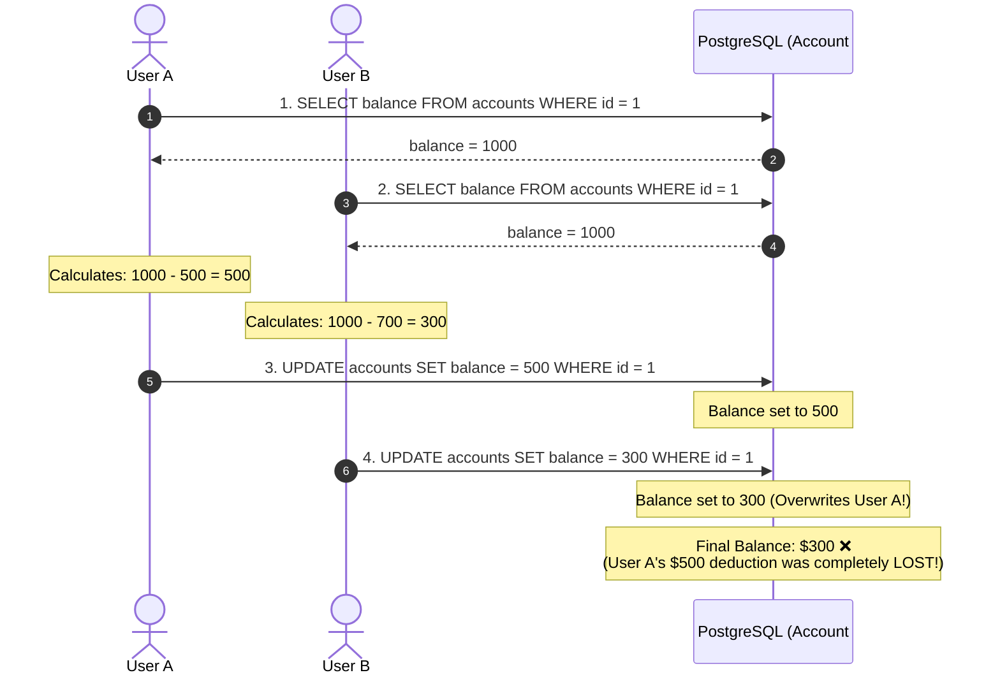
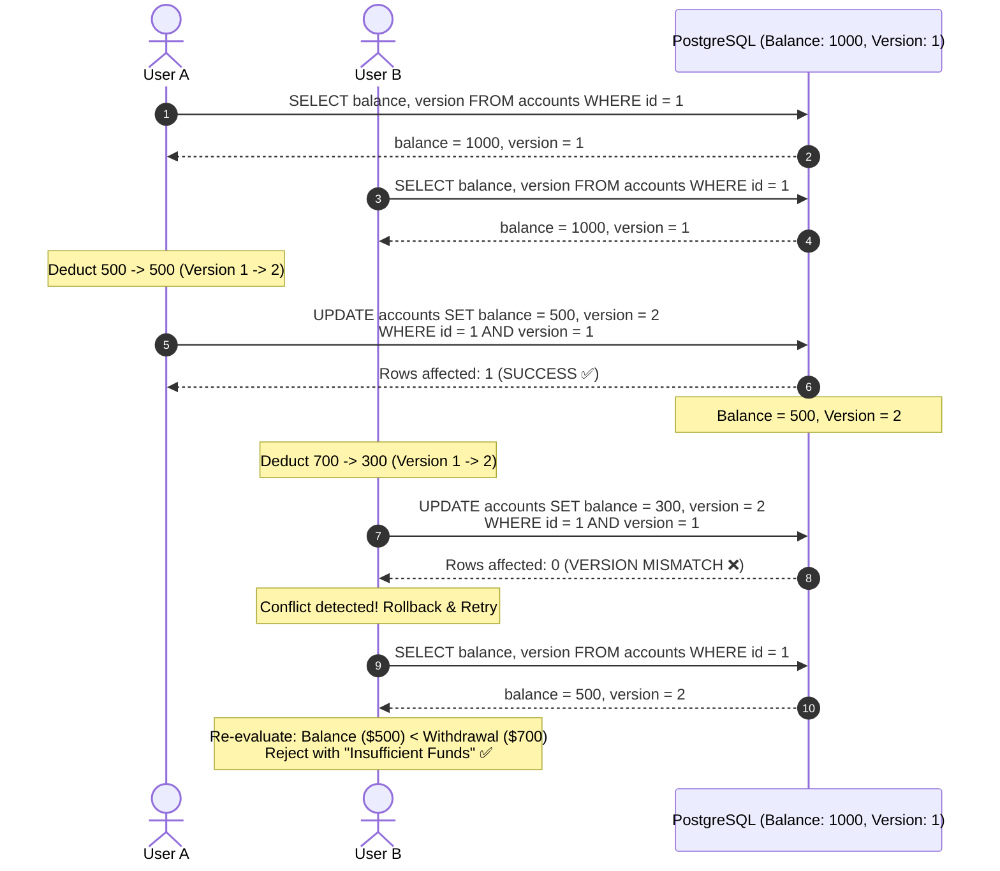
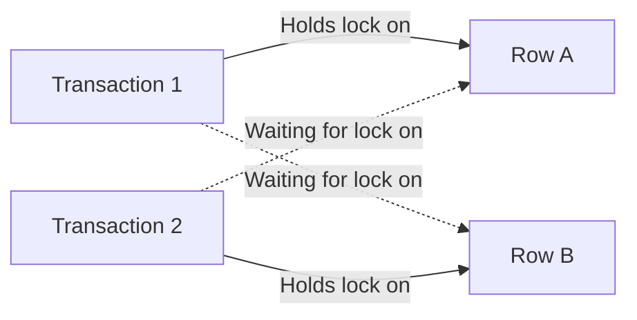
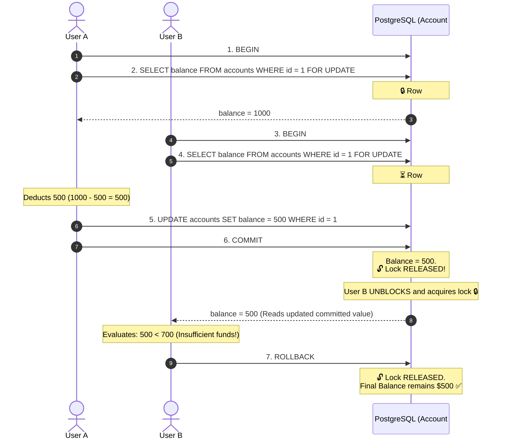
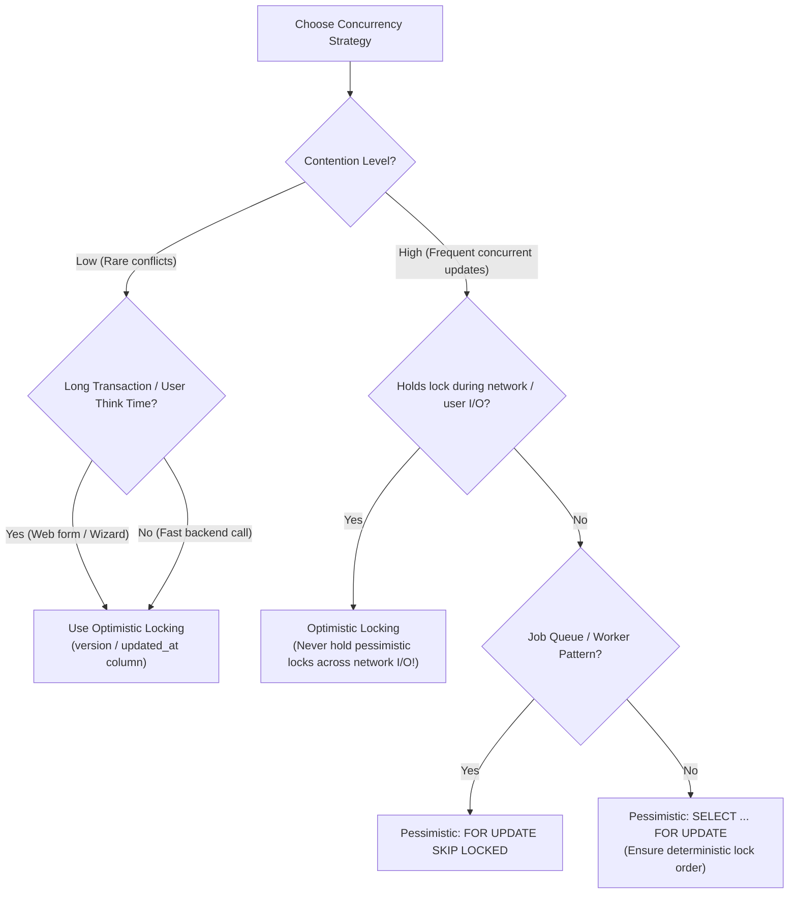

# PostgreSQL Concurrency Control: Optimistic vs. Pessimistic Locking

In multi-user database systems, concurrent transactions frequently attempt to read and modify the same records at the same time. While PostgreSQL's Multi-Version Concurrency Control (MVCC) ensures that **readers never block writers and writers never block readers**, it does not automatically prevent concurrent **write-write conflicts** at the application level.

To prevent race conditions, data corruption, and lost updates, applications must choose an appropriate concurrency control strategy: **Optimistic Locking** or **Pessimistic Locking**.

---

## 1. The Problem: The Lost Update Anomaly

Consider a banking application where Account #1 has an initial balance of **$1,000**. Two users (or service threads) concurrently attempt to withdraw funds:

- **User A** wants to deduct **$500**.
- **User B** wants to deduct **$700**.

### Without Locking (Data Corruption)



Without concurrency control:

1. Both transactions read the same initial state (`balance = 1000`).
2. Each transaction calculates the new balance in local application memory.
3. User B's write blindly overwrites User A's update.
4. The bank loses $500 because User A's deduction is silently obliterated.

---

## 2. Concepts

### Concept 1: Optimistic Locking (Best for Low Contention)

**Optimistic Locking** assumes that data conflicts are rare. Transactions do not lock records when reading. Instead, each record tracks a **version counter** (or timestamp). When writing changes back to the database, the transaction verifies that the version has not changed since it was read. If another transaction changed the version in the meantime, the update is rejected, and the application must reload and retry.

#### How It Works

1. **Read**: The application reads the row along with its current `version` (e.g., `version = 1`).
2. **Compute**: The business logic executes in application memory without holding any database locks.
3. **Validate & Update**: The application executes an `UPDATE` statement that specifically targets `version = 1` and increments `version = 2`.
4. **Check Affected Rows**:
   - If **`rows affected == 1`**: The update succeeded. No concurrent modifications occurred.
   - If **`rows affected == 0`**: Another transaction updated the row first. The application rolls back, refetches the latest version, and retries.

#### PostgreSQL Implementation

```sql
-- Step 1: Read data and version (No lock held)
SELECT id, balance, version
FROM accounts
WHERE id = 1;
-- Returns: balance = 1000, version = 1

-- Step 2: Application computes: new_balance = 1000 - 500 = 500

-- Step 3: Conditional update
UPDATE accounts
SET balance = 500,
    version = version + 1
WHERE id = 1
  AND version = 1; -- Ensures no one modified it in the meantime

-- Step 4: Inspect rows affected in application driver
-- If rows_affected == 0 -> Raise OptimisticLockException -> Refetch & Retry
```

> [!TIP]
> **Can we use PostgreSQL's internal `xmin` system column?**
> While `WHERE id = 1 AND xmin = :read_xmin` is possible, using an explicit application column (e.g., `version INT NOT NULL DEFAULT 1` or `updated_at TIMESTAMPTZ`) is strongly recommended. `xmin` can change during background vacuuming, row re-writing, or trigger operations, causing false conflict rejections.

#### Pros & Cons

- **Pros**:
  - **High Throughput & Scalability**: No database locks held during processing or external I/O.
  - **Zero Deadlocks**: Because transactions do not hold locks while waiting on others, deadlocks cannot occur.
  - **Ideal for Distributed & Stateless Systems**: Works across long user think times (e.g., filling out a web form across 5 minutes).
- **Cons**:
  - **High Contention Penalty**: Under heavy write contention, high abort/retry rates waste CPU and database bandwidth.
  - **Requires Retry Logic**: The application layer must implement exponential backoff, jitter, and retry handlers.

#### Interaction



---

### Concept 2: Pessimistic Locking (Best for High Contention)

**Pessimistic Locking** assumes that concurrent conflicts are likely. Instead of validating at write time, a transaction **explicitly locks the target rows upfront** before reading or modifying them. Other transactions attempting to modify or acquire conflicting locks on the same records are forced to wait in a queue until the locking transaction finishes (`COMMIT` or `ROLLBACK`).

#### How It Works

1. **Begin Transaction**: The application starts a transaction (`BEGIN`).
2. **Acquire Lock**: The query fetches the row using `SELECT ... FOR UPDATE`, placing an exclusive row-level lock on the tuple.
3. **Block Contenders**: Any other transaction attempting to `SELECT ... FOR UPDATE` or `UPDATE` the same row blocks and waits.
4. **Mutate & Release**: The transaction updates the row and executes `COMMIT`, which automatically applies the change and releases the lock to the next queued transaction.

#### PostgreSQL Implementation

```sql
-- Session A
BEGIN;

-- Acquires an exclusive row-level lock on row id = 1
SELECT balance
FROM accounts
WHERE id = 1
FOR UPDATE;
-- Returns: balance = 1000

UPDATE accounts
SET balance = balance - 500
WHERE id = 1;

COMMIT; -- Lock is released here!
```

```sql
-- Session B (Running concurrently)
BEGIN;

-- This query BLOCKS until Session A commits or rolls back
SELECT balance
FROM accounts
WHERE id = 1
FOR UPDATE;

-- After Session A commits, Session B unblocks and reads: balance = 500
UPDATE accounts
SET balance = balance - 700
WHERE id = 1;
-- Application sees balance is 500, rejects over-draft!

ROLLBACK;
```

#### Non-Blocking Variants (`NOWAIT` & `SKIP LOCKED`)

In high-concurrency environments, waiting indefinitely for locks can cause connection pool starvation. PostgreSQL provides two vital modifiers:

1. **`NOWAIT`**: Fails immediately if the row is locked rather than waiting.
   ```sql
   SELECT * FROM accounts WHERE id = 1 FOR UPDATE NOWAIT;
   -- ERROR: could not obtain lock on row in relation "accounts"
   ```
2. **`SKIP LOCKED`**: Skips any locked rows and returns only unlocked rows. This is the industry-standard pattern for building **high-throughput job queues** and background worker pools:
   ```sql
   -- Fetch and lock the next available unprocessed job
   SELECT * FROM task_queue
   WHERE status = 'PENDING'
   ORDER BY id
   LIMIT 1
   FOR UPDATE SKIP LOCKED;
   ```

#### Deadlock Risk & Mitigation

Because pessimistic locking holds locks across multiple operations, concurrent transactions can easily form circular wait dependencies (**deadlocks**):

- Transaction 1 locks Row A, requests Row B.
- Transaction 2 locks Row B, requests Row A.



PostgreSQL detects deadlocks using its internal `deadlock_timeout` (default: **1 second**). If a cycle is detected, the database aborts one of the transactions with:

```text
ERROR: deadlock detected
DETAIL: Process 12345 waits for ExclusiveLock on tuple...
```

> [!IMPORTANT]
> **Deadlock Prevention Rule**: Always acquire locks in a **consistent, deterministic order** across all transactions (e.g., always sort row IDs in ascending order before locking: `SELECT * FROM accounts WHERE id IN (1, 2) ORDER BY id FOR UPDATE`).

#### Pros & Cons

- **Pros**:
  - **Guaranteed Consistency**: Zero risk of lost updates or application-level overwrite anomalies.
  - **No Wasted Computation**: Prevents the churn of repeated rollbacks and retries under high contention.
  - **Simple Programming Model**: Logic does not need complex retry loops.
- **Cons**:
  - **Blocking & Serialization**: Concurrent transactions are queued, increasing latency and reducing throughput.
  - **Connection Pool Exhaustion**: Long lock waits hold connection pool slots idle, risking pool starvation.
  - **Deadlock Potential**: Circular lock dependencies require deterministic ordering or retry handlers.

#### Interaction



---

## 3. Deep Dive: PostgreSQL Row-Level Lock Modes

PostgreSQL offers fine-grained row-level lock modes to prevent unnecessary blocking between non-conflicting queries:

| Lock Mode               | SQL Clause                     | Blocks Concurrent Writes (`UPDATE`/`DELETE`)? | Blocks `SELECT FOR UPDATE`? | Self-Compatible? | Allows Concurrent Readers (`SELECT`)? | Common Use Case                                                                                                |
| :---------------------- | :----------------------------- | :-------------------------------------------: | :-------------------------: | :--------------: | :-----------------------------------: | :------------------------------------------------------------------------------------------------------------- |
| **`FOR UPDATE`**        | `SELECT ... FOR UPDATE`        |                    **Yes**                    |           **Yes**           |      **No**      |                **Yes**                | Strict mutual exclusion before updating or deleting rows.                                                      |
| **`FOR NO KEY UPDATE`** | `SELECT ... FOR NO KEY UPDATE` |                    **Yes**                    |           **Yes**           |      **No**      |                **Yes**                | Updating columns _other than_ unique/primary keys (does not block foreign key checks).                         |
| **`FOR SHARE`**         | `SELECT ... FOR SHARE`         |                    **Yes**                    |           **Yes**           |     **Yes**      |                **Yes**                | Guaranteeing rows are not deleted or modified while being read (multiple readers can share-lock the same row). |
| **`FOR KEY SHARE`**     | `SELECT ... FOR KEY SHARE`     |            **Only if key changes**            |           **No**            |     **Yes**      |                **Yes**                | Foreign key enforcement (Postgres acquires this automatically on referenced parent rows).                      |

---

## 4. When to Use What? (Decision Matrix)



### Scenario Comparison Matrix

| Scenario                                                                         |   Use Optimistic Locking    |      Use Pessimistic Locking      | Recommended Approach                                                                            |
| :------------------------------------------------------------------------------- | :-------------------------: | :-------------------------------: | :---------------------------------------------------------------------------------------------- |
| **Low Contention** _(rare concurrent updates)_                                   |  ✅ **Better Performance**  |           ❌ Not needed           | **Optimistic**: Avoids unnecessary locking overhead and latch contention.                       |
| **High Contention** _(frequent updates to same row, e.g. flash sales)_           | ❌ Many conflicts & retries |     ✅ **Better Consistency**     | **Pessimistic**: Queues requests cleanly without wasting CPU on repeated rollbacks.             |
| **Long Transactions / Human "Think Time"** _(e.g. multi-step forms)_             |     ✅ **Recommended**      |     ❌ Never hold locks open      | **Optimistic**: Pessimistic locks hold database connections open, starving the connection pool. |
| **Short, High-Speed Transactions** _(e.g. financial ledgers, balance transfers)_ |           ✅ Good           |            ✅ **Good**            | **Pessimistic**: Guarantees serial execution without retry logic complexity.                    |
| **Task / Job Queue Worker Pools**                                                |       ❌ Inefficient        | ✅ **Optimal with `SKIP LOCKED`** | **Pessimistic (`SKIP LOCKED`)**: Prevents duplicate task processing without blocking workers.   |

---

## 5. Key Takeaways

> [!IMPORTANT]
>
> - **Optimistic Locking**: Does not lock data upfront. Detects conflicts at write time using a `version` or `updated_at` column. Requires application-side retry mechanisms. Ideal for low-contention workloads and distributed, stateless architectures.
> - **Pessimistic Locking**: Locks data upfront using `SELECT ... FOR UPDATE`. Avoids conflicts by blocking competing transactions. Can lead to deadlocks, increased latency, and connection pool exhaustion if held too long.
> - **Never hold pessimistic locks across external network calls or user think time**: Database transactions must be as short as possible to prevent holding connections and locks hostage.
> - **Use `SKIP LOCKED` for queue consumers**: It enables lock-free consumer scaling without lock contention or duplicate message processing.
