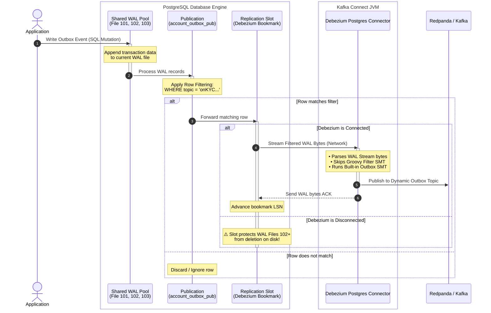

# PostgreSQL Logical Replication Architecture & Commands Guide

PostgreSQL Logical Replication follows a **Publish-Subscribe** model. Instead of copying raw disk blocks byte-for-byte (like physical replication), logical replication streams data changes dynamically based on SQL-like operations (`INSERT`, `UPDATE`, `DELETE`, `TRUNCATE`).

---

## 1. Core Architecture Under the Hood

Logical replication relies on three distinct components working together: the **Publication**, the **Shared WAL Pool**, and the **Logical Replication Slot**.

### The Roles Explained

- **Publication (The Blueprint):** Lives on the publisher database. It is entirely passive and merely defines _what_ tables, actions, and row-level criteria (`WHERE` clauses) should be made available for replication.
- **Shared WAL Pool (The Engine):** Postgres maintains a single global directory of Write-Ahead Logs (`pg_wal`). When `wal_level = logical`, Postgres writes enough transaction information to these files to reconstruct standard SQL operations.
- **Logical Replication Slot (The Safeguard/Bookmark):** Lives on the publisher database. It acts as an active pointer or "bookmark" tracking exactly how far a subscriber (Debezium) has read through the shared WAL files. It explicitly protects unread WAL files from being deleted by Postgres' space-clearing processes.

---

### System Architecture Flow



---

### Lifecycle Breakdown

1. **The Write:** Your application drops a row into the `outbox_event` table. Postgres logs this mutation directly to the **Shared WAL Pool**.
2. **The Gatekeeper:** The **Publication** evaluates the incoming data against its internal filter query (`WHERE topic = '<topic-name>'`). If the row doesn't match, it is ignored by the replication engine.
3. **The Bookmark:** If the row matches, the **Logical Replication Slot** increments its target ledger and streams the raw transaction bytes across the network boundary to your Kafka Connect container.
4. **The Transform:** The **Debezium Postgres Connector** catches the raw bytes, decodes them natively, and passes them to the lightweight Outbox SMT to router-map the final payload directly into your designated **Redpanda** topics.

### The Risk of Shared WAL & Slots

Because all slots share the same physical WAL files on disk, Postgres will **never delete a WAL file** until the slowest active slot has finished reading it. If a subscriber goes offline permanently, its slot stands still, causing WAL files to accumulate.

To prevent your publisher's disk from filling up and crashing the database, use the `max_slot_wal_keep_size` setting (available in Postgres 13+). If a slot falls behind past this threshold, Postgres will **invalidate** the slot, purge the old WAL files to protect the primary database, and change the slot's status to `lost`.

---

## 2. Publication Commands (Publisher Side)

These commands manage the blueprints of what data changes are available to stream.

### Creating Publications

- **Publish all tables in the database:**
  _Automatically includes any tables created in the future._

```sql
CREATE PUBLICATION my_all_tables_pub FOR ALL TABLES;

```

- **Publish specific tables:**

```sql
CREATE PUBLICATION my_specific_pub FOR TABLE users, orders;

```

- **Publish tables with Row Filtering (Postgres 15+):**
  _Only streams rows matching a specific criteria._

```sql
CREATE PUBLICATION us_users_pub FOR TABLE users WHERE (country = 'US' AND status = 'active');

```

- **Publish specific columns only (Postgres 15+):**
  _Excludes sensitive columns from replication._

```sql
CREATE PUBLICATION public_profile_pub FOR TABLE users (id, username, email);

```

- **Publish specific actions only:**
  _Ignore certain operations like DELETEs (useful for audit logging)._

```sql
CREATE PUBLICATION insert_only_pub FOR TABLE logs WITH (publish = 'insert');

```

### Modifying & Recreating Publications

If you completely drop a publication using `DROP PUBLICATION my_pub;`, it is destroyed. To reactivate replication, you must recreate it on the publisher and refresh the subscriber.

- **Add a table to an existing publication:**

```sql
ALTER PUBLICATION my_specific_pub ADD TABLE products;

```

- **Remove a table from a publication:**

```sql
ALTER PUBLICATION my_specific_pub DROP TABLE orders;

```

- **Replace all tables inside a publication:**

```sql
ALTER PUBLICATION my_specific_pub SET TABLE customers, invoices;

```

- **Completely drop a publication:**

```sql
DROP PUBLICATION IF EXISTS my_pub;

```

> ⚠️ **Crucial Replica Identity Rule:** If a publication includes `UPDATE` or `DELETE` operations, the published tables **must** have a Primary Key. Without one, you must manually assign a replica identity (e.g., `ALTER TABLE my_table REPLICA IDENTITY FULL;`), otherwise future updates/deletes on the publisher will throw a fatal error.

---

## 3. Replication Slot Commands (Publisher Side)

Replication slots are typically created automatically under the hood when a subscription is initialized. However, manual management is vital for monitoring and troubleshooting.

### Monitoring Slots

- **Check the status and lag of all slots:**
  _Pay attention to the `active` column. If a slot is `false`, it means the subscriber is disconnected and WAL files might be piling up._

```sql
SELECT slot_name, plugin, active, wal_status
FROM pg_replication_slots;

```

- **Check exact WAL lag size per slot (Postgres 13+):**

```sql
SELECT slot_name,
       pg_wal_lsn_diff(pg_current_wal_lsn(), confirmed_flush_lsn) AS lag_bytes
FROM pg_replication_slots;

```

### Manual Slot Maintenance

- **Manually drop a stuck/orphaned slot:**
  _If a subscriber is permanently destroyed, you must manually run this on the publisher to avoid filling up the disk._

```sql
SELECT pg_drop_replication_slot('your_slot_name');

```

### Manual Slot Drop

```sql
-- 1. Identify if a stale slot is still stuck in the system
SELECT slot_name, active FROM pg_replication_slots;

-- 2. Kill any zombie processes clinging to the slot
SELECT pg_terminate_backend(active_pid)
FROM pg_replication_slots
WHERE slot_name = 'your_slot_name' AND active = true;

-- 3. Drop the slot entirely
SELECT pg_drop_replication_slot('your_slot_name');
```

---

## 4. Subscription Control (Subscriber Side Shortcuts)

Instead of dropping publications when troubleshooting or performing maintenance, it is safer to temporarily pause the data stream from the subscriber side.

- **Pause replication safely:**
  _Stops the stream but keeps the bookmark (slot) intact on the publisher._

```sql
ALTER SUBSCRIPTION my_sub DISABLE;

```

- **Resume replication safely:**
  _Resumes streaming exactly from where it was paused._

```sql
ALTER SUBSCRIPTION my_sub ENABLE;

```

- **Refresh a subscription after publication changes:**
  _Required if you dropped and recreated a publication, or added new tables to an existing publication._

```sql
ALTER SUBSCRIPTION my_sub REFRESH PUBLICATION;

```

---

### Quick Reference: Inspecting via `psql` CLI

If you are logged directly into the interactive PostgreSQL command line utility (`psql`), use these short macros:

- `\dRp` : List all publications.
- `\dRp+` : List detailed publication rules (filters, specific columns, actions).
- `\dRs` : List all subscriptions (run on the subscriber database).
