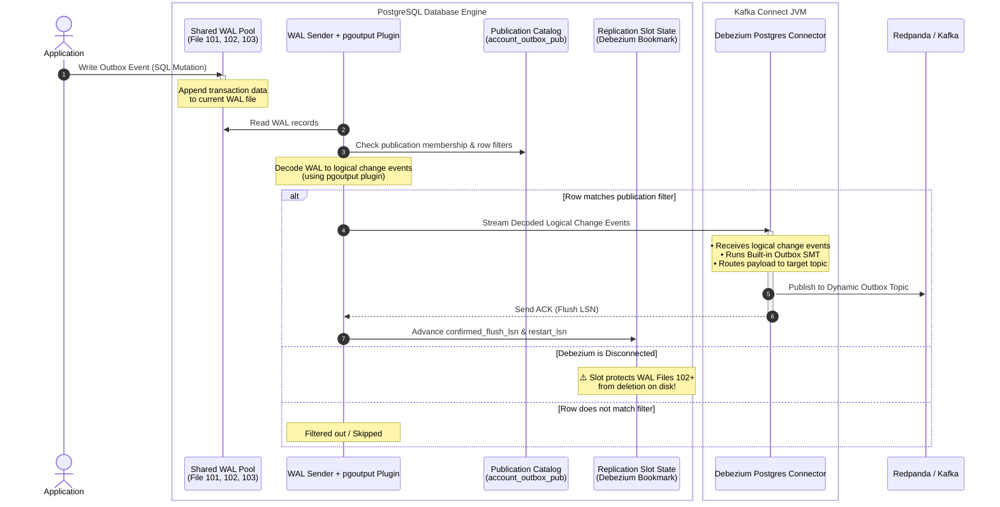

# PostgreSQL Logical Replication Architecture & Commands Guide

PostgreSQL Logical Replication follows a **Publish-Subscribe** model. Instead of copying raw disk blocks byte-for-byte (like physical replication), logical replication streams data changes dynamically based on SQL-like operations (`INSERT`, `UPDATE`, `DELETE`, `TRUNCATE`).

---

## 1. Core Architecture Under the Hood

Logical replication relies on three distinct components working together: the **Publication**, the **Shared WAL Pool**, and the **Logical Replication Slot**.

### The Roles Explained

- **Publication (The Blueprint):** Lives on the publisher database. It is entirely passive and merely defines _what_ tables, actions, and row-level criteria (`WHERE` clauses) should be made available for replication.
- **Shared WAL Pool (The Engine):** Postgres maintains a single global directory of Write-Ahead Logs (`pg_wal`). When `wal_level = logical`, Postgres writes enough transaction information to these files to reconstruct standard SQL operations.
- **Logical Replication Slot (The Safeguard/Bookmark):** Lives on the publisher database. It acts as an active pointer or "bookmark" tracking exactly how far a subscriber (Debezium) has read through the shared WAL files. It explicitly protects unread WAL files from being deleted by Postgres' space-clearing processes.

---

### System Architecture Flow



---

### Lifecycle Breakdown

1. **The Write:** Your application drops a row into the `outbox_event` table. Postgres logs this mutation directly to the **Shared WAL Pool**.
2. **The Decode & Filter:** The **`walsender` background process** reads WAL records on the server, uses the **`pgoutput` output plugin** to perform logical decoding (translating physical WAL entries into structured row-level change events), and checks the **Publication** catalog to apply table membership and row filters (`WHERE topic = '<topic-name>'`). If the row doesn't match, it is skipped.
3. **The Stream:** If the row matches, the `walsender` streams the **decoded logical change events** (not raw WAL bytes) across the network to your Kafka Connect container, and the **Replication Slot** tracks how far the consumer has read (`confirmed_flush_lsn`) and the oldest WAL position needed for restart (`restart_lsn`).
4. **The Transform:** The **Debezium Postgres Connector** receives the structured logical events and passes them to the lightweight Outbox SMT to route the final payload directly into your designated **Redpanda** topics.

### The Risk of Shared WAL & Slots

Because all slots share the same physical WAL files on disk, Postgres will **never delete a WAL file** until the slowest active slot has finished reading it. If a subscriber goes offline permanently, its slot stands still, causing WAL files to accumulate.

To prevent your publisher's disk from filling up and crashing the database, use the `max_slot_wal_keep_size` setting (available in Postgres 13+). If a slot falls behind past this threshold, Postgres will **invalidate** the slot, purge the old WAL files to protect the primary database, and change the slot's status to `lost`.

---

## 2. Publication Commands (Publisher Side)

These commands manage the blueprints of what data changes are available to stream.

### Creating Publications

- **Publish all tables in the database:**
  _Automatically includes any tables created in the future._

```sql
CREATE PUBLICATION my_all_tables_pub FOR ALL TABLES;

```

- **Publish specific tables:**

```sql
CREATE PUBLICATION my_specific_pub FOR TABLE users, orders;

```

- **Publish tables with Row Filtering (Postgres 15+):**
  _Only streams rows matching a specific criteria._

```sql
CREATE PUBLICATION us_users_pub FOR TABLE users WHERE (country = 'US' AND status = 'active');

```

- **Publish specific columns only (Postgres 15+):**
  _Excludes sensitive columns from replication._

```sql
CREATE PUBLICATION public_profile_pub FOR TABLE users (id, username, email);

```

- **Publish specific actions only:**
  _Ignore certain operations like DELETEs (useful for audit logging)._

```sql
CREATE PUBLICATION insert_only_pub FOR TABLE logs WITH (publish = 'insert');

```

### Modifying & Recreating Publications

If you completely drop a publication using `DROP PUBLICATION my_pub;`, it is destroyed. To reactivate replication, you must recreate it on the publisher and refresh the subscriber.

- **Add a table to an existing publication:**

```sql
ALTER PUBLICATION my_specific_pub ADD TABLE products;

```

- **Remove a table from a publication:**

```sql
ALTER PUBLICATION my_specific_pub DROP TABLE orders;

```

- **Replace all tables inside a publication:**

```sql
ALTER PUBLICATION my_specific_pub SET TABLE customers, invoices;

```

- **Completely drop a publication:**

```sql
DROP PUBLICATION IF EXISTS my_pub;

```

---

## 3. Replica Identity (Publisher Side)

When a subscriber receives an `UPDATE` or `DELETE` event, it needs a way to locate the **exact row** to modify on the target table. The **Replica Identity** tells Postgres which column values to include in the WAL as the "old row key" so the subscriber can match the correct row.

Without a configured replica identity, Postgres has no way to communicate _which_ row changed, and will throw a fatal error:

```
ERROR: cannot update table "orders" because it does not have a replica identity and publishes updates
```

> 💡 If a publication only publishes `INSERT` operations (`WITH (publish = 'insert')`), replica identity is **not required** because inserts don't need to locate an existing row.

### Replica Identity Modes

| Mode          | What gets logged in WAL                           | Requirements                                                             | Performance                                                                                |
| ------------- | ------------------------------------------------- | ------------------------------------------------------------------------ | ------------------------------------------------------------------------------------------ |
| `DEFAULT`     | Old values of **Primary Key** columns only        | Table must have a PK                                                     | ✅ Best — minimal WAL overhead                                                             |
| `USING INDEX` | Old values of the chosen **unique index** columns | A non-partial, non-deferrable `UNIQUE` index with all columns `NOT NULL` | ✅ Good — similar to PK                                                                    |
| `FULL`        | Old values of **all columns** in the row          | None (works on any table)                                                | ⚠️ Heavy — increased WAL volume, slower subscriber lookups, expensive with TOASTed columns |
| `NOTHING`     | No old row values logged                          | N/A                                                                      | ❌ `UPDATE`/`DELETE` cannot be replicated at all                                           |

> 📝 **`USING INDEX` requirements explained:**
>
> - **Non-partial:** The index must cover _all_ rows in the table (no `WHERE` clause on the index definition), so every row can be uniquely identified.
> - **Non-deferrable:** The uniqueness constraint must be checked immediately on each statement, not deferred to the end of a transaction.
>   - This matters because Postgres writes change events to WAL **at statement execution time**, not at commit time.
>   - A `DEFERRABLE` constraint allows temporarily duplicated values mid-transaction (e.g., swapping two rows' values), meaning the "old key" logged to WAL could match multiple rows — making it ambiguous on the subscriber.
>   - A non-deferrable constraint guarantees the key is always unique at the moment it is logged.
>
> ```sql
> -- Example: a deferrable unique constraint allows temporary duplicates
> CREATE TABLE seats (
>    id INT PRIMARY KEY,
>    seat_number INT UNIQUE DEFERRABLE INITIALLY DEFERRED
> );
>
> BEGIN;
>  UPDATE seats SET seat_number = 2 WHERE id = 1;  -- seat 2 briefly duplicated!
>  UPDATE seats SET seat_number = 1 WHERE id = 2;  -- swap complete, no duplicates
> COMMIT;  -- uniqueness checked HERE, passes — but WAL already logged ambiguous keys
> ```
>
> - **All columns `NOT NULL`:** `NULL` values cannot be reliably compared for equality (`NULL ≠ NULL`), so every column in the index must reject nulls to guarantee a deterministic row match on the subscriber.

### Setting Replica Identity

- **Use Primary Key (Default — nothing to do):**
  _If the table already has a PK, Postgres uses it automatically._

```sql
-- Verify current replica identity
SELECT relname, relreplident
FROM pg_class
WHERE relname = 'orders';
-- 'd' = default (PK), 'n' = nothing, 'f' = full, 'i' = index

```

- **Use a Unique Index:**

```sql
-- The index must be UNIQUE, non-partial, non-deferrable, and all columns NOT NULL
ALTER TABLE orders REPLICA IDENTITY USING INDEX orders_external_id_idx;

```

- **Use Full (fallback for tables without any key):**

```sql
ALTER TABLE legacy_events REPLICA IDENTITY FULL;

```

- **Reset back to Default:**

```sql
ALTER TABLE orders REPLICA IDENTITY DEFAULT;

```

### Gotchas

> ⚠️ **Partitioned Tables:** Replica identity must be set on **each partition individually**. Setting it on the parent table does **not** propagate to existing or future partitions.

> ⚠️ **Row Filter Gotcha (PG 15+):** If a table uses row filtering (`WHERE ...`), any columns referenced in the `WHERE` clause **must** be part of the replica identity (or the table must use `REPLICA IDENTITY FULL`), otherwise `UPDATE`/`DELETE` operations will fail with an error.

---

## 4. Replication Slot Commands (Publisher Side)

Replication slots are typically created automatically under the hood when a subscription is initialized. However, manual management is vital for monitoring and troubleshooting.

### Monitoring Slots

- **Check the status and lag of all slots:**
  _Pay attention to the `active` column. If a slot is `false`, it means the subscriber is disconnected and WAL files might be piling up._

```sql
SELECT slot_name, plugin, active, wal_status
FROM pg_replication_slots;

```

- **Check exact WAL lag size per slot (Postgres 13+):**
  _`restart_lsn` measures actual WAL retention on disk (what prevents Postgres from removing WAL files). `confirmed_flush_lsn` measures consumer consumption lag (what the client has processed)._

```sql
SELECT slot_name,
       pg_wal_lsn_diff(pg_current_wal_lsn(), restart_lsn) AS wal_retained_bytes,
       pg_wal_lsn_diff(pg_current_wal_lsn(), confirmed_flush_lsn) AS consumer_lag_bytes
FROM pg_replication_slots;

```

### Manual Slot Maintenance & Cleanup

_If a subscriber is permanently destroyed, you must manually drop its slot on the publisher to avoid filling up the disk with retained WAL files._

```sql
-- 1. Identify if a stale slot is still stuck in the system
SELECT slot_name, active FROM pg_replication_slots;

-- 2. Kill any zombie processes clinging to the slot (if still active)
SELECT pg_terminate_backend(active_pid)
FROM pg_replication_slots
WHERE slot_name = 'your_slot_name' AND active = true;

-- 3. Drop the slot entirely
SELECT pg_drop_replication_slot('your_slot_name');
```

---

## 5. Subscription Control (Subscriber Side Shortcuts)

Instead of dropping publications when troubleshooting or performing maintenance, it is safer to temporarily pause the data stream from the subscriber side.

- **Pause replication safely:**
  _Stops the stream but keeps the bookmark (slot) intact on the publisher._

```sql
ALTER SUBSCRIPTION my_sub DISABLE;

```

- **Resume replication safely:**
  _Resumes streaming exactly from where it was paused._

```sql
ALTER SUBSCRIPTION my_sub ENABLE;

```

- **Refresh a subscription after publication changes:**
  _Required if you dropped and recreated a publication, or added new tables to an existing publication._

```sql
ALTER SUBSCRIPTION my_sub REFRESH PUBLICATION;

```

---

### Quick Reference: Inspecting via `psql` CLI

If you are logged directly into the interactive PostgreSQL command line utility (`psql`), use these short macros:

- `\dRp` : List all publications.
- `\dRp+` : List detailed publication rules (filters, specific columns, actions).
- `\dRs` : List all subscriptions (run on the subscriber database).
