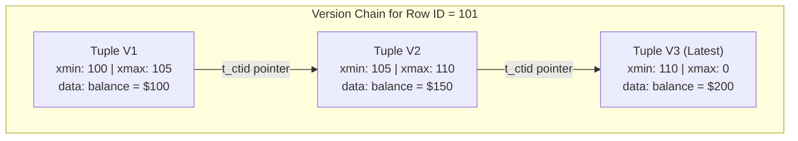
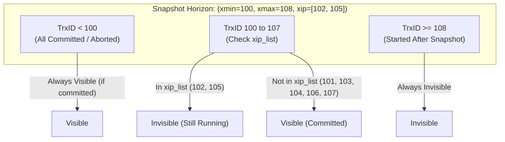
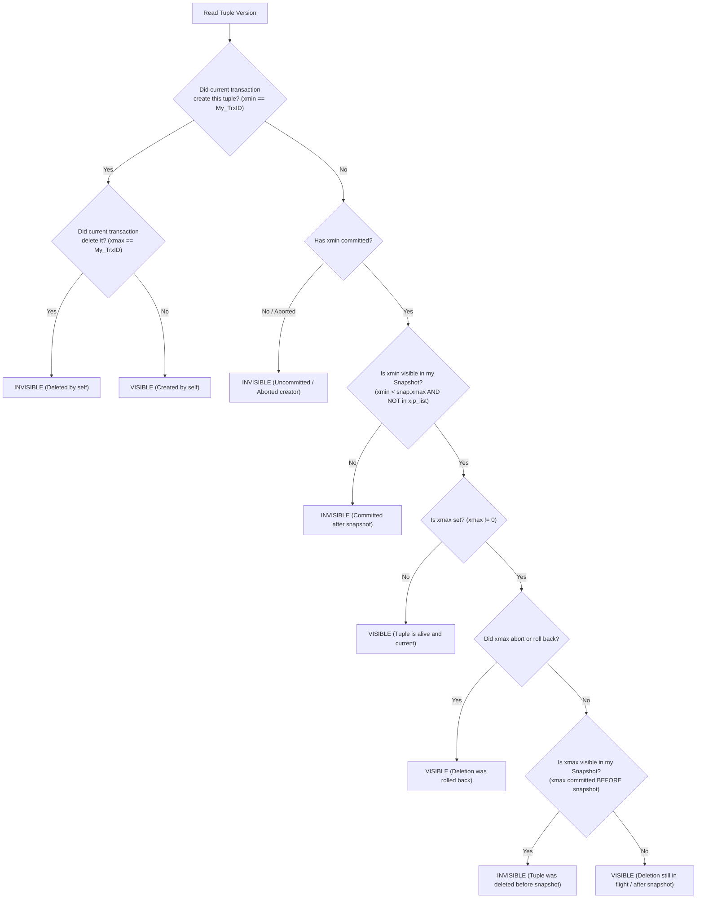
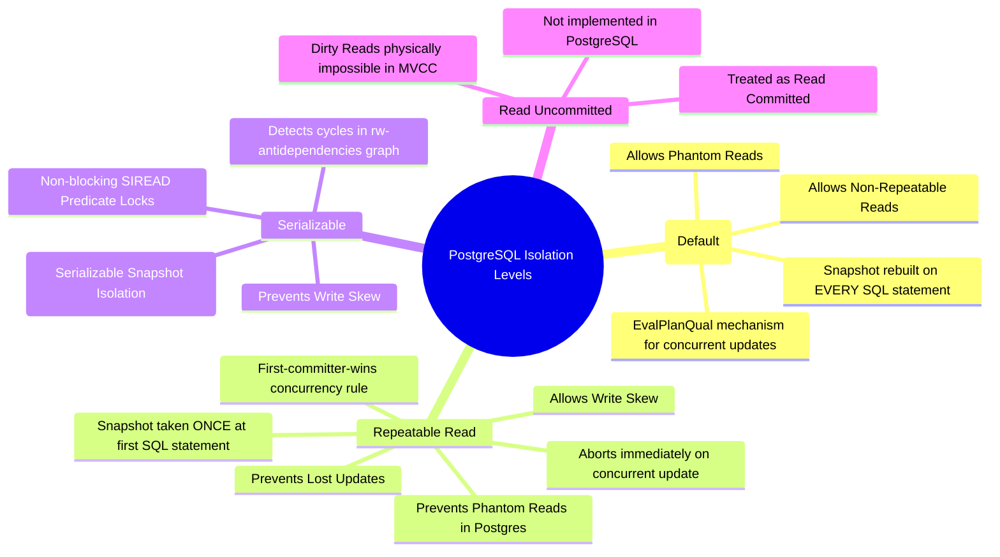
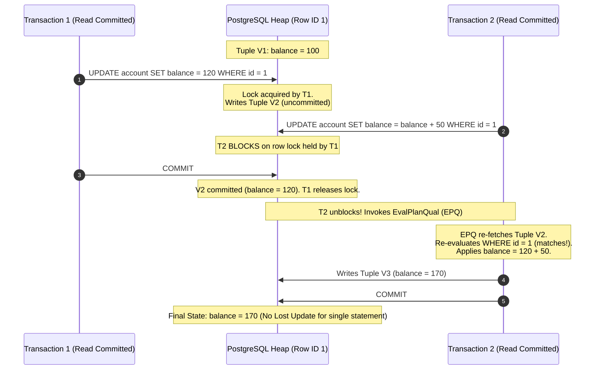
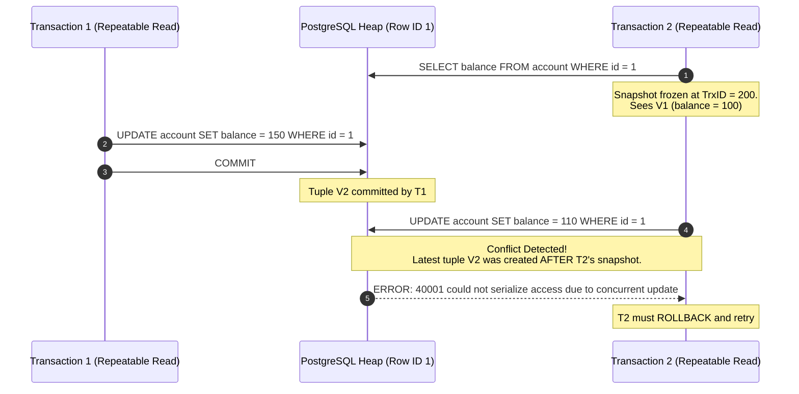
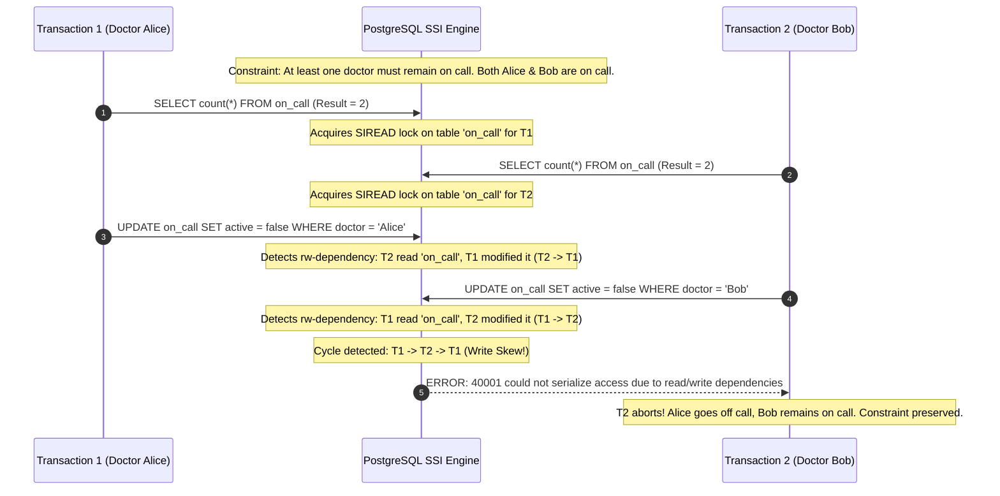
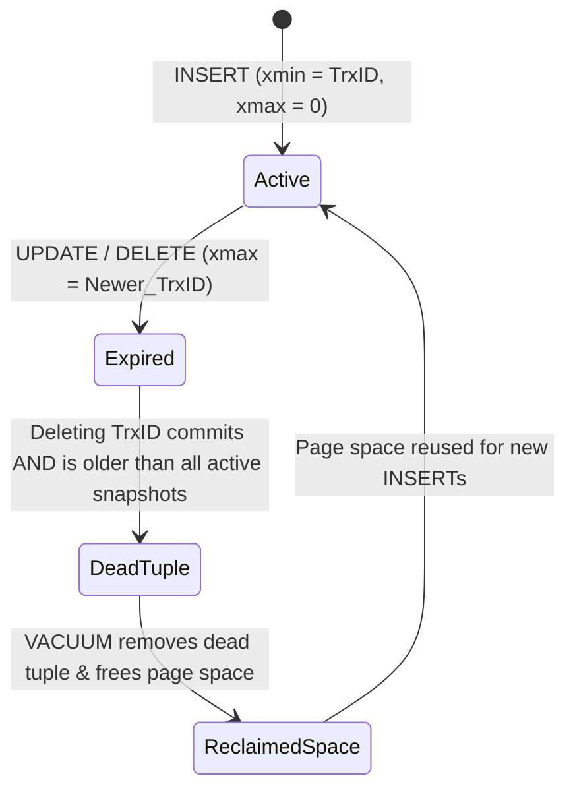

# PostgreSQL Multi-Version Concurrency Control (MVCC)

A technical reference and deep dive into PostgreSQL's Multi-Version Concurrency Control (MVCC) engine, snapshot mechanics, visibility rules, tuple headers, and implementation behavior across all transaction isolation levels.

---

## 1. High-Level Concept of MVCC

Multi-Version Concurrency Control (**MVCC**) is a concurrency control protocol designed to solve a fundamental database trade-off: **how to maintain ACID transaction isolation without locking readers and writers against each other**.

In traditional lock-based protocols (such as strict Two-Phase Locking / 2PL):

- Readers acquire shared read locks, blocking writers.
- Writers acquire exclusive write locks, blocking both readers and other writers.
- Under high concurrent load, lock contention cripples throughput.

### The MVCC Paradigm: "Readers Never Block Writers, Writers Never Block Readers"

Instead of modifying data in place, PostgreSQL treats updates and deletions as versioning operations:

1. **Non-In-Place Updates**: When a transaction updates a row, PostgreSQL **does not overwrite the existing data**. It writes a brand new tuple (row version) to the heap and marks the old tuple version as expired.
2. **Version Chains**: Successive updates to a row produce a chain of physical tuples linked together on disk via tuple pointer offsets (`t_ctid`).
3. **Point-in-Time Snapshots**: Each query or transaction inspects the database through a specific **Snapshot**. As a transaction scans a table, it walks the version chain for each record and reads whichever tuple version is visible to its snapshot.



---

## 2. Low-Level Mechanics: Tuple Headers & Transaction Metadata

To determine which version of a tuple a transaction can see, PostgreSQL embeds metadata directly into every row's header and builds in-memory snapshots.

### 2.1 Heap Tuple Header Fields (`HeapTupleHeaderData`)

Every 8 KB heap page stores tuples with a 23-byte header containing crucial MVCC tracking fields:

| Header Field      | Size                           | Description                                                                                                                                                                             |
| :---------------- | :----------------------------- | :-------------------------------------------------------------------------------------------------------------------------------------------------------------------------------------- |
| **`t_xmin`**      | 4 bytes (32-bit `xid`)         | The Transaction ID (`xid`) of the transaction that **inserted/created** this tuple version.                                                                                             |
| **`t_xmax`**      | 4 bytes (32-bit `xid`)         | The Transaction ID (`xid`) of the transaction that **deleted or updated** this tuple version. Set to `0` (InvalidXid) if active and un-deleted.                                         |
| **`t_cid`**       | 4 bytes                        | Command Identifier: sequential counter (0, 1, 2...) tracking which SQL command inside a single transaction created or deleted the tuple. Overlays with `t_xvac` in a C union.           |
| **`t_ctid`**      | 6 bytes (`BlockId` + `Offset`) | Physical pointer `(page_number, item_offset)`. Points to itself if it is the latest version, or forward to the next tuple version if updated.                                           |
| **`t_infomask2`** | 2 bytes                        | Number of attributes (columns) in the tuple, plus additional flag bits (e.g., `HEAP_HOT_UPDATED`, `HEAP_ONLY_TUPLE`).                                                                   |
| **`t_infomask`**  | 2 bytes                        | Bit flags caching transaction commit/abort statuses (e.g., `HEAP_XMIN_COMMITTED`, `HEAP_XMIN_ABORTED`, `HEAP_XMAX_COMMITTED`). Prevents repeatedly checking the Commit Log (`pg_xact`). |
| **`t_hoff`**      | 1 byte                         | Offset (in bytes) from the start of the tuple header to the beginning of the actual user data. Must be a multiple of `MAXALIGN`.                                                        |

### 2.2 Transaction Snapshots (`SnapshotData`)

When PostgreSQL needs to evaluate visibility, it constructs a snapshot of active transactions. In PostgreSQL internals, this snapshot is represented as:

$$\text{Snapshot} = (\text{xmin}, \text{xmax}, [\text{xip\_list}])$$

- **`xmin`**: The lowest transaction ID that was still in flight (uncommitted) at the time the snapshot was taken. Any transaction with $\text{xid} < \text{xmin}$ is guaranteed to have already committed or aborted.
- **`xmax`**: The highest transaction ID assigned so far $+ 1$. Any transaction with $\text{xid} \ge \text{xmax}$ had not even started when the snapshot was taken, making its effects invisible.
- **`xip_list`** (Active In-Flight Array): The list of transaction IDs currently in progress between $\text{xmin}$ and $\text{xmax}$ at snapshot creation time.



---

## 3. Read Logic: The Tuple Visibility Decision Tree

When an active transaction scans a heap table, it passes every tuple version through PostgreSQL's visibility routine (`HeapTupleSatisfiesVisibility`).



---

## 4. PostgreSQL Isolation Levels

> [!IMPORTANT]
> **Clarification on PostgreSQL Default Isolation Level**:
> Introductory articles often explain base MVCC by stating that "a snapshot is taken once at the start of a transaction." While that accurately describes **Repeatable Read**, it is **not the default in PostgreSQL**.
>
> In PostgreSQL, the default isolation level is **`READ COMMITTED`**. Under Read Committed, PostgreSQL dynamically refreshes the snapshot for **every single SQL statement**.



---

### 4.1 Read Committed (PostgreSQL Default)

#### A. Snapshot Timing & Behavior

- A **new snapshot is generated at the start of each individual SQL query** within the transaction.
- If Transaction A runs `SELECT count(*) FROM orders`, and Transaction B commits new orders, a subsequent `SELECT count(*) FROM orders` inside Transaction A **will see the newly committed rows**.
- **Anomalies Permitted**: Non-Repeatable Reads and Phantom Reads.

#### B. Update Mechanism & `EvalPlanQual` (EPQ)

When two transactions attempt to update or delete the same row concurrently under Read Committed:

1. Transaction 1 acquires an exclusive row lock (`XMAX` stamped).
2. Transaction 2 blocks, waiting for Transaction 1 to complete.
3. If Transaction 1 **rolls back**, Transaction 2 unblocks and updates the original tuple.
4. If Transaction 1 **commits**, Transaction 2 unblocks. Instead of aborting, PostgreSQL triggers **`EvalPlanQual`**:
   - Transaction 2 follows the `t_ctid` pointer to fetch the **latest committed version** created by Transaction 1.
   - It re-evaluates the query's `WHERE` clause against this new version.
   - If the predicate still evaluates to true, Transaction 2 executes its update on the new version.



> [!WARNING]
> While `EvalPlanQual` prevents lost updates for **single-statement atomic updates** (`UPDATE ... SET val = val + 1`), it **cannot** prevent lost updates across **multi-statement application workflows** (e.g., `SELECT balance` $\rightarrow$ application logic $\rightarrow$ `UPDATE balance = $calculated`). Multi-statement workflows require explicit row locks (`SELECT ... FOR UPDATE`) or optimistic concurrency tokens under Read Committed.

---

### 4.2 Repeatable Read

#### A. Snapshot Timing & Behavior

- The snapshot is created **at the execution of the first non-transaction-control statement** (`SELECT`, `INSERT`, `UPDATE`, `DELETE`) and remains **frozen** for the duration of the transaction.
- Subsequent `SELECT` statements see the exact same database state, preventing Non-Repeatable Reads.
- **Phantom Read Prevention**: Unlike standard ANSI SQL (which permits phantom reads in Repeatable Read), PostgreSQL's MVCC implementation **completely prevents phantom reads** because predicate scans walk the frozen snapshot.

#### B. Update Mechanism: "First Committer Wins"

If Transaction 2 attempts to update a row that was concurrently modified and committed by Transaction 1 after Transaction 2's snapshot was taken:

1. Transaction 2 blocks until Transaction 1 finishes.
2. If Transaction 1 commits, Transaction 2 detects that the updated tuple version is newer than its frozen snapshot.
3. PostgreSQL **immediately aborts Transaction 2** with a serialization failure error:
   ```text
   ERROR: could not serialize access due to concurrent update (SQLSTATE 40001)
   ```



#### C. PostgreSQL vs. MySQL (InnoDB) Repeatable Read Difference

- **MySQL InnoDB**: Uses "consistent reads" (plain `SELECT` uses snapshot), but "current reads" (`UPDATE`, `DELETE`, `SELECT ... FOR UPDATE`) read the latest committed data on disk. As a result, MySQL can silently overwrite concurrent updates or suffer lost updates unless explicit locking is used.
- **PostgreSQL**: Strictly enforces that an update cannot modify a tuple newer than the transaction's snapshot. Any concurrent commit aborts the follower transaction, completely eliminating lost updates.

#### D. The Write Skew Anomaly

Repeatable Read does **not** prevent **Write Skew**. Write skew occurs when concurrent transactions read overlapping datasets, satisfy invariant checks independently, and make non-overlapping updates that collectively violate a global constraint.

---

### 4.3 Serializable (SSI - Serializable Snapshot Isolation)

PostgreSQL implements true serializability using **Serializable Snapshot Isolation (SSI)** without requiring heavy read locks.

#### A. Mechanics: Non-Blocking `SIREAD` Predicate Locks

- Instead of using exclusive locks that block other queries, SSI takes lightweight in-memory **`SIREAD` locks** on tuples, 8 KB pages, or whole tables.
- `SIREAD` locks do not block any reads or writes; their sole purpose is to record **who read what**.

#### B. Dependency Graph & Cycle Detection ($rw$-antidependencies)

When a transaction writes to a tuple that another concurrent serializable transaction previously read, PostgreSQL records a **rw-antidependency edge** ($T_1 \xrightarrow{rw} T_2$: $T_1$ read a version before $T_2$ replaced it).

If SSI detects a cycle in the dependency graph (e.g., $T_1 \xrightarrow{rw} T_2 \xrightarrow{rw} T_1$), it indicates that the execution order cannot be mapped to any valid serial sequence. PostgreSQL immediately aborts one of the conflicting transactions with:

```text
ERROR: could not serialize access due to read/write dependencies among transactions (SQLSTATE 40001)
```



---

### 4.4 Read Uncommitted

- **Not Implemented**: PostgreSQL does **not** implement a true `READ UNCOMMITTED` isolation level.
- **Engine Behavior**: If an application executes `SET TRANSACTION ISOLATION LEVEL READ UNCOMMITTED`, PostgreSQL silently treats it as **`READ COMMITTED`**.
- **Architectural Reason**: In PostgreSQL's storage engine, tuple visibility is governed by checking `t_xmin` and transaction commit logs (`pg_xact`). A row version is physically invisible to all other transactions until its inserting transaction commits. Supporting dirty reads would require bypassing transaction status resolution altogether, which the storage architecture fundamentally forbids.

---

## 5. Summary Comparison of Isolation Levels

| Isolation Level                | Snapshot Built At   | Concurrent Update Behavior                           | Prevents Dirty Read | Prevents Non-Repeatable Read | Prevents Phantom Read | Prevents Serialization Anomaly\* |
| :----------------------------- | :------------------ | :--------------------------------------------------- | :------------------ | :--------------------------- | :-------------------- | :------------------------------- |
| **Read Uncommitted**           | Per statement       | Mapped to Read Committed                             | Yes                 | No                           | No                    | No                               |
| **Read Committed** _(Default)_ | **Each statement**  | Blocks $\rightarrow$ `EvalPlanQual` re-evaluates     | Yes                 | No                           | No                    | No                               |
| **Repeatable Read**            | **First statement** | Blocks $\rightarrow$ Aborts on concurrent commit     | Yes                 | Yes                          | Yes _(in Postgres)_   | No                               |
| **Serializable**               | **First statement** | Tracks `SIREAD` locks $\rightarrow$ Aborts on cycles | Yes                 | Yes                          | Yes                   | **Yes**                          |

_\*Serialization anomalies include phenomena such as **Write Skew**, where concurrent transactions read overlapping data, pass independent constraint checks, and make non-overlapping writes that collectively violate a global invariant. Only the Serializable isolation level detects and prevents these anomalies._

---

## 6. The Cost of MVCC: Storage Bloat, Write Amplification, and `VACUUM`

While MVCC provides high concurrent read/write throughput, it incurs significant disk and indexing trade-offs.

### 6.1 Tuple Bloat & Write Amplification

Because an `UPDATE` writes an entirely new copy of the row:

- Updating a single row 1,000 times generates **1,000 physical tuple copies** in heap pages.
- Every secondary index on the table must also insert a new index pointer referencing the new tuple's `ctid` (unless HOT applies).
- Inactive, dead versions continue consuming disk space and memory buffer cache until cleaned up.

### 6.2 The Role of `VACUUM` and Autovacuum

A tuple becomes a **dead tuple** when its `xmax` is committed and is older than the oldest active transaction snapshot in the database.



- **`VACUUM`**: A maintenance command that scans heap pages, removes dead tuples, defragments pages, and records available free space in the **Free Space Map (FSM)**. The **autovacuum daemon** automatically triggers `VACUUM` in the background based on table activity thresholds.
- **Transaction ID Wraparound**: 32-bit transaction IDs ($2^{32} \approx 4.29$ billion total values) use modular arithmetic with a half-space comparison, giving each transaction a usable visibility window of ~2 billion transactions in each direction. Tables must be vacuumed at least every ~2 billion transactions. `VACUUM FREEZE` marks older commit identifiers as frozen (`FrozenXID`) to prevent catastrophic data invisibility.

### 6.3 Heap-Only Tuples (HOT) Optimization

To reduce write amplification on secondary indexes:

- If an `UPDATE` **does not modify any indexed columns**, and
- The new tuple fits inside the **same 8 KB heap page** as the old version:
  PostgreSQL chains the tuples directly inside the page without creating new index pointers in secondary B-Trees. Index lookups follow the root line pointer and traverse the in-page HOT chain.

---

## 7. Real-World Architectural Case Studies

The trade-offs of PostgreSQL's MVCC design have driven major architectural pivots across tech companies:

### Uber: Migration from PostgreSQL to MySQL

In 2016, Uber published their transition from PostgreSQL to MySQL (InnoDB). The primary technical drivers stemmed directly from PostgreSQL's MVCC implementation:

1. **Write Amplification on Secondary Indexes**: When non-HOT updates occurred, every secondary index on a large table had to write new entries pointing to the new `ctid` address on disk.
2. **Buffer Pool Invalidation**: Continuous tuple copies dirtied massive volumes of cache pages in `shared_buffers`, saturating disk write bandwidth.
3. **InnoDB Contrast**: MySQL InnoDB uses an in-place primary key clustered index with rollback segments (**undo logs**). Secondary indexes reference the primary key rather than physical disk pointers, isolating updates to the cluster index and undo log buffers.

### Notion: Database Sharding

Notion scaled their primary PostgreSQL cluster to support hundreds of millions of users by horizontally sharding into dozens of physical PostgreSQL databases. Sharding kept individual table sizes within thresholds where `autovacuum` workers could clean dead tuples without falling behind high write velocity and triggering table bloat spikes.

---

## References & Further Reading

- [Eyo Chen: A Straightforward Guide for MVCC in Postgres](https://dev.to/eyochen/a-straightforward-guide-for-mvcc-in-postgres-15b4)
- [PostgreSQL Official Documentation: Chapter 13. Concurrency Control](https://www.postgresql.org/docs/current/mvcc.html)
- [H. Berenson et al.: A Critique of ANSI SQL Isolation Levels (SIGMOD 1995)](https://www.microsoft.com/en-us/research/publication/a-critique-of-ansi-sql-isolation-levels/)
- [PostgreSQL Internal: EvalPlanQual (EPQ) Mechanism](https://www.postgresql.org/docs/current/transaction-iso.html#XACT-READ-COMMITTED)
