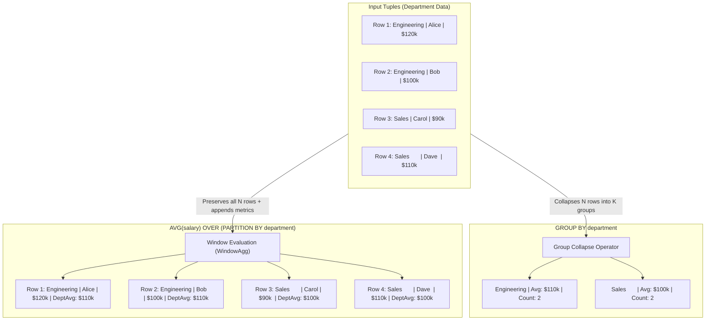
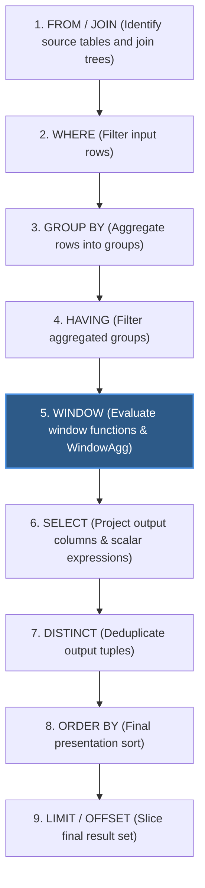
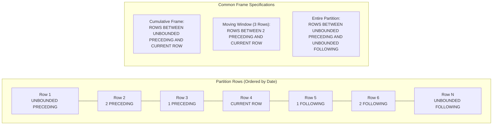
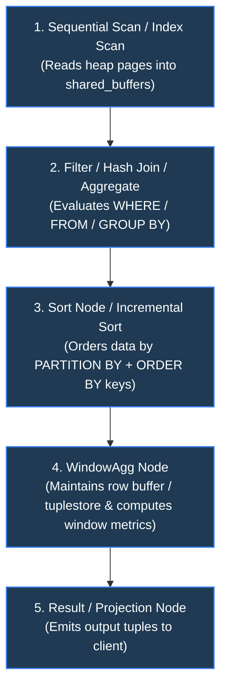
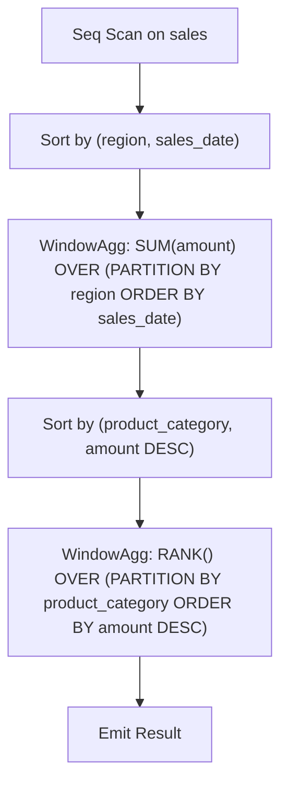
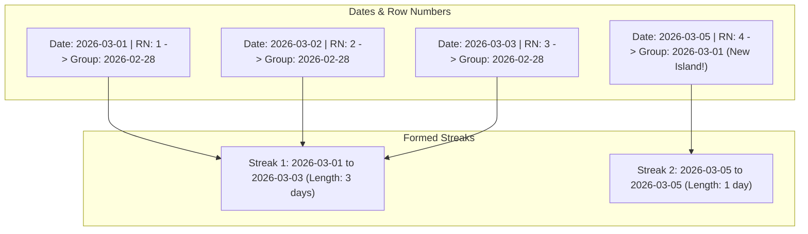

# PostgreSQL Window Functions: Architecture, Mechanics & Practical Guide

A comprehensive technical reference and deep dive into PostgreSQL Window Functions: query processing lifecycle, framing mechanics, execution engine internals (`WindowAgg`), function catalog, production design patterns, and performance optimization.

---

## 1. High-Level Concept: `GROUP BY` vs. Window Functions

In relational database systems, aggregation operations typically collapse multiple input rows into a single summary row. PostgreSQL provides two distinct paradigms for performing calculations across row sets: **Aggregate Groups (`GROUP BY`)** and **Window Functions (`OVER (...)`)**.

### The Core Architectural Distinction

- **Aggregate Functions (`GROUP BY`)**: Group multiple tuples sharing identical grouping keys into a single output tuple. Individual tuple identities, original column values, and row granularity are eliminated in favor of group summaries.
- **Window Functions (`OVER`)**: Perform calculations across a set of rows (the "window") related to the current row, but **retain every individual row's identity and granularity**. The computed value is appended as an additional column to each output tuple.



### SQL Logical Execution Order

To understand where and why window functions can be used in SQL queries, consider PostgreSQL's logical query processing lifecycle:



> [!IMPORTANT]
> **Why Window Functions Cannot Be Used in `WHERE` or `HAVING`**:
> Because the `WINDOW` evaluation stage (Step 5) occurs **after** the `WHERE` (Step 2) and `HAVING` (Step 4) filtering stages, window functions are illegal in `WHERE` and `HAVING` clauses.
>
> Attempting to execute `SELECT * FROM sales WHERE ROW_NUMBER() OVER (...) = 1;` causes PostgreSQL to throw:
>
> ```text
> ERROR: window functions are not allowed in WHERE
> ```
>
> To filter on window function results, the calculation must be wrapped inside a **Subquery** or **Common Table Expression (CTE)**.

---

## 2. Anatomy of the `OVER (...)` Clause

The `OVER` clause defines the window (set of rows) across which the function calculates its output.

### 2.1 Complete Syntax

```sql
function_name([expression, ...]) OVER (
    [existing_window_name]
    [PARTITION BY partition_expression, ...]
    [ORDER BY sort_expression [ASC | DESC] [NULLS { FIRST | LAST }], ...]
    [frame_clause]
)
```

Where `frame_clause` is structured as:

```sql
{ ROWS | RANGE | GROUPS } frame_start [frame_exclusion]
{ ROWS | RANGE | GROUPS } BETWEEN frame_start AND frame_end [frame_exclusion]
```

---

### 2.2 Named Windows (`WINDOW` Clause)

When multiple window functions in a single query share identical partitioning or ordering specifications, repeating the `OVER (...)` clause creates visual noise and maintenance overhead. PostgreSQL supports named windows via the `WINDOW` clause placed directly before `ORDER BY`:

```sql
SELECT
    id,
    department,
    salary,
    AVG(salary) OVER w AS avg_dept_sal,
    MAX(salary) OVER w AS max_dept_sal,
    MIN(salary) OVER w AS min_dept_sal,
    RANK() OVER w AS dept_rank
FROM employees
WINDOW w AS (PARTITION BY department ORDER BY salary DESC);
```

---

### 2.3 The Three Components of Window Definition

#### 1. `PARTITION BY` (Division)

- Divides the intermediate result set into independent subsets called **Partitions**.
- The window function is evaluated independently within each partition; boundaries are never crossed.
- If `PARTITION BY` is omitted, the **entire intermediate result set** is treated as a single partition.

#### 2. `ORDER BY` (Sequencing & Framing Trigger)

- Defines the logical sequence of rows within each partition.
- Vital for ranking functions (`ROW_NUMBER`, `RANK`, `DENSE_RANK`) and navigational offsets (`LAG`, `LEAD`).
- **Critical Side Effect**: Including an `ORDER BY` clause automatically alters the default window frame (explained below).

#### 3. Framing Clause (`ROWS`, `RANGE`, `GROUPS`)

The frame defines a subset of the partition relative to the **current row**.

| Frame Mode   | Definition                                                  | Peer Handling                                                                   |
| :----------- | :---------------------------------------------------------- | :------------------------------------------------------------------------------ |
| **`ROWS`**   | Physical row count offsets relative to the current row.     | Does not group ties. Evaluates exact row counts regardless of duplicate values. |
| **`RANGE`**  | Logical value offsets based on the `ORDER BY` column.       | Groups peer rows (rows having identical `ORDER BY` values).                     |
| **`GROUPS`** | Offsets in terms of peer groups (sets of identical values). | Moves by groups of ties rather than single rows.                                |

#### Frame Boundaries

- `UNBOUNDED PRECEDING`: Frame starts at the first row of the partition.
- `n PRECEDING`: Frame starts $n$ rows/units before the current row.
- `CURRENT ROW`: Frame starts/ends at the current row (or peers in `RANGE` mode).
- `n FOLLOWING`: Frame ends $n$ rows/units after the current row.
- `UNBOUNDED FOLLOWING`: Frame ends at the last row of the partition.



---

### 2.4 The Dangerous Default Frame Trap

One of the most frequent sources of subtle SQL bugs in PostgreSQL involves implicit frame defaults:

> [!WARNING]
>
> - **Case A: Without `ORDER BY`**:
>   `OVER ()` or `OVER (PARTITION BY dept)`
>   Default Frame: `RANGE BETWEEN UNBOUNDED PRECEDING AND CURRENT ROW`. Since there is no `ORDER BY`, all rows are peers of the current row, so this effectively includes the entire partition.
> - **Case B: With `ORDER BY`**:
>   `OVER (ORDER BY created_at)` or `OVER (PARTITION BY dept ORDER BY salary)`
>   Default Frame: **`RANGE BETWEEN UNBOUNDED PRECEDING AND CURRENT ROW`**.
>
> Because of this default, using `LAST_VALUE(col) OVER (ORDER BY col)` **does not return the last value in the partition**; it returns the value of the current row (or its latest peer), because the frame stops at `CURRENT ROW`.

To make `LAST_VALUE()` look across the entire partition, you must explicitly expand the frame:

```sql
-- Correct usage of LAST_VALUE:
LAST_VALUE(salary) OVER (
    PARTITION BY department
    ORDER BY salary
    ROWS BETWEEN UNBOUNDED PRECEDING AND UNBOUNDED FOLLOWING
)
```

---

### 2.5 Frame Exclusions (PostgreSQL 11+)

PostgreSQL supports the `EXCLUDE` subclause to selectively omit rows from the frame:

- `EXCLUDE CURRENT ROW`: Excludes the current row from the frame computation.
- `EXCLUDE GROUP`: Excludes the current row and all peers sharing its `ORDER BY` value.
- `EXCLUDE TIES`: Retains the current row in the frame, but excludes any peer rows sharing its value.
- `EXCLUDE NO OTHERS`: Default behavior; nothing is excluded.

---

## 3. Window Function Taxonomy & Catalog

PostgreSQL window functions fall into three distinct categories: **Ranking Functions**, **Navigation / Value Functions**, and **Aggregate Window Functions**.

### 3.1 Ranking Functions

Ranking functions assign integer rankings or percentiles to rows within each partition according to the `ORDER BY` specification.

| Function                 | Return Type        | Tie Handling                      | Gaps in Sequence?       | Description                                                                                  |
| :----------------------- | :----------------- | :-------------------------------- | :---------------------- | :------------------------------------------------------------------------------------------- |
| **`ROW_NUMBER()`**       | `bigint`           | Arbitrary tie-breaker             | **No** (1, 2, 3, 4, 5)  | Unique sequential integer starting at 1 within each partition.                               |
| **`RANK()`**             | `bigint`           | Identical rank for ties           | **Yes** (1, 2, 2, 4, 5) | Rank of the current row with gaps corresponding to tie counts.                               |
| **`DENSE_RANK()`**       | `bigint`           | Identical rank for ties           | **No** (1, 2, 2, 3, 4)  | Rank of current row without gaps between distinct values.                                    |
| **`PERCENT_RANK()`**     | `double precision` | Identical value for ties          | Normalized (0.0 to 1.0) | Evaluated as $\frac{\text{rank} - 1}{\text{total\_rows} - 1}$.                               |
| **`CUME_DIST()`**        | `double precision` | Identical value for ties          | Cumulative distribution | Evaluated as $\frac{\text{count of rows preceding or peer to current}}{\text{total\_rows}}$. |
| **`NTILE(num_buckets)`** | `integer`          | Distributes as evenly as possible | Sequential bucket IDs   | Divides partition rows into $n$ ranked buckets (e.g. quartiles).                             |

#### Ranking Behavior Example

Given four employees with salaries `[$100k, $90k, $90k, $80k]`:

```sql
SELECT
    name, salary,
    ROW_NUMBER() OVER (ORDER BY salary DESC) AS row_num,
    RANK()       OVER (ORDER BY salary DESC) AS rnk,
    DENSE_RANK() OVER (ORDER BY salary DESC) AS dense_rnk,
    PERCENT_RANK() OVER (ORDER BY salary DESC) AS pct_rnk
FROM salaries;
```

**Result**:

| Name    | Salary | `row_num` | `rnk` | `dense_rnk` | `pct_rnk` |
| :------ | :----- | :-------- | :---- | :---------- | :-------- |
| Alice   | $100k  | 1         | 1     | 1           | 0.00      |
| Bob     | $90k   | 2         | 2     | 2           | 0.33      |
| Charlie | $90k   | 3         | 2     | 2           | 0.33      |
| Dave    | $80k   | 4         | 4     | 3           | 1.00      |

---

### 3.2 Value & Navigation Functions

Value functions inspect and retrieve values from adjacent or distant rows within the partition without self-joining.

| Function            | Signature                           | Description                                                                                                                                     |
| :------------------ | :---------------------------------- | :---------------------------------------------------------------------------------------------------------------------------------------------- |
| **`LAG()`**         | `LAG(expr [, offset [, default]])`  | Returns `expr` evaluated at the row $n$ positions before the current row within the partition. Default offset is 1; default fallback is `NULL`. |
| **`LEAD()`**        | `LEAD(expr [, offset [, default]])` | Returns `expr` evaluated at the row $n$ positions after the current row.                                                                        |
| **`FIRST_VALUE()`** | `FIRST_VALUE(expr)`                 | Returns `expr` evaluated at the first row of the window frame.                                                                                  |
| **`LAST_VALUE()`**  | `LAST_VALUE(expr)`                  | Returns `expr` evaluated at the last row of the window frame. _(Requires explicit frame clause to see past `CURRENT ROW`)_.                     |
| **`NTH_VALUE()`**   | `NTH_VALUE(expr, n)`                | Returns `expr` evaluated at the $n$-th row of the window frame ($1$-indexed).                                                                   |

---

### 3.3 Aggregate Functions as Window Functions

Any built-in or user-defined aggregate function (e.g., `SUM`, `AVG`, `MIN`, `MAX`, `COUNT`, `STRING_AGG`, `JSONB_AGG`) can be evaluated as a window function by supplying an `OVER (...)` clause:

```sql
SELECT
    trans_date,
    amount,
    -- Running balance from the start of the account to today:
    SUM(amount) OVER (
        PARTITION BY account_id
        ORDER BY trans_date
        ROWS BETWEEN UNBOUNDED PRECEDING AND CURRENT ROW
    ) AS running_balance,
    -- 7-day rolling average (physical 7-row moving average):
    AVG(amount) OVER (
        PARTITION BY account_id
        ORDER BY trans_date
        ROWS BETWEEN 6 PRECEDING AND CURRENT ROW
    ) AS rolling_avg_7day
FROM transactions;
```

---

## 4. PostgreSQL Query Execution Engine Internals

Understanding how the PostgreSQL query executor evaluates window functions is essential for writing efficient queries and diagnosing slow execution plans.

### 4.1 Execution Plan Nodes: `WindowAgg` and `Sort`

When PostgreSQL compiles an execution plan containing window functions, it inserts one or more **`WindowAgg`** plan nodes:



#### Plan Example (`EXPLAIN ANALYZE`)

```text
QUERY PLAN
-------------------------------------------------------------------------------------------------------------------------
WindowAgg  (cost=120.50..180.00 rows=2500 width=36) (actual time=1.215..2.840 rows=2500 loops=1)
  ->  Sort  (cost=120.50..126.75 rows=2500 width=28) (actual time=1.190..1.350 rows=2500 loops=1)
        Sort Key: department, salary DESC
        Sort Method: quicksort  Memory: 195kB
        ->  Seq Scan on employees  (cost=0.00..35.00 rows=2500 width=28) (actual time=0.012..0.450 rows=2500 loops=1)
Planning Time: 0.125 ms
Execution Time: 3.120 ms
```

1. **Tuples Sorting**: The `WindowAgg` node requires incoming tuples to be **strictly ordered** by the window's `PARTITION BY` columns followed by its `ORDER BY` columns. If no matching index provides this order, a dedicated `Sort` node runs first.
2. **Streaming Execution**: As sorted tuples enter `WindowAgg`, it tracks partition boundaries. When the `PARTITION BY` key changes, the internal state resets.

---

### 4.2 Memory Allocation: `work_mem` vs. `tuplestore`

- **In-Memory Buffering**: `WindowAgg` buffers rows in memory using a structure called a **`tuplestore`** to support backward/forward access (e.g. `LEAD`, `LAG`, `LAST_VALUE`, frame sliding).
- **RAM Limits**: If the tuples in a single partition or frame fit within **`work_mem`**, the tuplestore resides entirely in RAM.
- **Disk Spill**: If the partition size exceeds `work_mem`, PostgreSQL spills the tuplestore to temporary files on disk (`pgsql_tmp`), drastically degrading query performance.

---

### 4.3 Multi-Window Query Planning & Chaining

When a query contains multiple window functions with **different** `PARTITION BY` or `ORDER BY` clauses, PostgreSQL cannot compute them in a single pass. It must sort and chain multiple `WindowAgg` nodes:



> [!TIP]
> **Optimization Rule**: Try to harmonize `PARTITION BY` and `ORDER BY` specifications across window functions in the same query. When specifications match, PostgreSQL evaluates all window functions inside a single `WindowAgg` node with a single sort pass.

---

### 4.4 PostgreSQL 15+ Optimization: Window RunCondition Pushdown

Historically, queries fetching the Top-N rows per partition:

```sql
WITH ranked AS (
    SELECT *, ROW_NUMBER() OVER (PARTITION BY dept_id ORDER BY salary DESC) AS rn
    FROM employees
)
SELECT * FROM ranked WHERE rn <= 3;
```

required PostgreSQL to evaluate `ROW_NUMBER()` across **every single row** in every department before discarding rows with `rn > 3`.

Starting in **PostgreSQL 15**, the planner detects monotonic window functions (`ROW_NUMBER()`, `RANK()`, `DENSE_RANK()`) constrained by an outer condition (`<= N` or `< N`) and pushes a **`RunCondition`** into the `WindowAgg` node:

```text
->  WindowAgg  (cost=120.50..180.00 rows=100 width=36)
      RunCondition: (row_number() OVER (?) <= 3)
```

As soon as `row_number()` exceeds 3, `WindowAgg` immediately skips the remaining tuples of that partition and jumps directly to the next partition, yielding orders of magnitude faster execution on large datasets.

---

## 5. Production Patterns & Real-World Use Cases

### Pattern 1: Deduplication & Top-N Per Category

**Problem**: Retrieve the most recent order for every customer from a table of millions of orders.

```sql
WITH ranked_orders AS (
    SELECT
        order_id,
        customer_id,
        order_date,
        total_amount,
        ROW_NUMBER() OVER (
            PARTITION BY customer_id
            ORDER BY order_date DESC, order_id DESC
        ) AS row_num
    FROM orders
)
SELECT
    order_id,
    customer_id,
    order_date,
    total_amount
FROM ranked_orders
WHERE row_num = 1;
```

- **Why `ROW_NUMBER()`**: Deterministic single-row selection. The tie-breaker `order_id DESC` guarantees consistent output even if timestamps collide.

---

### Pattern 2: Financial Ledger Running Balances

**Problem**: Compute a running account balance after every transaction while keeping track of total historical volume.

```sql
SELECT
    transaction_id,
    account_id,
    transaction_time,
    amount,
    -- Running ledger balance:
    SUM(amount) OVER (
        PARTITION BY account_id
        ORDER BY transaction_time
        ROWS BETWEEN UNBOUNDED PRECEDING AND CURRENT ROW
    ) AS current_balance,
    -- Total transaction volume across the account's entire history:
    SUM(ABS(amount)) OVER (
        PARTITION BY account_id
    ) AS total_lifetime_volume
FROM account_transactions
ORDER BY account_id, transaction_time;
```

---

### Pattern 3: Rolling Moving Averages

**Problem**: Smooth out volatile daily revenue data by calculating a 7-day moving average.

```sql
SELECT
    sale_date,
    daily_revenue,
    -- 7-row moving average (current day + 6 previous days):
    ROUND(
        AVG(daily_revenue) OVER (
            ORDER BY sale_date
            ROWS BETWEEN 6 PRECEDING AND CURRENT ROW
        ), 2
    ) AS rolling_avg_7day
FROM daily_sales_summary;
```

---

### Pattern 4: Period-over-Period Delta Analysis (MoM / DoD)

**Problem**: Calculate Month-over-Month (MoM) revenue growth percentage.

```sql
WITH monthly_metrics AS (
    SELECT
        DATE_TRUNC('month', order_date)::DATE AS sales_month,
        SUM(total_amount) AS revenue
    FROM orders
    GROUP BY DATE_TRUNC('month', order_date)
)
SELECT
    sales_month,
    revenue,
    LAG(revenue, 1) OVER (ORDER BY sales_month) AS prev_month_revenue,
    ROUND(
        (revenue - LAG(revenue, 1) OVER (ORDER BY sales_month))
        / NULLIF(LAG(revenue, 1) OVER (ORDER BY sales_month), 0) * 100.0,
        2
    ) AS mom_growth_percentage
FROM monthly_metrics
ORDER BY sales_month;
```

---

### Pattern 5: Gaps and Islands (Streaks / Sessionization)

**Problem**: Identify consecutive login streaks for users.

If a user logs in on consecutive dates `[2026-03-01, 2026-03-02, 2026-03-03, 2026-03-05]`, we want to group days 1–3 into one streak ("island") and day 5 into another.

```sql
WITH distinct_logins AS (
    -- Step 1: Deduplicate multiple logins on the same day
    SELECT DISTINCT user_id, login_date::DATE AS login_day
    FROM user_logins
),
numbered_logins AS (
    -- Step 2: Subtract ROW_NUMBER() days from login_day.
    -- For consecutive days, (login_day - row_number * 1 day) produces a CONSTANT date!
    SELECT
        user_id,
        login_day,
        login_day - (ROW_NUMBER() OVER (PARTITION BY user_id ORDER BY login_day) * INTERVAL '1 day') AS streak_group
    FROM distinct_logins
)
SELECT
    user_id,
    MIN(login_day) AS streak_start,
    MAX(login_day) AS streak_end,
    COUNT(*) AS streak_length_days
FROM numbered_logins
GROUP BY user_id, streak_group
ORDER BY user_id, streak_start;
```



---

## 6. Performance Traps, Anti-Patterns & Optimization

### 6.1 `ROWS` vs. `RANGE` Performance Trap

When calculating running aggregates with an `ORDER BY` clause, never omit the frame specification if physical row counts suffice:

```sql
-- SLOW (Default RANGE mode):
SUM(amount) OVER (ORDER BY created_at)

-- FAST (Explicit ROWS mode):
SUM(amount) OVER (ORDER BY created_at ROWS BETWEEN UNBOUNDED PRECEDING AND CURRENT ROW)
```

**Why**:

- Under **`RANGE`**, PostgreSQL must check for duplicate peer values of `created_at` at every single row to determine if future rows share the same value.
- Under **`ROWS`**, PostgreSQL simply advances a physical pointer by one row without inspecting tie conditions, avoiding thousands of peer equality comparisons. Benchmarks on large datasets show `ROWS` executing **2x to 10x faster** than default `RANGE`.

---

### 6.2 Index Optimization for Window Queries

A query with window functions often spends 80%+ of its total execution time in the `Sort` node.

To achieve optimal performance:

```sql
SELECT *
FROM customer_orders
WINDOW w AS (PARTITION BY customer_id ORDER BY order_date DESC);
```

Create a composite B-Tree index matching the `(PARTITION BY, ORDER BY)` columns in exact order:

```sql
CREATE INDEX idx_orders_cust_date
ON customer_orders (customer_id, order_date DESC);
```

#### The Architectural Effect

With this index:

1. PostgreSQL performs an **Index Scan** or **Index Only Scan**.
2. Tuples are read off disk already pre-partitioned and pre-sorted.
3. The query planner completely **eliminates the `Sort` node**.
4. Execution streams directly from the index into `WindowAgg` in $O(N)$ time with minimal RAM usage.

---

### 6.3 Memory Configuration: `work_mem`

For analytical queries processing millions of rows across wide partitions:

- Check `EXPLAIN (ANALYZE, BUFFERS)` for:

  ```text
  Sort Method: external merge  Disk: 45200kB
  ```

- An external merge indicates sorting spilled to disk because `work_mem` was exhausted.
- Temporarily scale `work_mem` for the analytical session or transaction:

```sql
SET work_mem = '256MB';
-- Execute window query
RESET work_mem;
```

---

## 7. Summary Reference Card

```sql
-- General Template
SELECT
    col1, col2,
    -- 1. Numbering:
    ROW_NUMBER() OVER w,
    -- 2. Value navigation:
    LAG(col2, 1) OVER w,
    LEAD(col2, 1) OVER w,
    -- 3. Cumulative Running Aggregate:
    SUM(col2) OVER (
        w ROWS BETWEEN UNBOUNDED PRECEDING AND CURRENT ROW
    ),
    -- 4. Moving Average (3-row frame):
    AVG(col2) OVER (
        w ROWS BETWEEN 2 PRECEDING AND CURRENT ROW
    )
FROM table_name
WINDOW w AS (PARTITION BY col1 ORDER BY col2);
```
