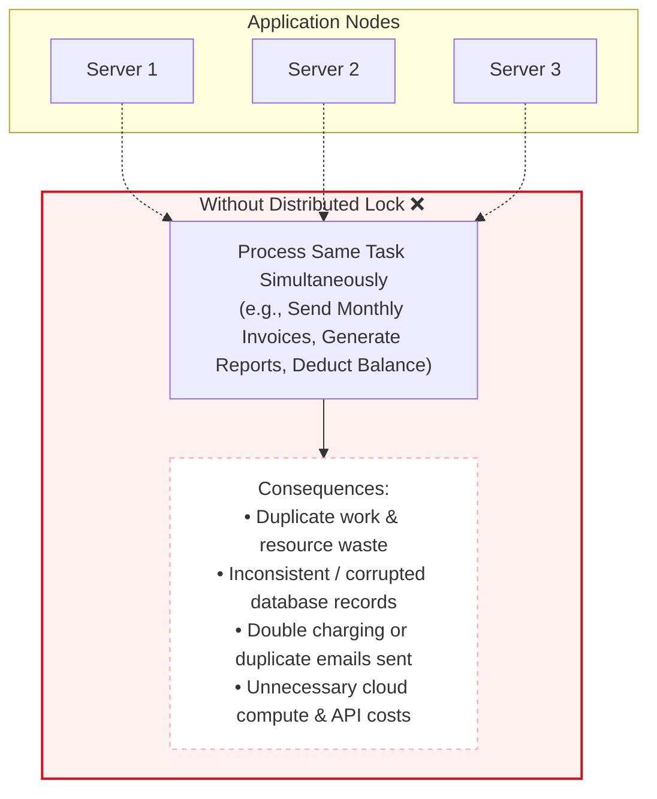
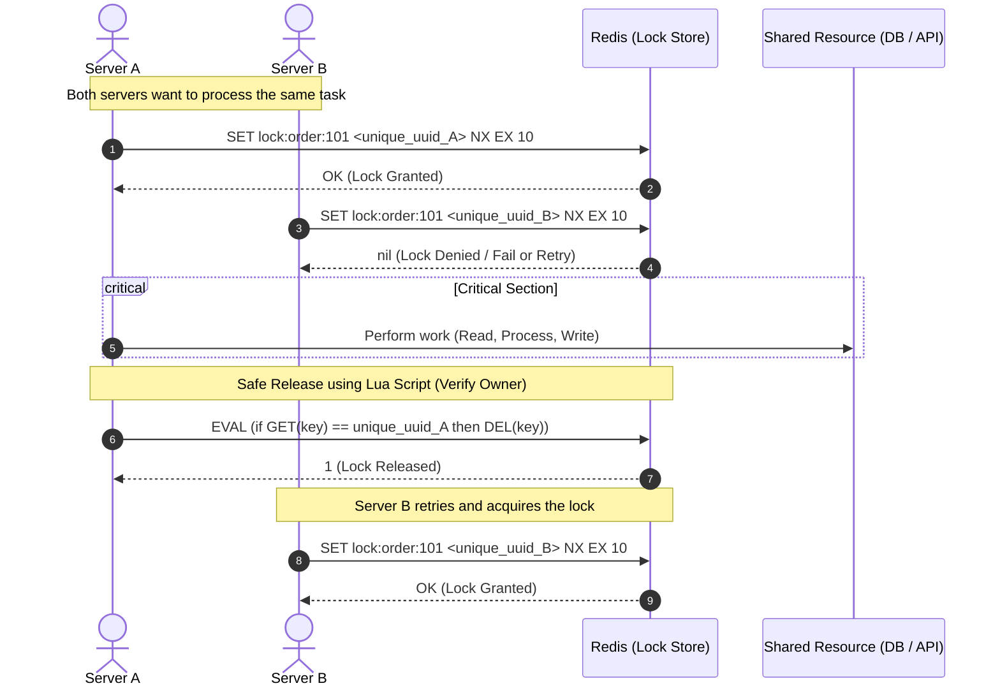
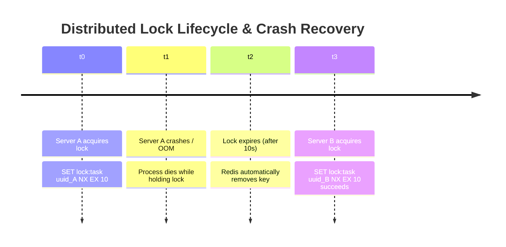
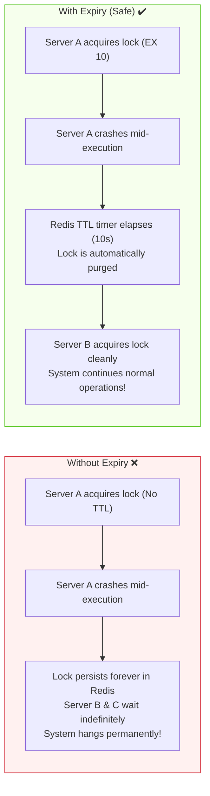
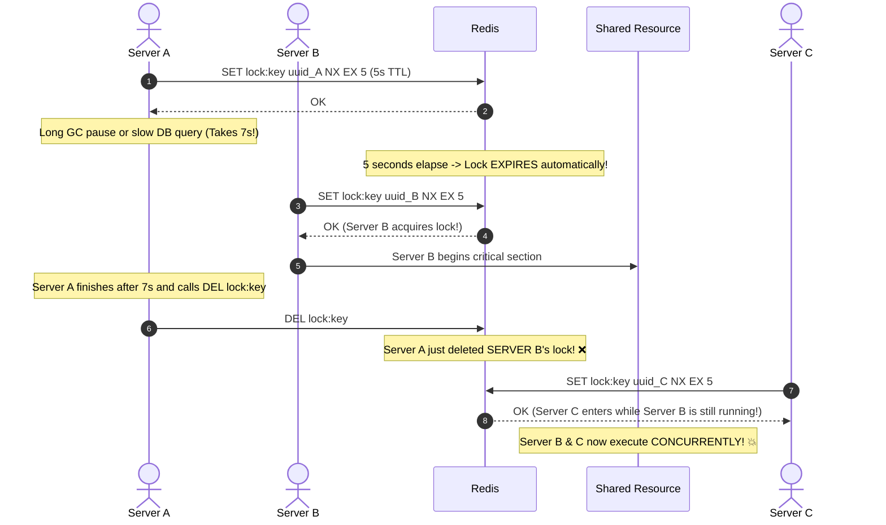
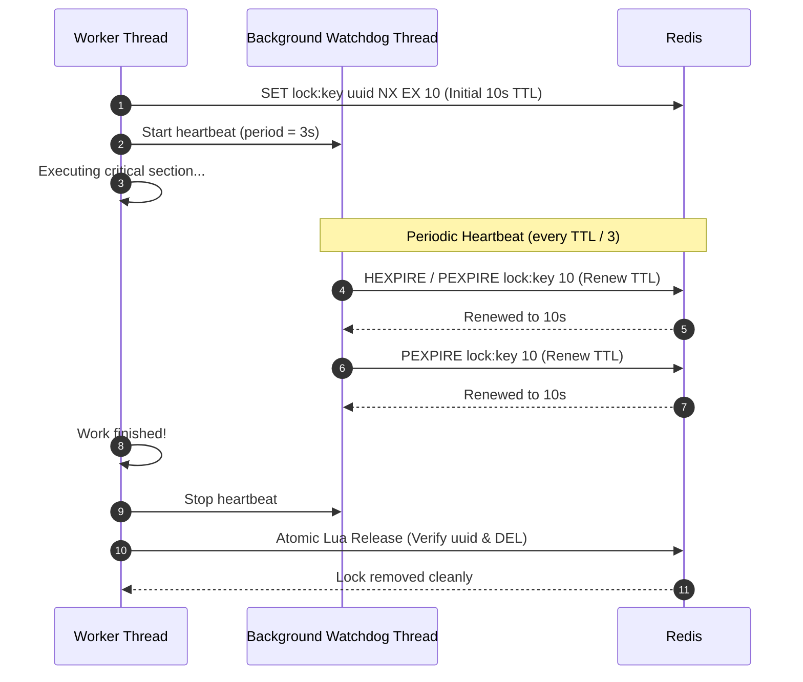
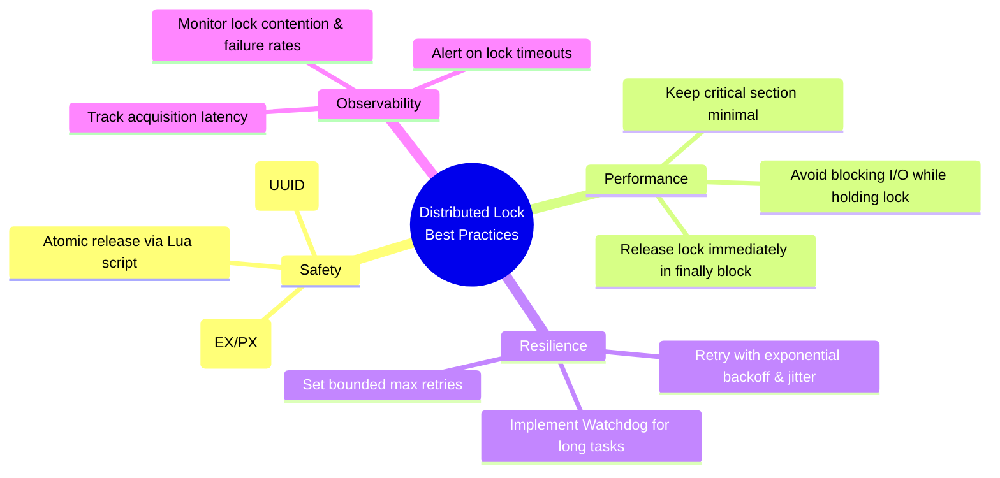
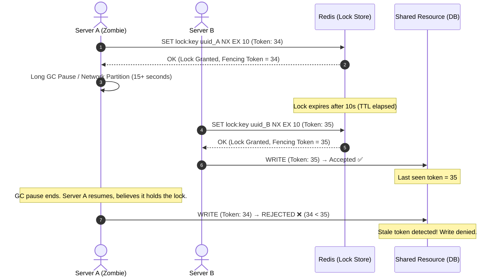

# Distributed Locks with Redis

A **distributed lock** is a synchronization mechanism that works across multiple servers, worker processes, or microservice instances to ensure that **only one process can access a shared resource or execute a critical section at any given time**.

In a single-process application, threads coordinate using local synchronization primitives (such as mutexes, semaphores, or synchronized blocks). In a distributed architecture with multiple nodes communicating over a network, local locks are ineffective. A centralized or distributed consensus store—most commonly **Redis**—is required to arbitrate access.

---

## 1. Why Do We Need Distributed Locks?

In modern cloud environments, applications run multiple stateless replicas behind load balancers, cron workers, or queue consumers. Without distributed coordination, concurrent instances can race to execute the exact same operation.



### Common Scenarios Requiring Distributed Locks

1. **Scheduled Background Jobs (Cron Tasks)**: Multiple worker instances scheduled to run a daily billing report at midnight must guarantee only one instance executes the job.
2. **Preventing Duplicate External Mutations**: Preventing duplicate API calls to third-party payment gateways (e.g., charging a customer's credit card twice during network retries).
3. **Inventory & Reservation Systems**: Reserving concert seats, flight tickets, or flash-sale stock where simultaneous purchases could cause overselling.
4. **Cache Stampede (Thundering Herd) Protection**: When a popular cache entry expires, thousands of incoming requests race to query the primary database. A distributed lock allows only one worker to regenerate the cache while others await the result.

---

## 2. How It Works (Using Redis as Lock Store)

Redis is an ideal lock provider due to its in-memory speed, single-threaded command execution model, and native atomic primitives.



### Core Redis Primitives

A reliable Redis lock relies on specific atomic command parameters:

```redis
SET lock:resource_name <unique_id> NX EX <ttl_in_seconds>
```

| Parameter              | Purpose                                                                        | Why It Matters                                                                                                    |
| :--------------------- | :----------------------------------------------------------------------------- | :---------------------------------------------------------------------------------------------------------------- |
| `key`                  | The resource identifier (e.g., `lock:report:2026-09`)                          | Granularly scopes the lock to a specific entity or task.                                                          |
| `<unique_id>`          | A cryptographically random value (e.g., UUID or `node_id:thread_id:timestamp`) | Identifies lock ownership to prevent one server from deleting another server's lock.                              |
| `NX`                   | **Set if Not eXists**                                                          | Ensures the key is only written if it does not already exist. If the lock is held, Redis returns `nil` / `false`. |
| `EX <sec>` / `PX <ms>` | **Expiration Time (TTL)**                                                      | Sets an automatic expiration to prevent deadlocks if the lock holder crashes.                                     |

> [!IMPORTANT]
> The `SET ... NX EX` command is **strictly atomic**. Earlier patterns that executed `SETNX` followed by a separate `EXPIRE` were prone to deadlocks if the server crashed in the microsecond between the two commands.

---

## 3. Lock with Expiry: Safety & Deadlock Prevention

A critical design requirement of any distributed lock is **liveness**: if the process holding the lock crashes or is disconnected, other processes must not wait indefinitely.



### With Expiry vs. Without Expiry



- **Without Expiry**: If a server crashes, runs out of memory (OOM), or experiences a network partition while holding a lock, the key remains in Redis indefinitely. The system enters an unrecoverable deadlock.
- **With Expiry**: The TTL acts as a fail-safe deadline. Even if the owner completely dies, the lock expires automatically, allowing standby workers to proceed.

---

## 4. The Lock Release Dilemma: Why Atomic Lua is Mandatory

Releasing a lock cannot be performed with a naive `DEL lock:key`. Doing so introduces a dangerous split-brain race condition.

### The Race Condition with Naive `DEL`



### The Solution: Atomic Check-and-Delete via Lua

To release the lock safely, the application must verify that the stored value matches its own unique identifier before issuing `DEL`. Because Redis executes Lua scripts as a single atomic transaction, no other command can intervene between the check and the deletion.

```lua
-- Atomic Lock Release Script
-- KEYS[1]: lock key
-- ARGV[1]: client's unique identifier (e.g., UUID)

if redis.call("get", KEYS[1]) == ARGV[1] then
    return redis.call("del", KEYS[1])
else
    return 0
end
```

If the lock expired and was acquired by another process, `GET` returns a different UUID, the script returns `0`, and the foreign lock remains intact.

---

## 5. Addressing the "Long Task" Problem: Watchdog / Lock Renewal

What happens if a legitimate task genuinely takes longer than the lock's expiration time?

1. **Setting an excessively long TTL** delays failure recovery if the node crashes.
2. **Setting a short TTL** risks the lock expiring while the node is still actively processing.

The standard production solution is a **Watchdog (Heartbeat / Lock Renewal)** pattern, popularized by libraries such as Java's **Redisson**.



- While the worker is actively executing, a lightweight background timer renews the key's TTL at regular intervals (typically every $\frac{1}{3}$ of the TTL).
- If the worker process abruptly crashes, the watchdog thread terminates with it. The TTL stops renewing and expires normally within the remaining seconds.

---

## 6. Best Practices



1. **Always Set an Expiry (`EX` / `PX`)**: Never create a lock without a TTL. A missing expiration turns any node crash into a permanent deadlock.
2. **Use Cryptographically Unique Values**: Generate a unique token (`UUID`, `nanoid`, or `machine_id:thread_id:timestamp`) for each lock acquisition attempt.
3. **Atomic Verification on Release**: Never issue a raw `DEL`. Always use an atomic Lua script to confirm you are the owner before releasing.
4. **Keep Critical Sections Short**: Minimize work performed under lock contention. Offload heavy computation, unnecessary network roundtrips, or unrelated queries outside the lock scope.
5. **Handle Acquisition Failures Gracefully**:
   - For idempotent tasks (e.g., cron jobs), skip execution if lock acquisition fails.
   - For transactional requests, implement retries with **exponential backoff and randomized jitter** to prevent thundering herd spikes against Redis.
6. **Use `finally` / Scoped Cleanup**: Always release locks inside a `finally` block (TypeScript/Java), `defer` (Go), or context manager (Python) to guarantee release even when exceptions occur.
7. **Monitor Lock Telemetry**: Track metrics such as lock acquisition wait time, lock hold duration, and lock acquisition failure rates to identify architectural bottlenecks.

---

## 7. Fencing Tokens: Guarding Against Zombie Processes

Even with TTL-based expiry, watchdog renewal, and atomic Lua release, a subtle race condition remains. A process can experience a long **stop-the-world GC pause**, **VM live migration**, or **network partition** that causes it to lose awareness of time. When the process resumes, it believes it still holds the lock, but the TTL has already expired and another process has legitimately acquired it.



### How Fencing Tokens Work

1. **Monotonically Increasing Token**: Each time a lock is successfully acquired, the lock manager issues a **strictly increasing integer** (the fencing token). This can be implemented using a Redis `INCR` counter alongside the lock.
2. **Token Accompanies Every Write**: The lock holder includes its fencing token with every write operation sent to the protected resource (database, file system, external API).
3. **Resource-Side Enforcement**: The protected resource tracks the highest token it has seen. It **rejects any write carrying a token lower than the current maximum**, guaranteeing that a zombie process with an expired lock cannot corrupt data written by the legitimate current lock holder.

> [!IMPORTANT]
> Fencing tokens require **cooperation from the protected resource**. The resource must be capable of inspecting and comparing tokens on each write. This is straightforward in databases (store `last_fencing_token` and check with `WHERE fencing_token > last_seen`), but may be infeasible with third-party APIs that do not support custom headers or conditional writes.

---

## 8. Architectural Comparison: Redis vs. Other Lock Providers

| Characteristic           | Single Redis Instance / Sentinel                                                                            | Redlock Algorithm (Multi-Master)                             | Apache ZooKeeper / etcd / Consul                                                                                        |
| :----------------------- | :---------------------------------------------------------------------------------------------------------- | :----------------------------------------------------------- | :---------------------------------------------------------------------------------------------------------------------- |
| **Primary Mechanism**    | `SET key uuid NX EX` + Lua `DEL`                                                                            | Multi-instance quorum voting ($N/2 + 1$)                     | Ephemeral Nodes / Distributed Leases + Raft/ZAB consensus                                                               |
| **Throughput & Latency** | Sub-millisecond, extremely high throughput                                                                  | High throughput, multiple network roundtrips                 | Moderate throughput, higher write latency due to strict quorum consensus                                                |
| **Consistency Level**    | Eventual consistency (Asynchronous replication)                                                             | Fault-tolerant across independent Redis masters              | **Strong Linearizability** (CP system in CAP theorem)                                                                   |
| **Failover Behavior**    | Asynchronous master failover can lose un-replicated locks                                                   | Tolerates minority node outages without lock loss            | Leader election guarantees lock state persistence                                                                       |
| **Recommended Use Case** | **95% of standard applications**: Background jobs, deduplication, cache stampede prevention, rate limiting. | High-reliability scenarios within Redis-only infrastructure. | **High-stakes financial transactions** where split-brain or double-locking is unacceptable under any network partition. |

> [!NOTE]
> **Single Redis vs. Redlock**:
> In a standard Redis Master-Replica setup, replication is **asynchronous**. If Master acquires a lock and crashes before replicating the key to Replica, the promoted Replica does not have the lock, permitting a second node to acquire it.
> For the vast majority of web engineering tasks (deduplicating emails, reports, rate limits), single-instance Redis is sufficient and performant. For missions requiring zero-tolerance against double execution, either use **etcd/ZooKeeper** or implement **Fencing Tokens**.

---

## 9. Key Takeaways

> [!IMPORTANT]
>
> - **Distributed Locks Coordinate Across Nodes**: They ensure only one instance at a time executes a critical task across a distributed cluster.
> - **Atomic Acquisition**: Always acquire locks using `SET lock:key <unique_id> NX EX <ttl>` in a single atomic command.
> - **Always Use Expiry (TTL)**: Expiration prevents infinite deadlocks when an instance holding the lock crashes or disconnects.
> - **Always Release with Identity Check**: Never use plain `DEL`. Use an atomic Lua script to ensure instances only release locks they legitimately own.
> - **Keep Locks Short**: Keep the critical section lean, and employ a watchdog renewal pattern if task execution times vary.
> - **Use Fencing Tokens for Critical Resources**: When the protected resource supports it, issue monotonically increasing tokens to guard against zombie processes that resume after lock expiry.
