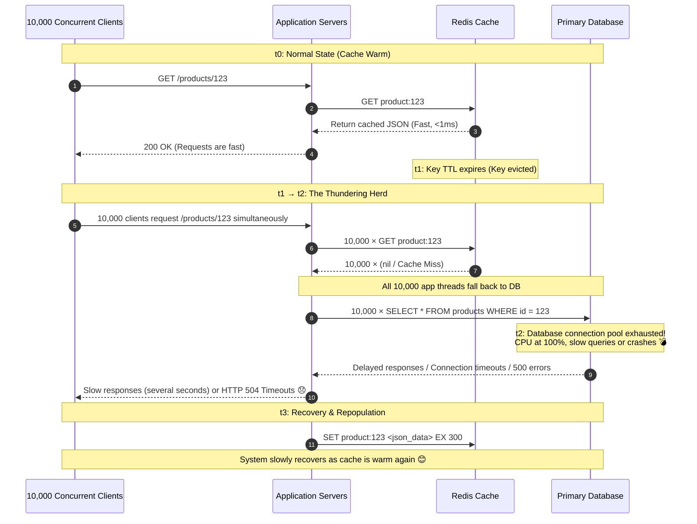
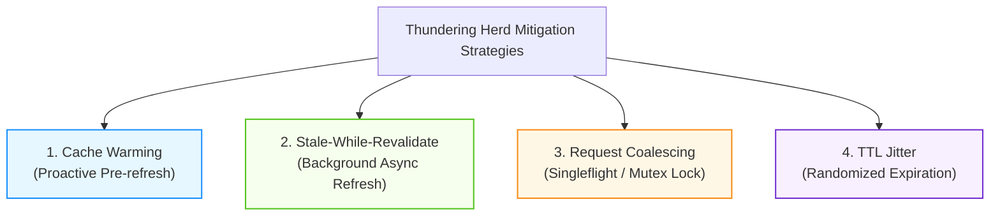
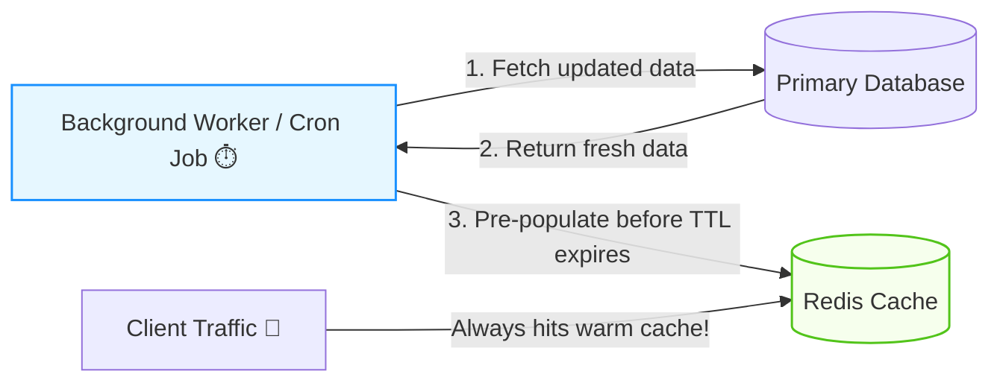
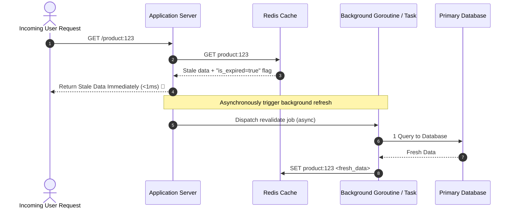
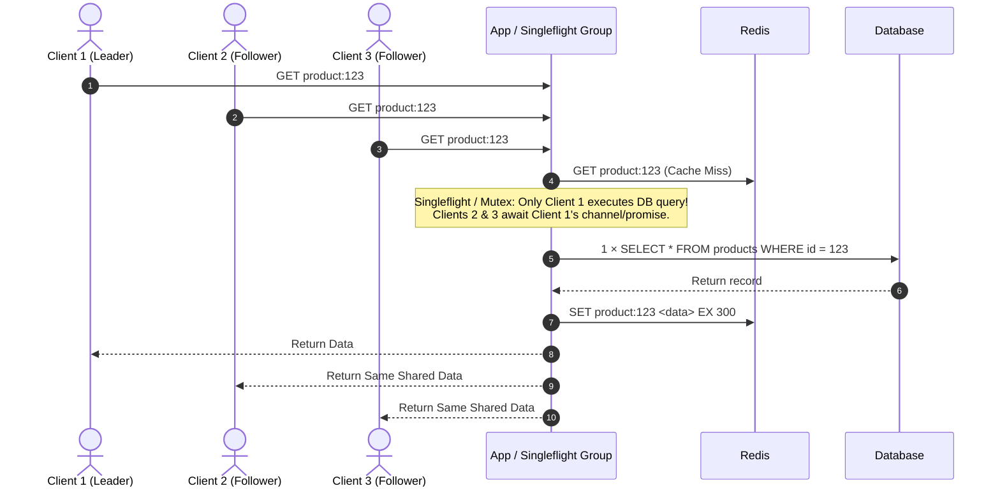
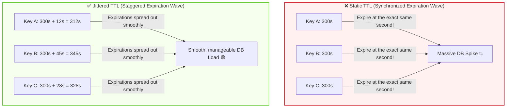
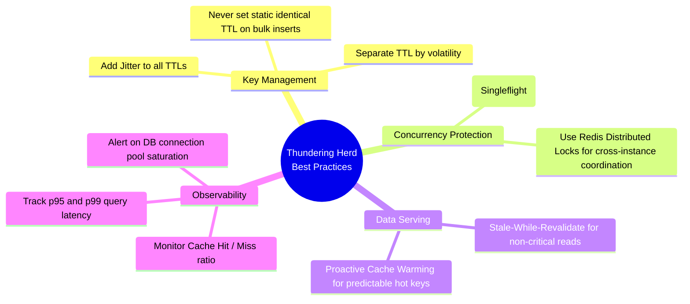

# Thundering Herd Problem (Cache Stampede)

The **Thundering Herd Problem** (also commonly referred to as a **Cache Stampede** or **Dog-piling**) is a system design concurrency issue that occurs when **a large number of incoming requests attempt to access an expired or missing cached resource simultaneously, overwhelming the backend database or downstream service**.

Under normal circumstances, caching layers like **Redis** absorb the vast majority of read traffic (e.g., 99%+ hit rate). However, the moment a hot cache key expires or is invalidated, all concurrent client requests experience a simultaneous **cache miss**. Each request then attempts to fetch the data from the underlying primary database and re-populate the cache at the exact same moment, causing a severe traffic spike that can bring down the database.

---

## 1. How It Happens

```mermaid
flowchart LR
    subgraph Clients ["Concurrent Traffic"]
        C1["Client 1"]
        C2["Client 2"]
        C3["Client 3"]
        C10k["... 10,000 Clients"]
    end

    subgraph CachingLayer ["Redis Cache Layer"]
        Cache[("Redis Cache<br/>Key: <code>product:123</code><br/><b>STATUS: EXPIRED ⏳</b>")]
    end

    subgraph PrimaryDB ["Primary Database"]
        DB[("PostgreSQL / MySQL<br/><b>Hit by 10,000 Queries! 💣</b>")]
    end

    subgraph ImpactArea ["System Impact 💥"]
        direction TB
        I1["❌ Massive Database CPU / RAM Spike"]
        I2["❌ Connection Pool Exhaustion"]
        I3["❌ Response Latency Spikes"]
        I4["❌ Request Timeouts (HTTP 504)"]
        I5["❌ Cascading Service Failures"]
    end

    Clients -->|"1. Concurrent Requests"| Cache
    Cache -->|"2. Cache MISS"| PrimaryDB
    PrimaryDB --> ImpactArea

    style CachingLayer fill:#fff1f0,stroke:#cf1322,stroke-width:2px
    style PrimaryDB fill:#fff2e8,stroke:#d4380d,stroke-width:2px
    style ImpactArea fill:#fffbe6,stroke:#d48806,stroke-width:1.5px
```



### The Breakdown Sequence

1. **Hot Key Expiration**: A frequently accessed item (e.g., a top-selling product on an e-commerce landing page) has a Time-To-Live (TTL) that reaches zero.
2. **Synchronized Cache Misses**: Thousands of incoming requests arrive in the same 50–100 millisecond window and query Redis for the key, receiving a `nil` (cache miss).
3. **Redundant Expensive Queries**: Instead of a single query refreshing the cache, all 10,000 requests execute identical, expensive SQL queries against the primary database concurrently.
4. **Backend Saturation**: The database runs out of available connection slots (see [PostgreSQL Connection Pooling](<file:///c:/Users/Lyzander%20Andrylie/Documents/(5)%20Note/software-engineer/concept/postgres/connection_pool.md>)), CPU utilization surges to 100%, and query execution times balloon from 5ms to several seconds.
5. **Cascading Failure**: Upstream API gateways and application threads reach timeout thresholds, causing request queues to back up and triggering wide-scale service outages.

---

## 2. Example Scenario & Lifecycle Timeline

Consider an e-commerce platform during high-traffic hours featuring a popular flash-sale product (`product:123`):



### Timeline Milestones

| Timestamp | Cache Status                | Database State                      | User Experience                                     |
| :-------- | :-------------------------- | :---------------------------------- | :-------------------------------------------------- |
| **$t_0$** | **Warm** (Cache Hit)        | Normal baseline load                | Instant sub-millisecond responses.                  |
| **$t_1$** | **Expired** (TTL reaches 0) | Calm before the storm               | Traffic continues flowing normally.                 |
| **$t_2$** | **Massive Misses**          | **Overloaded** (10K queries hit DB) | High latency, connection timeouts, HTTP 504 errors. |
| **$t_3$** | **Re-warmed** (Repopulated) | Load normalizes                     | System recovers; requests served from cache again.  |

---

## 3. How to Prevent & Mitigate

There are four primary architectural solutions to eliminate or mitigate the thundering herd problem:



---

### Strategy 1: Cache Warming (Proactive Refresh)

Instead of waiting for user traffic to experience a cache miss, an automated background job or scheduled cron periodically regenerates popular/hot keys **before** their TTL runs out.



- **Mechanism**: Identify "hot keys" (e.g., homepage banners, top 100 products, exchange rates) and set up a background scheduler (e.g., Celery, temporal, or cron) that executes every $N$ minutes to refresh the cache.
- **Benefits**: End users **never** experience a cache miss for critical resources.
- **Trade-offs**: Only practical for predictable, finite sets of hot keys. You cannot warm millions of unique long-tail keys.

---

### Strategy 2: Stale-While-Revalidate (SWR) & Probabilistic Early Expiration

When a cache key expires, the application immediately serves the **slightly stale (old) data** to incoming users while triggering a **single asynchronous background task** to revalidate and update the cache.



#### Probabilistic Early Expiration (XFetch Algorithm)

Rather than using a hard TTL cutoff, the system computes the probability of refreshing the key on read requests before it actually expires:

$$\text{Probability to Refresh} = -\beta \times \delta \times \ln(\text{random}(0, 1)) > \text{Remaining TTL}$$

Where:

- $\delta$: The computation time required to fetch the data from the database.
- $\beta$: An aggressiveness multiplier ($> 0$, usually set to 1.0).
- As remaining TTL shrinks and read frequency increases, the likelihood that one client triggers an early background refresh approaches 100%, guaranteeing the cache never reaches absolute zero.

---

### Strategy 3: Request Coalescing (Singleflight / Mutex / Distributed Lock)

When a cache miss occurs across multiple concurrent requests, **only one request is permitted to call the database**. All other concurrent requests wait for that single in-flight query to finish and share the result.



#### Implementation Options

1. **In-Memory Request Coalescing (Same Instance)**:
   - **Go**: `golang.org/x/sync/singleflight`
   - **Node.js**: Memoizing promises based on cache key.
   - **Java**: `ConcurrentHashMap` with `CompletableFuture`.
2. **Cross-Instance Coalescing via Redis Distributed Lock**:
   - When requests span multiple instances behind a load balancer, instances use a Redis mutex lock (`SET lock:key uuid NX EX 5`).
   - The instance that wins the lock executes the DB query and populates Redis.
   - Instances that fail to acquire the lock sleep briefly (e.g., 50ms) and retry reading the newly warmed cache.
   - _For in-depth details on implementing safe distributed locks, see [Distributed Locks with Redis](<file:///c:/Users/Lyzander%20Andrylie/Documents/(5)%20Note/software-engineer/concept/redis/lock.md>)._

---

### Strategy 4: Add Jitter to TTL (Randomized Expiration)

When caching thousands of records at the same time (e.g., bulk database exports, daily catalogs, or batch warming jobs), setting a static TTL (e.g., exactly 300 seconds) ensures they will all expire at the **exact same instant**, creating a synthetic thundering herd.

To avoid this, add random **jitter (entropy)** to the TTL:

$$\text{Actual TTL} = \text{Base TTL} + \text{Random}(0, \text{Jitter})$$



#### Example Implementation

```python
import random

BASE_TTL = 300       # 5 minutes
MAX_JITTER = 60      # up to 1 minute extra

actual_ttl = BASE_TTL + random.randint(0, MAX_JITTER)
redis_client.set("product:123", serialized_data, ex=actual_ttl)
```

---

## 4. Comparison of Mitigation Strategies

| Strategy                   | Where Implemented        | Complexity  | Latency for User on Expiry                   | Best Used For                                                     |
| :------------------------- | :----------------------- | :---------- | :------------------------------------------- | :---------------------------------------------------------------- |
| **Cache Warming**          | Background Scheduler     | Low         | Zero latency impact (Cache never cold)       | Predictable hot resources (e.g., Top 50 products, homepage data)  |
| **Stale-While-Revalidate** | App / Cache Layer        | Medium      | Zero latency impact (Serves stale instantly) | Read-heavy endpoints where slight staleness (1–2s) is acceptable  |
| **Request Coalescing**     | App Layer / Redis Lock   | Medium–High | Minimal (One DB query time)                  | High-concurrency operations where fresh data is strictly required |
| **TTL Jitter**             | App Layer (Cache Writes) | Very Low    | Normal cache miss latency                    | Bulk/batch cached items and general baseline defense              |

---

## 5. Best Practices Checklist



- [x] **Always Add Jitter to TTLs**: Apply 10%–20% random entropy to avoid synchronized expiration waves.
- [x] **Use Cache Warming for Hot Keys**: Identify top traffic drivers and refresh them via background workers.
- [x] **Implement Request Coalescing**: Ensure only one in-flight database query occurs per unique missing key.
- [x] **Adopt Stale-While-Revalidate**: Return slightly stale data immediately while refreshing asynchronously in the background.
- [x] **Monitor Key Indicators**: Set up alerts for sudden drops in cache hit rate, spikes in DB connection pool usage, and database CPU threshold breaches.

---

## 6. Key Takeaways

1. **The Root Cause**: The thundering herd occurs when numerous requests hit the same resource at the exact same moment—typically right after cache expiry—overwhelming backend databases.
2. **Cascading Failure Risk**: Unmitigated cache stampedes can cascade from database exhaustion into API gateway timeouts and total system downtime.
3. **Layered Defense**: No single solution fits all keys:
   - Combine **TTL Jitter** as a universal baseline.
   - Use **Request Coalescing (Singleflight)** to guard against unexpected traffic spikes on cold keys.
   - Use **Cache Warming & SWR** for top tier hot keys.
4. **Massive ROI**: A small architectural adjustment (such as a singleflight mutex or TTL jitter) can prevent total database collapse during traffic peaks.
