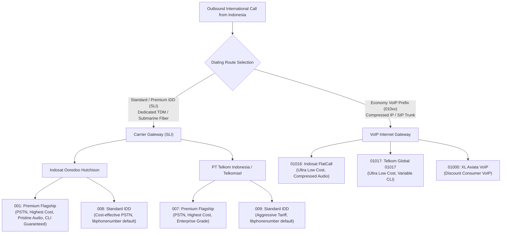
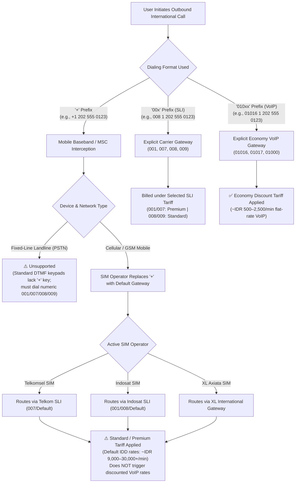
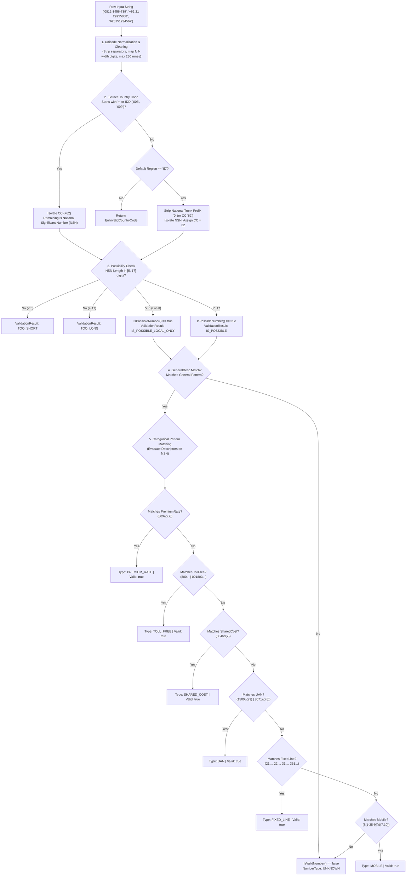

# Indonesian Phone Number Validation (+62)

| Metadata              | Value                                                                                                                                                                          |
| :-------------------- | :----------------------------------------------------------------------------------------------------------------------------------------------------------------------------- |
| **Country**           | Indonesia (Republic of Indonesia / Republik Indonesia)                                                                                                                         |
| **ISO 3166-1 Code**   | `ID` (Alpha-2), `IDN` (Alpha-3)                                                                                                                                                |
| **Country Code (CC)** | `+62`                                                                                                                                                                          |
| **National Prefix**   | `0` (Domestic trunk prefix)                                                                                                                                                    |
| **IDD Prefixes**      | `008` (Indosat), `009` (Telkom) — Metadata regex: `00[89]` _(Note: `001` was historically Indosat IDD, but in metadata `001` is reserved for inbound toll-free e.g. `001803`)_ |
| **Package**           | `github.com/nyaruka/phonenumbers/v2`                                                                                                                                           |
| **Upstream Parity**   | Google `libphonenumber` `v9.0.38`                                                                                                                                              |
| **Applicable Types**  | `MOBILE`, `FIXED_LINE`, `TOLL_FREE`, `SHARED_COST`, `PREMIUM_RATE`, `UAN`, `EMERGENCY`                                                                                         |

---

## Glossary


- **IDD (International Direct Dialing)**: A telephony service and mechanism allowing subscribers to place outbound international calls directly without operator intervention. In dialing notation, it refers to the **international exit code** dialed before the destination country calling code (e.g., `008` or `009` in Indonesia, `011` in North America, or `00` under ITU recommendation; represented abstractly by `+` in ITU-T E.164).
  - **International Exit Code (International Call Prefix)**: The dialing prefix dialed by a caller to break out of the local/national telephone exchange and route an outbound call onto an international telephone gateway.
    - Standardized by the ITU as `00` (used throughout Europe and parts of Asia), `011` in North America (NANP), `0011` in Australia, and carrier-specific codes in Indonesia (`008` Indosat, `009` Telkom). In the international E.164 standard, it is represented by the leading `+` symbol. _(See [Section 1.1](#11-outbound-international-dialing-idd-vs-voip-sli-vs-voip) for carrier differences, cost tiers, and `+` vs. `00x` dialing mechanics)._

  - **Country Calling Code (Country Code / CC)**: A 1- to 3-digit numerical code assigned by the ITU-T (under Recommendations E.123 and E.164) to route international calls to a specific sovereign nation, overseas territory, or international service.
    - It is dialed immediately following the international exit code or represented after the `+` sign (e.g., `+62` for Indonesia, `+1` for North America, `+44` for the UK, `+81` for Japan).

- **NDD (National Direct Dialing)**: A telephony service and procedure enabling callers to place domestic trunk, inter-city, or mobile calls directly without operator assistance, typically initiated by dialing the domestic trunk prefix.
  - **Domestic Trunk Prefix (National Prefix)**: The leading digit or sequence of digits dialed before a telephone number to route the call outside the local exchange onto the national trunk network (to reach other geographic area codes or cellular networks).
    - Typically `0` in Indonesia and most countries, or `1` in North America (NANP). It is strictly used for domestic dialing and is omitted when formatting in international E.164 format.
- **NSN (National Significant Number)**: Under ITU-T Recommendation E.164, the portion of a telephone number that immediately follows the country calling code, completely stripped of international exit codes (IDD) and domestic trunk prefixes.
  - It consists of the **National Destination Code** (NDC / area code or mobile network code) and the **Subscriber Number** (SN).
  - For example, for Indonesian mobile `+62 812-3456-7890`, the NSN is `81234567890` (represented as `NationalNumber` in `libphonenumber`).
- **Dedicated Service Blocks**: Special non-geographic numbering blocks allocated for specific organizational or utility telephony services:
  - **Universal Access Numbers (UAN / `1500xxx`)**: Single nationwide business access numbers routed to centralized customer service/call centers.
    - The telecom operator’s switch automatically routes the call to the organization’s central customer service PBX or the nearest regional call center.
    - The primary nationwide commercial hotline block:

      • Halo BCA: 1500888

      • Bank Mandiri: 1500046

      • Telkomsel: 1500735

  - **Toll-Free (`0800`)**: Inbound service numbers where calling charges are fully absorbed by the recipient.
  - **Shared Cost (`0804`)**: Service numbers where call charges are split between the caller and the recipient.
  - **Premium Rate (`0809`)**: Information, entertainment, or specialized support lines billed to the caller at higher-than-standard tariffs.

---

## 1. Overview & Telephony Fundamentals

Indonesian telecommunications are regulated by the Ministry of Communication and Informatics (Kementerian Komunikasi dan Digital / KOMDIGI) and follow the ITU-T E.164 recommendation under country calling code **`+62`**.

Telephone numbering in Indonesia is structurally diverse due to:

- **Variable Mobile Subscriber Lengths**: Cellular mobile numbers vary between **10, 11, 12, and 13 digits** in national format (`08xx-xxxx-xxxx`), corresponding to **9 to 12 digits** in National Significant Number (NSN) format (`8xx-xxxx-xxxx`).
- **Mixed Area Code Lengths**: Fixed-line area codes range from **2 to 3 digits** (or **3 to 4 digits** when including the leading domestic trunk prefix `0`), depending on geographic density:
  - 2-digit area codes (dialed as 3 digits with domestic trunk prefix: `021` for Greater Jakarta, `031` for Surabaya, `022` for Bandung, `024` for Semarang, `061` for Medan).
  - 3-digit area codes (dialed as 4 digits with domestic trunk prefix: `0251` for Bogor, `0361` for Denpasar, `0511` for Banjarmasin, `0411` for Makassar, `0967` for Jayapura).
- **Three Time Zones**: Numbers map across Western Indonesia Time (**WIB** / UTC+7 / `Asia/Jakarta`), Central Indonesia Time (**WITA** / UTC+8 / `Asia/Makassar`), and Eastern Indonesia Time (**WIT** / UTC+9 / `Asia/Jayapura`).
- **Dedicated Service Blocks**: Special numbering blocks for Universal Access Numbers (**UAN** `1500xxx`), Toll-Free (`0800`), Shared Cost (`0804`), and Premium Rate (`0809`).

`phonenumbers` provides deterministic parsing, possibility checks, category-based regular expression verification, formatting, and offline enrichment for all Indonesian numbers without making external network calls.

### 1.1. Outbound International Dialing: IDD vs. VoIP (SLI vs. VoIP)

Historically and architecturally, Indonesia does not route international calls through a single monolithic `00` exit prefix. The Ministry of Communication and Informatics (KOMDIGI) allocated distinct international gateway prefixes to competing telecom operators (principally Indosat and Telkom). Dialing codes differ significantly across **routing infrastructure (PSTN/TDM vs. VoIP)**, **audio quality & latency**, **tariffs / cost tiers**, and **`libphonenumber` metadata handling**:

- **SLI (Sambungan Langsung Internasional)**: The official Indonesian statutory and regulatory term (under KOMDIGI) for **IDD (International Direct Dialing)**. It designates standard outbound international telephone calls placed directly by subscribers over licensed international gateway switches without operator assistance.
- **PSTN (Public Switched Telephone Network)**: The traditional, global circuit-switched telephone network consisting of fiber-optic cables, cellular base stations, switching centers, and undersea cables. In PSTN routing, a dedicated, continuous physical or logical circuit is reserved for the entire duration of the call.
- **TDM (Time-Division Multiplexing)**: A digital transmission technology used across core telecommunication backbones and PSTN trunk lines that interleaves multiple discrete phone calls into separate recurrent time slots within a single channel (e.g., E1 trunks delivering 30 voice channels at 64 kbps PCM). TDM provides deterministic latency, zero packet jitter, and fixed bitrates.
- **VoIP (Voice over Internet Protocol)**: A digital telephony technology that packetizes voice signals into discrete IP packets (using protocols like SIP and RTP, encoded with codecs like G.711 or compressed G.729) and routes them over packet-switched data networks or the public internet, rather than reserving dedicated circuit lines.
- **CLI (Calling Line Identification / Caller ID)**: A telephony signaling feature (via SS7 / ISUP or SIP `From` / `P-Asserted-Identity` headers) that transmits the caller’s original telephone number to the recipient's display terminal. Standard SLI guarantees CLI integrity, whereas budget VoIP routes frequently strip or overwrite CLI with generic gateway trunks.
- **KOMDIGI (Kementerian Komunikasi dan Digital)**: The government ministry responsible for telecommunication regulations, radio spectrum licensing, and national numbering plans in the Republic of Indonesia (formerly _Kemenkominfo_).



#### Carrier Exit Prefixes & Tariff Comparison Matrix

| Prefix                    | Operator / Gateway                                             | Service Type & Network                                                             | Relative Cost / Tariff                                             | Voice Quality & CLI                                                                       | `libphonenumber` Status                                                                      |
| :------------------------ | :------------------------------------------------------------- | :--------------------------------------------------------------------------------- | :----------------------------------------------------------------- | :---------------------------------------------------------------------------------------- | :------------------------------------------------------------------------------------------- |
| **`001`**                 | **Indosat Ooredoo Hutchison**                                  | Flagship SLI (PSTN/TDM circuit-switched via dedicated submarine cables/satellites) | **Premium (Highest)**<br>_(~IDR 9,000–30,000+/min)_                | Crystal-clear, zero jitter, uncompressed audio, guaranteed Caller ID (CLI).               | Excluded from IDD regex in metadata to avoid collision with inbound Toll-Free (`001803...`). |
| **`008`**                 | **Indosat Ooredoo Hutchison** _(Originally Satelindo)_         | Standard SLI (PSTN international gateway)                                          | **Medium / Standard**<br>_(~20%–40% cheaper than 001)_             | High carrier-grade quality, reliable CLI delivery.                                        | **Recognized IDD** in `metadata.xml` (`00[89]`).                                             |
| **`007`**                 | **Telkom Indonesia**                                           | Flagship SLI (Telkom International Gateway)                                        | **Premium (High)**<br>_(Enterprise-level PSTN rates)_              | Crystal-clear, uncompressed PSTN, prioritized routing, guaranteed CLI.                    | Excluded from IDD regex in metadata to avoid collision with Toll-Free (`007803...`).         |
| **`009`**                 | **Telkom Indonesia** _(Originally Bakrie Telecom / Ratelindo)_ | Standard / Economy SLI                                                             | **Medium / Standard**<br>_(Competitive / discounted standard IDD)_ | Carrier-grade quality, reliable CLI delivery.                                             | **Recognized IDD** in `metadata.xml` (`00[89]`).                                             |
| **`01016`**               | **Indosat Ooredoo Hutchison** _(Indosat FlatCall)_             | VoIP / IP Telephony (H.323/SIP packet-switched)                                    | **Economy (Lowest)**<br>_(~IDR 500–2,500/min or flat rate)_        | Compressed audio (e.g. G.729), potential latency/jitter, CLI pass-through not guaranteed. | Not an E.164 IDD; treated as a value-added service prefix.                                   |
| **`01017`**               | **Telkomsel / Telkom** _(Global 01017)_                        | VoIP / IP Telephony                                                                | **Economy (Lowest)**<br>_(Budget per-minute / per-block rates)_    | Compressed audio, slight delay, CLI may display generic gateway number.                   | Not an E.164 IDD; treated as a value-added service prefix.                                   |
| **`01000`** / **`01088`** | **XL Axiata** _(XL VoIP)_                                      | VoIP / IP Telephony                                                                | **Economy (Lowest)**                                               | Compressed audio, consumer budget tier.                                                   | Not an E.164 IDD.                                                                            |

> [!NOTE]
> **Why `phonenumbers` only recognizes `008` and `009` as IDD**:
> In Google `libphonenumber`, the metadata regex for Indonesia's `internationalPrefix` is strictly `00[89]`. Although `001` and `007` are valid PSTN exit prefixes in Indonesian telecommunications, they are omitted from the IDD prefix regex to prevent parser collisions with inbound **International Toll-Free Services (ITFS)** such as `001803xxxxxxx` and `007803xxxxxxx` (which are categorized under `TOLL_FREE` / `no_intl_dial`).

#### Dialing `+` vs. Explicit Numerical Prefix (`00x` / `010xx`)

When placing outbound international calls, dialing the abstract `+` symbol versus dialing an explicit numerical prefix (`001`, `007`, `008`, `009`, or `010xx`) behaves fundamentally differently across device types, carrier routing, and billing:



| Feature / Dimension        | Dialing `+` (e.g., `+1 202...`)                                                                                                                            | Dialing `00x` (e.g., `008 1...`, `009 1...`)                                                             | Dialing `010xx` (e.g., `01016 1...`, `01017 1...`)                                           |
| :------------------------- | :--------------------------------------------------------------------------------------------------------------------------------------------------------- | :------------------------------------------------------------------------------------------------------- | :------------------------------------------------------------------------------------------- |
| **Underlying Mechanism**   | 3GPP/GSM Type-of-Number (TON) flag set to `International`. Handset/MSC maps `+` to the SIM carrier's default exit trunk.                                   | Caller explicitly chooses which licensed gateway operator (Indosat vs. Telkom) handles the call.         | Caller explicitly routes call through packet-switched IP telephony gateway.                  |
| **Cost / Tariff Impact**   | **Standard / Premium IDD Rate**.<br>⚠️ The network **never** auto-downgrades `+` to cheaper VoIP tariffs.                                                  | Billed according to the dialed gateway operator's specific SLI tier (e.g., `008` is cheaper than `001`). | **Cheapest / Economy Rate** (often 80%–90% cheaper, flat-rate per minute or 6-second block). |
| **Cellular (Mobile)**      | Supported globally. Long-press `0` on phone dialer generates `+`.                                                                                          | Supported (if caller's SIM permits cross-carrier SLI routing).                                           | Supported. Must be manually dialed to benefit from budget promo rates.                       |
| **Fixed-Line (Landline)**  | **Not possible**. Traditional PSTN DTMF keypads do not have a `+` key.                                                                                     | **Mandatory**. Landlines must dial `001`, `007`, `008`, or `009`.                                        | Supported if VoIP service is enabled on the landline account.                                |
| **International Roaming**  | **Seamless & Globally Portable**. Works worldwide; visiting foreign carrier automatically resolves `+` to local exit code (e.g. `011` in US, `001` in SG). | **Fails when roaming**. Indonesian exit codes (`008`/`009`) are unrecognized in foreign networks.        | **Fails when roaming**.                                                                      |
| **Software / API Storage** | **Universal Best Practice (ITU-T E.164)**. Carrier-agnostic, country-agnostic, deterministic parsing in `phonenumbers`.                                    | Fragile in software databases; ties numbers to domestic Indonesian routing.                              | Fragile; value-added service prefix, not standard E.164.                                     |

---

## 2. Validation Architecture & Processing Pipeline

The validation lifecycle for an Indonesian telephone number traverses a multi-tiered pipeline:



### Possibility vs. Full Validity

| Check Method                        | Execution Scope                                                                                                                              | Cost             | Indonesia Behavior                                                                                                                                  |
| :---------------------------------- | :------------------------------------------------------------------------------------------------------------------------------------------- | :--------------- | :-------------------------------------------------------------------------------------------------------------------------------------------------- |
| `IsPossibleNumber(num)`             | Checks whether the NSN length matches possible length constraints defined in `general_desc`.                                                 | $\mathcal{O}(1)$ | Returns `true` if NSN length is between **7 and 17 digits**, or **5 to 6 digits** for local-only fixed lines (evaluates `possible == IS_POSSIBLE \  |
| `IsPossibleNumberWithReason(num)`   | Returns an enum explaining possibility failure reasons (`TOO_SHORT`, `TOO_LONG`, `INVALID_LENGTH`, `IS_POSSIBLE`, `IS_POSSIBLE_LOCAL_ONLY`). | $\mathcal{O}(1)$ | Returns `TOO_SHORT` if NSN $< 5$ digits; `IS_POSSIBLE_LOCAL_ONLY` if 5–6 digits; `IS_POSSIBLE` if 7–17 digits; `TOO_LONG` if $> 17$ digits.         |
| `IsValidNumber(num)`                | Executes full regular-expression matching against the active territory's category descriptors.                                               | $\mathcal{O}(K)$ | Returns `true` only if the NSN matches a valid recognized category pattern (Mobile, Fixed Line, Toll-Free, UAN, etc.).                              |
| `IsValidNumberForRegion(num, "ID")` | Verifies both that `num.GetCountryCode() == 62` and that the number satisfies Indonesia's categorical rules.                                 | $\mathcal{O}(K)$ | Returns `false` if country code is not 62, even if the national number would be valid in another territory.                                         |

---

## 3. Metadata & Number Plan Specification

The canonical metadata for Indonesia embedded in `phonenumbers` (`metadata/data/metadata.xml.gz`) defines the following structural rules:

### Metadata Descriptors

| Descriptor         | National Number Regex Pattern                                                                      | NSN Lengths                        | National Format Example           |
| :----------------- | :------------------------------------------------------------------------------------------------- | :--------------------------------- | :-------------------------------- |
| **`general_desc`** | `00[1-9]\d{9,14}\|(?:[1-36]\|8\d{5})\d{6}\|00\d{9}\|[1-9]\d{8,10}\|[2-9]\d{7}`                     | `7–17`                             | —                                 |
| **`mobile`**       | `8[1-35-9]\d{7,10}`                                                                                | `9, 10, 11, 12`                    | `0812-3456-789`                   |
| **`fixed_line`**   | `2[124]\d{7,8}\|619\d{8}\|2(?:1(?:14\|500)\|2\d{3})\d{3}\|61\d{5,8}\|(?:2(?:[35][1-4]\|…))\d{5,8}` | `7, 8, 9, 10, 11` _(+ 5, 6 local)_ | `0218-350-123`                    |
| **`toll_free`**    | `00(?:1803\d{5,11}\|7803\d{7})\|(?:177\d\|800)\d{5,7}`                                             | `8–17`                             | `0800-123-4567`                   |
| **`shared_cost`**  | `804\d{7}`                                                                                         | `10`                               | `0804 123 4567`                   |
| **`premium_rate`** | `809\d{7}`                                                                                         | `10`                               | `0809 1 234 567`                  |
| **`uan`**          | `(?:1500\|8071\d{3})\d{3}`                                                                         | `7, 10`                            | `8071-123-456`                    |
| **`emergency`**    | `11[02389]`                                                                                        | `3`                                | `110`, `112`, `113`, `118`, `119` |
| **`short_code`**   | `1(?:1[02389]\|40\d\d\|50264)`                                                                     | `3, 5, 6`                          | `110`, `14010`, `150264`          |
| **`no_intl_dial`** | `001803\d{5,11}\|(?:007803\d\|8071)\d{6}`                                                          | `10–17`                            | —                                 |

> [!NOTE]
>
> `VOIP`, `PERSONAL_NUMBER`, `PAGER`, and `VOICEMAIL` descriptors have `possible_length: [-1]` for Indonesia, indicating they are not assigned or classified independently under Indonesian national numbering plans.

---

## 4. Number Categories & Verification Rules

### 4.1. Cellular Mobile Numbers (`MOBILE`)

In national format, all Indonesian mobile numbers begin with **`08`**. When parsed into a `*PhoneNumber`, the domestic prefix `0` is stripped, leaving an NSN starting with **`8`**.

- **National Number Pattern**: `^8[1-35-9]\d{7,10}$`
- **NSN Lengths**: 9, 10, 11, or 12 digits (corresponding to 10, 11, 12, or 13 digits in domestic `08xx` format).
- **Leading Digit Rule**: The second digit after `8` can be any digit from `1` to `9` **except `0` and `4`**:
  - `080x` is strictly reserved for non-geographic services (Toll-Free `0800`, Shared Cost `0804`, UAN `0807`, Premium Rate `0809`).
  - `084x` is unallocated.
  - `0814` is an exception that matches because the second digit is `1` (`814...`), historically used for Indosat M2 data cards.

#### Operator Allocation Matrix

| Operator / Brand                                                   | Domestic Prefixes (`08xx`)                                                                                                 | E.164 Prefix                                                                                                           | Validated Lengths | Resolved Carrier Name         |
| :----------------------------------------------------------------- | :------------------------------------------------------------------------------------------------------------------------- | :--------------------------------------------------------------------------------------------------------------------- | :---------------- | :---------------------------- |
| **Telkomsel**<br>_(kartuHalo, simPATI, KARTU As, Loop, by.U)_      | `0811`, `0812`, `0813`, `0821`, `0822`, `0823`, `0851`, `0852`, `0853`                                                     | `+62811`, `+62812`, `+62813`, `+62821`, `+62822`, `+62823`, `+62851`, `+62852`, `+62853`                               | 10 to 13 digits   | `"Telkomsel"`                 |
| **Indosat Ooredoo Hutchison**<br>_(IM3, Matrix, Mentari, 3 / Tri)_ | `0814`, `0815`, `0816`, `0855`, `0856`, `0857`, `0858`, `0895`, `0896`, `0897`, `0898`, `0899`                             | `+62814`, `+62815`, `+62816`, `+62855`, `+62856`, `+62857`, `+62858`, `+62895`, `+62896`, `+62897`, `+62898`, `+62899` | 10 to 13 digits   | `"Indosat Ooredoo Hutchison"` |
| **XL Axiata**<br>_(XL)_                                            | `0817`, `0818`, `0819`, `0859`, `0877`, `0878`, `0879`                                                                     | `+62817`, `+62818`, `+62819`, `+62859`, `+62877`, `+62878`, `+62879`                                                   | 10 to 13 digits   | `"XL"`                        |
| **AXIS**<br>_(XL Axiata subsidiary)_                               | `0831`, `0832`, `0833`, `0838`                                                                                             | `+62831`, `+62832`, `+62833`, `+62838`                                                                                 | 10 to 13 digits   | `"AXIS"`                      |
| **Smartfren**                                                      | `0881`, `0882`, `0883`, `0887`, `0888`, `0889`<br>_(Note: `0884`–`0886` match `MOBILE` but resolve to empty carrier `""`)_ | `+62881`, `+62882`, `+62883`, `+62887`, `+62888`, `+62889`                                                             | 10 to 13 digits   | `"Smartfren"`                 |

---

### 4.2. Fixed-Line PSTN Numbers (`FIXED_LINE`)

Indonesian fixed-line telephone numbers are tied to geographical regions. The subscriber number length varies by region, typically between 5 and 8 digits after the area code.

#### Regional Area Code Directory

| Island / Region          | Area Code | National Dialing | Primary Coverage                                           | Localized Area (`en` / `id`)             | IANA Timezone          |
| :----------------------- | :-------- | :--------------- | :--------------------------------------------------------- | :--------------------------------------- | :--------------------- |
| **Java**                 | `21`      | `021`            | Greater Jakarta (Jakarta, Bogor, Depok, Tangerang, Bekasi) | `Greater Jakarta` / `Jabodetabek`        | `Asia/Jakarta` (WIB)   |
|                          | `22`      | `022`            | Bandung, Cimahi                                            | `Bandung/Cimahi`                         | `Asia/Jakarta` (WIB)   |
|                          | `24`      | `024`            | Semarang, Demak                                            | `Semarang/Demak`                         | `Asia/Jakarta` (WIB)   |
|                          | `251`     | `0251`           | Bogor Regency & City                                       | `Bogor`                                  | `Asia/Jakarta` (WIB)   |
|                          | `271`     | `0271`           | Surakarta (Solo), Sukoharjo, Karanganyar, Sragen           | `Surakarta/Sukoharjo/Karanganyar/Sragen` | `Asia/Jakarta` (WIB)   |
|                          | `274`     | `0274`           | Yogyakarta, Bantul, Sleman, Gunungkidul                    | `Yogyakarta`                             | `Asia/Jakarta` (WIB)   |
|                          | `31`      | `031`            | Surabaya, Sidoarjo, Gresik                                 | `Surabaya`                               | `Asia/Jakarta` (WIB)   |
|                          | `341`     | `0341`           | Malang, Batu                                               | `Malang/Batu`                            | `Asia/Jakarta` (WIB)   |
| **Bali & Nusa Tenggara** | `361`     | `0361`           | Denpasar, Badung, Gianyar, Tabanan                         | `Denpasar`                               | `Asia/Makassar` (WITA) |
|                          | `370`     | `0370`           | Mataram, West Lombok, Central Lombok (Praya)               | `Mataram/Praya`                          | `Asia/Makassar` (WITA) |
|                          | `380`     | `0380`           | Kupang                                                     | `Kupang`                                 | `Asia/Makassar` (WITA) |
| **Sumatra**              | `61`      | `061`            | Medan, Binjai, Deli Serdang                                | `Medan`                                  | `Asia/Jakarta` (WIB)   |
|                          | `711`     | `0711`           | Palembang, Ogan Ilir                                       | `Palembang`                              | `Asia/Jakarta` (WIB)   |
|                          | `751`     | `0751`           | Padang, Pariaman                                           | `Padang/Pariaman`                        | `Asia/Jakarta` (WIB)   |
|                          | `761`     | `0761`           | Pekanbaru                                                  | `Pekanbaru`                              | `Asia/Jakarta` (WIB)   |
|                          | `778`     | `0778`           | Batam                                                      | `Batam`                                  | `Asia/Jakarta` (WIB)   |
| **Kalimantan**           | `511`     | `0511`           | Banjarmasin, Banjarbaru                                    | `Banjarmasin`                            | `Asia/Makassar` (WITA) |
|                          | `541`     | `0541`           | Samarinda, Kutai Kartanegara                               | `Samarinda/Tenggarong`                   | `Asia/Makassar` (WITA) |
|                          | `542`     | `0542`           | Balikpapan                                                 | `Balikpapan`                             | `Asia/Makassar` (WITA) |
|                          | `561`     | `0561`           | Pontianak, Mempawah                                        | `Pontianak/Mempawah`                     | `Asia/Jakarta` (WIB)   |
| **Sulawesi**             | `411`     | `0411`           | Makassar, Maros, Gowa                                      | `Makassar/Maros/Sungguminasa`            | `Asia/Makassar` (WITA) |
|                          | `431`     | `0431`           | Manado, Tomohon, Minahasa (Tondano)                        | `Manado/Tomohon/Tondano`                 | `Asia/Makassar` (WITA) |
|                          | `451`     | `0451`           | Palu                                                       | `Palu`                                   | `Asia/Makassar` (WITA) |
| **Maluku & Papua**       | `911`     | `0911`           | Ambon                                                      | `Ambon`                                  | `Asia/Jayapura` (WIT)  |
|                          | `951`     | `0951`           | Sorong                                                     | `Sorong`                                 | `Asia/Jayapura` (WIT)  |
|                          | `967`     | `0967`           | Jayapura                                                   | `Jayapura`                               | `Asia/Jayapura` (WIT)  |

---

### 4.3. Business, Non-Geographic & Specialized Services

#### Universal Access Numbers (`UAN`)

Used by corporations, banks, government institutions, and ride-hailing call centers:

- **`1500xxx`**: 7-digit nationwide single-number access (e.g. Bank BCA `1500888`, Bank Mandiri `1500046`, Telkomsel `1500735`). Formatted as `1 500 123`.
- **`8071xxxxxx`**: 10-digit alternative access number. Formatted as `0807 1 234 567`.

#### Toll-Free Numbers (`TOLL_FREE`)

- **`0800-xxxx-xxx`**: Standard domestic toll-free numbers (e.g. `0800 1234567`). Free for callers when dialed from fixed-line phones.
- **`001803xxxxxxx` / `007803xxxxxxx`**: International inbound toll-free services routed via Indosat (`001`) or Telkom (`007`), carrying reverse charges.

#### Shared Cost & Premium Rate

- **`SHARED_COST` (`0804-xxxxxxx`)**: Call charges are split between the caller and the recipient. Widely used for airline booking and customer support desks (e.g. Garuda Indonesia `0804 1 807 807`).
- **`PREMIUM_RATE` (`0809-xxxxxxx`)**: Charged at premium commercial rates for entertainment, voting, or specialized advisory lines.

---

### 4.4. Emergency & Short Codes (`ShortNumberInfo`)

Indonesian emergency numbers and short codes are evaluated using the `phonenumbers` short number APIs:

| Code        | Type        | Purpose / Service                                                              | `IsEmergencyNumber(code, "ID")`               |
| :---------- | :---------- | :----------------------------------------------------------------------------- | :-------------------------------------------- |
| **`110`**   | Emergency   | Indonesian National Police (Kepolisian Negara Republik Indonesia / POLRI)      | `true`                                        |
| **`112`**   | Emergency   | National Unified Emergency Hotline (Layanan Panggilan Darurat Terpadu)         | `true`                                        |
| **`113`**   | Emergency   | Fire Department (Pemadam Kebakaran / DAMKAR)                                   | `true`                                        |
| **`118`**   | Emergency   | Ambulance & Medical Emergencies (Ambulans Kemenkes)                            | `true`                                        |
| **`119`**   | Emergency   | Emergency Health Service / PSC 119 (Sistem Penanggulangan Gawat Darurat Medis) | `true`                                        |
| **`115`**   | Short Code  | Search and Rescue (Badan Nasional Pencarian dan Pertolongan / BASARNAS)        | `false` _(classified as standard short code)_ |
| **`140xx`** | Short Code  | Commercial 5-digit banking hotlines (e.g. `14000`, `14045`)                    | `false`                                       |
| **`71400`** | SMS Service | Telco SMS content & carrier subscription gateway                               | `false`                                       |

---

## 5. Multi-Standard Formatting Engine

The library formats Indonesian telephone numbers into four recognized international and national standards:

```go
num, _ := phonenumbers.Parse("08123456789", "ID")

// 1. Storage & Telecom API Standard (ITU-T E.164)
phonenumbers.Format(num, phonenumbers.E164)
// Output: "+628123456789"

// 2. National Dialing Standard
phonenumbers.Format(num, phonenumbers.NATIONAL)
// Output: "0812-3456-789"

// 3. International Readable Notation (ITU-T E.123)
phonenumbers.Format(num, phonenumbers.INTERNATIONAL)
// Output: "+62 812-3456-789"

// 4. Telecom Web / Mobile URI Standard (RFC 3966)
phonenumbers.Format(num, phonenumbers.RFC3966)
// Output: "tel:+62-812-3456-789"
```

### Formatting Transformation Matrix

| Number Category           | Raw Input       | E.164             | National Format   | International Format | RFC 3966                 |
| :------------------------ | :-------------- | :---------------- | :---------------- | :------------------- | :----------------------- |
| **Mobile (10-digit)**     | `0811123456`    | `+62811123456`    | `0811-123-456`    | `+62 811-123-456`    | `tel:+62-811-123-456`    |
| **Mobile (11-digit)**     | `08123456789`   | `+628123456789`   | `0812-3456-789`   | `+62 812-3456-789`   | `tel:+62-812-3456-789`   |
| **Mobile (12-digit)**     | `087812345678`  | `+6287812345678`  | `0878-1234-5678`  | `+62 878-1234-5678`  | `tel:+62-878-1234-5678`  |
| **Mobile (13-digit)**     | `0896123456789` | `+62896123456789` | `0896-1234-56789` | `+62 896-1234-56789` | `tel:+62-896-1234-56789` |
| **Fixed Line (Jakarta)**  | `02129955888`   | `+622129955888`   | `(021) 29955888`  | `+62 21 29955888`    | `tel:+62-21-29955888`    |
| **Fixed Line (Denpasar)** | `0361222000`    | `+62361222000`    | `(0361) 222000`   | `+62 361 222000`     | `tel:+62-361-222000`     |
| **Toll-Free**             | `08001234567`   | `+628001234567`   | `0800 1234567`    | `+62 800 1234567`    | `tel:+62-800-1234567`    |
| **Shared Cost**           | `08041234567`   | `+628041234567`   | `0804 123 4567`   | `+62 804 123 4567`   | `tel:+62-804-123-4567`   |
| **Premium Rate**          | `08091234567`   | `+628091234567`   | `0809 1 234 567`  | `+62 809 1 234 567`  | `tel:+62-809-1-234-567`  |
| **UAN**                   | `1500123`       | `+621500123`      | `1 500 123`       | `+62 1 500 123`      | `tel:+62-1-500-123`      |

---

## 6. Offline Telephony Enrichment

### 6.1. Mobile Network Carrier Identification (`carrier`)

The `carrier` subpackage identifies mobile operators via prefix-tree lookups:

```go
import "github.com/nyaruka/phonenumbers/v2/carrier"

num, _ := phonenumbers.Parse("08123456789", "ID")
name, err := carrier.GetNameForNumber(num, "en")
// name == "Telkomsel"

indosatNum, _ := phonenumbers.Parse("089612345678", "ID")
name2, _ := carrier.GetNameForNumber(indosatNum, "en")
// name2 == "Indosat Ooredoo Hutchison" (reflects 3 / Indosat merger)
```

> [!NOTE]
>
> **Mobile Number Portability (MNP) & Prefix Allocation**: Indonesia has not implemented nationwide MNP for cellular services (`phonenumbers.IsMobileNumberPortableRegion("ID") == false`). Therefore, `carrier.GetNameForNumber` directly reflects the prefix-allocating operator based on national regulatory assignment blocks, and `carrier.GetSafeDisplayName(num, "en")` returns the same resolved name. In countries where MNP _is_ active (such as the US or UK), `GetSafeDisplayName` intentionally returns an empty string `""` because offline prefix lookup cannot guarantee the current carrier without live HLR/telecom dips.

---

### 6.2. Geographical Area Description (`geocoding`)

The `geocoding` subpackage maps fixed-line area codes to human-readable geographic locations in English (`"en"`) or Indonesian (`"id"`):

```go
import "github.com/nyaruka/phonenumbers/v2/geocoding"

jkt, _ := phonenumbers.Parse("02129955888", "ID")

descEn, _ := geocoding.GetDescriptionForNumber(jkt, "en")
// descEn == "Greater Jakarta"

descId, _ := geocoding.GetDescriptionForNumber(jkt, "id")
// descId == "Jabodetabek"
```

For cellular mobile numbers, toll-free, and UAN numbers that have no single fixed geographic location, the geocoder returns `"Indonesia"`.

---

### 6.3. Timezone Mapping (`timezone`)

Indonesia spans three distinct IANA time zones. The `timezone` package resolves numbers to their specific regional time zones:

```go
import "github.com/nyaruka/phonenumbers/v2/timezone"

// 1. Western Indonesia (WIB) - Jakarta
jkt, _ := phonenumbers.Parse("02129955888", "ID")
tz1, _ := timezone.GetTimeZonesForNumber(jkt)
// tz1 == []string{"Asia/Jakarta"}

// 2. Central Indonesia (WITA) - Bali / Denpasar
bali, _ := phonenumbers.Parse("0361222000", "ID")
tz2, _ := timezone.GetTimeZonesForNumber(bali)
// tz2 == []string{"Asia/Makassar"}

// 3. Eastern Indonesia (WIT) - Jayapura
papua, _ := phonenumbers.Parse("0967532000", "ID")
tz3, _ := timezone.GetTimeZonesForNumber(papua)
// tz3 == []string{"Asia/Jayapura"}

// 4. Nationwide Toll-Free (spanning all three zones)
tf, _ := phonenumbers.Parse("08001234567", "ID")
tz4, _ := timezone.GetTimeZonesForNumber(tf)
// tz4 == []string{"Asia/Jakarta", "Asia/Jayapura", "Asia/Makassar"}
```

---

## 7. Production Integration Recipes

### Recipe 1: User Registration Phone Number Validator

Normalizes user input, validates strictly against the Indonesian numbering plan, rejects non-mobile numbers (if only cellphones can receive SMS OTPs), and outputs canonical E.164 strings for database storage:

```go
package validator

import (
	"errors"
	"strings"

	"github.com/nyaruka/phonenumbers/v2"
	"github.com/nyaruka/phonenumbers/v2/carrier"
)

var (
	ErrInvalidPhone    = errors.New("nomor telepon tidak valid")
	ErrNotMobileNumber = errors.New("hanya nomor ponsel (08xx) yang diperbolehkan")
)

type ValidatedPhone struct {
	E164        string `json:"e164"`        // e.g. "+628123456789"
	NationalFmt string `json:"national"`    // e.g. "0812-3456-789"
	CarrierName string `json:"carrier"`     // e.g. "Telkomsel"
	Subscriber  uint64 `json:"subscriber"`  // e.g. 8123456789
}

// ValidateIndonesianMobile parses and verifies an Indonesian cellphone number.
func ValidateIndonesianMobile(rawInput string) (*ValidatedPhone, error) {
	cleanInput := strings.TrimSpace(rawInput)

	// Pre-normalization: handle user typing "628..." without leading "+"
	// (Defensive practice; phonenumbers.Parse with "ID" also strips CC automatically)
	if strings.HasPrefix(cleanInput, "628") {
		cleanInput = "+" + cleanInput
	}

	// Parse with default fallback region "ID"
	num, err := phonenumbers.Parse(cleanInput, "ID")
	if err != nil {
		return nil, ErrInvalidPhone
	}

	// 1. Check possibility (length bounds 5-17)
	if !phonenumbers.IsPossibleNumber(num) {
		return nil, ErrInvalidPhone
	}

	// 2. Strict validation against national numbering rules
	if !phonenumbers.IsValidNumberForRegion(num, "ID") {
		return nil, ErrInvalidPhone
	}

	// 3. Ensure the number is a cellular mobile line
	numType := phonenumbers.GetNumberType(num)
	if numType != phonenumbers.MOBILE {
		return nil, ErrNotMobileNumber
	}

	carrierName, _ := carrier.GetNameForNumber(num, "en")

	return &ValidatedPhone{
		E164:        phonenumbers.Format(num, phonenumbers.E164),
		NationalFmt: phonenumbers.Format(num, phonenumbers.NATIONAL),
		CarrierName: carrierName,
		Subscriber:  num.GetNationalNumber(),
	}, nil
}
```

---

### Recipe 2: Interactive As-You-Type UI Formatter

Simulates dialpad input formatting for real-time mobile and web forms:

```go
package main

import (
	"fmt"
	"github.com/nyaruka/phonenumbers/v2"
)

func main() {
	aytf := phonenumbers.GetAsYouTypeFormatter("ID")
	defer aytf.Clear()

	keystrokes := "08123456789"
	for _, digit := range keystrokes {
		display := aytf.InputDigit(digit)
		fmt.Printf("Typed '%c' -> Display: %s\n", digit, display)
	}
	// Output progression:
	// Typed '0' -> Display: 0
	// Typed '8' -> Display: 08
	// Typed '1' -> Display: 081
	// Typed '2' -> Display: 0812
	// Typed '3' -> Display: 0812-3
	// ...
	// Typed '9' -> Display: 0812-3456-789
}
```

---

### Recipe 3: Free-Text Extraction from SMS & Documents

Extracts and normalizes Indonesian telephone numbers from unformatted text using Go 1.23+ range-over-func iterators:

```go
package main

import (
	"fmt"
	"github.com/nyaruka/phonenumbers/v2"
)

func extractIndonesianNumbers(text string) {
	// Find all valid numbers with default region "ID"
	for match := range phonenumbers.FindNumbers(text, "ID") {
		num := match.Number()
		fmt.Printf("Found: %-16s | Standardized E.164: %-15s | Type: %d\n",
			match.RawString(),
			phonenumbers.Format(num, phonenumbers.E164),
			phonenumbers.GetNumberType(num),
		)
	}
}
```

---

## 8. Common Pitfalls & Edge Cases

### Pitfall 1: Assuming Mobile Numbers Have Fixed 11 or 12 Digit Lengths

- **Problem**: Many developers write regular expressions assuming Indonesian numbers are always 11 or 12 digits (e.g. `^08[0-9]{9,10}$`).
- **Reality**: Early postpaid kartuHalo numbers (`0811-xx-xxxx`) are **10 digits**. Newer prepaid series and IoT eSIMs reach **13 digits** (`0896-xxxx-xxxxx`). All are structurally valid in `libphonenumber`.

### Pitfall 2: Treating `080` as a Cellular Mobile Prefix

- **Problem**: Code checking `strings.HasPrefix(phone, "08")` assumes the input is a mobile phone capable of receiving SMS OTPs.
- **Reality**: `0800` (Toll-Free), `0804` (Shared Cost), and `0809` (Premium Rate) are fixed, non-geographic virtual services. Always verify with `phonenumbers.GetNumberType(num) == phonenumbers.MOBILE`.

### Pitfall 3: Parsing Raw Numbers Starting with `62` without `+`

- **Nuance**: When `defaultRegion = "ID"`, `phonenumbers.Parse("628123456789", "ID")` automatically identifies that the number starts with the default country code `62`, strips it, and validates the number as expected (`country_code: 62`, `national_number: 8123456789`).
- **Where it fails**: If the parser is called with an empty or unknown region (e.g. `defaultRegion = ""` or `"ZZ"`), or if a user inputs a foreign country's number without `+` (e.g. `16502530000` with `defaultRegion = "ID"`), `Parse` cannot determine the country calling code and returns `ErrInvalidCountryCode`.
- **Best Practice**: For multi-region user inputs or generic registration forms, explicitly normalize leading country codes (or prompt users with an international dial-code selector with leading `+`) so inputs parse predictably regardless of fallback region.

### Pitfall 4: Validating Numbers with Custom Regular Expressions

- **Anti-pattern**:

  ```go
  // ❌ Inadequate custom regex: rejects valid 13-digit numbers, misses area codes
  var re = regexp.MustCompile(`^(\+62|62|0)8[1-9][0-9]{7,10}$`)
  ```

- **Why it fails**: Does not validate operator prefix allocations, cannot verify 3-digit vs 4-digit fixed area codes, cannot detect emergency codes or UAN numbers, and risks catastrophic backtracking (ReDoS).
- **Correct Approach**: Always use `phonenumbers.Parse(input, "ID")` followed by `phonenumbers.IsValidNumber(num)`.

### Pitfall 5: Dialing PSTN Fixed Lines Without Area Code

- Fixed line subscribers within the same regency historically dial 5 to 7 digits without the area code (e.g. dialing `29955888` directly inside Jakarta).
- In `phonenumbers`, this is represented by `possible_length_local_only: [5, 6]`. Calling `IsPossibleNumberWithReason` may yield `IS_POSSIBLE_LOCAL_ONLY`. Local-only numbers cannot be dialed internationally and cannot be mapped to a definitive region without context.

---

## Appendix A: Upstream `libphonenumber` Metadata Source

> [!NOTE]
>
> The files documented below are sourced from the upstream [google/libphonenumber](https://github.com/google/libphonenumber) repository and stored locally at [`metadata/62/`](file:///c:/Users/Lyzander%20Andrylie/Documents/%285%29%20Note/software-engineer/product/go/phonenumbers/metadata/62). These CSV files are the **canonical human-readable definitions** from which the compiled protobuf metadata (`metadata.xml.gz`) is generated. They represent the ground truth for Indonesia's numbering plan as maintained by Google's telephony team.

### Source File Inventory

| File                                                                                                                                                   | Size                | Purpose                                                                                                                                  |
| :----------------------------------------------------------------------------------------------------------------------------------------------------- | :------------------ | :--------------------------------------------------------------------------------------------------------------------------------------- |
| [`ranges.csv`](file:///c:/Users/Lyzander%20Andrylie/Documents/%285%29%20Note/software-engineer/product/go/phonenumbers/metadata/62/ranges.csv)         | 82 KB (375 entries) | Complete prefix-to-type mapping: every allocated prefix with its type, length, tariff, operator, format, timezone, and bilingual geocode |
| [`formats.csv`](file:///c:/Users/Lyzander%20Andrylie/Documents/%285%29%20Note/software-engineer/product/go/phonenumbers/metadata/62/formats.csv)       | 1.2 KB (11 formats) | Named formatting templates defining national and international digit grouping patterns                                                   |
| [`altformats.csv`](file:///c:/Users/Lyzander%20Andrylie/Documents/%285%29%20Note/software-engineer/product/go/phonenumbers/metadata/62/altformats.csv) | 225 B (6 entries)   | Alternative digit grouping patterns accepted during parsing but not used for canonical output                                            |
| [`operators.csv`](file:///c:/Users/Lyzander%20Andrylie/Documents/%285%29%20Note/software-engineer/product/go/phonenumbers/metadata/62/operators.csv)   | 352 B (6 entries)   | Mobile operator registry with IDD codes and carrier names                                                                                |
| [`examples.csv`](file:///c:/Users/Lyzander%20Andrylie/Documents/%285%29%20Note/software-engineer/product/go/phonenumbers/metadata/62/examples.csv)     | 251 B (6 entries)   | Canonical example NSN for each number type (used in test generation)                                                                     |
| [`shortcodes.csv`](file:///c:/Users/Lyzander%20Andrylie/Documents/%285%29%20Note/software-engineer/product/go/phonenumbers/metadata/62/shortcodes.csv) | 348 B (5 entries)   | Emergency codes and commercial short numbers with tariff and SMS/carrier flags                                                           |
| [`comments.csv`](file:///c:/Users/Lyzander%20Andrylie/Documents/%285%29%20Note/software-engineer/product/go/phonenumbers/metadata/62/comments.csv)     | 1.8 KB (12 entries) | Provenance notes, source URLs, and editorial annotations for metadata maintainers                                                        |

---

### A.1. Formatting Templates (`formats.csv`)

Defines the named formatting templates referenced by `ranges.csv`. Each format specifies national (with trunk prefix `#` = `0`) and international digit grouping, where `X` represents a digit slot and `*` indicates variable repetition.

| Format Id            | National Pattern       | International Pattern | Description                                                                                |
| :------------------- | :--------------------- | :-------------------- | :----------------------------------------------------------------------------------------- |
| `fixed_2/5-9`        | `(#XX) XXXXX****`      | `XX XXXXX****`        | Fixed-line with 2-digit area code (Jakarta `21`, Surabaya `31`, Semarang `24`, Medan `61`) |
| `fixed_3/5-8`        | `(#XXX) XXXXX***`      | `XXX XXXXX***`        | Fixed-line with 3-digit area code (Bogor `251`, Denpasar `361`, Makassar `411`)            |
| `mobile_3/3-4/3`     | `#XXX-XXX*-XXX`        | `XXX-XXX*-XXX`        | Mobile 9–10 digit (e.g. `0812-345-6789`)                                                   |
| `mobile_3/4/4-5`     | `#XXX-XXXX-XXXX*`      | `XXX-XXXX-XXXX*`      | Mobile 11–12 digit (e.g. `0878-1234-5678`)                                                 |
| `sharedcost_3/3/4`   | `#XXX XXX XXXX`        | `XXX XXX XXXX`        | Shared cost `0804 xxx xxxx`                                                                |
| `varcost_3/1/3/3`    | `#XXX X XXX XXX`       | `XXX X XXX XXX`       | UAN `8071` and premium rate `0809`                                                         |
| `uan_1/3/3`          | `X XXX XXX`            | `X XXX XXX`           | Short UAN `1 500 xxx`                                                                      |
| `tollfree_3/5-7`     | `#XXX XXXXX**`         | `XXX XXXXX**`         | Standard toll-free `0800 xxxxx`                                                            |
| `tollfree_3/6-8`     | `#XXX XXXXXX**`        | `XXX XXXXXX**`        | Extended toll-free numbers                                                                 |
| `tollfree_3/3/3/2-8` | `XXX XXX XXX XX******` | _(none)_              | `001803` international inbound toll-free                                                   |
| `tollfree_2/4/3/4`   | `XX XXXX XXX XXXX`     | _(none)_              | 13-digit ITFS numbers `007803`                                                             |

---

### A.2. Alternative Formats (`altformats.csv`)

Accepted during parsing as valid groupings but not used for canonical formatting output. These handle common user-typed variations:

| Alternative Format | Parent Format    | Description                             |
| :----------------- | :--------------- | :-------------------------------------- |
| `XX XXX* XXXX`     | `fixed_2/5-9`    | Fixed-line alternative: `21 2995 5888`  |
| `XX XXX XXXXX`     | `fixed_2/5-9`    | Fixed-line alternative: `21 299 55888`  |
| `XX XX XXX XXX`    | `fixed_2/5-9`    | Fixed-line alternative: `21 29 955 888` |
| `XXX XXX XXXX`     | `mobile_3/3-4/3` | Mobile alternative: `812 345 6789`      |
| `XXX XXX XXXXX*`   | `mobile_3/4/4-5` | Mobile alternative: `878 123 45678`     |
| `XXX XXX XX XXX`   | `mobile_3/4/4-5` | Mobile alternative: `878 123 45 678`    |

---

### A.3. Operator Registry (`operators.csv`)

Defines the mobile carrier identifiers used in the `Operator` column of `ranges.csv`:

| Operator Id | Carrier Name (`en`)       | Notes                                                                    |
| :---------- | :------------------------ | :----------------------------------------------------------------------- |
| `telkomsel` | Telkomsel                 | Prefixes: `0811`–`0813`, `0821`–`0823`, `0851`–`0853`                    |
| `indosat`   | Indosat Ooredoo Hutchison | Prefixes: `0814`–`0816`, `0855`–`0858`, `0895`–`0899` (provenance: IR21) |
| `xl`        | XL                        | Prefixes: `0817`–`0819`, `0859`, `0877`–`0879`                           |
| `axis`      | AXIS                      | Prefixes: `0831`–`0833`, `0838`                                          |
| `smartfren` | Smartfren                 | Prefixes: `0881`–`0883`, `0887`–`0889`                                   |
| `__unknown` | _(unnamed)_               | IDD codes: `008`, `009`                                                  |

---

### A.4. Example Numbers (`examples.csv`)

Canonical example NSNs used for test generation and documentation:

| Type           | Example NSN  | Full National Format |
| :------------- | :----------- | :------------------- |
| `FIXED_LINE`   | `218350123`  | `(021) 8350123`      |
| `MOBILE`       | `812345678`  | `0812-345-678`       |
| `TOLL_FREE`    | `8001234567` | `0800 1234567`       |
| `PREMIUM_RATE` | `8091234567` | `0809 1 234 567`     |
| `SHARED_COST`  | `8041234567` | `0804 123 4567`      |
| `UAN`          | `8071123456` | `0807 1 123 456`     |

---

### A.5. Short Codes (`shortcodes.csv`)

Emergency numbers and commercial short codes with tariff and service flags:

| Prefix      | Length | Type         | Tariff      | SMS    | Carrier Specific |
| :---------- | :----- | :----------- | :---------- | :----- | :--------------- |
| `11[02389]` | 3      | `EMERGENCY`  | `TOLL_FREE` |        |                  |
| `140`       | 5      | `COMMERCIAL` |             |        |                  |
| `150264`    | 6      | `COMMERCIAL` |             |        |                  |
| `71400`     | 5      | `COMMERCIAL` |             | `true` | `true`           |
| `89887`     | 5      | `COMMERCIAL` |             |        | `true`           |

---

### A.6. Provenance & Editorial Notes (`comments.csv`)

Key editorial annotations from upstream metadata maintainers:

| Label                           | Summary                                                                                                                                                                                                                                                                     |
| :------------------------------ | :-------------------------------------------------------------------------------------------------------------------------------------------------------------------------------------------------------------------------------------------------------------------------- |
| `XML`                           | Primary sources: ITU-T numbering plan (2001, very outdated), Wikipedia `+62` article                                                                                                                                                                                        |
| `XML_FIXED_LINE`                | Area codes sourced from Wikipedia and Telkom's official area code directory. Very short 5/6-digit local numbers in Jakarta are special cases for well-known companies (McDonald's, KFC, etc.). The ITU doc is outdated (2001); many lengths are validated from user reports |
| `XML_NO_INTERNATIONAL_DIALLING` | `00798` ITFS numbers cannot be dialed internationally (source: Twilio support article)                                                                                                                                                                                      |
| `SC_CARRIER_SPECIFIC`           | Sources: Google+ verification codes, Twitter SMS shortcodes                                                                                                                                                                                                                 |

---

### A.7. Number Range Allocation Summary (`ranges.csv`)

The `ranges.csv` file (375 entries) contains the complete prefix allocation map for Indonesia. Key structural observations:

#### Fixed-Line Coverage

- **2-digit area codes** (5 regions): `21` (Greater Jakarta), `22` (Bandung/Cimahi), `24` (Semarang/Demak), `31` (Surabaya), `61` (Medan: `61[0-8]`, `619`) — formatted via `fixed_2/5-9`
- **3-digit area codes** (305 prefix entries across 290 named regions): PSTN prefixes from `231` (Cirebon) through `986` (Manokwari) — formatted via `fixed_3/5-8`
- **Special Jakarta entries**: `2114` (7-digit) and `21500` (8-digit) cover legacy short fixed-line numbers

#### Mobile Prefix-to-Operator Mapping

Each mobile prefix appears as two rows (one for 9–10 digit NSN using `mobile_3/3-4/3`, one for 11–12 digit NSN using `mobile_3/4/4-5`). Operator-assigned prefixes are tagged with the `Operator` column; unassigned prefixes have an empty operator field.

| Prefix Pattern                                                                                                   | Operator       | Provenance |
| :--------------------------------------------------------------------------------------------------------------- | :------------- | :--------- |
| `811`, `81[23]`, `82[1-3]`, `85[12]`, `853`                                                                      | `telkomsel`    |            |
| `81[4-6]`, `85[5-8]`, `89[5-9]`                                                                                  | `indosat`      | IR21       |
| `817`, `81[89]`, `859`, `87[7-9]`                                                                                | `xl`           |            |
| `83[13]`, `83[28]`                                                                                               | `axis`         |            |
| `88[1-389]`, `887`                                                                                               | `smartfren`    |            |
| `810`, `82[05-8]`, `8[23][49]`, `83[05-7]`, `85[04]`, `86[0-79]`, `868`, `87[0-5]`, `876`, `88[04-6]`, `89[0-4]` | _(unassigned)_ |            |

#### Timezone Distribution

| IANA Timezone                 | Abbreviation | Coverage                                                                                                                                                                                              |
| :---------------------------- | :----------- | :---------------------------------------------------------------------------------------------------------------------------------------------------------------------------------------------------- |
| `Asia/Jakarta`                | WIB (UTC+7)  | Java, Sumatra, West/Central Kalimantan — majority of fixed-line prefixes and mobile numbers                                                                                                           |
| `Asia/Makassar`               | WITA (UTC+8) | Bali, Nusa Tenggara, South/East Kalimantan, Sulawesi — area codes `36x`–`56x`, `40x`–`48x`                                                                                                            |
| `Asia/Jayapura`               | WIT (UTC+9)  | Maluku, Papua — area codes `90x`–`98x`                                                                                                                                                                |
| `Asia/Jakarta&Asia/Makassar`  | WIB/WITA     | Service numbers (`1500`, `800`, `804`, `809`), cross-zone fixed-line prefixes (e.g. `458`, `539`), and dual-zone mobile prefixes (`811`, `81[89]`, `8[23][49]`, `83[13]`, `853`, `868`, `876`, `887`) |
| `Asia/Jayapura&Asia/Makassar` | WIT/WITA     | Raha fixed-line (`403`)                                                                                                                                                                               |
| `Asia/Jakarta&Asia/Jayapura`  | WIB/WIT      | Bula (`915`) and Teminabuan (`952`) fixed-line prefixes                                                                                                                                               |
| _(unspecified)_               | N/A          | International inbound toll-free `001803`                                                                                                                                                              |
