# phonenumbers

| Metadata                       | Value                                                                                                            |
| :----------------------------- | :--------------------------------------------------------------------------------------------------------------- |
| **Repository**                 | `https://github.com/nyaruka/phonenumbers`                                                                        |
| **Product Version**            | `v2.0.11` (Metadata reconciled against upstream Google libphonenumber `v9.0.38`)                                 |
| **License**                    | MIT License                                                                                                      |
| **Category**                   | Telephony / Internationalization (i18n) / Phone Number Processing Library                                        |
| **Language & Stack**           | Go 1.25 / Protocol Buffers (`google.golang.org/protobuf v1.36.11`) / Unicode (`golang.org/x/text v0.41.0`)       |
| **Entry Points**               | `github.com/nyaruka/phonenumbers/v2`, `carrier`, `geocoding`, `timezone`, `metadata`, `cmd/phoneparser`          |
| **Input / Output**             | Raw strings, ISO 3166-1 alpha-2 region codes / `*PhoneNumber` proto messages, formatted strings, enums, geocodes |
| **Document Creation Date**     | 05-09-2026                                                                                                       |
| **Document Last Updated Date** | 05-09-2026                                                                                                       |

---

## 1. Overview

### Description

`phonenumbers` is a strict, production-grade Go port of Google's [libphonenumber](https://github.com/google/libphonenumber) library. Specifically, it mirrors libphonenumber's reference **Java** implementation (of which the C++ and JavaScript versions are themselves downstream ports). The package provides comprehensive functionality for ==parsing, formatting, validating, and searching international phone numbers across all world regions==, as well as ==performing offline geocoding, telecommunication carrier identification, and timezone mapping==.

Maintained actively by [Nyaruka](https://github.com/nyaruka), the library prioritizes strict behavioral parity with Google's reference implementation. Type structures, method signatures, error semantics, and test cases deliberately ==follow Java libphonenumber's design==, guaranteeing that ==international numbering plan== updates and ==logic enhancements== from upstream releases can be reconciled reliably.

### Problem

==Global telecommunications numbering plans are inherently heterogeneous and constantly shifting==:

- Over 240 countries and territories manage independent dialing rules, national prefixes (NDD), international direct dialing prefixes (IDD), area code boundaries, and variable subscriber number lengths (ranging from 2 to 17 digits).
- Phone numbers exist in free text in unstandardized forms: national formats with trunk prefixes (`(020) 7946 0919`), international notations (`+44 20 7946 0919`), vanity alpha strings (`1-800-GOOG-411`), and RFC 3966 URIs (`tel:+1-650-253-0000;ext=123`).
- Many countries assign mobile numbers variable leading digits or mobile tokens (e.g. Argentina prefix `9` between country code and area code), while others feature non-geographical calling codes (`+800` International Toll Free, `+808` International Shared Cost) or shared country codes (NANPA country code `+1` shared across 25+ Caribbean and North American territories).
- Naive validation using ad-hoc regular expressions fails on corner cases, causes deliverability drop-offs for SMS/voice gateways, risks catastrophic backtracking (ReDoS), and cannot deduce geolocation, carrier names, or valid dialability.

### Solution

`phonenumbers` solves international telephony processing through a ==metadata-driven architecture==:

1. **Embedded Canonical Metadata**: Pre-compiled and gzipped Protocol Buffer representations of Google's upstream XML metadata collections are embedded directly into the Go binary (`//go:embed`), requiring zero external network calls or database dependencies.
2. **Deterministic Parsing & Normalization**: Strips international/national prefixes, normalizes Unicode digits (including fullwidth and supplementary-plane characters), resolves carrier selection codes, and ==encapsulates numbers into structured, immutable Protobuf messages== (`*PhoneNumber`).
3. **Multi-Standard Formatting**: Formats parsed numbers according to ITU-T E.123, ITU-T E.164, national conventions, or RFC 3966 URIs, with optional carrier code injection and mobile dialing transformations.
4. **Dynamic As-You-Type Formatting**: Provides an interactive formatter (`AsYouTypeFormatter`) that simulates real-time dialpad input for user interface forms.
5. **Streaming Text Matching**: Extracts valid phone numbers from unstructured text using Go 1.23+ range-over-func iterators (`FindNumbers`) backed by configurable leniency heuristics.
6. **Offline Enrichment Engines**: Subpackages (`carrier`, `geocoding`, `timezone`) perform prefix-tree lookups against compact binary data maps to resolve mobile network operators, geographic localities, and IANA timezones.

### Usage

```bash
go get github.com/nyaruka/phonenumbers/v2
```

```go
package main

import (
	"fmt"
	"log"

	"github.com/nyaruka/phonenumbers/v2"
	"github.com/nyaruka/phonenumbers/v2/carrier"
	"github.com/nyaruka/phonenumbers/v2/geocoding"
	"github.com/nyaruka/phonenumbers/v2/timezone"
)

func main() {
	// 1. Parsing and Validation
	rawInput := "020 7946 0919"
	defaultRegion := "GB"

	num, err := phonenumbers.Parse(rawInput, defaultRegion)
	if err != nil {
		log.Fatalf("Parse failed: %v", err)
	}

	isValid := phonenumbers.IsValidNumber(num)
	numType := phonenumbers.GetNumberType(num)
	fmt.Printf("Valid: %t | Type: %d\n", isValid, numType)
	// Output: Valid: true | Type: 0

	// 2. Multi-Standard Formatting
	fmt.Println("E164:         ", phonenumbers.Format(num, phonenumbers.E164))
	// Output: E164:          +442079460919
	fmt.Println("International:", phonenumbers.Format(num, phonenumbers.INTERNATIONAL))
	// Output: International: +44 20 7946 0919
	fmt.Println("National:     ", phonenumbers.Format(num, phonenumbers.NATIONAL))
	// Output: National:      020 7946 0919
	fmt.Println("RFC3966:      ", phonenumbers.Format(num, phonenumbers.RFC3966))
	// Output: RFC3966:       tel:+44-20-7946-0919

	// 3. As-You-Type Formatting (UI / Dialpad input)
	aytf := phonenumbers.GetAsYouTypeFormatter("US")
	digits := "6502530000"
	for _, ch := range digits {
		fmt.Printf("Typed '%c' -> %s\n", ch, aytf.InputDigit(ch))
	}
	// Output:
	// Typed '6' -> 6
	// Typed '5' -> 65
	// Typed '0' -> 650
	// Typed '2' -> 650-2
	// Typed '5' -> 650-25
	// Typed '3' -> 650-253
	// Typed '0' -> 650-2530
	// Typed '0' -> (650) 253-00
	// Typed '0' -> (650) 253-000
	// Typed '0' -> (650) 253-0000

	// 4. Free-Text Extraction (Go 1.23+ Range-over-Func)
	text := "Contact customer support at +1 650-253-0000 or locally at (800) 555-0199."
	for match := range phonenumbers.FindNumbers(text, "US") {
		fmt.Printf("Match: %s [%d:%d] -> %s\n",
			match.RawString(), match.Start(), match.End(),
			phonenumbers.Format(match.Number(), phonenumbers.E164))
	}
	// Output:
	// Match: +1 650-253-0000 [28:43] -> +16502530000
	// Match: (800) 555-0199 [58:72] -> +18005550199

	// 5. Offline Enrichment (Carrier, Geocoding, Timezone)
	swissMobile, _ := phonenumbers.Parse("+41794012345", "CH")
	carrierName, _ := carrier.GetNameForNumber(swissMobile, "en")
	geoDesc, _ := geocoding.GetDescriptionForNumber(swissMobile, "en")
	timezones, _ := timezone.GetTimeZonesForNumber(swissMobile)

	fmt.Printf("Carrier: %s | Location: %s | Timezones: %v\n", carrierName, geoDesc, timezones)
	// Output: Carrier: Swisscom | Location: Switzerland | Timezones: [Europe/Zurich]
}
```

---

## 2. Architecture & Layering

```mermaid
flowchart TD
    subgraph Inputs ["Inputs / Triggers"]
        RawStr["Raw String Input\n('+1 (650) 253-0000')"]
        RegionCode["ISO Region Code\n('US', 'GB', 'ZZ')"]
        FreeText["Free Text Segment\n(Documents / SMS / Logs)"]
        DialpadRunes["Dialpad Keystroke Stream\n('6' -> '5' -> '0' ...)"]
    end

    subgraph PublicAPI ["Public API Layer"]
        RootAPI["phonenumbers\n(Parse, Format, IsValidNumber)"]
        MatcherAPI["Matcher / Iterator API\n(FindNumbers, FindNumbersWithLeniency)"]
        AYTFAPI["Interactive Formatter\n(AsYouTypeFormatter)"]
        ShortNumAPI["Short Number Engine\n(ShortNumberInfo)"]
        EnrichmentAPI["Enrichment Facades\n(carrier, geocoding, timezone)"]
    end

    subgraph CoreEngine ["Core Processing Layer"]
        ParseEngine["PhoneNumberUtil Engine\n(parseHelper, extractCountryCode)"]
        FormatEngine["Formatting Engine\n(formatNsn, chooseFormat)"]
        ValidationEngine["Validation Engine\n(checkRegion, testNumberLength)"]
        AYTFEngine["Template Builder & State Machine\n(createFormattingTemplate, narrowFormats)"]
        RegexMatcher["Matcher Regex Scanner\n(leadClassPattern, pubPages, leniency)"]
    end

    subgraph MetadataSubsystem ["Metadata & Lookup Layer"]
        MetaContainer["metadata.Container (Singleton / Swappable)\n(regionToMetadataMap, nanpaRegions)"]
        PrefixMapper["internal/prefixmapper.Mapper\n(Lazy Lang Loader, Longest Prefix Search)"]
        RegexMatcherImpl["internal/regexbasedmatcher\n(MatchNationalNumber against PhoneNumberDesc)"]
    end

    subgraph InfraLayer ["Low-Level Infrastructure & Encoding"]
        CharUtil["internal/character\n(Unicode Nd Digit Normalizer)"]
        RegexCache["internal/regexcache\n(Thread-Safe Compiled Regexp Cache)"]
        StringBuf["internal/stringbuilder\n(Index-Mutable UTF-8 Byte Buffer)"]
        Serializer["internal/serialize\n(Varint Delta & String-Interning Deserializer)"]
    end

    subgraph EmbeddedData ["Embedded Static Data Layer (go:embed)"]
        BlobMeta["metadata/data/metadata.xml.gz\n(Core Territory Protobufs)"]
        BlobRegion["metadata/data/countrycode_to_region.xml.gz\n(Country Code Mappings)"]
        BlobShort["data/shortnumber_metadata.xml.gz\n(Short Number Plans)"]
        BlobAlt["data/alternateformats_metadata.xml.gz\n(Alternate Number Formats)"]
        BlobCarrier["carrier/data/*.txt.gz\n(Carrier Binary Tables)"]
        BlobGeo["geocoding/data/*.txt.gz\n(Geocoding Binary Tables)"]
        BlobTZ["timezone/data/prefix_to_timezone.xml.gz\n(Timezone Mapping Table)"]
    end

    subgraph Outputs ["Outputs / Side Effects"]
        ProtoNum["*PhoneNumber Proto Struct"]
        FormattedStr["E.164 / RFC 3966 / National String"]
        ValidationStatus["ValidationResult / MatchType Booleans"]
        EnrichedMeta["Carrier Names / Geo Locality / IANA Timezones"]
        MatchIter["iter.Seq[*PhoneNumberMatch]"]
    end

    %% Wiring
    RawStr --> RootAPI
    RegionCode --> RootAPI
    FreeText --> MatcherAPI
    DialpadRunes --> AYTFAPI

    RootAPI --> ParseEngine
    RootAPI --> FormatEngine
    RootAPI --> ValidationEngine
    MatcherAPI --> RegexMatcher
    AYTFAPI --> AYTFEngine
    ShortNumAPI --> ValidationEngine
    EnrichmentAPI --> PrefixMapper

    ParseEngine --> MetaContainer
    ParseEngine --> CharUtil
    ParseEngine --> RegexCache
    FormatEngine --> MetaContainer
    ValidationEngine --> MetaContainer
    ValidationEngine --> RegexMatcherImpl
    RegexMatcherImpl --> RegexCache
    AYTFEngine --> StringBuf
    AYTFEngine --> MetaContainer
    PrefixMapper --> Serializer

    MetaContainer -.-> BlobMeta
    MetaContainer -.-> BlobRegion
    ShortNumAPI -.-> BlobShort
    FormatEngine -.-> BlobAlt
    PrefixMapper -.-> BlobCarrier
    PrefixMapper -.-> BlobGeo
    EnrichmentAPI -.-> BlobTZ

    ParseEngine --> ProtoNum
    FormatEngine --> FormattedStr
    ValidationEngine --> ValidationStatus
    EnrichmentAPI --> EnrichedMeta
    RegexMatcher --> MatchIter
```

The system architecture is structured into six strictly demarcated layers:

1. **Inputs / Triggers**: Ingests telephone strings in varying states of normalization, ISO 3166-1 alpha-2 territory designations, unstructured free-form text corpora, and progressive dialpad key events.
2. **Public API Layer**: Serves as the developer entry point. It provides thread-safe standalone functions in the root `phonenumbers` package, specialized subpackages (`carrier`, `geocoding`, `timezone`, `metadata`), and standard Go range-over-func iterators (`FindNumbers`).
3. **Core Processing Layer**: Implements the ported Java algorithms. `PhoneNumberUtil` coordinates parsing, normalization, type extraction, and formatting; `AsYouTypeFormatter` tracks stateful dialpad sequences; `PhoneNumberMatcher` extracts tokens and evaluates leniency; `ShortNumberInfo` evaluates emergency and premium short codes.
4. **Metadata & Lookup Layer**: Bundles runtime territory configurations within `metadata.Container`. Maintains in-memory indexed hash maps for country codes, NANPA groups, and non-geographical entities (`001`). `prefixmapper.Mapper` conducts longest-matching-prefix queries for enrichment attributes.
5. **Low-Level Infrastructure & Encoding**: Provides runtime primitives optimized for high throughput. `internal/regexcache` ensures regular expressions are compiled once and cached behind a reader-writer mutex; `internal/character` normalizes Unicode decimal digits across BMP and supplementary planes; `internal/stringbuilder` delivers index-addressable byte buffer mutations matching Java's `StringBuilder`; `internal/serialize` decodes gzipped varint-delta interned binary tables.
6. **Embedded Static Data Layer**: Retains all upstream libphonenumber metadata compilations within the binary via `//go:embed`, guaranteeing deterministic, zero-network execution.

---

## 3. Source Code Structure

```text
software-engineer/product/go/phonenumbers/code/
├── .github/workflows/          # CI workflows (Go version matrix, linting)
├── CHANGELOG.md                # Release history and upstream sync milestones
├── LICENSE                     # MIT License
├── README.md                   # Quickstart, installation, and update guide
├── SYNC.md                     # Upstream libphonenumber version & deliberate divergences
├── UPGRADING.md                # Migration guide between major versions (1.x -> 2.x)
├── go.mod                      # Module definition (github.com/nyaruka/phonenumbers/v2)
├── go.sum                      # Cryptographic checksums of direct & transitive dependencies
├── doc.go                      # Package-level documentation and architectural context
├── enums.go                    # Enums: PhoneNumberFormat, PhoneNumberType, MatchType, Leniency
├── errors.go                   # Package-level sentinel errors (ErrNumTooLong, ErrTooShortAfterIDD)
├── phonemetadata.proto         # Protobuf schema definition for telephone metadata collections
├── phonenumber.proto           # Protobuf schema definition for parsed telephone numbers
├── phonenumber.pb.go           # Generated Go code for phonenumber.proto
├── phonemetadata.go            # Re-exports of metadata aliases (PhoneMetadata, PhoneMetadataCollection, PhoneNumberDesc, NumberFormat)
├── metadata.go                 # go:embed directives for shortnumber and alternateformats XML data blobs
├── phonenumberutil.go          # Core parsing, formatting, validation, and matching engine (~2.9k LOC)
├── phonenumberutil_test.go     # Comprehensive test suites ported from PhoneNumberUtilTest.java
├── phonenumberutil_internal_test.go # Internal white-box unit tests and microbenchmarks
├── asyoutypeformatter.go       # AsYouTypeFormatter dialpad formatting implementation
├── asyoutypeformatter_test.go  # Test suite for AsYouTypeFormatter
├── phonenumbermatch.go         # PhoneNumberMatch struct representing extracted text matches
├── phonenumbermatcher.go       # PhoneNumberMatcher state machine & candidate scanner
├── phonenumbermatcher_test.go  # Test suite for PhoneNumberMatcher
├── shortnumberinfo.go          # Short number, emergency code, and cost category evaluations
├── shortnumberinfo_test.go     # Test suite for ShortNumberInfo
├── alternateformats.go         # Loader for fallback phone formatting patterns
├── examplenumbers_test.go      # Integration test validating example numbers for all regions
├── builder_test.go             # Verifies metadata builder serialization roundtrips
├── metadatasource_test.go      # Tests for dynamic metadata container switching
├── testmetadata_test.go        # Test fixtures using synthetic PhoneNumberMetadataForTesting
├── testdata/                   # Test fixtures and golden sample payloads
├── data/                       # Embedded XML data blobs
│   ├── alternateformats_metadata.xml.gz # Gzipped alternate formatting patterns
│   └── shortnumber_metadata.xml.gz      # Gzipped short number metadata
├── metadata/                   # Metadata management subpackage
│   ├── metadata_util.go        # Accessor helpers for phone metadata structures
│   ├── phonemetadata.pb.go     # Generated Go code for phonemetadata.proto
│   ├── source.go               # Container struct, active container singleton, Load & Use
│   ├── version.go              # Generated upstream version constant (metadata.Version)
│   └── data/                   # Core embedded territory datasets
│       ├── countrycode_to_region.xml.gz # Binary map: calling code -> ISO region slice
│       └── metadata.xml.gz              # Serialized PhoneMetadataCollection protobuf
├── carrier/                    # Offline mobile carrier lookup subpackage
│   ├── carrier.go              # GetNameForNumber, GetSafeDisplayName, mobile detection
│   ├── carrier_test.go         # Carrier lookup unit tests
│   └── data/                   # Embedded per-language binary tables (en, zh, ar, etc.)
├── geocoding/                  # Offline geographical area lookup subpackage
│   ├── geocoding.go            # GetDescriptionForNumber, regionDisplayName via x/text
│   ├── geocoding_test.go       # Geocoder unit tests
│   └── data/                   # Embedded per-language binary tables (en, fr, de, es, etc.)
├── timezone/                   # Offline timezone resolution subpackage
│   ├── timezone.go             # GetTimeZonesForNumber, longest prefix resolution
│   ├── timezone_test.go        # Timezone unit tests
│   └── data/
│       └── prefix_to_timezone.xml.gz # Gzipped binary prefix-to-timezone map
├── cmd/
│   ├── buildmetadata/          # Automation tool to pull, parse, and rebuild embedded metadata
│   │   └── main.go             # Clones upstream libphonenumber, compiles protobufs & maps
│   └── phoneparser/            # Simple command-line telephone number inspection utility
│       └── main.go             # CLI binary entry point
└── internal/                   # Private internal utilities and primitives
    ├── character/              # Unicode digit normalization (BMP + supplementary planes)
    ├── metadatabuilder/        # Intermediate XML/Protobuf compiler helpers
    ├── prefixmapper/           # Concurrent prefix-to-string dictionary mapper
    ├── regexbasedmatcher/      # PhoneNumberDesc pattern matching implementation
    ├── regexcache/             # Mutex-protected thread-safe regex cache
    ├── serialize/              # Varint delta & string-interning binary decoders
    └── stringbuilder/          # Minimal mutable UTF-8 buffer mimicking Java StringBuilder
```

| Path                      | Description                                                                                  |
| :------------------------ | :------------------------------------------------------------------------------------------- |
| `phonenumberutil.go`      | Core telephone parsing, formatting, validation, and comparison engine (~2,930 lines).        |
| `phonenumber.pb.go`       | Protobuf definitions for `PhoneNumber` struct and `CountryCodeSource` enum.                  |
| `asyoutypeformatter.go`   | Interactive, stateful dialpad formatting engine for live text inputs.                        |
| `phonenumbermatcher.go`   | Regular expression scanning engine for extracting telephone numbers from arbitrary text.     |
| `shortnumberinfo.go`      | Logic for evaluating emergency codes, SMS service numbers, and short number cost categories. |
| `metadata/source.go`      | Defines `metadata.Container`, default loader `Load()`, and test seam `Use()`.                |
| `carrier/carrier.go`      | Offline carrier lookup mapping telephone prefixes to mobile network operators.               |
| `geocoding/geocoding.go`  | Offline geographic description resolver using localized country and area names.              |
| `timezone/timezone.go`    | Timezone mapping engine resolving E.164 numbers to IANA timezone identifiers.                |
| `internal/regexcache/`    | Concurrent read-through cache for compiled regular expressions (`*regexp.Regexp`).           |
| `internal/character/`     | Unicode character classification and digit extraction across decimal code points.            |
| `internal/prefixmapper/`  | Thread-safe, lazy-loading prefix search engine backed by embedded compressed data.           |
| `internal/serialize/`     | Binary serialization decoder implementing varint delta encoding and string interning.        |
| `internal/stringbuilder/` | Index-mutable byte buffer designed to mimic Java's `StringBuilder` operations.               |
| `cmd/buildmetadata/`      | Autonomous synchronization tool that pulls upstream libphonenumber and regenerates data.     |

---

## 4. Public API & Interface

### Key Types & Interfaces

| Type / Interface     | Location                | Description                                                                                                                                                                                                 |
| :------------------- | :---------------------- | :---------------------------------------------------------------------------------------------------------------------------------------------------------------------------------------------------------- |
| `PhoneNumber`        | `phonenumber.pb.go`     | Protocol buffer struct holding `CountryCode` (int32), `NationalNumber` (uint64), `Extension` (string), `ItalianLeadingZero` (bool), `NumberOfLeadingZeros` (int32), `RawInput` (string), and carrier codes. |
| `PhoneNumberFormat`  | `enums.go`              | Enum representing output formats: `E164` (0), `INTERNATIONAL` (1), `NATIONAL` (2), `RFC3966` (3).                                                                                                           |
| `PhoneNumberType`    | `enums.go`              | Enum categorizing number types: `FIXED_LINE`, `MOBILE`, `FIXED_LINE_OR_MOBILE`, `TOLL_FREE`, `PREMIUM_RATE`, `SHARED_COST`, `VOIP`, `PERSONAL_NUMBER`, `PAGER`, `UAN`, `VOICEMAIL`, `UNKNOWN`.              |
| `ValidationResult`   | `enums.go`              | Enum detailing number possibility: `IS_POSSIBLE`, `IS_POSSIBLE_LOCAL_ONLY`, `INVALID_COUNTRY_CODE`, `TOO_SHORT`, `INVALID_LENGTH`, `TOO_LONG`.                                                              |
| `MatchType`          | `enums.go`              | Enum indicating comparison equality: `NOT_A_NUMBER`, `NO_MATCH`, `SHORT_NSN_MATCH`, `NSN_MATCH`, `EXACT_MATCH`.                                                                                             |
| `Leniency`           | `enums.go`              | Strictness level for text extraction: `POSSIBLE`, `VALID`, `STRICT_GROUPING`, `EXACT_GROUPING`. Contains `Verify()` method.                                                                                 |
| `AsYouTypeFormatter` | `asyoutypeformatter.go` | Stateful dialpad formatter tracking accrued digits, national prefixes, and cursor positions.                                                                                                                |
| `PhoneNumberMatch`   | `phonenumbermatch.go`   | Immutable result from text search; provides `Number()`, `Start()`, `End()`, and `RawString()`.                                                                                                              |
| `ShortNumberCost`    | `shortnumberinfo.go`    | Cost classification: `TOLL_FREE_COST`, `STANDARD_RATE_COST`, `PREMIUM_RATE_COST`, `UNKNOWN_COST`.                                                                                                           |
| `Container`          | `metadata/source.go`    | Immutable bundle of parsed metadata mappings; swappable via `metadata.Use` for testing.                                                                                                                     |

### Common Usage Patterns

#### Pattern 1: Strict Parsing and Validation with Region Fallbacks

Standard parsing converts arbitrary strings into structured `*PhoneNumber` objects, verifying structural validity against region-specific metadata rules.

```go
package main

import (
    "fmt"
    "github.com/nyaruka/phonenumbers/v2"
)

func validateInput(input, region string) {
    // Parse string into proto message
    num, err := phonenumbers.Parse(input, region)
    if err != nil {
        fmt.Printf("Parsing error: %v\n", err)
        return
    }

    // 1. Quick length and prefix possibility check
    possibility := phonenumbers.IsPossibleNumberWithReason(num)
    if possibility != phonenumbers.IS_POSSIBLE {
        fmt.Printf("Number impossible: %d\n", possibility)
        return
    }

    // 2. Full regular-expression pattern validation against national numbering plan
    if phonenumbers.IsValidNumber(num) {
        fmt.Printf("Valid Number: CountryCode=%d NationalNumber=%d Region=%s\n",
            num.GetCountryCode(), num.GetNationalNumber(), phonenumbers.GetRegionCodeForNumber(num))
    } else {
        fmt.Println("Number matches format length but is invalid for region.")
    }
}

func main() {
    validateInput("(650) 253-0000", "US")
    // Output: Valid Number: CountryCode=1 NationalNumber=6502530000 Region=US

    validateInput("020 7946 0919", "GB")
    // Output: Valid Number: CountryCode=44 NationalNumber=2079460919 Region=GB

    validateInput("123", "US")
    // Output: Number impossible: 3 (TOO_SHORT)

    validateInput("not-a-number", "US")
    // Output: Parsing error: The string supplied did not seem to be a phone number
}
```

#### Pattern 2: Multi-Standard Formatting (E.164, National, RFC 3966)

Converts a `*PhoneNumber` into standardized representations for storage, UI presentation, or telephony protocols.

```go
package main

import (
	"fmt"
	"github.com/nyaruka/phonenumbers/v2"
)

func formatNumber(num *phonenumbers.PhoneNumber) {
	// Storage standard (ITU-T E.164): "+41446681800"
	fmt.Println("E164:         ", phonenumbers.Format(num, phonenumbers.E164))
	// Output: E164:          +41446681800

	// Global display (ITU-T E.123): "+41 44 668 18 00"
	fmt.Println("International:", phonenumbers.Format(num, phonenumbers.INTERNATIONAL))
	// Output: International: +41 44 668 18 00

	// In-country local dialing: "044 668 18 00"
	fmt.Println("National:     ", phonenumbers.Format(num, phonenumbers.NATIONAL))
	// Output: National:      044 668 18 00

	// Telecom URI standard (RFC 3966): "tel:+41-44-668-18-00"
	fmt.Println("RFC3966:      ", phonenumbers.Format(num, phonenumbers.RFC3966))
	// Output: RFC3966:       tel:+41-44-668-18-00
}

func main() {
	num, _ := phonenumbers.Parse("+41446681800", "CH")
	formatNumber(num)
	// Output:
	// E164:          +41446681800
	// International: +41 44 668 18 00
	// National:      044 668 18 00
	// RFC3966:       tel:+41-44-668-18-00
}
```

#### Pattern 3: Interactive As-You-Type Formatting with Cursor Tracking

Simulates keystroke-by-keystroke dialpad entry, formatting numbers dynamically while tracking cursor offsets.

```go
package main

import (
	"fmt"
	"github.com/nyaruka/phonenumbers/v2"
)

func simulateLiveTyping(input string, region string) {
	formatter := phonenumbers.GetAsYouTypeFormatter(region)
	defer formatter.Clear()

	for _, ch := range input {
		// Input digit and calculate formatted mask up to current character
		formatted := formatter.InputDigit(ch)
		fmt.Printf("Input: %c -> Display: %s\n", ch, formatted)
	}
}

func main() {
	simulateLiveTyping("6502530000", "US")
	// Output:
	// Input: 6 -> Display: 6
	// Input: 5 -> Display: 65
	// Input: 0 -> Display: 650
	// Input: 2 -> Display: 650-2
	// Input: 5 -> Display: 650-25
	// Input: 3 -> Display: 650-253
	// Input: 0 -> Display: 650-2530
	// Input: 0 -> Display: (650) 253-00
	// Input: 0 -> Display: (650) 253-000
	// Input: 0 -> Display: (650) 253-0000
}
```

#### Pattern 4: Extracting Numbers from Free-Form Text via Iterator

Uses Go 1.23+ range-over-func iterator semantics to scan arbitrary text passages for valid telephone numbers.

```go
package main

import (
	"fmt"
	"github.com/nyaruka/phonenumbers/v2"
)

func extractNumbers(bodyText string) {
	// Scan with default VALID leniency and default fallback region "US"
	for match := range phonenumbers.FindNumbers(bodyText, "US") {
		fmt.Printf("Found: %q at byte range [%d:%d]\n",
			match.RawString(), match.Start(), match.End())
		fmt.Printf("Normalized E.164: %s\n",
			phonenumbers.Format(match.Number(), phonenumbers.E164))
	}
}

func main() {
	text := "Contact customer support at +1 650-253-0000 or locally at (800) 555-0199."
	extractNumbers(text)
	// Output:
	// Found: "+1 650-253-0000" at byte range [28:43]
	// Normalized E.164: +16502530000
	// Found: "(800) 555-0199" at byte range [58:72]
	// Normalized E.164: +18005550199
}
```

#### Pattern 5: Offline Telephony Enrichment (Carrier, Geocoding, Timezone)

Enriches parsed numbers with mobile operator names, geographic locations, and timezones without external network calls.

```go
package main

import (
	"fmt"
	"github.com/nyaruka/phonenumbers/v2"
	"github.com/nyaruka/phonenumbers/v2/carrier"
	"github.com/nyaruka/phonenumbers/v2/geocoding"
	"github.com/nyaruka/phonenumbers/v2/timezone"
)

func enrichNumber(num *phonenumbers.PhoneNumber) {
	// Mobile carrier identification
	carrierName, _ := carrier.GetNameForNumber(num, "en")

	// Geographic area name (city / state / province / country)
	geoArea, _ := geocoding.GetDescriptionForNumber(num, "en")

	// IANA timezones
	tzs, _ := timezone.GetTimeZonesForNumber(num)

	fmt.Printf("Carrier: %s | Location: %s | Timezones: %v\n", carrierName, geoArea, tzs)
	// Output: Carrier: Swisscom | Location: Switzerland | Timezones: [Europe/Zurich]
}

func main() {
	swissMobile, _ := phonenumbers.Parse("+41794012345", "CH")
	enrichNumber(swissMobile)
	// Output: Carrier: Swisscom | Location: Switzerland | Timezones: [Europe/Zurich]
}
```

### API Design Philosophy

The public API design is governed by four core architectural principles:

1. **Strict Upstream Java Parity**: Type names, function names, and parameter order match Google's Java reference implementation line-for-line (e.g. `PhoneNumberUtil`, `AsYouTypeFormatter`, `ShortNumberInfo`). This allows upstream patches to be verified and integrated mechanically.
2. **Protobuf Pointer-Based Model**: All parsed representations use `*PhoneNumber`. In proto2, fields are pointers (`*int32`, `*uint64`, `*string`), which allows the library to cleanly distinguish between unset fields and zero-value fields (e.g. distinguishing a missing national prefix from a zero prefix).
3. **Zero-Allocation Mutable Overloads**: In addition to standard value-returning functions (`Parse`, `ParseAndKeepRawInput`), the library provides allocation-free alternatives (`ParseToNumber`, `ParseAndKeepRawInputToNumber`) where the caller supplies a reusable `*PhoneNumber` instance to eliminate heap churn in high-throughput pipelines.
4. **Idiomatic Go Enhancements**: Where Java idioms do not fit Go, idiomatic Go patterns are introduced:
   - `FindNumbers` yields `iter.Seq[*PhoneNumberMatch]` for range-over-func integration.
   - `PhoneNumberMatch.Start()` and `End()` represent exact Go byte offsets (rather than Java UTF-16 code unit offsets).
   - Character classification leverages Go's standard `unicode.Nd` tables.

---

## 5. Components

### Component Dependency Matrix

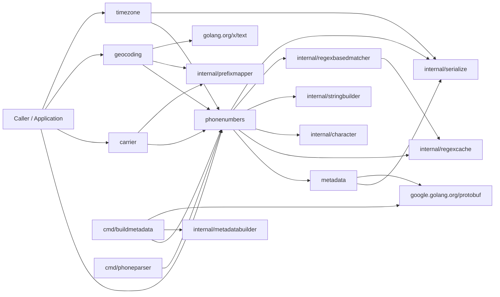

| Component                | Depends On                                                                                                                                        | Depended On By                                                                                   |
| :----------------------- | :------------------------------------------------------------------------------------------------------------------------------------------------ | :----------------------------------------------------------------------------------------------- |
| `phonenumbers`           | `metadata`, `internal/regexcache`, `internal/character`, `internal/stringbuilder`, `internal/regexbasedmatcher`, `internal/serialize`, `protobuf` | Calling applications, `carrier`, `geocoding`, `timezone`, `cmd/phoneparser`, `cmd/buildmetadata` |
| `metadata`               | `internal/serialize`, `google.golang.org/protobuf`                                                                                                | `phonenumbers`                                                                                   |
| `carrier`                | `phonenumbers`, `internal/prefixmapper`                                                                                                           | Calling applications                                                                             |
| `geocoding`              | `phonenumbers`, `internal/prefixmapper`, `golang.org/x/text`                                                                                      | Calling applications                                                                             |
| `timezone`               | `phonenumbers`, `internal/serialize`                                                                                                              | Calling applications                                                                             |
| `internal/regexcache`    | Standard library `regexp`, `sync`                                                                                                                 | `phonenumbers`, `internal/regexbasedmatcher`                                                     |
| `internal/prefixmapper`  | `internal/serialize`, standard library `embed`, `sync`                                                                                            | `carrier`, `geocoding`                                                                           |
| `internal/serialize`     | Standard library `compress/gzip`, `encoding/binary`                                                                                               | `metadata`, `timezone`, `internal/prefixmapper`, `phonenumbers`                                  |
| `internal/stringbuilder` | Standard library `slices`, `unicode/utf8`                                                                                                         | `phonenumbers` (AYTF)                                                                            |
| `cmd/buildmetadata`      | `phonenumbers`, `internal/metadatabuilder`, `google.golang.org/protobuf`                                                                          | CI / Upstream synchronizer                                                                       |

---

### `phonenumbers`: Core Engine & Facade

- **Location**: `.` (`phonenumberutil.go`, `asyoutypeformatter.go`, `phonenumbermatcher.go`, `shortnumberinfo.go`, `alternateformats.go`)
- **Responsibilities**: Implements top-level phone parsing, normalization, validation, categorization, formatting, dialpad state machines, text matching, and short number rules.
- **Key Entities**:
  - `PhoneNumber`: Parsed number protobuf message.
  - `AsYouTypeFormatter`: Stateful digit formatter.
  - `PhoneNumberMatcher`: Regular expression scanner for numbers in free text.
  - `ShortNumberInfo`: Emergency, carrier-specific, and SMS service number analyzer.
- **Inputs & Outputs**:
  - **Input**: Raw phone number strings, ISO region strings, free text, dialpad runes.
  - **Output**: `*PhoneNumber` proto messages, formatted strings, validation results, iterators.

#### Component Interaction

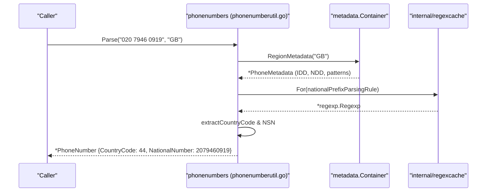

The caller initiates parsing by passing raw input and a default region. The utility retrieves the region's metadata, fetches compiled regular expressions from `regexcache`, strips prefixes, extracts the ITU country code and national significant number, and constructs the protobuf structure.

---

### `metadata`: Metadata Subsystem & Swappable Container

- **Location**: `metadata/` (`source.go`, `metadata_util.go`, `phonemetadata.pb.go`, `version.go`)
- **Responsibilities**: Decompresses, unmarshals, and indexes embedded territory metadata collections. Provides process-global accessor methods and testing isolation hooks.
- **Key Entities**:
  - `Container`: Active metadata bundle with region-to-metadata maps, non-geo maps, and NANPA sets.
  - `PhoneMetadataCollection`: Root protobuf collection containing all territory definitions.
- **Inputs & Outputs**:
  - **Input**: Gzipped binary protobuf blobs (`metadata.xml.gz`, `countrycode_to_region.xml.gz`).
  - **Output**: Fast in-memory lookup pointers for `PhoneMetadata` by region or calling code.

#### Component Interaction

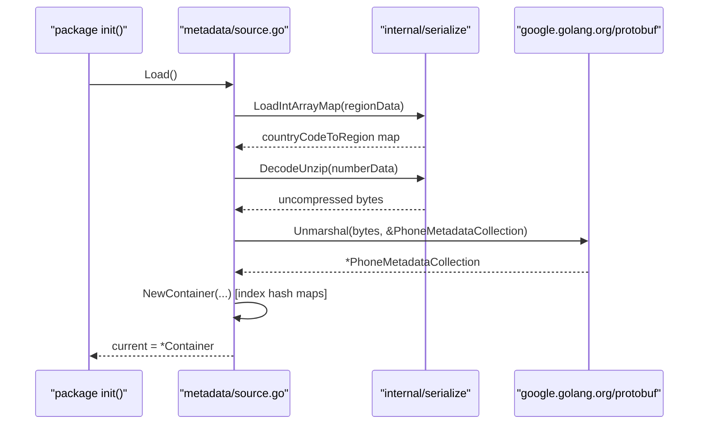

During package initialization, `source.go` decompresses embedded data, unmarshals the metadata collection protobuf, and builds indexed lookup maps for regions, country calling codes, and NANPA memberships into a global `Container`.

---

### `carrier`: Offline Mobile Carrier Mapper

- **Location**: `carrier/` (`carrier.go`, `carrier/data/*.txt.gz`)
- **Responsibilities**: Identifies mobile network operators (MNOs) for telephone numbers using embedded prefix-to-name dictionaries.
- **Key Entities**:
  - `mapper`: Instance of `prefixmapper.Mapper` initialized with `carrierData` embedded filesystem.
- **Inputs & Outputs**:
  - **Input**: `*PhoneNumber`, BCP-47 language tag string (e.g. `"en"`, `"zh"`).
  - **Output**: Carrier name string (e.g. `"Vodafone"`, `"AT&T"`), error.

#### Component Interaction

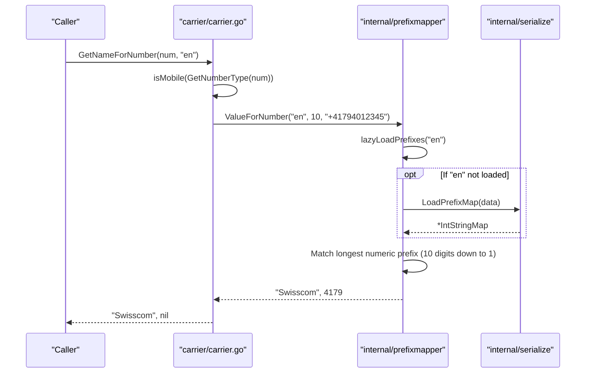

When querying carrier data, `carrier.go` formats the number to E.164 and delegates to `prefixmapper`. The mapper lazily decompresses and deserializes the requested language's binary map, then scans prefixes from maximum length downward to identify the most specific match.

---

### `geocoding`: Offline Geographical Description Resolver

- **Location**: `geocoding/` (`geocoding.go`, `geocoding/data/*.txt.gz`)
- **Responsibilities**: Returns localized geographic area names (cities, provinces, states, countries) for phone numbers, handling mobile token stripping (e.g. Argentina prefix `9`) and CLDR user-region display.
- **Key Entities**:
  - `mapper`: Instance of `prefixmapper.Mapper` initialized with `geocodingData` embedded filesystem.
- **Inputs & Outputs**:
  - **Input**: `*PhoneNumber`, language tag, optional user region code.
  - **Output**: Geographic area description string, error.

#### Component Interaction

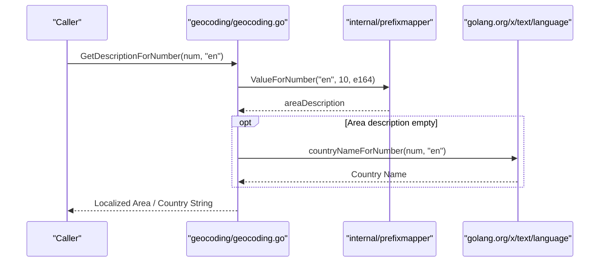

`geocoding.go` queries `prefixmapper` for sub-national geographic locality. If no locality matches (e.g. for non-fixed numbers), it falls back to localized country names rendered via `golang.org/x/text`.

---

### `timezone`: Timezone Mapping Resolver

- **Location**: `timezone/` (`timezone.go`, `timezone/data/prefix_to_timezone.xml.gz`)
- **Responsibilities**: Maps phone number prefixes to lists of IANA timezone names (e.g. `["America/New_York"]`).
- **Key Entities**:
  - `timezoneMap`: Integer prefix to `[]string` array map.
  - `Unknown`: Constant `"Etc/Unknown"` returned when no timezone matches.
- **Inputs & Outputs**:
  - **Input**: `*PhoneNumber`.
  - **Output**: Slice of timezone strings (`[]string`), error.

#### Component Interaction

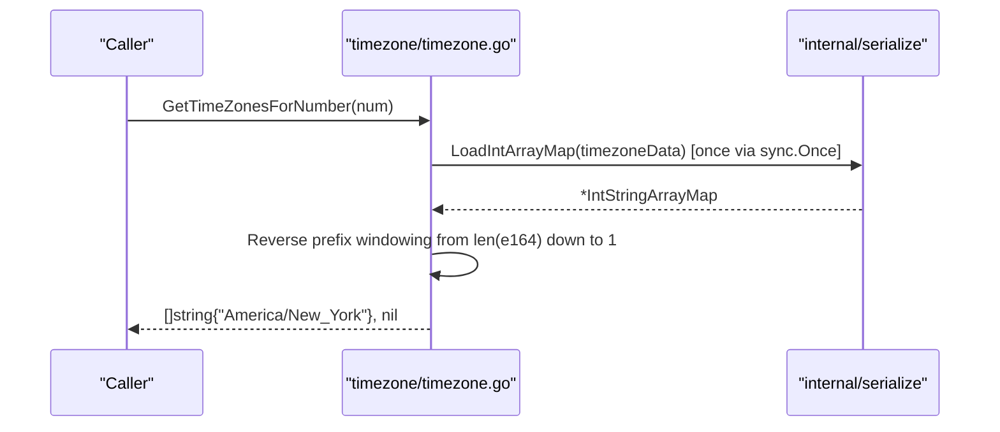

`timezone.go` initializes its map once, strips any leading `+` sign, and scans prefixes backward from number length down to 1, returning the first matching set of timezone identifiers.

---

## 6. Execution Flows

### Happy Path

#### Complete Phone Number Parsing and Formatting Flow

Standard execution converts an unformatted national telephone string into a validated `*PhoneNumber` and formats it as an international E.164 string.

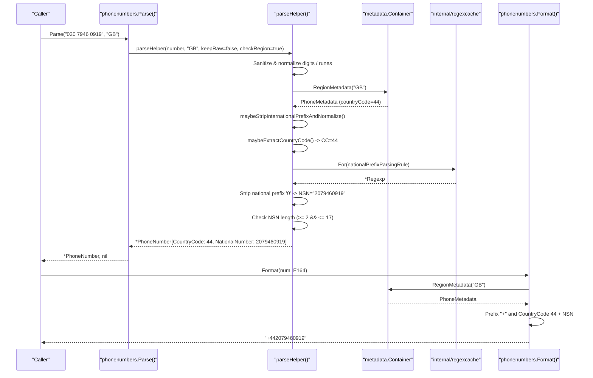

1. **Input Normalization**: The caller invokes `Parse("020 7946 0919", "GB")`. `parseHelper` validates that input length is within `maxInputStringLength` (250 chars) and converts non-ASCII Unicode digits to ASCII decimal characters.
2. **Metadata Lookup**: Metadata for region `"GB"` is loaded from the active `Container`.
3. **Prefix Extraction**: International prefixes are evaluated and removed if present. Since the number is national, the national prefix parsing rule (`0`) is compiled via `regexcache` and stripped, isolating the National Significant Number (`2079460919`).
4. **Country Code Derivation**: Country calling code `44` is derived from the region metadata.
5. **Protobuf Instantiation**: A `PhoneNumber` protobuf message is populated with `CountryCode=44` and `NationalNumber=2079460919`.
6. **Formatting**: Passing the message to `Format(num, E164)` combines the international plus sign, the country code, and the national significant number into `"+442079460919"`.

---

### Error / Recovery Path

#### Malformed Input and Bounds Defense Flow

Demonstrates system recovery when presented with malformed, oversized, or unviable strings.

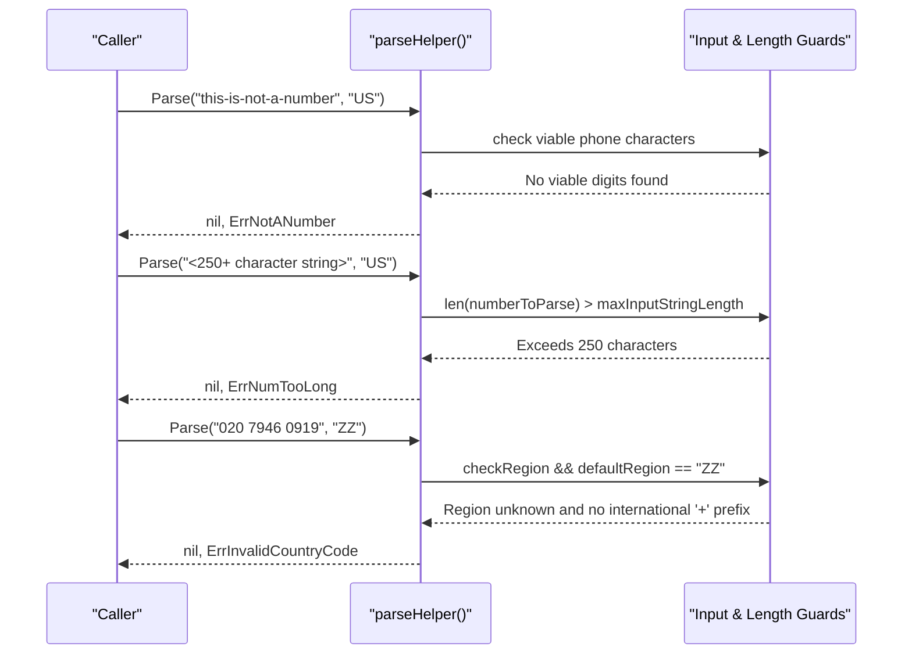

1. **Empty / Non-Numeric Input**: If the string has no viable phone characters or is empty, parsing aborts immediately returning `ErrNotANumber`.
2. **ReDoS Defense Buffer Limit**: If the input length exceeds `maxInputStringLength` (250 bytes), execution aborts returning `ErrNumTooLong`. This bounds regular expression evaluation and prevents malicious ReDoS payloads.
3. **Missing Region Recovery**: If a national number is parsed with unknown region `"ZZ"` and lacks an international `+` prefix, the parser cannot infer the country code and fails safely with `ErrInvalidCountryCode`.

---

### Hot Path

#### Interactive Dialpad Processing in `AsYouTypeFormatter`

Demonstrates the sub-millisecond execution loop when processing sequential dialpad keystrokes in UI forms.

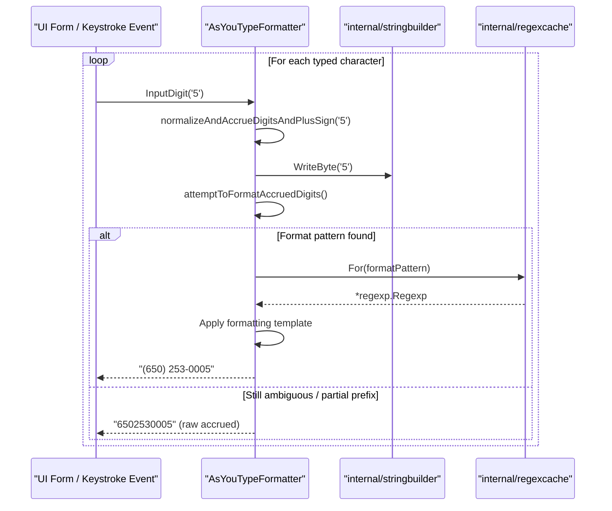

1. **Character Accrual**: Each keystroke enters `InputDigit(rune)`. The rune is normalized via `character.Digit` and appended to an internal `stringbuilder.Builder`.
2. **Template Evaluation**: `attemptToFormatAccruedDigits` checks if the accrued digits match any available `NumberFormat` rules for the active region.
3. **Regex Application**: Format patterns are fetched from `regexcache`. If matched, digits are formatted into a template mask (e.g. `(xxx) xxx-xxxx`); otherwise, raw accrued digits are returned until sufficient digits disambiguate the format.

---

## 7. Data Models & Transformations

### Transformation Pipeline

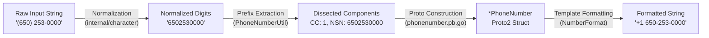

| Stage   | Model / Entity       | Format            | Description                                                                                                                 |
| :------ | :------------------- | :---------------- | :-------------------------------------------------------------------------------------------------------------------------- |
| Stage 1 | Raw Input String     | `string`          | Unsanitized, user-provided string containing punctuation, alpha vanity characters, or international prefixes.               |
| Stage 2 | Normalized Runes     | `string`          | Punctuation stripped, Unicode digits mapped to ASCII decimal digits (`'0'`-`'9'`), vanity letters mapped to dialpad digits. |
| Stage 3 | Dissected Components | `int32`, `uint64` | Dissected country calling code, national significant number, extension, and leading zeros.                                  |
| Stage 4 | `PhoneNumber`        | Protobuf message  | Canonical structured object representing the telephone number.                                                              |
| Stage 5 | Formatted String     | `string`          | Fully formatted string conforming to E.164, National, International, or RFC 3966 standards.                                 |

#### `PhoneNumber`

- **Location**: `phonenumber.pb.go` (generated from `phonenumber.proto`)
- **Description**: The core data structure representing an international phone number.
- **Key Fields**:
  - `CountryCode *int32`: ITU calling code (e.g. `1` for US, `44` for UK).
  - `NationalNumber *uint64`: National significant subscriber number without trunk prefixes.
  - `Extension *string`: Dialable extension string, if present.
  - `ItalianLeadingZero *bool`: Set to true for numbers retaining leading zeros internationally (e.g. Italy `+39 02...`).
  - `NumberOfLeadingZeros *int32`: Count of leading zeros in the national significant number.
  - `RawInput *string`: Retains original raw input when parsed via `ParseAndKeepRawInput`.
  - `CountryCodeSource *PhoneNumber_CountryCodeSource`: Enum recording how the country code was derived (`FROM_NUMBER_WITH_PLUS_SIGN`, `FROM_NUMBER_WITH_IDD`, `FROM_DEFAULT_COUNTRY`).
  - `PreferredDomesticCarrierCode *string`: Preferred domestic carrier selection code.

#### `PhoneMetadata`

- **Location**: `metadata/phonemetadata.pb.go` (generated from `phonemetadata.proto`)
- **Description**: Defines national numbering rules, regular expressions, and formatting templates for a single region or non-geographical entity.
- **Key Fields**:
  - `Id *string`: ISO 3166-1 alpha-2 territory code (`"US"`, `"GB"`) or `"001"` for non-geo entities.
  - `CountryCode *int32`: Country calling code.
  - `GeneralDesc *PhoneNumberDesc`: Comprehensive length and possibility regular expressions.
  - `FixedLine *PhoneNumberDesc` / `Mobile *PhoneNumberDesc`: Category-specific validation patterns.
  - `NumberFormat []*NumberFormat`: List of formatting rules for local and international presentation.
  - `InternationalPrefix *string`: International dialing prefix regex (e.g. `"011"` for US, `"00"` for Europe).
  - `NationalPrefix *string`: Domestic trunk prefix (e.g. `"0"` for UK, `"1"` for US).

---

### Persistent State

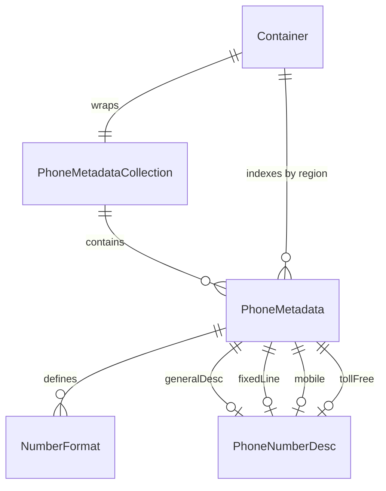

| Entity                | Location                 | Lifecycle                      | Description                                                                                                                      |
| :-------------------- | :----------------------- | :----------------------------- | :------------------------------------------------------------------------------------------------------------------------------- |
| `metadata.Container`  | `metadata/source.go`     | Process Singleton              | Stores indexed maps of region metadata, country calling codes, and NANPA memberships. Swappable during tests via `metadata.Use`. |
| `regexcache.cache`    | `internal/regexcache/`   | Process Lifetime               | Thread-safe in-memory map caching compiled regular expressions to avoid compilation overhead.                                    |
| `prefixmapper.Mapper` | `internal/prefixmapper/` | Subpackage Lifetime            | Lazily loads and caches per-language carrier and geocoding prefix tables.                                                        |
| `timezoneMap`         | `timezone/timezone.go`   | Process Lifetime (`sync.Once`) | Lazily decompressed prefix-to-timezone mapping table.                                                                            |

#### `metadata.Container`

- **Location**: `metadata/source.go`
- **Description**: Immutable container bundling all territory-derived lookup tables.
- **Key Fields**:
  - `regionToMetadataMap map[string]*PhoneMetadata`: Hash map from 2-letter ISO code to region metadata.
  - `countryCodeToNonGeographicalMetadataMap map[int]*PhoneMetadata`: Non-geo entity metadata mapped by calling code.
  - `countryCodeToRegion map[int][]string`: Mapping from calling code to supported region codes.
  - `nanpaRegions map[string]struct{}`: Set of regions sharing North American country code `1`.
- **Persistence**: Built once at application startup from embedded compressed data blobs; zero disk or network I/O.

---

## 8. Key Algorithms & Methods

### Country Calling Code & Prefix Extraction

- **Location**: `phonenumberutil.go` (`maybeExtractCountryCode`, `maybeStripInternationalPrefixAndNormalize`)
- **Purpose**: Determines the country calling code from raw input and strips international or national dialing prefixes.
- **Complexity**: Time: $\mathcal{O}(k)$ where $k \le 3$ digit lookups; Space: $\mathcal{O}(1)$

#### How It Works

1. Input

   ```text
   rawInput = "011 44 20 7946 0919", defaultRegion = "US"
   ```

2. Inspects the leading characters of the input string for an international plus sign (`+`) or full-width equivalent (`\uFF0B`).

   ```text
   Input: "011 44 20 7946 0919"
   Leading character: '0' != '+' and '0' != '\uFF0B'
   Result: No plus prefix detected; proceed to IDD prefix evaluation.
   ```

3. Matches the leading characters against the international direct dialing (IDD) prefix pattern of the default region and strips the matched prefix.

   ```text
   Region: "US" -> IDD pattern: "^(?:011)[\d ]*"
   Prefix match: "011" detected and stripped.
   Remainder buffer: "44 20 7946 0919"
   CountryCodeSource: FROM_NUMBER_WITH_IDD
   ```

4. Normalizes digits by removing whitespace, punctuation, and non-dialable formatting symbols.

   ```text
   Raw remainder: "44 20 7946 0919"
   Normalize digits -> Candidate buffer: "442079460919"
   ```

5. Scans the first 1 to 3 digits against the global calling code table to extract the country calling code and isolate the National Significant Number (NSN), falling back to default region metadata if no international prefix was present.

   ```text
   Prefix lookup in countryCodeToRegion map:
     - 1 digit : "4"   -> Miss
     - 2 digits: "44"  -> HIT (United Kingdom / GB)
   Extracted CountryCode: 44
   Isolated NSN: "2079460919" (strip "44" from "442079460919")
   ```

6. Output

   ```text
   CountryCode: 44 (FROM_NUMBER_WITH_IDD)
   NationalNumber: 2079460919
   Region: "GB"
   ```

---

### As-You-Type Digit Formatting

- **Location**: `asyoutypeformatter.go` (`attemptToChooseFormattingPattern`, `createFormattingTemplate`)
- **Purpose**: Progressively applies formatting punctuation as the user enters digits without requiring full number validation.
- **Complexity**: Time: $\mathcal{O}(M \times L)$ where $M$ is the number of formats (typically $\le 5$) and $L$ is string length; Space: $\mathcal{O}(L)$

#### How It Works

1. Input

   ```text
   User dials US number digits one by one: '6', '5', '0', '2', '5', '3', '0', '0', '0', '0'
   defaultRegion = "US"
   ```

2. Accrues normalized dialpad digits and tracks remembered cursor offsets with each keystroke.

   ```text
   Keystrokes: '6' -> '5' -> '0'
   Accrued buffer: "650"
   Cursor position tracks the active character index within the accrued string.
   ```

3. Scans available `NumberFormat` rules for the region and filters candidates whose `leadingDigitsPatterns` match the accrued string.

   ```text
   Keystroke: '2' -> Accrued digits: "6502"
   Scan "US" metadata formats:
     Format candidate: pattern = "(\d{3})(\d{3})(\d{4})", format = "($1) $2-$3"
     leadingDigitsPatterns[0]: "^[2-9]" matches "6"
   Format matched and selected.
   ```

4. Generates a formatting template from the matched `NumberFormat` by replacing digit capture placeholders with a sentinel character (`'9'`).

   ```text
   Format string : "($1) $2-$3"
   Regex pattern : "(\d{3})(\d{3})(\d{4})"
   Template mask : "(999) 999-9999" (sentinel '9' denotes digit insertion slot)
   ```

5. Injects accrued digits sequentially into sentinel positions of the template mask to produce the formatted output.

   ```text
   Accrued "6502"      -> Injected into mask -> "(650) 2"
   Accrued "65025"     -> Injected into mask -> "(650) 25"
   Accrued "650253"    -> Injected into mask -> "(650) 253"
   Accrued "6502530"   -> Injected into mask -> "(650) 253-0"
   ```

6. Output

   ```text
   Final Formatted String: "(650) 253-0000"
   Cursor Offset: Position corresponding to terminal digit index
   ```

---

### Sliding-Window Text Extraction & Leniency Verification

- **Location**: `phonenumbermatcher.go` (`find`, `parseAndVerify`), `enums.go` (`Leniency.Verify`)
- **Purpose**: Extracts telephone numbers from free-form text while filtering out false positives such as dates, timestamps, and page numbers.
- **Complexity**: Time: $\mathcal{O}(N)$ where $N$ is text length; Space: $\mathcal{O}(1)$ streaming memory

#### How It Works

1. Input

   ```text
   text = "Meeting on 3/10/2011, call 650-253-0000 or (211-227 (2003))"
   defaultRegion = "US", leniency = STRICT_GROUPING
   ```

2. Searches the text buffer using a candidate regular expression pattern (`phoneNumberMatcherPattern`) to identify potential telephone number windows.

   ```text
   Match Windows identified:
     - Candidate 1 (offset 11..20): "3/10/2011"
     - Candidate 2 (offset 28..40): "650-253-0000"
     - Candidate 3 (offset 45..58): "211-227 (2003"
   ```

3. Applies heuristic pruning to reject common non-phone patterns including slash-separated dates, timestamps, and publication page citations.

   ```text
   Candidate 1 ("3/10/2011"):
     Matches slash-separated date regex /(?:[0-3]?\d...)/ -> REJECTED (Date false positive)

   Candidate 3 ("211-227 (2003"):
     Matches publication citation regex /\d{1,5}-+\d{1,5}\s*\(\d{1,4}/ -> REJECTED (Citation false positive)
   ```

4. Verifies bracket balancing and surrounding character context to prevent partial or broken token matches.

   ```text
   Candidate 2 ("650-253-0000"):
     - Bracket balance check : Passed (no unbalanced '(' or ')')
     - Surrounding context   : Passed (bounded by whitespace, no trailing Latin characters)
   ```

5. Parses surviving candidate tokens and verifies them against the requested leniency level (`POSSIBLE`, `VALID`, `STRICT_GROUPING`, `EXACT_GROUPING`).

   ```text
   Candidate 2 parsed: CountryCode = 1, NSN = "6502530000"
   Leniency Check (STRICT_GROUPING):
     - IsValidNumber(num): true (valid US fixed-line/mobile)
     - Digit grouping check: ["650", "253", "0000"] matches standard national format
   ```

6. Output

   ```text
   Status: EMITTED
   PhoneNumberMatch:
     Start: 28, End: 40
     RawString: "650-253-0000"
     PhoneNumber: +16502530000 (CountryCode: 1, NationalNumber: 6502530000)
   ```

---

### Variable-Byte Delta Interned Prefix Mapping

- **Location**: `internal/serialize/serialize.go` (`LoadPrefixMap`), `internal/prefixmapper/prefixmapper.go` (`ValueForNumber`)
- **Purpose**: Extremely fast, memory-efficient offline dictionary lookup for carrier and geocoding names.
- **Complexity**: Time: $\mathcal{O}(K)$ where $K \le 10$ hash map lookups; Space: Compact in-memory representation (~a few kilobytes per language)

#### How It Works

1. Input

   ```text
   Query: E.164 = "+16502530000", maxLength = 10
   Embedded binary map: geocoding data for language "en"
   ```

2. Decodes a gzipped binary table into a shared string pool array to intern repetitive descriptive strings.

   ```text
   String Pool (values array):
     [0] = ""
     [1] = "California"
     [2] = "Mountain View, CA"
     [3] = "Sunnyvale, CA"
   ```

3. Reconstructs sequential numeric prefix keys from unsigned variable-length integers (`binary.ReadUvarint`) using delta addition (`prefix += diff`).

   ```text
   Delta stream deserialization:
     Record 1: diff = 1650250 -> prefix = 0 + 1650250 = 1650250
     Record 2: diff = 3       -> prefix = 1650250 + 3 = 1650253
     Record 3: diff = 1       -> prefix = 1650253 + 1 = 1650254
   ```

4. Maps each reconstructed numeric prefix key to a 16-bit index pointing into the string pool array.

   ```text
   In-memory prefix map:
     Map[1650250] = index 1 -> "California"
     Map[1650253] = index 2 -> "Mountain View, CA"
     Map[1650254] = index 3 -> "Sunnyvale, CA"
   ```

5. Searches for the longest matching prefix by slicing the query number from maximum length (10 digits) downward to 1 digit until a map entry is found.

   ```text
   E.164 query: "+16502530000"
     Iteration 1 (10 digits): 1650253000 -> Map check: Miss
     Iteration 2 (9 digits) : 165025300  -> Map check: Miss
     Iteration 3 (8 digits) : 16502530   -> Map check: Miss
     Iteration 4 (7 digits) : 1650253    -> Map check: HIT! -> Map[1650253] = 2 ("Mountain View, CA")
   ```

6. Output

   ```text
   Description: "Mountain View, CA"
   Matched Prefix: 1650253
   ```

---

## 9. Performance & Optimization

### Optimization Strategy

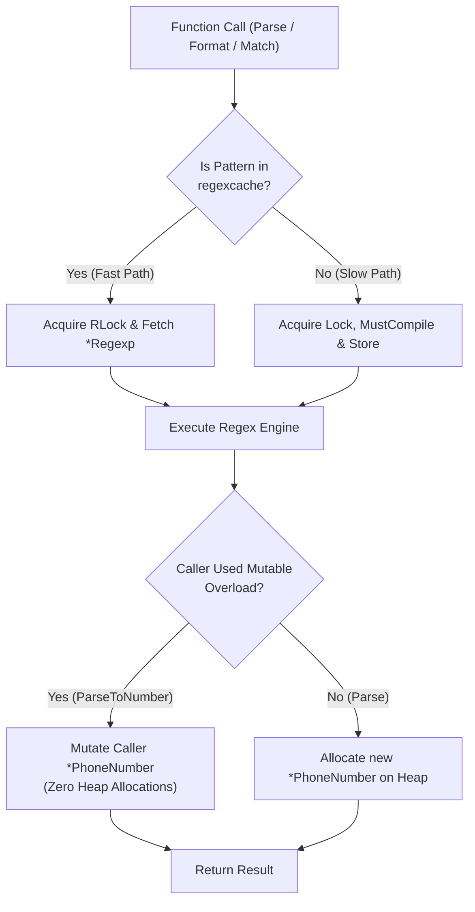

### Caching & State Management

1. **Compiled Regular Expression Cache (`internal/regexcache`)**:
   - Compiling regular expressions dynamically from metadata is CPU-expensive.
   - `regexcache` stores all metadata-derived patterns in a package-level map protected by a `sync.RWMutex`.
   - The cache is unbounded (no eviction), growing as new patterns are encountered. Read hits execute concurrently under `RLock()`.

1. **Lazy Language Deserialization (`internal/prefixmapper`)**:
   - Rather than decompressing carrier and geocoding data for all languages at startup, `prefixmapper.Mapper` decompresses and deserializes `.txt.gz` tables only upon the first query for a given language code.
   - Cached tables remain in memory behind a `sync.Mutex`.

1. **Pre-Parsed Process-Global Metadata (`metadata.Container`)**:
   - All core territory rules are decompressed and indexed once during package initialization (`init()`), avoiding runtime deserialization costs during request execution.

### Concurrency & Resource Management

- **Thread Safety**: All public functions in `phonenumbers`, `carrier`, `geocoding`, and `timezone` are fully safe for concurrent execution across arbitrary goroutines.
- **Immutable State**: Once constructed, `PhoneMetadataCollection`, `PhoneMetadata`, and `NumberFormat` structures are strictly read-only.
- **Bounds Checking & ReDoS Protection**:
  - Input string lengths are hard-capped at 250 characters (`maxInputStringLength = 250`). Any string exceeding this is rejected before reaching the regular expression engine.
  - National significant numbers are clamped between 2 and 17 digits.
  - Number of leading zeros is capped to prevent memory allocation attacks on untrusted protobuf inputs.

---

## 10. Configuration & Environment

### Configuration Resolution

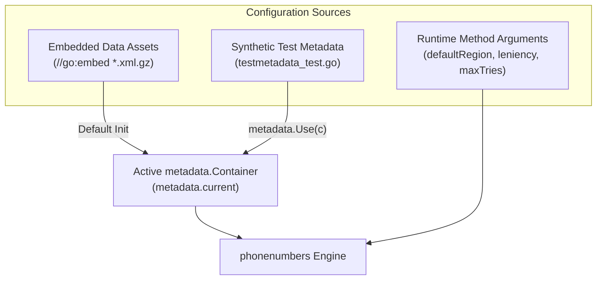

The library operates with zero configuration files or environment variables:

- **Default Resolution**: Package `init()` automatically decompresses embedded data assets and assigns the resulting `*Container` to `metadata.current`.
- **Test Override Seam**: Callers testing custom or synthetic numbering plans can invoke `metadata.NewContainer` followed by `metadata.Use(customContainer)`. `Use` swaps the active container and returns a restore closure suitable for `t.Cleanup()`.
- **Per-Call Parameters**: Regional assumptions are supplied per-call via `defaultRegion` (e.g. `"US"`, `"GB"`, `"ZZ"`).

### Execution Environments & Isolation

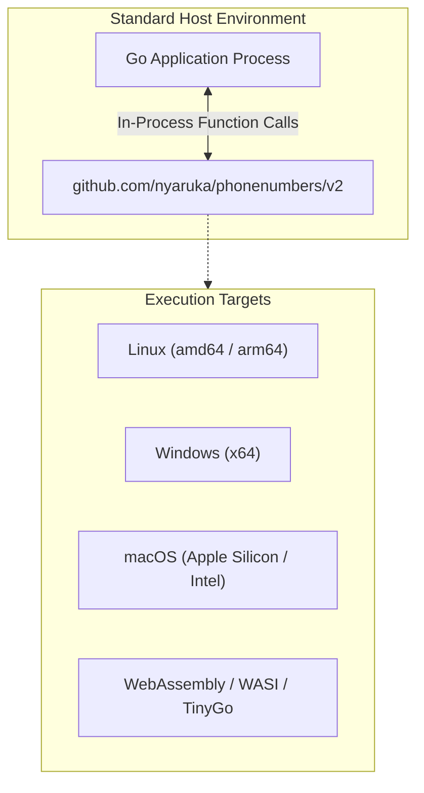

- **Execution Targets**:
  - Standard Go runtimes on Linux, macOS, and Windows.
  - Fully compatible with containerized microservices (Docker, Kubernetes, Alpine, scratch base images).
  - Compatible with WebAssembly (`GOOS=js GOARCH=wasm` and `GOOS=wasip1`).
- **Isolation Boundaries**: Pure Go implementation with zero cgo dependencies. All memory is allocated within the Go runtime heap and garbage collected.
- **External Dependencies**: Zero runtime network connections, file descriptors, or child processes.

---

## 11. Extensibility & Integration

### Integration Topology

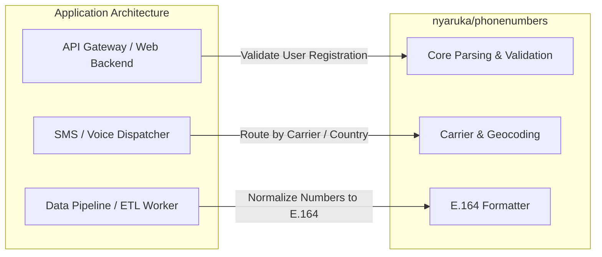

### Extensibility

1. **Upstream Metadata Synchronization (`cmd/buildmetadata`)**:
   - New country code allocations, area code adjustments, and mobile prefix updates released by Google can be synchronized by running `go run ./cmd/buildmetadata [tag]`.
   - The tool fetches the upstream Git release, builds compressed Protocol Buffer metadata, updates prefix tables, and updates `metadata/version.go`.

1. **Pluggable Test Containers**:
   - Developers writing unit tests for proprietary telephony hardware or internal PBX plans can construct a custom `metadata.Container` via `metadata.NewContainer()` and swap it in process-wide.

### APIs & Protocols

- **In-Process Go API**: Direct Go package imports (`github.com/nyaruka/phonenumbers/v2`).
- **Data Protocols**:
  - **ITU-T E.164**: International public telecommunication numbering plan standard.
  - **ITU-T E.123**: Notation for national and international telephone numbers.
  - **RFC 3966**: URI format for telephone numbers (`tel:+1-201-555-0123`).
  - **Protocol Buffers v2**: Serialization wire format for `PhoneNumber` and `PhoneMetadata`.

---

## 12. Design & Trade-offs

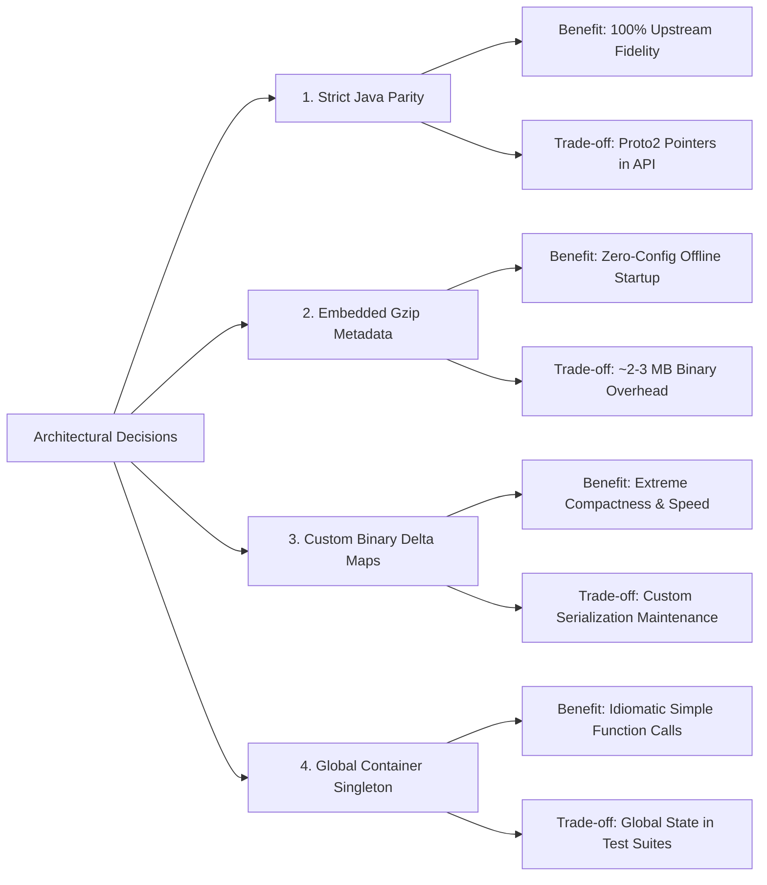

| Design / Pattern                               | Benefits                                                                                                                                              | Trade-offs                                                                                                                                  |
| :--------------------------------------------- | :---------------------------------------------------------------------------------------------------------------------------------------------------- | :------------------------------------------------------------------------------------------------------------------------------------------ |
| **Strict Upstream Java Parity**                | Ensures exact functional fidelity with Google's reference library; automated upstream syncs; eliminates behavioral divergence across language stacks. | Preserves Java-like method names and Proto2 pointer fields (`*int32`, `*uint64`) rather than idiomatic Go primitive structs.                |
| **Embedded Compressed Metadata Blobs**         | Zero runtime filesystem or database dependencies; instant startup; deterministic behavior across environments.                                        | Increases compiled binary size by approximately 2.5 MB due to embedded gzipped data assets.                                                 |
| **Custom Varint-Delta & Interned Binary Maps** | Compresses hundreds of thousands of carrier and locality rules into a few hundred kilobytes; rapid prefix lookup via integer diffs.                   | Requires custom binary encoder/decoder in `internal/serialize` rather than standard JSON/SQL schemas.                                       |
| **Global `metadata.Container` Singleton**      | Clean, ergonomic package-level API (`phonenumbers.Parse()`) without requiring dependency injection of metadata contexts.                              | Swapping metadata during tests (`metadata.Use`) mutates process-global state, preventing parallel test execution for synthetic test suites. |
| **Zero-Allocation Parsing Overloads**          | `ParseToNumber` allows high-throughput messaging pipelines to reuse allocated `*PhoneNumber` structs, eliminating GC pressure.                        | Exposes two sets of parsing functions in the public API (`Parse` vs `ParseToNumber`).                                                       |

---

## 13. Error Handling & Edge Cases

### Error Types & Propagation

| Error Type              | Source                                                 | Propagation Strategy                                                        | User-Facing?  |
| :---------------------- | :----------------------------------------------------- | :-------------------------------------------------------------------------- | :------------ |
| `ErrNotANumber`         | `phonenumberutil.go`                                   | Returned when input has no dialable digits or viable phone characters.      | Yes           |
| `ErrNumTooLong`         | `errors.go`                                            | Returned when input length exceeds `maxInputStringLength` (250 chars).      | Yes           |
| `ErrInvalidCountryCode` | `phonenumberutil.go`                                   | Returned when country code cannot be derived from prefix or default region. | Yes           |
| `ErrTooShortNSN`        | `phonenumberutil.go`                                   | Returned when national significant number length is less than 2 digits.     | Yes           |
| `ErrTooShortAfterIDD`   | `errors.go`                                            | Returned when number contains an IDD but remaining digits are insufficient. | Yes           |
| `ErrEmptyMetadata`      | `errors.go` (re-export of `metadata.ErrEmptyMetadata`) | Returned if a metadata collection contains zero records.                    | No (Internal) |
| `ErrInvalidIndex`       | `internal/stringbuilder`                               | Returned on out-of-bounds slice access in `stringbuilder.Builder`.          | No (Internal) |

### Recovery Mechanisms

- **Defensive Slice Bounds in RFC 3966**: When parsing RFC 3966 strings (e.g. `tel:03-331-6005;phone-context=+64`), the parser guarantees slice bounds remain strictly ordered even on malformed inputs where `tel:` appears after `phone-context`.
- **Leading Zero Clamping**: Untrusted inputs containing pathological counts of leading zeros are clamped before allocation, neutralizing heap-exhaustion denial of service attacks.
- **Fallback Country Codes**: If parsing without an international prefix, the parser falls back to the supplied default region. If default region is `"ZZ"` or empty, it parses strictly as an international number.

### Known Limitations & Edge Cases

- **Mobile Number Portability (MNP)**: Offline carrier lookups (`carrier.GetNameForNumber`) inspect number prefixes. In regions with high mobile number portability, ported numbers cannot be determined without live HLR/telecom dips. `carrier.GetSafeDisplayName` returns an empty string for regions supporting MNP.
- **Supplementary-Plane Unicode Digits**: Java's UTF-16 iteration fails to normalize supplementary-plane decimal digits (e.g. Adlam or Osmanya digits). Go's `internal/character.Digit` normalizes all Unicode `Nd` characters, matching the C++ and Python ports.
- **Non-Geographical Calling Codes**: Calling codes like `+800` (International Toll Free) map to region `"001"`. They have no domestic trunk prefixes, no national formatting, and cannot be resolved to a specific ISO country.
- **Italian Leading Zeros**: Numbers in Italy (`+39`) retain leading zeros even when dialed internationally (e.g. Milan `+39 02 36618 300`). The library preserves this via the `ItalianLeadingZero` and `NumberOfLeadingZeros` protobuf fields.

---

## 14. Dependencies & Ecosystem

### Key Dependencies

| Dependency                            | Role                   | Why Chosen                                                                                                               |
| :------------------------------------ | :--------------------- | :----------------------------------------------------------------------------------------------------------------------- |
| `google.golang.org/protobuf v1.36.11` | Protobuf Runtime       | Official Go runtime for Protocol Buffers; powers serialization and deserialization of `PhoneNumber` and `PhoneMetadata`. |
| `golang.org/x/text v0.41.0`           | Unicode & Localization | Provides Unicode language and display tables for localized country name resolution in `geocoding`.                       |
| `github.com/stretchr/testify v1.11.1` | Testing Assertions     | Simplifies unit test assertions across the extensive test suite ported from Java. (Test dependency only).                |

### Ecosystem & Community

- **Package Registry**: Published on [pkg.go.dev/github.com/nyaruka/phonenumbers/v2](https://pkg.go.dev/github.com/nyaruka/phonenumbers/v2).
- **Production Adoption**: Core telephony processing library for Nyaruka's open-source RapidPro platform and commercial TextIt service, routing hundreds of millions of SMS interactions globally.
- **Upstream Alignment**: Directly tracks [google/libphonenumber](https://github.com/google/libphonenumber), incorporating numbering updates from international telecommunications authorities.

---

## 15. Build & Distribution

### Build Pipeline

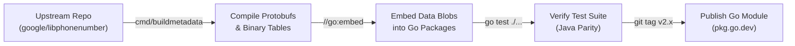

1. **Metadata Ingestion**: `cmd/buildmetadata` pulls XML resources and carrier dictionaries from the target upstream Git release.
2. **Data Compilation**: XML files are transformed into Protocol Buffer collections and gzipped into `metadata/data/` and `data/`.
3. **Go Compilation**: The standard Go compiler embeds all data assets into package binaries via `//go:embed`.
4. **Automated Testing**: CI executes `go test ./...` across a matrix of supported Go versions (Go 1.24, Go 1.25), asserting line-by-line parity against Google's upstream test results.

### Packaging & Distribution

- **Distribution Channels**: Distributed via standard Go module proxy (`go get github.com/nyaruka/phonenumbers/v2`).
- **Versioning Strategy**: Follows Semantic Versioning (SemVer). Patch releases represent regular metadata synchronizations with upstream libphonenumber; minor releases introduce ported upstream logic enhancements.
- **Zero Binary Bloat for Unused Features**: Callers who do not import `carrier`, `geocoding`, or `timezone` avoid linking those packages' embedded data files.

---

## Appendix

### A. Monetization & Feature Gating

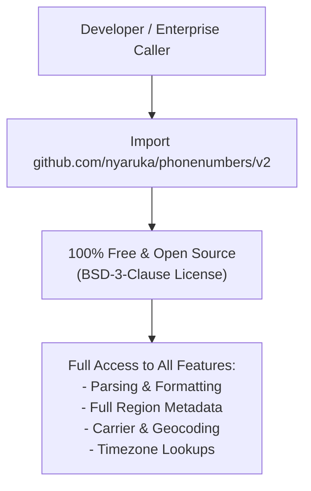

- **Model**: Pure open-source software licensed under the permissive [MIT License](file:///C:/Users/Lyzander%20Andrylie/Documents/%285%29%20Note/software-engineer/product/go/phonenumbers/code/LICENSE).
- **Gating Mechanism**: None. There are no commercial editions, paywalled subpackages, telemetry trackers, or API key restrictions.

---

### B. Anti-patterns

#### Anti-pattern 1: Validating Phone Numbers with Custom Regular Expressions

- **What it looks like**: Developers use generic regular expressions like `^\+?[1-9]\d{1,14}$` to validate user input.
- **Why it's wrong**: Regex cannot verify region-specific prefix rules, variable subscriber lengths, active area codes, or dialability. It accepts non-existent numbers and rejects valid international numbers with unusual formatting.
- **Correct approach**: Parse into `*PhoneNumber` and invoke `phonenumbers.IsValidNumber`.

```go
// ❌ Bad
var phoneRegex = regexp.MustCompile(`^\+[1-9]\d{6,14}$`)
func isValid(phone string) bool {
    return phoneRegex.MatchString(phone)
}
// isValid("+10000000000") -> true  (False positive: non-existent area code/exchange)
// isValid("020 7946 0919")  -> false (False negative: valid UK national number missing '+')

// ✅ Good
func isValid(phone, defaultRegion string) bool {
    num, err := phonenumbers.Parse(phone, defaultRegion)
    if err != nil {
        return false
    }
    return phonenumbers.IsValidNumber(num)
}
// isValid("+10000000000", "US") -> false (Correct: fails national numbering plan regex)
// isValid("020 7946 0919", "GB") -> true  (Correct: strips '0' and validates London fixed line)
```

#### Anti-pattern 2: Storing Unstandardized Raw Strings in Databases

- **What it looks like**: Storing telephone numbers as entered by users (`"(650) 253-0000"`, `"020 7946 0919"`).
- **Why it's wrong**: Prevents exact-match queries, breaks SMS gateway delivery, and loses the country context for local numbers.
- **Correct approach**: Normalize numbers to canonical ITU-T E.164 strings (`+16502530000`, `+442079460919`) or serialize the `PhoneNumber` protobuf before persisting.

```go
// ❌ Bad
func saveUser(phone string) {
    // Inserts unnormalized raw strings like "(650) 253-0000" or "020 7946 0919"
    db.Exec("INSERT INTO users (phone) VALUES (?)", phone)
}

// ✅ Good
func saveUser(rawPhone, defaultRegion string) error {
    num, err := phonenumbers.Parse(rawPhone, defaultRegion)
    if err != nil || !phonenumbers.IsValidNumber(num) {
        return fmt.Errorf("invalid phone number")
    }
    e164 := phonenumbers.Format(num, phonenumbers.E164)
    // Inserts canonical E.164: "+16502530000" or "+442079460919"
    db.Exec("INSERT INTO users (phone) VALUES (?)", e164)
    return nil
}
```

#### Anti-pattern 3: Instantiating a New `AsYouTypeFormatter` on Every Keystroke

- **What it looks like**: Creating a new `AsYouTypeFormatter` inside a web input handler on every keystroke and feeding the entire accumulated string.
- **Why it's wrong**: `AsYouTypeFormatter` is stateful. Recreating it on every keystroke destroys internal prefix recognition, miscalculates cursor positions, and causes formatting flicker.
- **Correct approach**: Retain the formatter instance across a session, invoke `InputDigit` sequentially, and call `Clear()` when resetting.

```go
// ❌ Bad
func handleKeystroke(fullInput string) string {
    formatter := phonenumbers.GetAsYouTypeFormatter("US")
    var out string
    for _, ch := range fullInput {
        out = formatter.InputDigit(ch)
    }
    return out // Re-instantiating every keystroke loses state and resets formatting context
}

// ✅ Good
type InputSession struct {
    formatter *phonenumbers.AsYouTypeFormatter
}

func NewSession(region string) *InputSession {
    return &InputSession{formatter: phonenumbers.GetAsYouTypeFormatter(region)}
}

func (s *InputSession) OnDigit(ch rune) string {
    return s.formatter.InputDigit(ch)
    // Progressively accumulates digits and preserves state:
    // '6' -> "6"
    // '5' -> "65"
    // '0' -> "650"
    // '2' -> "650-2"
    // ...
    // '0' -> "(650) 253-0000"
}
```

#### Anti-pattern 4: Parsing National Numbers with an Empty or "ZZ" Default Region

- **What it looks like**: Calling `phonenumbers.Parse("020 7946 0919", "")` or using `"ZZ"`.
- **Why it's wrong**: When a number is not formatted with an international leading `+` sign, the library requires a valid default ISO region code to identify the country calling code and national prefix rules. Omitting it causes `ErrInvalidCountryCode`.
- **Correct approach**: Provide the user's known or expected ISO 3166-1 alpha-2 territory code (e.g. from IP geolocation, user settings, or form dropdown).

```go
// ❌ Bad
num, err := phonenumbers.Parse("020 7946 0919", "")
// Output: num = nil, err = "invalid country code" (ErrInvalidCountryCode)

// ✅ Good
userRegion := "GB"
num, err := phonenumbers.Parse("020 7946 0919", userRegion)
// Output: num = &PhoneNumber{CountryCode: 44, NationalNumber: 2079460919, CountryCodeSource: FROM_DEFAULT_COUNTRY}, err = nil
```
