# Markdown Preview Enhanced (MPE) for Visual Studio Code

| Metadata                       | Value                                                                                                                                                                                                                                                                                                                                                                                                                                                                                                                                                                             |
| :----------------------------- | :-------------------------------------------------------------------------------------------------------------------------------------------------------------------------------------------------------------------------------------------------------------------------------------------------------------------------------------------------------------------------------------------------------------------------------------------------------------------------------------------------------------------------------------------------------------------------------- |
| **Repository**                 | [https://github.com/shd101wyy/vscode-markdown-preview-enhanced](https://github.com/shd101wyy/vscode-markdown-preview-enhanced)                                                                                                                                                                                                                                                                                                                                                                                                                                                    |
| **Product Version**            | 0.8.33                                                                                                                                                                                                                                                                                                                                                                                                                                                                                                                                                                            |
| **Category**                   | Visual Studio Code Extension / Markdown & Technical Documentation Tooling                                                                                                                                                                                                                                                                                                                                                                                                                                                                                                         |
| **Language & Stack**           | TypeScript 5.2.2, Node.js (v16+), VS Code Extension API (^1.70.0), [crossnote 0.9.33](https://github.com/shd101wyy/crossnote), `@earendil-works/pi-ai`, `async-mutex`, `crypto-js`, `esbuild`, `gulp`, `pnpm`                                                                                                                                                                                                                                                                                                                                                                     |
| **Entry Points**               | [`src/extension.ts`](<file:///c:/Users/Lyzander%20Andrylie/Documents/(5)%20Note/software-engineer/product/vscode/vscode-markdown-preview-enhanced/code/src/extension.ts>), [`src/extension-web.ts`](<file:///c:/Users/Lyzander%20Andrylie/Documents/(5)%20Note/software-engineer/product/vscode/vscode-markdown-preview-enhanced/code/src/extension-web.ts>), [`src/preview-custom-editor-provider.ts`](<file:///c:/Users/Lyzander%20Andrylie/Documents/(5)%20Note/software-engineer/product/vscode/vscode-markdown-preview-enhanced/code/src/preview-custom-editor-provider.ts>) |
| **Input / Output**             | **Input**: Markdown/Quarto/Prompt documents (`.md`, `.qmd`, `.prompt`), cursor/scroll events, config (`.crossnote/`, settings). **Output**: Sandboxed Webview DOM, Note Graph View, Document Exports (HTML, PDF, PNG, eBook, Pandoc).                                                                                                                                                                                                                                                                                                                                             |
| **Document Creation Date**     | 2026-09-13                                                                                                                                                                                                                                                                                                                                                                                                                                                                                                                                                                        |
| **Document Last Updated Date** | 2026-09-13                                                                                                                                                                                                                                                                                                                                                                                                                                                                                                                                                                        |

---

## 1. Overview

### Description

[Markdown Preview Enhanced (MPE)](https://github.com/shd101wyy/vscode-markdown-preview-enhanced) is a comprehensive Markdown authoring and preview extension for Visual Studio Code and VS Code for the Web (`vscode.dev`). Built as a native wrapper around the headless [crossnote](https://github.com/shd101wyy/crossnote) rendering engine, MPE transforms plain text Markdown into a dynamic, publication-grade document environment supporting mathematical typesetting, reactive diagram compilation, interactive code execution, networked knowledge graph visualization, and multi-format document exporting.

### Problem

Standard Markdown previews in modern code editors suffer from distinct architectural limitations:

1. **Static Rendering**: Inability to execute embedded code chunks (Python, R, JavaScript, Bash) or compile complex diagrams (Mermaid, PlantUML, D2, WaveDrom, Graphviz, Vega).
2. **Mathematical Inadequacy**: Lack of comprehensive KaTeX and MathJax 3 macro environments, equation cross-referencing, and fine-grained TeX rendering.
3. **Disconnected Notes**: Standard previews treat files in isolation, lacking support for personal knowledge management (PKM) semantics such as Obsidian-style wikilinks (`[[Note]]`), block references (`^block-id`), hover transclusions, and interactive graph topology.
4. **Restricted Export Pipeline**: Inability to produce publication-ready artifacts (eBook ePub/mobi, Prince XML PDF, Puppeteer/Chrome headless PDF/images, and Pandoc conversions) directly from the authoring interface.

### Solution

MPE resolves these problems through an isolated, multi-layered architecture:

- **Headless Core Separation**: All parsing, AST transformations, and diagram/math rendering are delegated to the cross-platform `crossnote` engine.
- **Universal Host Support**: Employs dual entry points—desktop Node.js runtime and browser Web Extension runtime—abstracting filesystem operations through the VS Code Workspace Filesystem API (`vscode.workspace.fs`).
- **Reactive Sandboxed Webview**: Renders content within a Content-Security-Policy (CSP) protected `vscode.WebviewPanel`, synchronizing scroll position bidirectionally with the editor and streaming real-time incremental updates.
- **Extensible Hooking**: Allows per-user (`~/.crossnote`) and per-workspace (`.crossnote`) customizations via JavaScript hooks (`config.js`, `parser.js`), LESS styles (`style.less`), and HTML headers (`head.html`).
- **AI-Powered Translation**: Integrates an incremental, block-level streaming translation pipeline powered by `@earendil-works/pi-ai` with local disk caching.

### Usage

1. **Side-by-Side Live Preview**: Run `Markdown: Open Preview to the Side` (`Ctrl+K V` or `Cmd+K V`) to launch a live synchronized preview panel beside the active markdown editor.
2. **Dedicated / Locked Preview**: Run `Markdown: Open Locked Preview to the Side` (`Ctrl+K Shift+L`) to bind the preview to a specific document, preventing it from switching as other tabs are focused.
3. **Single Preview vs. Custom Editor Mode**: Use settings to configure `Single Preview` (one shared panel), `Multiple Previews` (one panel per document), or `Previews Only` (associating `.md` files directly with the MPE custom editor).
4. **Knowledge Management**: Type `[[` to trigger wikilink auto-completion, hover over `[[Note#Heading]]` or `[[Note^block-id]]` for instant markdown preview overlays, or execute `Markdown: Open Graph View` to explore node connections.
5. **Interactive Execution**: Press `Shift+Enter` to run the active code chunk or `Ctrl+Shift+Enter` to execute all chunks within the document.

---

## 2. Architecture & Layering

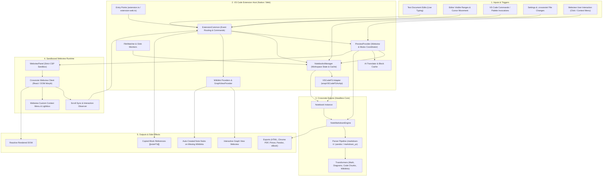

### Architecture Description

The system follows a decoupled, headless core architecture divided into five explicit operational layers:

1. **Inputs & Triggers**: Collects events from VS Code's editor lifecycle, user keybindings, configuration updates, and postMessage events emitted from the active preview iframe.
2. **VS Code Extension Host Layer**: The control plane running within Node.js (desktop) or Web Worker (browser). It initializes [`NotebooksManager`](<file:///c:/Users/Lyzander%20Andrylie/Documents/(5)%20Note/software-engineer/product/vscode/vscode-markdown-preview-enhanced/code/src/notebooks-manager.ts#L24>) per workspace, maintains a per-workspace concurrency mutex via [`async-mutex`](<file:///c:/Users/Lyzander%20Andrylie/Documents/(5)%20Note/software-engineer/product/vscode/vscode-markdown-preview-enhanced/code/src/preview-provider.ts#L1>), and stamps render requests with monotonic sequence counters to eliminate race conditions.
3. **Crossnote Engine Layer**: Headless core executing Markdown compilation. It accepts raw document strings, evaluates YAML front matter, invokes selected parsers (`markdown-it`, `pandoc`, or `markdown_yo`), runs macro substitutions (KaTeX/MathJax), compiles diagrams, and caches rendered tokens.
4. **Sandboxed Webview Runtime Layer**: A secure `vscode.Webview` operating under a strict Content Security Policy. It hosts the crossnote React client, manages DOM reconciliation, captures scroll events, and passes whitelisted commands back to the host.
5. **Outputs & Side Effects Layer**: Delivers real-time preview updates, writes compiled publication artifacts to disk, launches external viewers, updates the active knowledge graph, and copies Obsidian-compatible block reference anchors.

---

## 3. Source Code Structure

```text
code/
├── .github/workflows/       # CI/CD and release dispatch workflows
├── media/                   # Icons and assets (preview.svg, lightbox.css, etc.)
├── src/
│   ├── types/
│   │   └── pi-ai.d.ts       # Ambient typings for @earendil-works/pi-ai
│   ├── ai-translation-cache.ts          # LRU-capped disk cache for block translations
│   ├── ai-translator.ts                 # Streaming AI translation client & secret store
│   ├── backlinks-provider.ts            # Backlink reference bridge (stub)
│   ├── block-id-completion-provider.ts  # Autocomplete for [[note]], #heading, ^block, #tag
│   ├── block-id-helpers.ts              # Trigger context parsers for cursor position
│   ├── config.ts                        # MPE & crossnote config loader & schema mapping
│   ├── custom-editor-options.ts         # VS Code custom editor configuration options
│   ├── extension-common.ts              # Universal activation, event loops, & commands
│   ├── extension-web.ts                 # Web extension entry point (vscode.dev)
│   ├── extension.ts                     # Desktop Node.js extension entry point
│   ├── file-watcher.ts                  # Workspace file system watcher for note relations
│   ├── find-fragment-target-line.ts     # Target line resolver for #heading and ^block
│   ├── graph-view-provider.ts           # Interactive 2D note relation graph view
│   ├── image-helper.ts                  # Local pasting and remote image upload service
│   ├── markdown-blocks.ts               # State-machine markdown splitter and SHA256 hasher
│   ├── notebooks-manager.ts             # Workspace notebook lifecycle and config cascading
│   ├── preview-custom-editor-provider.ts# VS Code CustomTextEditorProvider adapter
│   ├── preview-provider.ts              # Webview panel coordinator, CSP, and render loop
│   ├── utils.ts                         # Environment detection, paths, & stub generator
│   ├── vscode-fs.ts                     # FileSystemApi bridge over vscode.workspace.fs
│   ├── wikilink-document-link-provider.ts# Clickable DocumentLink spans for [[wikilinks]]
│   └── wikilink-hover-provider.ts       # Rich hover preview cards for wikilinks and headings
├── test/                    # Unit test suite and runner fixtures
│   ├── markdown/            # Test markdown fixtures
│   ├── block-id-helpers.test.js
│   ├── extension.test.js
│   ├── find-fragment-target-line.test.js
│   ├── index.js
│   └── rank-by-closeness.test.js
├── build.js                 # Esbuild build orchestration (native Node & Web ESM)
├── gulpfile.js              # Asset distributor copying crossnote webview bundles
└── package.json             # Manifest defining commands, menus, views, & dependencies
```

| Path                                                                                                                                                                                                                  | Description                                                                                     |
| :-------------------------------------------------------------------------------------------------------------------------------------------------------------------------------------------------------------------- | :---------------------------------------------------------------------------------------------- |
| [`src/extension.ts`](<file:///c:/Users/Lyzander%20Andrylie/Documents/(5)%20Note/software-engineer/product/vscode/vscode-markdown-preview-enhanced/code/src/extension.ts>)                                             | Desktop entry point initializing local directory watchers (`~/.crossnote`) and host commands.   |
| [`src/extension-web.ts`](<file:///c:/Users/Lyzander%20Andrylie/Documents/(5)%20Note/software-engineer/product/vscode/vscode-markdown-preview-enhanced/code/src/extension-web.ts>)                                     | Web extension entry point initializing common services without desktop-only dependencies.       |
| [`src/extension-common.ts`](<file:///c:/Users/Lyzander%20Andrylie/Documents/(5)%20Note/software-engineer/product/vscode/vscode-markdown-preview-enhanced/code/src/extension-common.ts>)                               | Shared coordinator registering commands, editor listeners, scroll sync, and language providers. |
| [`src/preview-provider.ts`](<file:///c:/Users/Lyzander%20Andrylie/Documents/(5)%20Note/software-engineer/product/vscode/vscode-markdown-preview-enhanced/code/src/preview-provider.ts>)                               | Manages webview panels, mutex synchronization, render request sequencing, CSP, and exports.     |
| [`src/notebooks-manager.ts`](<file:///c:/Users/Lyzander%20Andrylie/Documents/(5)%20Note/software-engineer/product/vscode/vscode-markdown-preview-enhanced/code/src/notebooks-manager.ts>)                             | Creates and caches crossnote `Notebook` instances, merging VS Code settings with `.crossnote`.  |
| [`src/vscode-fs.ts`](<file:///c:/Users/Lyzander%20Andrylie/Documents/(5)%20Note/software-engineer/product/vscode/vscode-markdown-preview-enhanced/code/src/vscode-fs.ts>)                                             | Implements crossnote's `FileSystemApi` on top of `vscode.workspace.fs` for universal I/O.       |
| [`src/config.ts`](<file:///c:/Users/Lyzander%20Andrylie/Documents/(5)%20Note/software-engineer/product/vscode/vscode-markdown-preview-enhanced/code/src/config.ts>)                                                   | Reads MPE settings, defines color scheme enums, and maps properties to `NotebookConfig`.        |
| [`src/graph-view-provider.ts`](<file:///c:/Users/Lyzander%20Andrylie/Documents/(5)%20Note/software-engineer/product/vscode/vscode-markdown-preview-enhanced/code/src/graph-view-provider.ts>)                         | Orchestrates the webview-based note relation network visualization.                             |
| [`src/wikilink-document-link-provider.ts`](<file:///c:/Users/Lyzander%20Andrylie/Documents/(5)%20Note/software-engineer/product/vscode/vscode-markdown-preview-enhanced/code/src/wikilink-document-link-provider.ts>) | Provides clickable `DocumentLink` spans for `[[wikilinks]]` in the editor.                      |
| [`src/wikilink-hover-provider.ts`](<file:///c:/Users/Lyzander%20Andrylie/Documents/(5)%20Note/software-engineer/product/vscode/vscode-markdown-preview-enhanced/code/src/wikilink-hover-provider.ts>)                 | Renders rich hover previews for linked notes, headings, and block IDs.                          |
| [`src/block-id-completion-provider.ts`](<file:///c:/Users/Lyzander%20Andrylie/Documents/(5)%20Note/software-engineer/product/vscode/vscode-markdown-preview-enhanced/code/src/block-id-completion-provider.ts>)       | Supplies autocomplete suggestions for notes, headings, block IDs, and body `#tags`.             |
| [`src/ai-translator.ts`](<file:///c:/Users/Lyzander%20Andrylie/Documents/(5)%20Note/software-engineer/product/vscode/vscode-markdown-preview-enhanced/code/src/ai-translator.ts>)                                     | Manages LLM translation streaming via `@earendil-works/pi-ai` and secure API key storage.       |
| [`src/ai-translation-cache.ts`](<file:///c:/Users/Lyzander%20Andrylie/Documents/(5)%20Note/software-engineer/product/vscode/vscode-markdown-preview-enhanced/code/src/ai-translation-cache.ts>)                       | Persists translated markdown blocks to disk with LRU eviction capped at 5,000 blocks.           |
| [`src/markdown-blocks.ts`](<file:///c:/Users/Lyzander%20Andrylie/Documents/(5)%20Note/software-engineer/product/vscode/vscode-markdown-preview-enhanced/code/src/markdown-blocks.ts>)                                 | State-machine line parser that splits markdown on blank lines while preserving code fences.     |
| [`src/preview-custom-editor-provider.ts`](<file:///c:/Users/Lyzander%20Andrylie/Documents/(5)%20Note/software-engineer/product/vscode/vscode-markdown-preview-enhanced/code/src/preview-custom-editor-provider.ts>)   | Hooks into the VS Code Custom Editor API to host MPE inside standard document tabs.             |

---

## 4. Public API & Interface

### Key Types & Interfaces

| Type / Interface                                                                                                                                                                                 | Location                                                                                                                                                                                                                  | Description                                                                                                               |
| :----------------------------------------------------------------------------------------------------------------------------------------------------------------------------------------------- | :------------------------------------------------------------------------------------------------------------------------------------------------------------------------------------------------------------------------ | :------------------------------------------------------------------------------------------------------------------------ |
| [`MarkdownPreviewEnhancedConfig`](<file:///c:/Users/Lyzander%20Andrylie/Documents/(5)%20Note/software-engineer/product/vscode/vscode-markdown-preview-enhanced/code/src/config.ts#L59>)          | [`src/config.ts`](<file:///c:/Users/Lyzander%20Andrylie/Documents/(5)%20Note/software-engineer/product/vscode/vscode-markdown-preview-enhanced/code/src/config.ts>)                                                       | Typed representation of all VS Code configuration keys implementing crossnote's `NotebookConfig`.                         |
| [`PreviewColorScheme`](<file:///c:/Users/Lyzander%20Andrylie/Documents/(5)%20Note/software-engineer/product/vscode/vscode-markdown-preview-enhanced/code/src/config.ts#L23>)                     | [`src/config.ts`](<file:///c:/Users/Lyzander%20Andrylie/Documents/(5)%20Note/software-engineer/product/vscode/vscode-markdown-preview-enhanced/code/src/config.ts>)                                                       | Enum (`selectedPreviewTheme`, `systemColorScheme`, `editorColorScheme`) controlling dark/light adaptation.                |
| [`wrapVSCodeFSAsApi` / `FileSystemApi`](<file:///c:/Users/Lyzander%20Andrylie/Documents/(5)%20Note/software-engineer/product/vscode/vscode-markdown-preview-enhanced/code/src/vscode-fs.ts#L16>) | [`src/vscode-fs.ts`](<file:///c:/Users/Lyzander%20Andrylie/Documents/(5)%20Note/software-engineer/product/vscode/vscode-markdown-preview-enhanced/code/src/vscode-fs.ts>)                                                 | Factory function wrapping `vscode.workspace.fs` into crossnote's `FileSystemApi` interface (`exists`, `readFile`, etc.).  |
| [`TranslateResult`](<file:///c:/Users/Lyzander%20Andrylie/Documents/(5)%20Note/software-engineer/product/vscode/vscode-markdown-preview-enhanced/code/src/ai-translator.ts#L91>)                 | [`src/ai-translator.ts`](<file:///c:/Users/Lyzander%20Andrylie/Documents/(5)%20Note/software-engineer/product/vscode/vscode-markdown-preview-enhanced/code/src/ai-translator.ts>)                                         | Result type returned by translation streams containing `{ ok: boolean, markdown?: string, error?: string }`.              |
| [`GraphViewData`](<file:///c:/Users/Lyzander%20Andrylie/Documents/(5)%20Note/software-engineer/product/vscode/vscode-markdown-preview-enhanced/code/src/graph-view-provider.ts#L1>)              | [`src/graph-view-provider.ts`](<file:///c:/Users/Lyzander%20Andrylie/Documents/(5)%20Note/software-engineer/product/vscode/vscode-markdown-preview-enhanced/code/src/graph-view-provider.ts>) (imported from `crossnote`) | Crossnote node-link graph data interface representing document entities, cross-references, and tags across the workspace. |

### Common Usage Patterns

#### Pattern 1: Initializing and Rendering a Document Preview

```typescript
import * as vscode from "vscode";
import { PreviewProvider } from "./preview-provider";
import { getEditorActiveCursorLine } from "./utils";

async function openDocumentPreview(
  editor: vscode.TextEditor,
  context: vscode.ExtensionContext,
) {
  const uri = editor.document.uri;

  // Acquire the workspace-bound preview provider instance under mutex lock
  const previewProvider = await PreviewProvider.getPreviewContentProvider(
    uri,
    context,
  );

  // Initialize the Webview panel with CSP headers and start the compile pipeline
  await previewProvider.initPreview({
    sourceUri: uri,
    document: editor.document,
    cursorLine: getEditorActiveCursorLine(editor),
    viewOptions: {
      viewColumn: vscode.ViewColumn.Beside,
      preserveFocus: true,
    },
  });
}
// Expected output:
// Initializes or reveals a vscode.WebviewPanel beside the active editor titled
// "Preview <basename>", injects generated HTML template with CSP, and initiates
// bidirectional postMessage communication for live editing and scroll sync.
```

#### Pattern 2: Incremental Markdown Block Splitting and Hashing

```typescript
import { splitMarkdownBlocks, hashBlock } from "./markdown-blocks";

const sampleMarkdown = `---
title: Sample Document
---

# Architecture Overview
This is a introductory paragraph detailing the system architecture.

\`\`\`typescript
const port = 8080;
// Code block internal lines are preserved together
console.log(port);
\`\`\`

Final trailing paragraph with a block anchor. ^arch-summary`;

// Split document into discrete top-level syntactic blocks
const blocks = splitMarkdownBlocks(sampleMarkdown);
const hashes = blocks.map((block) => hashBlock(block));

console.log("Block Count:", blocks.length);
console.log("Hashes:", hashes);
// Expected output:
// Block Count: 4
// Hashes: [
//   "4f81c9a0b2d3e4f5", // YAML front matter block
//   "8a3d4f1e5b6c7a8b", // Heading and introductory paragraph
//   "9c2b4e6a8d0f1a3c", // Preserved fenced code block
//   "b1d3f5a7c9e0b2d4"  // Trailing paragraph with anchor
// ]
```

### API Design Philosophy

The API follows three architectural principles:

1. **Host-Agnostic Abstraction**: Crossnote requires no direct dependency on VS Code's runtime. The host adapts its environment by wrapping `vscode.workspace.fs` into a standard `FileSystemApi`.
2. **Deterministic Concurrency Control**: All asynchronous operations modifying workspace state or dispatching renders are protected by workspace-keyed mutexes (`WORKSPACE_MUTEX_MAP`) and Monotonic Request Identifiers (`initRequestSeq`, `renderRequestSeq`).
3. **Hardened Webview Boundary**: No blind command execution. Webview messages are validated against a strict whitelist ([`WEBVIEW_MESSAGE_COMMANDS`](<file:///c:/Users/Lyzander%20Andrylie/Documents/(5)%20Note/software-engineer/product/vscode/vscode-markdown-preview-enhanced/code/src/preview-provider.ts#L81>)) preventing prototype pollution or arbitrary host execution.

---

## 5. Components

### Component Dependency Matrix

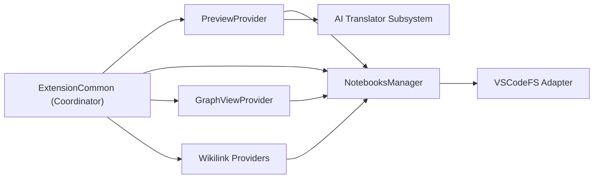

| Component                     | Depends On                                                                       | Depended On By                                            |
| :---------------------------- | :------------------------------------------------------------------------------- | :-------------------------------------------------------- |
| **`ExtensionCommon`**         | `PreviewProvider`, `NotebooksManager`, `GraphViewProvider`, `Wikilink Providers` | `src/extension.ts`, `src/extension-web.ts`                |
| **`PreviewProvider`**         | `NotebooksManager`, `AI Translator Subsystem`, `crossnote`                       | `ExtensionCommon`, `PreviewCustomEditorProvider`          |
| **`NotebooksManager`**        | `VSCodeFS Adapter`, `FileWatcher`, `crossnote`                                   | `PreviewProvider`, `ExtensionCommon`, `GraphViewProvider` |
| **`Wikilink Providers`**      | `NotebooksManager`, `VSCodeFS Adapter`, `crossnote`                              | `ExtensionCommon`                                         |
| **`AI Translator Subsystem`** | `@earendil-works/pi-ai`, `crypto-js`, `AI Translation Cache`                     | `PreviewProvider`                                         |

---

### Component 1: `PreviewProvider`

- **Location**: [`src/preview-provider.ts`](<file:///c:/Users/Lyzander%20Andrylie/Documents/(5)%20Note/software-engineer/product/vscode/vscode-markdown-preview-enhanced/code/src/preview-provider.ts>)
- **Responsibilities**: Manages the lifecycle of `vscode.WebviewPanel` instances, coordinates rendering passes, enforces CSP headers, prevents render race conditions, routes export commands (Chrome, Prince, Pandoc, eBook), and handles scroll events.
- **Key Entities**:
  - `PreviewProvider`: Singleton or per-workspace coordinator instance.
  - `WORKSPACE_PREVIEW_PROVIDER_MAP`: Registry mapping workspace URI to active provider.
  - `WEBVIEW_MESSAGE_COMMANDS`: Immutable security Set of whitelisted commands allowed from the webview.
- **Inputs & Outputs**:
  - **Input**: Document URIs, raw text, cursor position, webview IPC messages.
  - **Output**: Rendered HTML templates, `updateHtml` postMessage deltas, exported files on disk.

#### Component Interaction

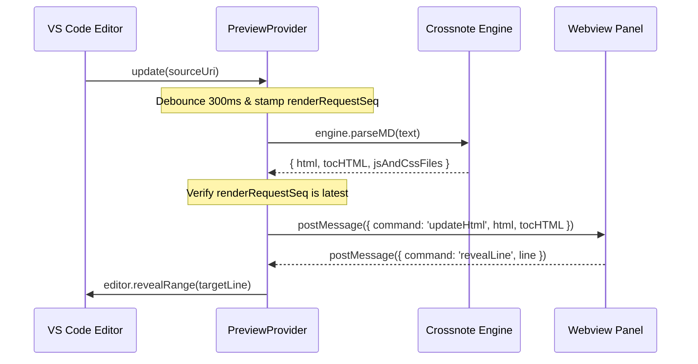

`PreviewProvider` acts as the intermediary between VS Code's editor surface and the webview iframe. It prevents UI flickering during typing by combining a 300ms debounce timer with sequence ID stamping.

---

### Component 2: `NotebooksManager`

- **Location**: [`src/notebooks-manager.ts`](<file:///c:/Users/Lyzander%20Andrylie/Documents/(5)%20Note/software-engineer/product/vscode/vscode-markdown-preview-enhanced/code/src/notebooks-manager.ts>)
- **Responsibilities**: Instantiates and caches crossnote `Notebook` instances per workspace, merges configuration across global (`~/.crossnote`) and workspace (`.crossnote`) directories, enforces filesystem root guards, and synchronizes editor associations when `previewMode` changes.
- **Key Entities**:
  - `NotebooksManager`: Master manager holding active `notebooks: Notebook[]`.
  - `warnIfFilesystemRoot`: Guard checking against indexing the root of the OS filesystem (`/` or `C:\`).
  - `applyPreviewScripts`: Security policy gate enabling user scripts only in trusted workspaces.
- **Inputs & Outputs**:
  - **Input**: Workspace URI, configuration updates, file watcher change notifications.
  - **Output**: Fully configured `Notebook` instance, updated `workbench.editorAssociations`.

#### Component Interaction

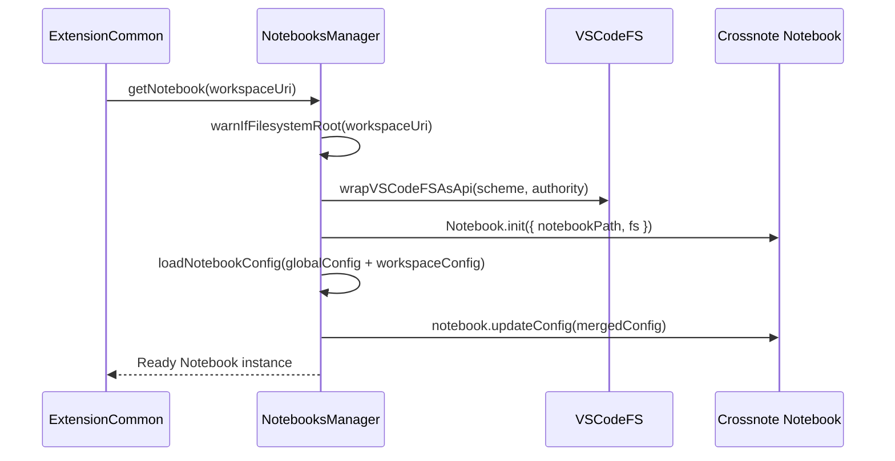

---

### Component 3: `ExtensionCommon`

- **Location**: [`src/extension-common.ts`](<file:///c:/Users/Lyzander%20Andrylie/Documents/(5)%20Note/software-engineer/product/vscode/vscode-markdown-preview-enhanced/code/src/extension-common.ts>)
- **Responsibilities**: Universal extension activation logic, command registration (`markdown-preview-enhanced.*` and internal `_crossnote.*`), document synchronization, selection tracking, and registration of wikilink completion/hover/document-link providers.
- **Key Entities**:
  - `initExtensionCommon`: Core function executed on extension startup.
  - `editorScrollDelay`: Latch timestamp preventing feedback loops when the editor scrolls in response to the webview.
- **Inputs & Outputs**:
  - **Input**: `vscode.ExtensionContext`, VS Code window/workspace event streams.
  - **Output**: Registered subscriptions, active document link providers, quick pick modals.

---

### Component 4: `Wikilink & Knowledge Management`

- **Location**: [`src/wikilink-document-link-provider.ts`](<file:///c:/Users/Lyzander%20Andrylie/Documents/(5)%20Note/software-engineer/product/vscode/vscode-markdown-preview-enhanced/code/src/wikilink-document-link-provider.ts>), [`src/wikilink-hover-provider.ts`](<file:///c:/Users/Lyzander%20Andrylie/Documents/(5)%20Note/software-engineer/product/vscode/vscode-markdown-preview-enhanced/code/src/wikilink-hover-provider.ts>), [`src/block-id-completion-provider.ts`](<file:///c:/Users/Lyzander%20Andrylie/Documents/(5)%20Note/software-engineer/product/vscode/vscode-markdown-preview-enhanced/code/src/block-id-completion-provider.ts>), [`src/graph-view-provider.ts`](<file:///c:/Users/Lyzander%20Andrylie/Documents/(5)%20Note/software-engineer/product/vscode/vscode-markdown-preview-enhanced/code/src/graph-view-provider.ts>)
- **Responsibilities**: Provides Obsidian-compatible note networking. Scans `[[Note]]`, `[[Note#Heading]]`, and `[[Note^block-id]]` syntax, creates missing notes upon navigation, displays section hovers, auto-completes headings/tags, and visualizes workspace graph connections.
- **Key Entities**:
  - `WikilinkCompletionProvider`: Implements `vscode.CompletionItemProvider` for `[`, `#`, and `^` trigger characters.
  - `WikilinkHoverProvider`: Implements `vscode.HoverProvider` with Levenshtein-based fuzzy match fallback (`rankByCloseness`).
  - `createMissingMarkdownNote`: Utility generating initial `# Title\n\n` stub when an orphan wikilink is clicked.

---

### Component 5: `AI Translation Subsystem`

- **Location**: [`src/ai-translator.ts`](<file:///c:/Users/Lyzander%20Andrylie/Documents/(5)%20Note/software-engineer/product/vscode/vscode-markdown-preview-enhanced/code/src/ai-translator.ts>), [`src/ai-translation-cache.ts`](<file:///c:/Users/Lyzander%20Andrylie/Documents/(5)%20Note/software-engineer/product/vscode/vscode-markdown-preview-enhanced/code/src/ai-translation-cache.ts>), [`src/markdown-blocks.ts`](<file:///c:/Users/Lyzander%20Andrylie/Documents/(5)%20Note/software-engineer/product/vscode/vscode-markdown-preview-enhanced/code/src/markdown-blocks.ts>)
- **Responsibilities**: Performs non-blocking, streaming translations of markdown documents to Chinese. Splits text into discrete blocks, caches translated blocks by SHA-256 hash, batches consecutive changed blocks into runs, and streams results sequentially into the preview without altering original source files.
- **Key Entities**:
  - `splitMarkdownBlocks`: Fenced-block-aware line parser.
  - `streamTranslateBlock`: Invokes `@earendil-works/pi-ai` models dynamically.
  - `ai-translation-cache`: Disk cache capped at 5,000 `.md` files with LRU eviction.

---

## 6. Execution Flows

### Happy Path: Live Document Editing & Real-Time Synchronized Preview

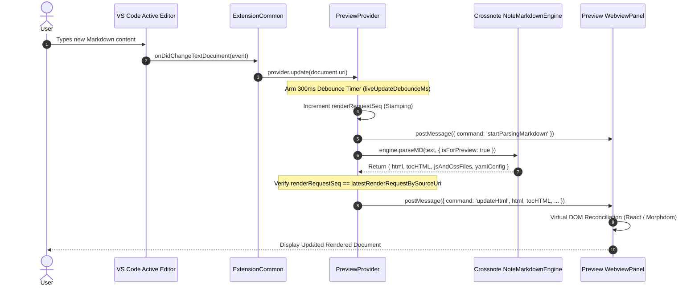

1. The user edits content in the VS Code editor, raising `vscode.workspace.onDidChangeTextDocument`.
2. `ExtensionCommon` filters for markdown files and forwards the URI to `PreviewProvider.update()`.
3. `PreviewProvider` resets its per-URI debounce timer (`liveUpdateDebounceMs`, default 300ms).
4. Upon debounce expiration, a unique render request ID is generated by incrementing `renderRequestSeq` and saved to `latestRenderRequestBySourceUri`.
5. The webview is notified with `startParsingMarkdown` to present parsing indicators.
6. The engine executes `parseMD`, running syntax extensions and Math/Diagram renderers.
7. `PreviewProvider` compares the request ID against the latest stored ID; if the render is still fresh, it dispatches `updateHtml` with the updated payload.
8. The webview reconciles the DOM in place, preserving existing scroll positions and presentation state.

---

### Error / Recovery Path: Stale Render Overrun & AI Stream Failure Fallback

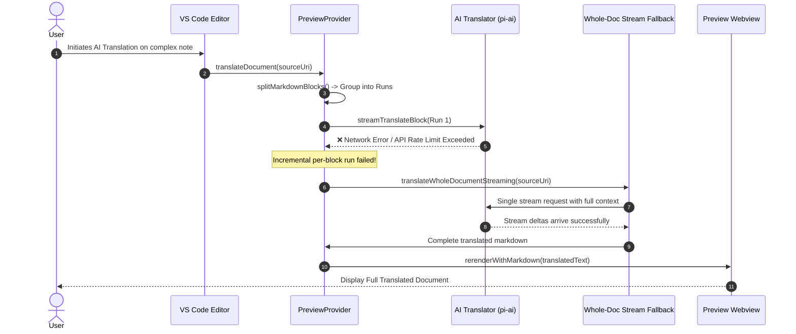

1. During incremental translation or live updates, an API or runtime failure occurs (e.g., rate limits or parser timeout).
2. The per-block incremental execution catches the failure and logs the diagnostic state to the `MPE AI Translation` output channel.
3. If every changed block run fails or the AI structurally alters block counts, MPE triggers its recovery fallback: `translateWholeDocumentStreaming`.
4. A single whole-document translation request is dispatched with full document context, presenting a cancellable VS Code progress notification.
5. On resolution, the completed markdown overrides the preview buffer via `translatedMarkdownOverrides`, ensuring the user receives a cohesive translation.

---

### Hot Path: Bidirectional Two-Way Scroll Synchronization

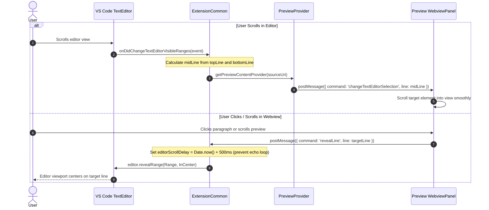

1. When the editor scrolls, `onDidChangeTextEditorVisibleRanges` calculates the visible midpoint line.
2. `changeTextEditorSelection` is posted to the webview, which queries its source-line map and scrolls to match.
3. Conversely, when a user double-clicks or interacts with an element in the webview, it dispatches `revealLine`.
4. `ExtensionCommon` sets `editorScrollDelay = Date.now() + 500ms`, suppressing echo scroll events, and calls `editor.revealRange()`.

---

## 7. Data Models & Transformations

### Transformation Pipeline


| Stage                       | Model / Entity        | Format        | Description                                                                    |
| :-------------------------- | :-------------------- | :------------ | :----------------------------------------------------------------------------- |
| **Stage 1: Ingestion**      | `vscode.TextDocument` | Plain Text    | Source buffer read from disk or dirty editor memory.                           |
| **Stage 2: Chunking**       | `MarkdownBlock[]`     | String Array  | Top-level blocks demarcated by blank lines, keeping code fences intact.        |
| **Stage 3: Identification** | `BlockHash`           | Hex String    | First 16 characters of SHA-256 hash used for incremental cache lookups.        |
| **Stage 4: Compilation**    | `ParsedResult`        | Object (HTML) | Output from crossnote containing `html`, `tocHTML`, and required JS/CSS links. |
| **Stage 5: Presentation**   | `HTMLDocument`        | Full HTML5    | Sandboxed template containing CSP, injected stylesheets, and bootstrap JS.     |

#### `MarkdownPreviewEnhancedConfig`

- **Location**: [`src/config.ts`](<file:///c:/Users/Lyzander%20Andrylie/Documents/(5)%20Note/software-engineer/product/vscode/vscode-markdown-preview-enhanced/code/src/config.ts#L59>)
- **Description**: Merged configuration schema driving engine behavior and UI modes.
- **Key Fields**:
  - `previewMode`: Enum determining preview display strategy (`Single Preview`, `Multiple Previews`, `Previews Only`).
  - `markdownParser`: Active engine parser (`markdown-it`, `pandoc`, or `markdown_yo`).
  - `scrollSync`: Boolean flag controlling two-way scroll synchronization.
  - `enableScriptExecution`: Boolean gate controlling code chunk evaluation.
  - `enableWikiLinkSyntax`: Enables PKM wikilink parsing and autocompletion.

---

### Persistent State

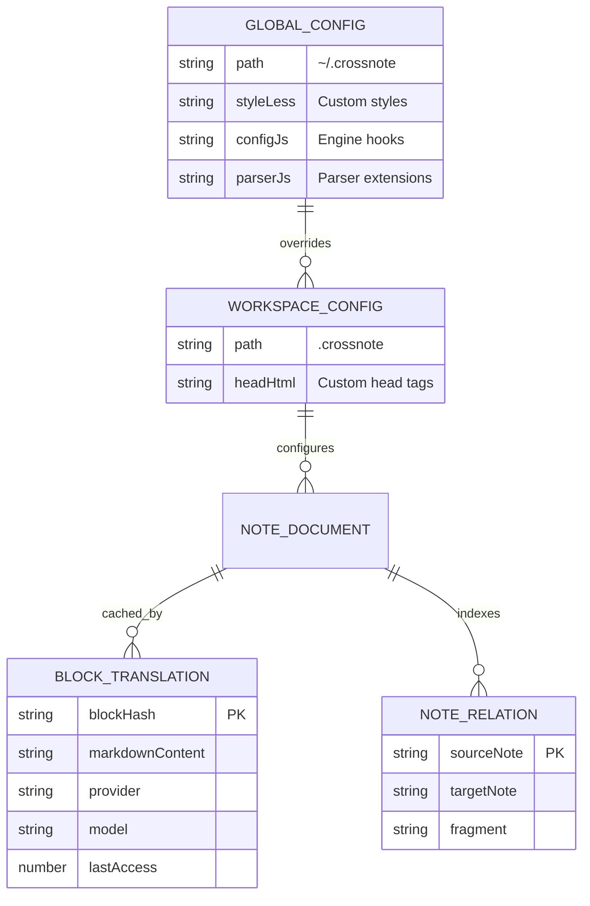

| Entity                      | Location                                    | Lifecycle             | Description                                                                        |
| :-------------------------- | :------------------------------------------ | :-------------------- | :--------------------------------------------------------------------------------- |
| **Global Config**           | `~/.crossnote/` (or platform equivalent)    | Persistent            | User-wide configuration, scripts, custom styles, and image history.                |
| **Workspace Config**        | `<workspace>/.crossnote/`                   | Per-Workspace         | Repository-specific overrides for parser hooks, CSS, and HTML headers.             |
| **Block Translation Cache** | `~/.crossnote/ai-translation-cache/blocks/` | Persistent (LRU 5000) | Stores translated markdown chunks (`<hash>.md`) and metadata (`<hash>.meta.json`). |
| **API Key Secret**          | VS Code `SecretStorage`                     | Persistent Secure     | Encrypted storage for AI translation API key under `mpe.aiTranslation.apiKey`.     |

#### `BlockTranslation` / `BlockMeta`

- **Location**: [`src/ai-translation-cache.ts`](<file:///c:/Users/Lyzander%20Andrylie/Documents/(5)%20Note/software-engineer/product/vscode/vscode-markdown-preview-enhanced/code/src/ai-translation-cache.ts#L31>)
- **Description**: Disk-persisted translation entry allowing incremental updates with zero API re-calls for unchanged paragraphs. In code, metadata is modeled via the `BlockMeta` interface and persisted as `<hash>.meta.json`, paired with the translated markdown content file `<hash>.md`.
- **Key Fields (`BlockMeta`)**:
  - `provider`: AI provider identifier (e.g., `openai`, `anthropic`, `google`).
  - `model`: Target LLM model name.
  - `lastAccess`: Timestamp for LRU eviction when block count exceeds `MAX_BLOCKS` (5000).
- **Persistence**: Saved as `<hash>.md` (translated content) and `<hash>.meta.json` (metadata). Keyed on disk by `blockHash` (16-character truncated SHA-256).

---

## 8. Key Algorithms & Methods

### 1. Incremental AI Translation with Contiguous Block-Run Merging (`translateIncrementally`)

- **Location**: [`src/preview-provider.ts`](<file:///c:/Users/Lyzander%20Andrylie/Documents/(5)%20Note/software-engineer/product/vscode/vscode-markdown-preview-enhanced/code/src/preview-provider.ts#L1092>)
- **Purpose**: Translates modified markdown documents without re-translating unchanged paragraphs, while grouping adjacent changed blocks to preserve context for the LLM.
- **Complexity**: $O(N)$ time for block parsing and hashing; $O(M)$ API requests where $M \ll N$ runs of changed blocks.

#### How It Works

1. **Input**: Raw markdown document containing mixed modified and unmodified blocks.

   ```text
   # Introduction
   Unchanged paragraph that was previously translated.

   New paragraph added by the author that needs translation.
   Another consecutive newly added paragraph.
   ```

2. **Block Splitting & Hash Resolution**:
   - Decomposes document using `splitMarkdownBlocks()`.
   - Computes `hashBlock(b)` for each block. Checks `getBlockTranslation(hash)`.

   ```text
   Block 0: Cached -> Reuse translation directly.
   Block 1: Cache Miss -> Queue for translation.
   Block 2: Cache Miss -> Queue for translation.
   ```

3. **Contiguous Run Merging**:
   - Groups adjacent cache misses into a single request capped at `MAX_RUN_BYTES = 8192` and `MAX_RUN_BLOCKS = 20`.

   ```text
   Run 1: [Block 1, Block 2] -> Sent as single combined prompt to AI provider.
   ```

4. **Sequential Streaming & Partial Refresh**:
   - Dispatches requests sequentially in document order.
   - Upon completion, splits translated run back into individual blocks and updates `partialBlocks`.
   - Invokes `refreshPreviewWithMarkdown()` via serialized promise chains (`refreshChains`).

5. **Output**:

   ```text
   # 介绍
   先前已翻译的未更改段落。

   作者新添加的需要翻译的段落。
   另一个连续的新添加段落。
   ```

---

### 2. Levenshtein-Based Wikilink Fuzzy Suggester (`rankByCloseness`)

- **Location**: [`src/wikilink-hover-provider.ts`](<file:///c:/Users/Lyzander%20Andrylie/Documents/(5)%20Note/software-engineer/product/vscode/vscode-markdown-preview-enhanced/code/src/wikilink-hover-provider.ts#L286>)
- **Purpose**: Ranks candidate note names, headings, or block IDs when a user hovers over an unresolved or mistyped wikilink.
- **Complexity**: $O(K \cdot |A| \cdot |B|)$ time, $O(\min(|A|, |B|))$ memory using single-row dynamic programming across $K$ candidates.

#### How It Works

1. **Input**:
   - Target query: `wanted = "architecure"` (typo)
   - Candidates: `["Architecture", "Artifacts", "System_Design"]`

2. **Case-Insensitive Substring & Edit Distance Calculation**:
   - Evaluates whether candidate contains query as a substring (ranking bonus: 0 vs 1).
   - Computes edit distance using single-row dynamic programming:

   ```text
   Candidate "Architecture": contains=0, distance=1
   Candidate "Artifacts":    contains=1, distance=7
   Candidate "System_Design": contains=1, distance=11
   ```

3. **Sort Comparison**:
   - Sorts candidates by `a.contains - b.contains || a.distance - b.distance || a.id.localeCompare(b.id)`.

4. **Output**:
   - Sorted suggestions: `["Architecture", "Artifacts", "System_Design"]`

---

## 9. Performance & Optimization

### Optimization Strategy

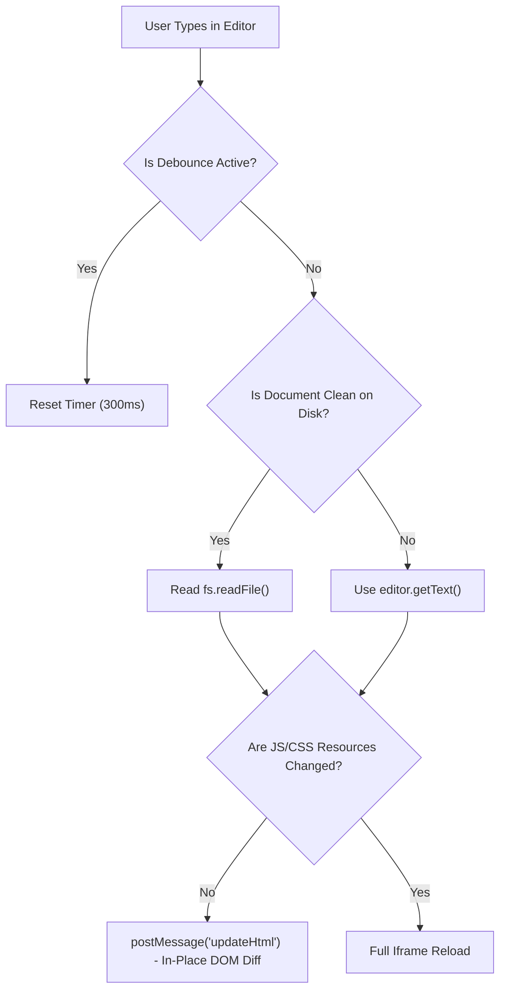

### Caching & State Management

- **Disk Block Cache**: AI translation blocks are hashed via SHA-256 and stored in `~/.crossnote/ai-translation-cache/blocks/`. Unchanged paragraphs incur zero network latency.
- **Image Watcher Cache**: [`WikilinkCompletionProvider`](<file:///c:/Users/Lyzander%20Andrylie/Documents/(5)%20Note/software-engineer/product/vscode/vscode-markdown-preview-enhanced/code/src/block-id-completion-provider.ts#L32>) maintains a cached list of workspace images (`IMAGE_GLOB`). The cache is only invalidated when files are created or deleted, preventing expensive `findFiles` scans during typing.
- **Render Sequence Stamping**: Every call to `updateMarkdown` increments `renderRequestSeq`. Responses returning out of order due to asynchronous parser delay are discarded if overtaken by a newer request.

### Concurrency & Resource Management

- **Workspace Mutex Locking**: Uses `async-mutex` per workspace (`WORKSPACE_MUTEX_MAP`). Only one render or initialization cycle executes per workspace at any given time, preventing race conditions.
- **Abortable AI Streams**: In-flight AI translation requests hold an `AbortController`. If the source document changes or the user switches files, the controller aborts active HTTP streams immediately.
- **Serialized Refresh Chains**: Partial streaming updates are chained through `refreshChains` per URI, guaranteeing that updates arrive in sequential order.

---

## 10. Configuration & Environment

### Configuration Resolution

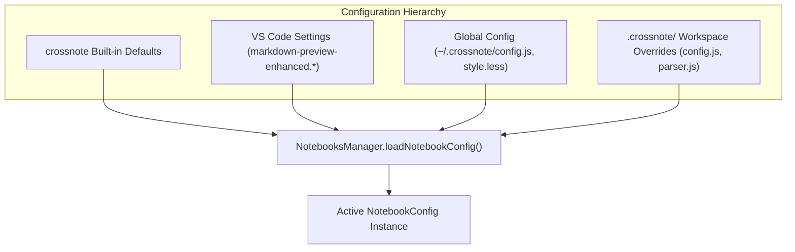

Configurations resolve through a tiered inheritance model:

1. **Crossnote Defaults**: Base properties established by `getDefaultNotebookConfig()`.
2. **VS Code Settings**: Overridden by user/workspace settings under `markdown-preview-enhanced.*`.
3. **Global Customizations**: Loaded from `~/.crossnote/` (custom styles appended to `globalCss`).
4. **Workspace Customizations**: Overrides loaded from `<workspace>/.crossnote/`, allowing per-repository parser extensions and style definitions.

---

### Execution Environments & Isolation

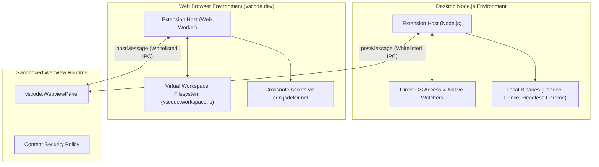

- **Execution Targets**:
  - **Desktop Node.js**: Full system access; supports external CLI processors (Pandoc, PrinceXML, Puppeteer Chrome), local TikZ Jax compilation, and direct disk caches.
  - **Web Extension**: Operates in sandboxed Web Workers (`vscode.dev`); file I/O is routed through `vscode.workspace.fs`. Binary CLI exporters are disabled; runtime assets load from `cdn.jsdelivr.net`.
- **Isolation Boundaries**: The webview operates under an explicit Content Security Policy preventing unauthorized script execution. Plugins, embeds, and `<form>` actions are locked down (`object-src 'none'`, `form-action 'none'`).
- **Cross-Environment Communication**: Communication occurs strictly over JSON-RPC style `postMessage` exchanges. Webview-to-host commands are checked against `WEBVIEW_MESSAGE_COMMANDS`.

---

## 11. Extensibility & Integration

### Integration Topology

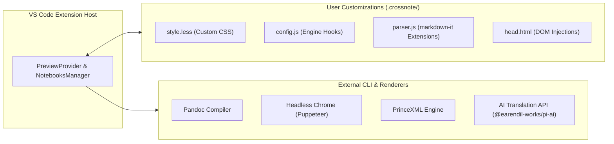

### Extensibility

1. **`style.less`**: Custom LESS stylesheets compiled into preview CSS, supporting user themes and custom fonts.
2. **`config.js`**: JavaScript hooks exposing `onWillParseMarkdown` and `onDidParseMarkdown` lifecycles for programmatic AST modifications.
3. **`parser.js`**: Direct registration hook to inject custom `markdown-it` plugins into the parsing pipeline.
4. **`head.html`**: Arbitrary HTML elements injected into the `<head>` of the preview webview (analytics, external font links, scripts).

### APIs & Protocols

- **Webview IPC Protocol**: Bidirectional `postMessage` protocol delivering actions (`updateHtml`, `changeTextEditorSelection`, `revealLine`, `runCodeChunk`).
- **Command Bus**: Public commands prefixed with `markdown-preview-enhanced.*`; internal webview-invocable operations routed via `_crossnote.*`.
- **Filesystem Adapter**: Abstraction layer implementing crossnote's `FileSystemApi` via `wrapVSCodeFSAsApi`.

---

## 12. Design & Trade-offs

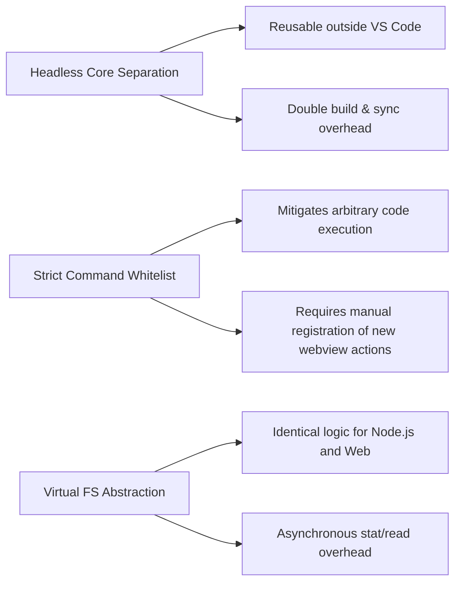

| Design / Pattern                | Benefits                                                                                            | Trade-offs                                                                                |
| :------------------------------ | :-------------------------------------------------------------------------------------------------- | :---------------------------------------------------------------------------------------- |
| **Headless Crossnote Core**     | Reuses parsing and diagram compilation across CLI, Atom, and VS Code.                               | Requires coordination between repository releases and local dependency bundling via Gulp. |
| **Strict Message Whitelisting** | Prevents blind command dispatch vulnerabilities (GHSA-83c6-hcjv-pvmg).                              | Any new UI interaction requires explicit enumeration in `WEBVIEW_MESSAGE_COMMANDS`.       |
| **Virtual Filesystem Adapter**  | Allows transparent operation across local disks, remote SSH/WSL, and virtual browser filesystems.   | Every file existence check requires asynchronous promise resolution (`await fs.stat()`).  |
| **Custom Editor Integration**   | Allows Markdown files to be viewed as rich previews directly in editor tabs (`Previews Only` mode). | Does not support standard text editor split panes simultaneously for the same tab.        |

---

## 13. Error Handling & Edge Cases

### Error Types & Propagation

| Error Type                   | Source                                                                                                                                                                                                           | Propagation Strategy                                                                          | User-Facing?                             |
| :--------------------------- | :--------------------------------------------------------------------------------------------------------------------------------------------------------------------------------------------------------------- | :-------------------------------------------------------------------------------------------- | :--------------------------------------- |
| **Filesystem Root Indexing** | [`NotebooksManager.warnIfFilesystemRoot`](<file:///c:/Users/Lyzander%20Andrylie/Documents/(5)%20Note/software-engineer/product/vscode/vscode-markdown-preview-enhanced/code/src/notebooks-manager.ts#L94>)       | Guards against root directory indexing; shows warning modal.                                  | Yes (`vscode.window.showWarningMessage`) |
| **Stale Render Request**     | [`PreviewProvider.updateMarkdown`](<file:///c:/Users/Lyzander%20Andrylie/Documents/(5)%20Note/software-engineer/product/vscode/vscode-markdown-preview-enhanced/code/src/preview-provider.ts#L812>)              | Discards render silently when request sequence ID mismatch occurs.                            | No (Logged to debug console)             |
| **AI Translation Failure**   | [`PreviewProvider.translateIncrementally`](<file:///c:/Users/Lyzander%20Andrylie/Documents/(5)%20Note/software-engineer/product/vscode/vscode-markdown-preview-enhanced/code/src/preview-provider.ts#L1092>)     | Falls back to whole-document streaming; surfaces error notification on complete failure.      | Yes (`vscode.window.showErrorMessage`)   |
| **Unresolved Wikilink**      | [`WikilinkHoverProvider.resolveNoteUri`](<file:///c:/Users/Lyzander%20Andrylie/Documents/(5)%20Note/software-engineer/product/vscode/vscode-markdown-preview-enhanced/code/src/wikilink-hover-provider.ts#L214>) | Employs Levenshtein fallback (`rankByCloseness`) to provide "did you mean" hover suggestions. | Yes (Markdown hover card)                |

### Recovery Mechanisms

- **External File Modification Recovery**: When files are edited outside VS Code (e.g., via Notepad or Git checkout across WSL), MPE detects that the buffer is not dirty and re-reads content directly from disk.
- **Orphan Wikilink Auto-Creation**: Clicking an unresolved `[[MissingNote]]` automatically creates a stub document with `# MissingNote\n\n`, preventing 404 navigation errors.
- **Automatic Preview Recovery**: If a webview panel crashes or is disposed, `initPreview` detects the invalid state and reinstantiates the panel.

### Known Limitations & Edge Cases

- **Web Extension Export Limitations**: CLI-based exports (Pandoc, PrinceXML, Headless Chrome) fail gracefully in web environments (`vscode.dev`) with a notification indicating lack of OS binary execution.
- **Filesystem Root Traversal**: Opening `/` or `C:\` as a workspace disables note relation indexing to prevent recursive stat operations across the whole operating system.

---

## 14. Dependencies & Ecosystem

### Key Dependencies

| Dependency                                                                                 | Type    | Role                                    | Why Chosen                                                                                                      |
| :----------------------------------------------------------------------------------------- | :------ | :-------------------------------------- | :-------------------------------------------------------------------------------------------------------------- |
| [`crossnote`](https://github.com/shd101wyy/crossnote) (`0.9.33`)                           | Runtime | Markdown parsing and compilation engine | Core rendering library unifying diagram parsers, math engines, and document exporters.                          |
| [`@earendil-works/pi-ai`](https://www.npmjs.com/package/@earendil-works/pi-ai) (`^0.83.0`) | Runtime | Multi-provider LLM client               | Lightweight, ESM-compatible client providing unified streaming interfaces across OpenAI, Anthropic, and Google. |
| [`async-mutex`](https://www.npmjs.com/package/async-mutex) (`^0.4.0`)                      | Runtime | Concurrency control                     | Serializes asynchronous preview initializations per workspace to eliminate race conditions.                     |
| [`crypto-js`](https://www.npmjs.com/package/crypto-js) (`^4.2.0`)                          | Runtime | Cryptographic hashing                   | Generates SHA-256 block hashes across both Node.js and browser web extension environments.                      |
| [`esbuild`](https://www.npmjs.com/package/esbuild) (`^0.25.0`)                             | Dev     | Fast bundler                            | Produces optimized, tree-shaken bundles for desktop CJS (`node16`) and web CJS (`es2020`).                      |

### Ecosystem & Community

- **Package Registry**: Published to the Visual Studio Code Marketplace and Open VSX Registry under publisher `shd101wyy`.
- **Release Automation**: Automated GitHub Actions workflow (`.github/workflows/release.yml`) handling changelog updates, tag creation, asset compilation, and VSIX deployment.

---

## 15. Build & Distribution

### Build Pipeline

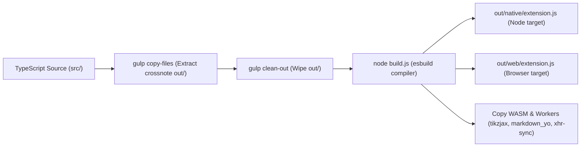

The extension uses a combined Gulp and esbuild pipeline:

1. `gulp copy-files`: Extracts prebuilt webview bundles, styles, and dependencies from `node_modules/crossnote/out/` into `./crossnote/`.
2. `gulp clean-out`: Cleans previous compilation artifacts.
3. `build.js`: Runs `esbuild` to compile native (`platform: 'node'`) and web (`platform: 'browser'`) bundles. Injects polyfills and copies native Emscripten/WASM assets (`tex.wasm.gz`, `markdown_yo_wasm_api.wasm`, `xhr-sync-worker.js`).

### Packaging & Distribution

- **Distribution Channels**: Visual Studio Marketplace, Open VSX, and direct GitHub Releases (`.vsix` artifacts).
- **Artifacts**: Packaged `.vsix` containing `out/native/extension.js`, `out/web/extension.js`, `./crossnote/` runtime assets, and extension manifests.

---

## Appendix

### A. Monetization & Feature Gating

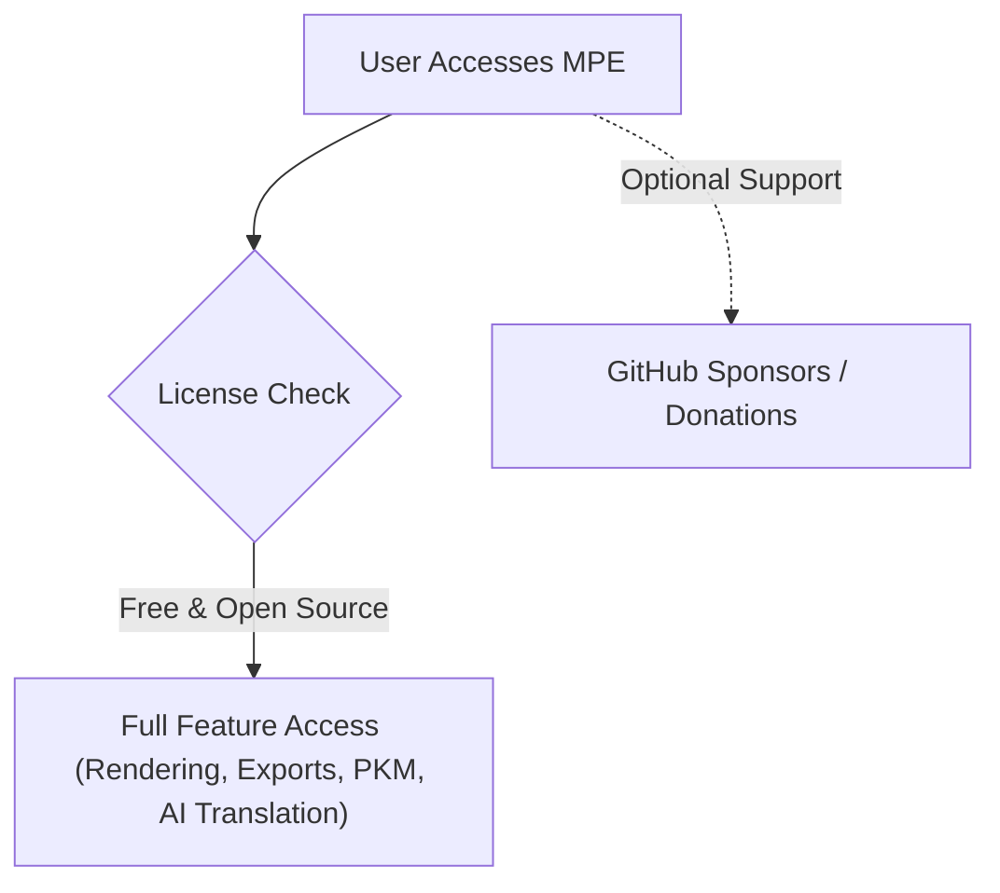

- **Model**: Completely Free and Open Source Software (FOSS) licensed under the NCSA (University of Illinois/NCSA Open Source License).
- **Gating Mechanism**: No premium feature gating or telemetry. Users can optionally support development via GitHub Sponsors (`https://github.com/sponsors/shd101wyy/`).

---

### B. Anti-patterns

#### 1. Blind Webview Command Dispatch

- **What it looks like**: Passing webview postMessage commands directly into `vscode.commands.executeCommand()` without argument validation or command name whitelisting.
- **Why it's wrong**: Compromised or untrusted markdown content running in a webview could execute arbitrary internal commands, modifying workspace settings or overwriting files on the host system (GHSA-83c6-hcjv-pvmg).
- **Correct approach**: Validate commands against an immutable `Set` of approved commands and ensure source URIs match active targets.

```typescript
// ❌ Bad: Blind dispatch of untrusted webview message
panel.webview.onDidReceiveMessage((msg) => {
  vscode.commands.executeCommand(msg.command, ...msg.args);
});
// Expected output:
// Security vulnerability: Allows arbitrary VS Code command execution from webview.

// ✅ Good: Whitelisted dispatch with source validation
panel.webview.onDidReceiveMessage((msg) => {
  if (
    typeof msg?.command !== "string" ||
    !WEBVIEW_MESSAGE_COMMANDS.has(msg.command)
  ) {
    return;
  }
  if (!Array.isArray(msg?.args)) {
    return;
  }
  vscode.commands.executeCommand(`_crossnote.${msg.command}`, ...msg.args);
});
// Expected output:
// Safe dispatch: Only verified, whitelisted commands can be invoked.
```

#### 2. Direct Node Filesystem Calls in Shared Extension Logic

- **What it looks like**: Using `import * as fs from 'fs'` directly inside providers shared between native and web builds.
- **Why it's wrong**: Causes complete activation failure when executed in browser-based VS Code (`vscode.dev`), where Node's `fs` module does not exist.
- **Correct approach**: Route all filesystem checks through `vscode.workspace.fs` using the `FileSystemApi` wrapper.

```typescript
// ❌ Bad: Native node fs breaking in web contexts
import * as fs from "fs";
function checkExists(filePath: string): boolean {
  return fs.existsSync(filePath);
}
// Expected output:
// Throws Error: Cannot find module 'fs' in vscode.dev browser environments.

// ✅ Good: Abstracted filesystem access via VS Code API
import * as vscode from "vscode";
async function checkExists(uri: vscode.Uri): Promise<boolean> {
  try {
    await vscode.workspace.fs.stat(uri);
    return true;
  } catch {
    return false;
  }
}
// Expected output:
// Resolves true or false universally across desktop, SSH remote, and browser environments.
```
