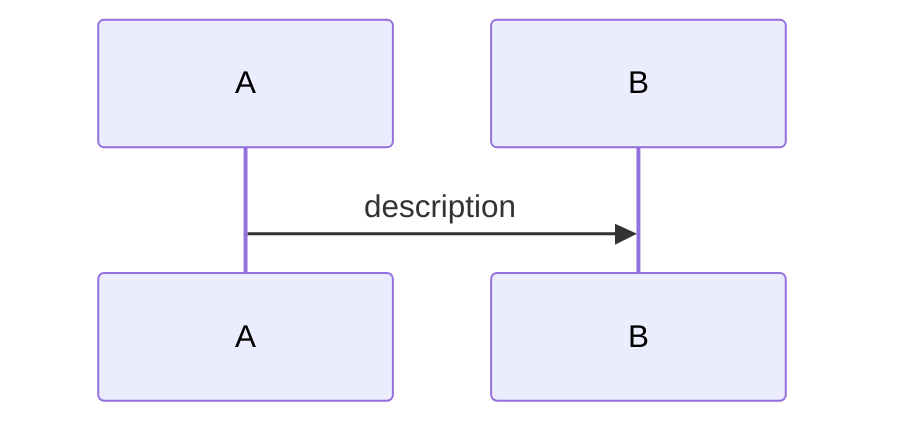

# Lib

Related Files:

- {file_path1}
- ...

## Description

{simple_description}

## Features

### {feature_1}: {simple_usecase_title}

{simple_usecase_description}

#### Interaction

```mermaid
sequenceDiagram
    A ->> B: description
```
