# {product_name}

| Metadata             | Value                |
| :------------------- | :------------------- |
| **Repository**       | {repo_url}           |
| **Product Version**  | {product_version}    |
| **Category**         | {category}           |
| **Language & Stack** | {language_and_stack} |
| **Entry Points**     | {entry_points}       |
| **Input / Output**   | {input_and_output}   |
| **Created Date**     | {created_date}       |
| **Updated Date**     | {updated_date}       |

---

## 1. Overview

### Description

{description}

### Problem

{problem_statement}

### Solution

{solution_overview}

### Usage

{how_it_is_used}

---

## 2. Architecture & Layering

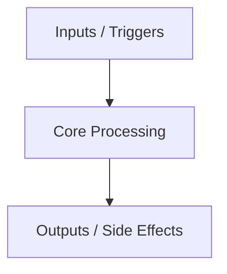

{architecture_description}

---

## 3. Source Code Structure

```text
{structure}
```

| Path       | Description   |
| :--------- | :------------ |
| `{path_1}` | {description} |
| `{path_2}` | {description} |

---

## 4. Public API & Interface

### Key Types & Interfaces

| Type / Interface | Location | Description   |
| :--------------- | :------- | :------------ |
| `{type_1}`       | `{path}` | {description} |
| `{type_2}`       | `{path}` | {description} |

### Common Usage Patterns

#### {pattern_1}: {pattern_title}

{description_and_code_example}

#### {pattern_2}: {pattern_title}

{description_and_code_example}

### API Design Philosophy

{api_design_philosophy_description}

---

## 5. Components

### Component Dependency Matrix

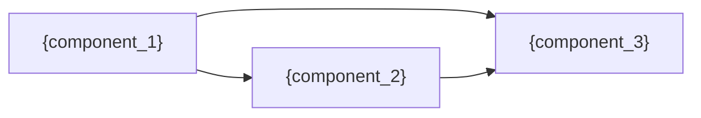

| Component       | Depends On     | Depended On By |
| :-------------- | :------------- | :------------- |
| `{component_1}` | {dependencies} | {dependents}   |
| `{component_2}` | {dependencies} | {dependents}   |

---

### {component_1}: {component_title}

- **Location**: `{path}`
- **Responsibilities**: {description}
- **Key Entities**:
  - `{entity_1}`: {description}
  - `{entity_2}`: {description}
- **Inputs & Outputs**:
  - **Input**: {input}
  - **Output**: {output}

#### Component Interaction

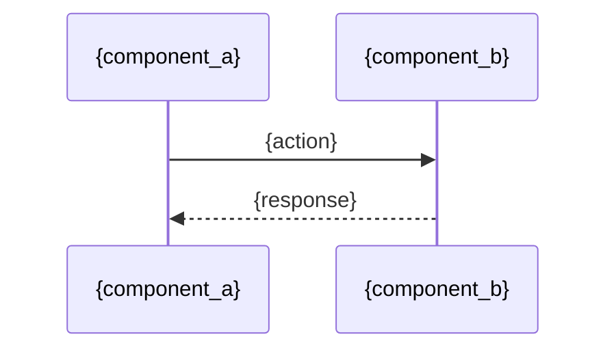

{component_interaction_description}

---

### {component_2}: {component_title}

- **Location**: `{path}`
- **Responsibilities**: {description}
- **Key Entities**:
  - `{entity_1}`: {description}
- **Inputs & Outputs**:
  - **Input**: {input}
  - **Output**: {output}

#### Component Interaction

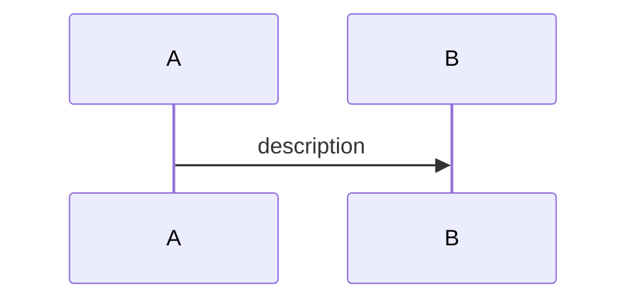

{component_interaction_description}

---

## 6. Execution Flows

### Happy Path

#### {happy_path_flow_title}

{flow_description}

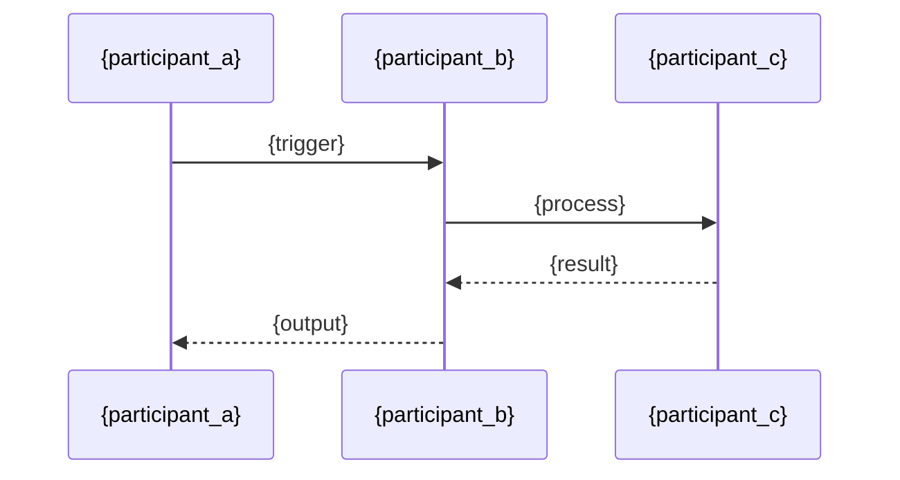

{flow_steps_or_details}

### Error / Recovery Path

#### {error_recovery_flow_title}

{flow_description}


{flow_steps_or_details}

### Hot Path

#### {hot_path_flow_title}

{flow_description}


{flow_steps_or_details}

---

## 7. Data Models & Transformations

### Transformation Pipeline

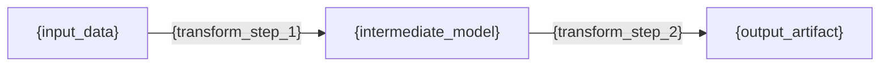

| Stage   | Model / Entity | Format   | Description   |
| :------ | :------------- | :------- | :------------ |
| Stage 1 | `{model_1}`    | {format} | {description} |
| Stage 2 | `{model_2}`    | {format} | {description} |
| Stage 3 | `{model_3}`    | {format} | {description} |

#### `{model_1}`

- **Location**: `{path}`
- **Description**: {description}
- **Key Fields**:
  - `{field_1}`: {description}
  - `{field_2}`: {description}

### Persistent State

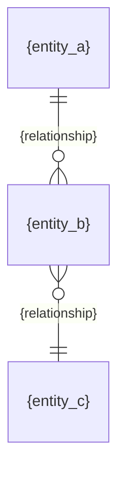

| Entity       | Location | Lifecycle   | Description   |
| :----------- | :------- | :---------- | :------------ |
| `{entity_1}` | `{path}` | {lifecycle} | {description} |
| `{entity_2}` | `{path}` | {lifecycle} | {description} |

#### `{entity_1}`

- **Location**: `{path}`
- **Description**: {description}
- **Key Fields**:
  - `{field_1}`: {description}
  - `{field_2}`: {description}
- **Persistence**: {how_and_where_stored}

---

## 8. Key Algorithms & Methods

### {algorithm_or_method_1}

- **Location**: `{path}`
- **Purpose**: {what_problem_or_operation_this_algorithm_addresses}
- **How It Works**: {description_of_the_algorithm_or_method}
- **Complexity**: {time_and_space_complexity}

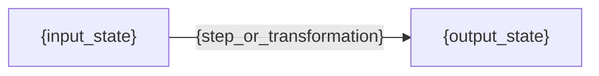

### {algorithm_or_method_2}

- **Location**: `{path}`
- **Purpose**: {what_problem_or_operation_this_algorithm_addresses}
- **How It Works**: {description_of_the_algorithm_or_method}
- **Complexity**: {time_and_space_complexity}

---

## 9. Performance & Optimization

### Optimization Strategy

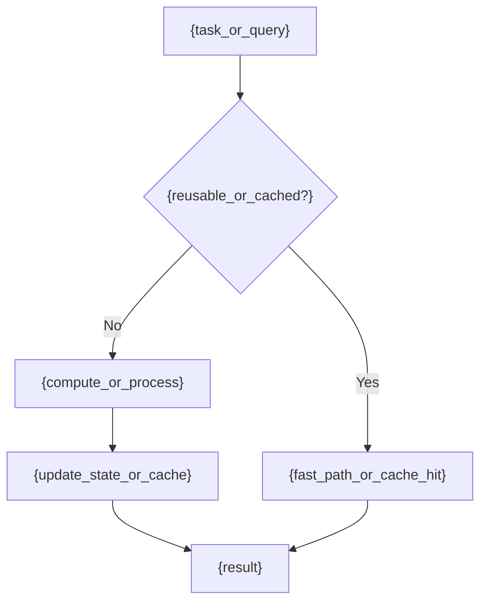

### Caching & State Management

{caching_strategies_and_state_management}

### Concurrency & Resource Management

{concurrency_threading_or_resource_handling}

---

## 10. Configuration & Environment

### Configuration Resolution

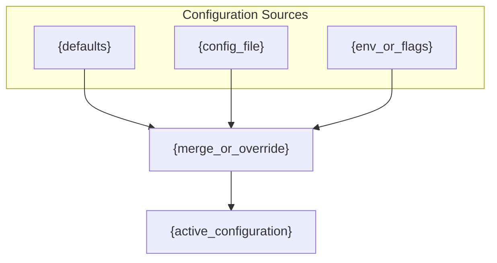

{how_configuration_is_defined_loaded_and_overridden}

### Execution Environments & Isolation

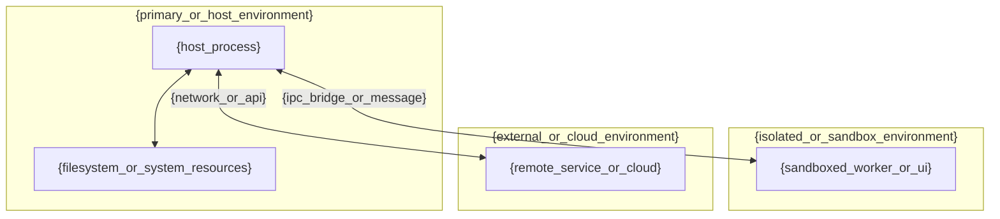

- **Execution Targets**:
  - `{environment_1}`: {capabilities_and_access_level}
  - `{environment_2}`: {capabilities_and_access_level}
- **Isolation Boundaries**: {how_sandboxing_or_isolation_is_enforced}
- **Cross-Environment Communication**: {how_data_or_commands_cross_boundaries}
- **External Dependencies**: {external_tools_services_or_runtimes_required}

---

## 11. Extensibility & Integration

### Integration Topology

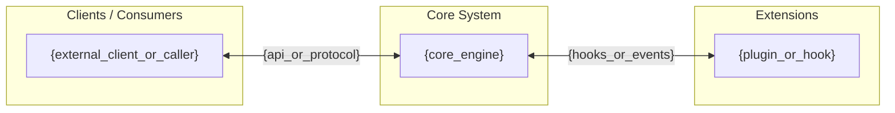

### Extensibility

{how_it_can_be_extended_or_customized}

### APIs & Protocols

- **APIs**: {public_or_internal_apis}
- **Protocols**: {communication_protocols}

---

## 12. Design & Trade-offs

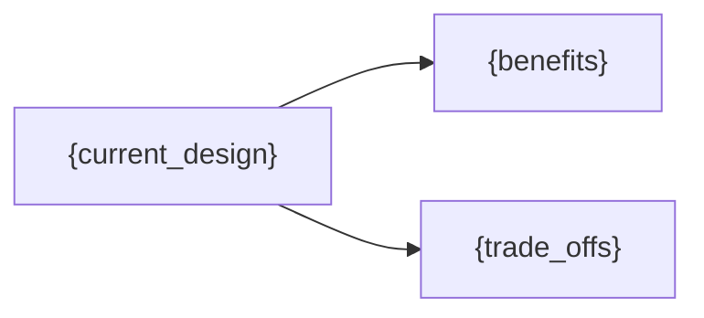

| Design / Pattern | Benefits   | Trade-offs   |
| :--------------- | :--------- | :----------- |
| `{design_1}`     | {benefits} | {trade_offs} |
| `{design_2}`     | {benefits} | {trade_offs} |

---

## 13. Error Handling & Edge Cases

### Error Types & Propagation

| Error Type  | Source     | Propagation Strategy | User-Facing? |
| :---------- | :--------- | :------------------- | :----------- |
| `{error_1}` | `{source}` | {strategy}           | {yes_or_no}  |
| `{error_2}` | `{source}` | {strategy}           | {yes_or_no}  |

### Recovery Mechanisms

{recovery_mechanisms_description}

### Known Limitations & Edge Cases

- {limitation_or_edge_case_1}
- {limitation_or_edge_case_2}

---

## 14. Dependencies & Ecosystem

### Key Dependencies

| Dependency | Role   | Why Chosen  |
| :--------- | :----- | :---------- |
| `{dep_1}`  | {role} | {rationale} |
| `{dep_2}`  | {role} | {rationale} |

### Ecosystem & Community

- **Package Registry**: {where_published}
- **Plugin / Extension Ecosystem**: {ecosystem_description}
- **Related Projects**: {related_or_complementary_projects}

---

## 15. Build & Distribution

### Build Pipeline

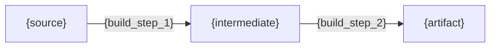

{how_the_product_is_built}

### Packaging & Distribution

- **Distribution Channels**: {how_users_obtain_the_product}
- **Artifacts**: {what_is_produced}

---

## Appendix

### A. Monetization & Feature Gating _(optional — commercial products only)_

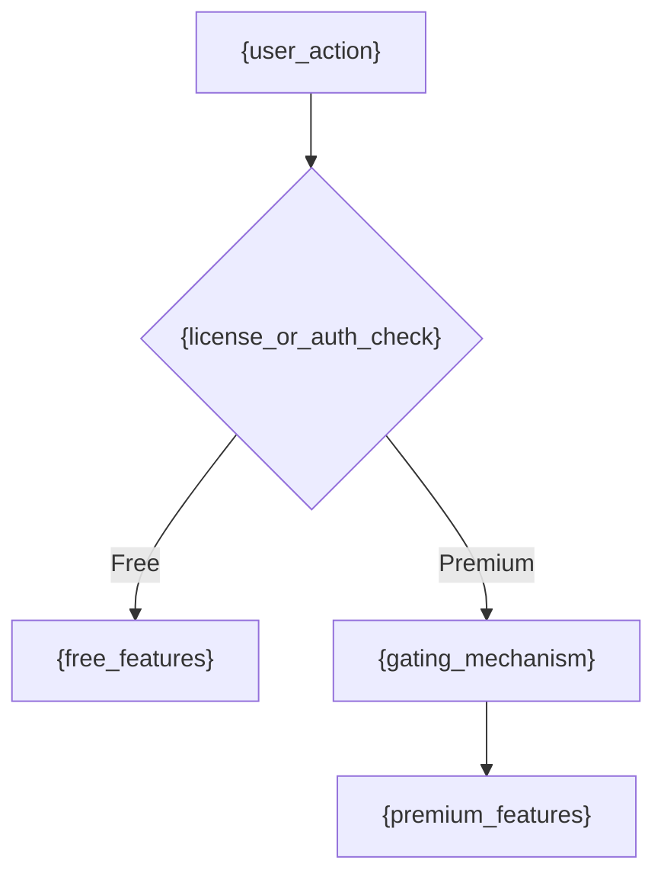

- **Model**: {open_source_or_freemium_or_paid}
- **Gating Mechanism**: {how_premium_features_are_gated}

### B. Anti-patterns _(optional)_

#### {anti_pattern_1}: {anti_pattern_title}

- **What it looks like**: {description_of_incorrect_usage}
- **Why it's wrong**: {explanation_of_issues}
- **Correct approach**: {recommended_alternative}

```{language}
// ❌ Bad
{incorrect_code_example}

// ✅ Good
{correct_code_example}
```

#### {anti_pattern_2}: {anti_pattern_title}

- **What it looks like**: {description_of_incorrect_usage}
- **Why it's wrong**: {explanation_of_issues}
- **Correct approach**: {recommended_alternative}

```{language}
// ❌ Bad
{incorrect_code_example}

// ✅ Good
{correct_code_example}
```
