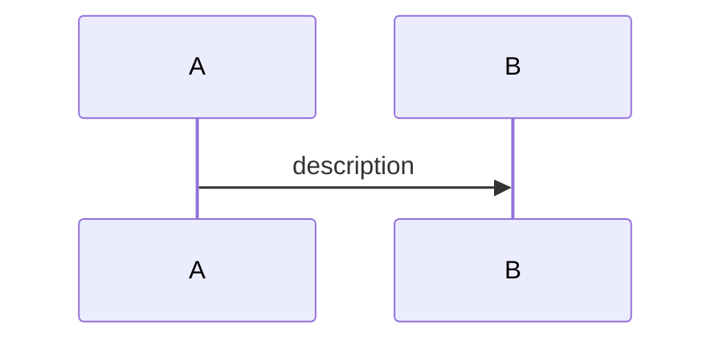

# Usecase Template

| Metadata      | Value            |
| ------------- | ---------------- |
| Author        | {author_name}    |
| Creation Date | Jan 2, 2006      |
| Last Updated  | Jan 2, 2006      |
| Repositories  | {link1}, {link2} |

## Description

{simple_usecase_description}

## Tables

- {table1}: {simple_description_related_to_usecase}
- ...

## Endpoints

### Public: {api_gw_type}

#### {grpc_service.grpc_method}: {grpc_description}

API: {url}

Related files:

- {file_1}
- ...

{endpoint_description}

### Backoffice: {api_gw_type}

#### {grpc_service.grpc_method}: {grpc_description}

API: {url}

Related files:

- {file_1}
- ...

{endpoint_description}

### Cron Job

#### {cron_service.cron_method}: {cron_description}

Related files:

- {file_1}
- ...

{endpoint_description}

### Message Queue

#### {message_queue_service.message_queue_method}: {message_queue_description}

Related files:

- {file_1}
- ...

{endpoint_description}
